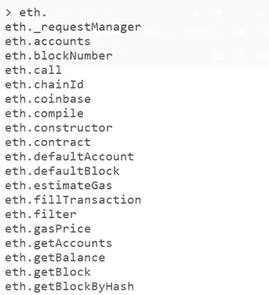

# 探索以太坊街区

> 原文：<https://levelup.gitconnected.com/exploring-the-ethereum-block-9fa3a68e42d8>

## 以太坊节点系列 II —使用 Geth 检索以太坊块数据

在以太坊节点系列的上一篇文章中，我们经历了 [**在 AWS 云**](/deploying-an-ethereum-node-on-aws-cloud-512a861026e2) 上部署以太坊节点的步骤。现在我们的节点已经部署并运行，让我们开始使用它，学习如何检索 Egthereum 块，了解以太坊块的不同组件，并了解一些与以太坊网络相关的其他命令。

## 以太坊——世界上最大的分布式计算机

以太坊也被描述为第二代区块链(类似于第一代比特币区块链)，支持首次[智能合约](/smart-contracts-can-we-just-get-straight-to-the-point-4c904d97630)和脚本功能。智能合约允许一个充满各种可能性的世界，它们可以几乎自动化任何事情，是生活在分散的区块链中的自我执行的计算机代码。一旦满足智能合约的条件，就会触发一个事件(无论智能合约是为什么而设计的)，从而实现智能合约的目的。


在以太坊，智能合约是用一种叫做 Solidity 的编程语言编写的，这些程序在 EVM——以太坊虚拟机上运行。你可以把 EVM 看作一个巨大的[图灵完全](/smart-contracts-can-we-just-get-straight-to-the-point-4c904d97630)，分散的虚拟机分布在全球所有以太坊节点上。总共有大约 8500 个节点，几乎任何人都可以成为网络中的一个节点。EVM 是智能合同执行的核心。由于其分散的性质，它还具有高冗余性、高容错性，并且非常能抵抗 DDoS 堆叠和不可变等攻击。有什么条件？代价是以太坊的吞吐量可能有点低，和/或交易费用有时可能很高。

## 以太坊街区

以太坊模块由以下几个字段组成。我们将把它们全部分解开来。下面，你可以看到我们从以太坊区块链取回的一块石头。


以太坊块与比特币相比略有不同，尽管有些字段是相同的。这是一个实际的块，更准确地说是 888888 块，它是用时间戳 1453494307(纪元时间)挖掘出来的，在人类可读的时间中是 2016 年 1 月 22 日，8:25:07 PM GMT。这个方块样本很好地展示了其他以太坊方块的样子。

## 开始使用以太坊 Geth 命令

假设你已经有了一台以太坊 geth 机，我们可以开始玩了。如果您还没有运行的节点，您可以查看这篇文章，在这篇文章中，我解释了如何在 AWS 上部署以太坊节点。

让我们开始吧！在 Geth 控制台中首先要学习的命令之一是

```
eth. 
```

快速按下 tab 键两次。

您将看到 API 命令列表。这些 API 命令兼容不同的编程语言，如 JavaScript 和 Python。



如果您按 tab 键，命令行会自动完成您开始编写的任何命令，以便于编写命令。例如，你可以输入 *eth.syn* ，如果你按下 tab 键，它会自动完成 *eth.syncing*

要对以太坊连接进行健康检查，并查看节点是否正在同步，可以使用以下命令:

```
eth.syncing
```


在这里，我们可以看到我们正在与网络、状态、区块链中的当前块等同步。

“eth.syncing”下还有一些附加命令。要查看列表，您可以键入 *eth.syncing.* 并快速按下 tab 键两次。

使用同步命令，我们可以看到节点正在同步，我们可以使用命令 eth.syncing 或 eth.syncing.currentBlock 来查看我们的节点正在同步的当前块。

## 检查以太坊节点网络状态

现在让我们检查我们的网络状态，并检查我们的节点是否正在监听并连接到其他对等节点。要从区块链检索数据并进行同步，您需要连接。


使用命令 net.listening，我们可以看到我们的 net.listening=true，这很好，

```
net.peerCount
```

我们看到我们连接到 16 个对等节点。太棒了。

另一个了解网络构成的有趣命令是

```
admin.peers
```

这将为您提供有关您所连接的对等节点的信息。


在这个截图中，我们可以看到这个节点的一些信息，包括他的软件的版本——在这个例子中，他使用的是 Geth v 1 . 9 . 25——我们还可以看到对等节点的 IP 地址。IP 地址是公开的，这就是为什么您不应该从您的个人笔记本电脑上运行节点。

如果您想获得节点的详细信息，可以运行

```
admin.nodeInfo
```

您将从自己的节点获得类似的信息，包括您的版本、IP 地址、块、共识等等。

# 探索以太坊街区

好的，一旦你确认你连接到网络上，你就可以开始探索这些区块并检索数据了。只要你的节点是同步的，你可以看一看并探索以太坊区块链的任何街区。

这是区块链的魔法之一:任何人都可以检查、审计或跟踪任何区块，确保网络可信。所有数据都可以验证。

例如，让我们使用以下命令获取块 987654:

```
eth.getBlock()
```

例如，您可以搜索块号

```
eth.getBlock(987654)
```

或者，如果您知道正在寻找的块的散列，则搜索块散列

```
eth.getBlock(“0x4ca44f16a98a6bc8206c152057cf0d7a6caeb0b287e845e21a1da2849bea4c8a”)
```


在这里，您可以看到关于该块的所有信息，包括难度、gasLimit 和 gasUsed、哈希、十六进制随机数、UNIX 时间中的时间戳、总难度和事务哈希。

**时间戳:**从 Unix 纪元时间开始，数据块时间戳以秒表示。时间是区块开采的时间。时间戳由开采该区块的矿工设定。因此，只要遵守一些基本规则，如块的时间戳必须是未来的某个时间而不是过去的某个时间，矿工就可以以某种方式操纵块或事务的时间戳。

什么是 Unix 时间或纪元 Unix 时间？Unix 时间基本上是计算机测量时间的方式。Unix 时间是自 1970 年 1 月 1 日以来的秒数。Unix 时间“0”表示 1970 年 1 月 1 日午夜，例如，当您重置旧手机时，您可能会看到这个日期。1455192272 是指在格林威治时间 2016 年 2 月 11 日星期四下午 12:04:32。

**stateRoot:** 起始根可以看作是以太坊区块链中所有之前的块、事务和代码散列到这个块的 stateRoot 中的一棵巨大的 Merkle 树。


这个状态根有一个重要的目的:它允许任何节点很容易地确认他拥有的块是正确的，而不用验证所有的区块链块。相反，他可以只验证来自其他块的散列树。当节点是灯光节点时，这一点尤其重要。

**logsBloom:** logsBloom 是一个 256 字节的字符串，它并不是传统意义上的日志。它是块日志的布隆过滤器，允许过滤块中每个元素的散列。目标是通过存储一些事件(如 bloom 中的历史事务)来最小化客户端需要进行的查询的数量。当有一个查询“数据 *z* 在集合中吗？”回答可以是“也许”，也可以是“不”。这是一种概率数据结构。

**receiptsRoot:** 这个 32 字节的字符串是交易收据的根散列。

**事务:**在这里，你看到的是块中所有事务的 hash。

**TransactionsRoot:** 一个 32 字节的字符串是块中所有事务的 Merkle 树的根哈希。

我们还可以向 eth.getBlock()添加一点魔法，通过使用如下命令获得事务细节:

```
eth.getBlock(987654, true)
```

这也将检索同一块中的所有事务。


下面是我们使用 eth.getBlock(987654，true)检索的块 98764 中的一个事务的详细信息。

下一篇文章将继续研究以太坊网络，并从以太坊获取额外的信息，比如交易信息！

**🚀关注我，也请查看我的🧱区块链课程:**

**🐶** [**有史以来第一次 Dogecoin 课程**](https://www.udemy.com/course/-dogecoin-course-the-first-complete-dogecoin-course/?referralCode=9416B1408224CE309DD8)

**👨‍🎓** [**Fintech、云和网络安全课程**](https://www.udemy.com/course/fintech-technologies-cloud-and-cybersecurity/?referralCode=F1D4EA005A2881735A36)

**📖**[](https://www.amazon.com/dp/B091CYTX37/ref=sr_1_1?dchild=1&keywords=unblockchain&qid=1617186443&s=digital-text&sr=1-1)**[**完整的 NFTs 教程**](https://www.udemy.com/course/the-complete-nft-course-learn-everything-about-nfts/?referralCode=AAEE908D13D0E2276B19)**

****👨‍🎓** [**Unblockchain 课程**](https://www.udemy.com/course/blockchain-deep-dive-from-bitcoin-to-ethereum-to-crypto/?referralCode=B8463EE382E6D313304B) **—脑洞大开的区块链课程****