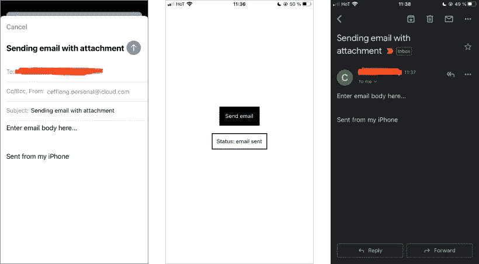

# Expo React-带附件的本地电子邮件

> 原文：<https://levelup.gitconnected.com/expo-react-native-email-with-attachment-d6a677b6d864>

## 了解如何在 Expo React-Native 中使用设备操作系统用户界面发送电子邮件


大家好，欢迎来到另一个 React 教程，我将向你们展示如何使用 Expo React-native 中的 OS (Android 或 IOS) UI 发送电子邮件。此外，本教程还介绍了如何在电子邮件中包含附件。本教程假设一些基本的 React/React-native 知识。然而，对于一个完全的初学者来说，这很简单，所以坚持下去。

# 我们将会建造什么

该应用程序将允许用户发送带/不带附件的电子邮件。这做了很多繁重的工作，因为您不需要后端或一些付费的电子邮件 API 来实现发送带有预填充字段的电子邮件。您可以使用这种方法让用户在您的移动应用程序中报告应用程序内的错误。下面的动画展示了正在运行的应用程序。让我们在下一节看看源代码。你可以在我的 Github 上找到[完整的源代码。](https://github.com/effiongcharles/expo_react_native_email)


# 设置 expo 反应本地

该项目利用[世博会](https://docs.expo.dev/)进行开发。你可能会问，世博会是什么？以下引文摘自官方[世博会文件](https://docs.expo.dev/):

> Expo 是通用 React 应用程序的框架和平台。它是一套围绕 React 原生和原生平台构建的工具和服务，可帮助您从相同的 JavaScript/TypeScript 代码库开发、构建、部署和快速迭代 iOS、Android 和 web 应用程序。

Expo 使得 React-native 应用程序的开发、测试和部署变得轻而易举。如果你尝试过使用 *bare React-native* 开发移动应用，你会对世博会有更高的评价——你不会喜欢它的！它只是一个使用 React-native 开发 Android/IOS 应用程序的伟大工具。

```
# Install the expo command line tools
npm install --global expo-cli# Create a new project
expo init email-app
```

以上代码片段是使用 Expo 设置和开始开发 React-native 应用程序所需的全部内容。第二个命令创建了一个名为 *email-app* 的新应用。如果还没有，您需要首先拥有[节点](https://nodejs.org/en/download/)。

我们需要两个 expo 包:一个用于[使用操作系统用户界面发送电子邮件](https://docs.expo.dev/versions/latest/sdk/mail-composer/)，另一个用于[选择图像](https://docs.expo.dev/versions/latest/sdk/imagepicker/)作为附件。

```
# Install mail package
expo install expo-mail-composer# Install image picker package
expo install expo-image-picker
```

上面的代码片段安装了必要的包。让我们开始使用软件包。

# 发送电子邮件用户界面

我们只需要一个按钮来触发启动 OS UI 的事件(如动画所示)。在*应用程序组件* (App.js 源代码)中的以下代码会解决这个问题。

```
import * as ImagePicker from 'expo-image-picker';
import * as MailComposer from 'expo-mail-composer';export default function App() {
  const [status, setStatus] = useState(null) return (
    <View style={styles.container}>
      <TouchableOpacity onPress={showAlert}>
        <Text>Send email</Text>
      </TouchableOpacity>
      {status !== null &&
        <View>
          <Text>{status}</Text>
        </View>
       }
    </View>
  );
}
```

为了保持简单，我抽象出了一些导入语句和 UI 样式。如前所述，你可以在 Github 上找到完整的[源代码。代码的输出(假设包含了所有其他的导入和样式)如下所示。](https://github.com/effiongcharles/expo_react_native_email)


**左**:基本 UI。**右**:点击发送邮件按钮时的预警提示。

UI 代码片段非常简单明了。当按钮被按下时，我们调用 ***showAlert*** 函数。该函数的代码片段如下所示:

```
const showAlert = () =>
  Alert.alert(
    "Add a file",
    "Do you want to attach a file?", [
      {
        text: "No",
        onPress: () => {sendEmail([])},
        style: "cancel"
      },
      { text: "Yes", onPress: sendEmailWithAttachment }
    ]
  );
```

# 发送不带附件的电子邮件

如果用户选择不附加文件，即按下警报上的 ***否*** 按钮，则调用 ***sendEmail*** 函数。我们来看看函数实现。

```
const sendEmail = async(file) => {
  var options = {}
  if(file.length < 1){
    options = {
      subject: "Sending email with attachment",
      recipients: ["talkwithcharles@gmail.com"],
      body: "Enter email body here..."
    }
  }else{
    options = {
    subject: "Sending email with attachment",
    recipients: ["talkwithcharles@gmail.com"],
    body: "Enter email body here...",
    attachments: file
  } let promise = new Promise((resolve, reject) => {
    MailComposer.composeAsync(options)
      .then((result) => {
        resolve(result)
      })
      .catch((error) => {
        reject(error)
      })
    })
  promise.then(
    result => setStatus("Status: email " + result.status),
    error => setStatus("Status: email " + error.status)
   )
}
```

上面的代码片段显示了函数的实现。首先，我们检查一个文件是否包含在函数调用中。还记得之前导入的邮件组合器对象吗？这个对象有一个函数，即 ***composeAsync*** ，它允许我们编写一个带有消息主题、正文、收件人和附件等选项的消息。该函数在执行完毕后返回一个结果或一个状态错误。例如，如果消息被成功发送，它返回一个*状态发送对象。*用邮件状态更新用户界面，以便让用户了解最新信息。



**左**:用 IOS UI 发送不带附件的消息。**中间**:更新了状态的 App UI。**右**:电话邮件客户端显示邮件确实收到。

现在开始有趣的旅程。当用户在*警告*提示上选择 ***是*** 按钮会发生什么？在这种情况下，我们希望用户能够选择要附加到电子邮件的文件。接下来我们来讨论这个。

# 发送带附件的电子邮件

当按下报警提示上的是按钮时，调用***sendemail with attachment***函数。我们来看看函数实现。

```
const sendEmailWithAttachment = async() => {
  //get the image to attach.
  let result = await ImagePicker.launchImageLibraryAsync({
    mediaTypes: ImagePicker.MediaTypeOptions.All,
    allowsEditing: false,
    aspect: [4, 3],
    quality: 1,
  }); if (!result.cancelled) {
    sendEmail([result.uri]); // file path
  }else{
    sendEmail([])
  }
}
```

该函数使用 *ImagePicker* 对象来选择要附加到电子邮件的图像。该对象调用*launchgimagelibraryasync*函数。此功能启动手机的图像库。接下来，我们检查返回的对象。如果过程被取消，即没有选择文件。我们仍然可以通过调用带有空数组的***sendmeil***函数来发送邮件(意思是没有附件。)另一方面，如果用户确实选择了一个文件，我们从结果中获取*文件路径*，即 ***result.uri*** ，并将其传递给 ***sendEmail*** 函数。


**左**:手机图库打开。**中间**:选中的图片包含在邮件界面中。**右图**:收到邮件。

如上图所示，所选图像包含在电子邮件正文中。

# **总结**

您已经学习了如何使用 Expo React-native 中的设备操作系统用户界面发送电子邮件。我们还在*图像拾取器库*的帮助下介绍了文件附件。*图像拾取器库*的一个限制是它只允许选择单个图像。如果您的用例需要或者出于边做边学的乐趣，这个项目可以扩展到包括多个文件选择。为此，您可以使用[Expo-image-picker-multiple](https://github.com/MonstroDev/expo-image-picker-multiple#readme)——是的，试试看。

我希望你在这篇教程中学到了一些东西。

随意在 Github 上[下载/克隆项目源代码。](https://github.com/effiongcharles/expo_react_native_email)

查看我的其他 [React/React-Native 教程。](https://ceffiong.medium.com/)

编码快乐！