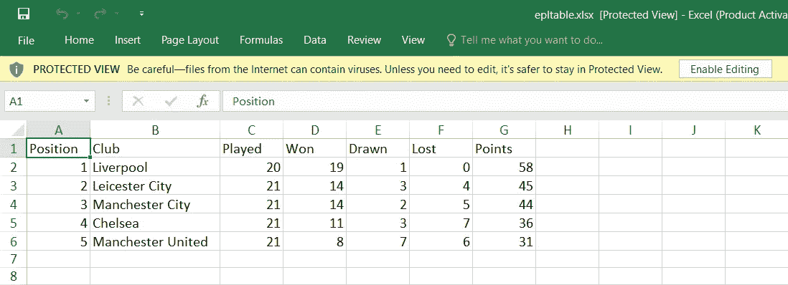

# 在 Angular 8 中将数据导出到 Excel 表格

> 原文：<https://levelup.gitconnected.com/export-data-to-excel-sheet-in-angular-8-7a8e0342643d>

## 在 Angular 中导出 excel 文件数据的指南


将 EPL 表导出到 Excel 表格

在本文中，我们将学习如何使用 Angular 8 导出 Excel 表格中的数据。有了 **xlsx** 库，我们就能把数据导出到 Excel 表格。

你所需要做的就是遵循这四个简单的步骤:

# 1.创建新的角度应用程序

首先，我们需要创建一个新的角度应用程序。在运行以下命令之前，确保您已经安装了 [Angular CLI](https://cli.angular.io/) 和 [Node.js](https://nodejs.org/en/download/) 。

```
ng new exportExcel
```

# 2.安装引导程序

对于这个演示，我们将使用 Bootstrap 作为我们的 CSS 设计模板。查看我以前的帖子，了解更多关于如何在 Angular 应用程序中安装 Bootstrap 的信息。

# 3.安装 XLSX 库

执行以下命令，将 xlsx 库添加到我们的应用程序中。

```
npm install xlsx --save
```

# 4.更新这两个文件

如下更新我们的 app.component.ts 和 app.component.ts。

**app.component.ts**

```
import { Component, OnInit, ViewChild, ElementRef } from '@angular/core';import * as xlsx from 'xlsx';@Component({
  selector: 'app-root',
  templateUrl: './app.component.html',
  styleUrls: ['./app.component.scss']
})export class AppComponent implements OnInit {
 @ViewChild('epltable', { static: false }) epltable: ElementRef; clubs = [
  {
    position: 1,
    name: "Liverpool",
    played: 20,
    won: 19,
    drawn: 1,
    lost: 0,
    points: 58
  },
  {
    position: 2,
    name: "Leicester City",
    played: 21,
    won: 14,
    drawn: 3,
    lost: 4,
    points: 45
  },
  {
    position: 3,
    name: "Manchester City",
    played: 21,
    won: 14,
    drawn: 2,
    lost: 5,
    points: 44
  },
  {
    position: 4,
    name: "Chelsea",
    played: 21,
    won: 11,
    drawn: 3,
    lost: 7,
    points: 36
  },
  {
    position: 5,
    name: "Manchester United",
    played: 21,
    won: 8,
    drawn: 7,
    lost: 6,
    points: 31
  }
 ];
 constructor() {} ngOnInit() {} exportToExcel() {
  const ws: xlsx.WorkSheet =   
  xlsx.utils.table_to_sheet(this.epltable.nativeElement);
  const wb: xlsx.WorkBook = xlsx.utils.book_new();
  xlsx.utils.book_append_sheet(wb, ws, 'Sheet1');
  xlsx.writeFile(wb, 'epltable.xlsx');
 }
}
```

**app.component.html**

```
<html lang="en">
 <head>
   <meta charset="UTF-8">
   <meta name="viewport" content="width=device-width, initial-scale=1.0">
   <meta http-equiv="X-UA-Compatible" content="ie=edge">  
   <title>Document</title>
 </head>
 <body class="bg-light">
  <div class="container">
   <div class="row py-5 justify-content-center">
    <div class="col-md-8">
     <h1 class="text-center py-4">Export Data to Excel Sheet in Angular 8</h1> <div class="col-md-12 table-responsive" #epltable>
      <div style="padding-bottom: 10px;padding-top: 10px;">
       <div class="row">
        <div class="col-sm-12">
         <button (click)="exportToExcel()" class="btn btn-success">Export To Excel</button> 
        </div>
       </div>
      </div> <table class="table table-bordered">
       <thead class="thead-dark">
       <tr>
        <th>Position</th>
        <th>Club</th>
        <th>Played</th>
        <th>Won</th>
        <th>Drawn</th>
        <th>Lost</th>
        <th>Points</th>
       </tr>
      </thead> <tbody>
       <tr *ngFor="let club of clubs">
        <td>{{club.position}}</td>
        <td>{{club.name}}</td>
        <td>{{club.played}}</td>
        <td>{{club.won}}</td>
        <td>{{club.drawn}}</td>
        <td>{{club.lost}}</td>
        <td>{{club.points}}</td>
       </tr>
      </tbody>
     </table>
    </div>
   </div>
  </div>
 </div>
</body></html>
```

通过运行`ng s -o`运行应用程序，并点击“导出到 Excel”按钮。

检查创建的 Excel 表。


创建并下载 Excel 表格

这是我们 Excel 表格中的结果。



Excel 表格中的 Epl 表格数据

# 结论

在本文中，我们学习了如何使用 xlsx 库在 Angular 8 应用程序中将数据导出到 Excel 表格中。

如果你认为这篇文章是有帮助的，不要忘记与你的朋友分享。

# 资源

[https://www . c-sharp corner . com/article/export-data-in-excel-sheet-using-angular/](https://www.c-sharpcorner.com/article/export-data-in-excel-sheet-using-angular/)