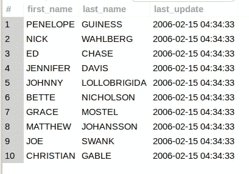
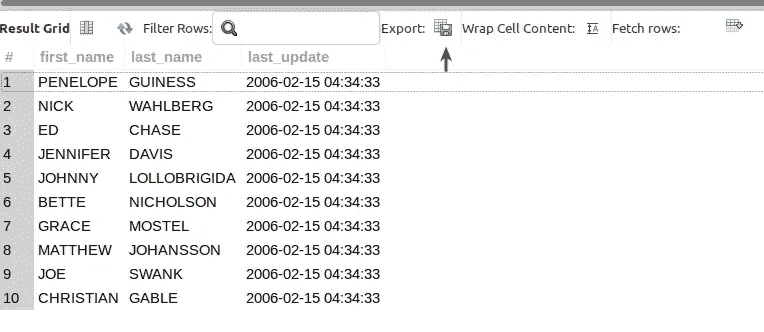
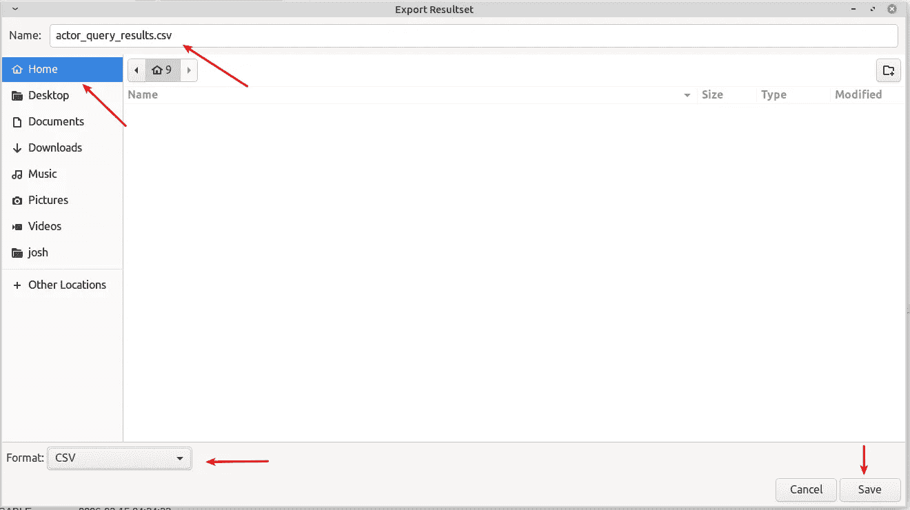
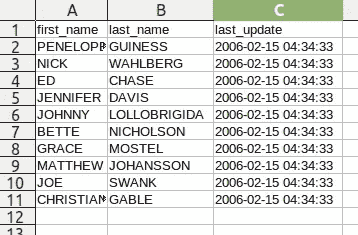

# 使用 MySQL Workbench 将查询结果导出到 CSV

> 原文：<https://levelup.gitconnected.com/export-query-results-to-csv-with-mysql-workbench-ed7722180174>

CSV 文件用于一切。由于 CSV 非常普遍，并且是一种友好的交换格式，每个人*都理解 CSV。这很好，因为有时可能有人需要您提供特定的查询结果数据或报告。您可以使用 MySQL Workbench 轻松地为他们提供一个精确查询结果的 CSV 文件…*


通过[注册电子邮件通知](https://parabollus.medium.com/subscribe)，我每次在 Medium 上发表博客文章时都会收到通知。如果你还不是该平台的会员，可以考虑通过[我的推荐链接](https://parabollus.medium.com/membership)注册一个中型账户。在不增加你额外费用的情况下，我会收到你会费的一小部分。成为会员后，你可以在平台上无限阅读作者的文章。谢谢你🙏

假设您在著名的 [sakila 实践数据库](https://dev.mysql.com/doc/sakila/en/)的“actor”表上有这样一个简单的查询:

```
SELECT first_name, last_name, last_update
FROM actor
LIMIT 10;
```



要将查询结果导出到 CSV 文件(或任意数量的格式)，请单击 MySQL 工作台**结果网格**中**导出:**选项卡旁边的网格/保存图标:



[***openlamp . tech***](http://openlamptech.substack.com)，面向 PHP/MySQL 开发者的简讯。建立社区。学习和成长…

点击**导出:**选项卡，弹出**导出结果集**对话框。如下图所示，你需要做的 4 件事是:

*   命名 CSV 文件
*   从**格式**下拉菜单中选择 **CSV**
*   选择导出位置
*   点击**保存**按钮



导出结果集对话界面

事实上就是这么简单…

使用您选择的电子表格应用程序(在本例中使用 LibreOffice)打开导出的 CSV，我们可以看到查询结果已经保存到 CSV 文件中:



一如既往，如果你有任何问题或看到代码中的任何错误，请通过评论让我知道。建设性的意见有助于我提供准确的博客帖子，我非常感激。感谢您的阅读。

[](/export-query-results-to-csv-with-sql-developer-digital-owls-prose-f5b5533b55de) [## 使用 SQL Developer 将查询结果导出为 CSV 格式— Digital Owl 的散文

### 世界上最通用的数据交换格式之一是 CSV 文件。数据专业人员使用 CSV 没有…

levelup.gitconnected.com](/export-query-results-to-csv-with-sql-developer-digital-owls-prose-f5b5533b55de) [](https://parabollus.medium.com/export-mysql-data-to-csv-with-phpmyadmin-4957b635a55b) [## 用 phpMyAdmin 将 MySQL 数据导出到 CSV

### 逗号分隔值文件(也称为 CSV 文件)是最受认可和使用最多的数据存储/交换文件之一…

parabollus.medium.com](https://parabollus.medium.com/export-mysql-data-to-csv-with-phpmyadmin-4957b635a55b) 

请在我的博客上关注我， [Digital Owl 的散文](http://joshuaotwell.com)，在那里我定期撰写关于 SQL、PHP 和 CodeIgniter 的文章。注册我的免费每周时事通讯，[***openlamp . tech***](http://openlamptech.substack.com)，这是一份面向 PHP/MySQL 开发人员的时事通讯，您可以收到每周直接发送到您收件箱的精选内容和深度专题文章。