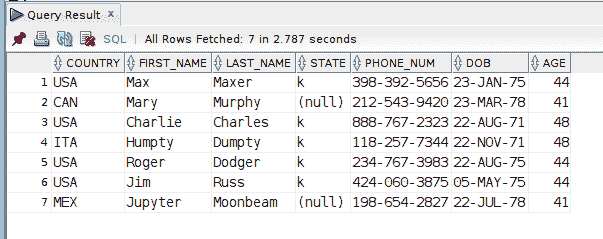
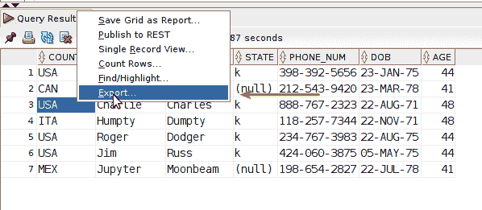
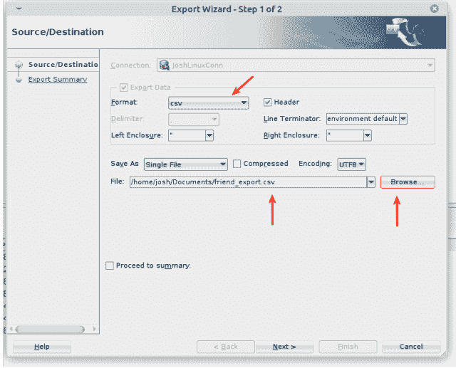
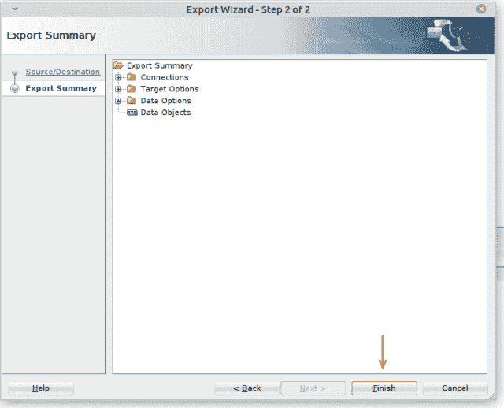
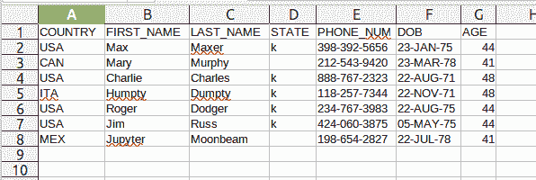

# 使用 SQL Developer 将查询结果导出到 CSV

> 原文：<https://levelup.gitconnected.com/export-query-results-to-csv-with-sql-developer-digital-owls-prose-f5b5533b55de>

## 数字猫头鹰的散文

世界上最通用的数据交换格式之一是 CSV 文件。数据专业人员不假思索地使用 CSV。同样，那些甚至不在“*数据字段”*中的人每天都使用 CSV。您是否有该报告的 SQL 查询结果，并且需要以 CSV 格式共享它们？使用 Oracle SQL Developer IDE，轻而易举…

自我推销:如果你喜欢这里写的内容，尽一切可能与其他可能从中受益或喜欢它的人分享这个博客和你最喜欢的帖子。因为咖啡是我最喜欢的饮料，如果你愿意，你甚至可以给我买一杯！

作为一名 SQL 专业人员，有时您必须深入 it 领域*才能从数据库中获取数据和见解。从数据中提供信息是我们工作的一部分。更进一步说，工作流程中其他人的*经常需要同样的数据和同样的洞察力来做好他们的工作。最容易理解和最容易的数据共享方式是什么？**

*CSV 文件。*

*如果您正在使用 Oracle 数据库并使用 SQL Developer，IDE 有一个易于使用的界面来导出数据。您可以将查询结果导出为各种格式，但是在本帖中，我们将查看如何将它们保存为 CSV 文件。*

# *将查询结果导出到 CSV*

*对于本文中的例子，我使用了这个虚构的**朋友**表和数据:*

*`SELECT * FROM FRIENDS;`*

**

*我坚持每周写一封关于我正在学习并感兴趣的 SQL/PHP 的邮件。如果这听起来像是你想参与的事情，请使用此[注册](https://digitalowlsprose.ck.page/1b35a06295)表格进行订阅。谢谢大家！*

## *步骤 1:查询导出结果*

*右键单击希望保存到 CSV 文件的查询结果的任意位置，并选择**导出**，如下图所示:*

**

*点击**导出**后，将打开导出向导对话框(如下一节所示)。*

## *步骤 2:配置导出选项*

*在打开的导出向导中执行以下步骤:*

*   *从**格式:**下拉列表中选择 csv。*
*   *使用**浏览**按钮并选择保存 CSV 文件的目的地。此外，在这一步命名文件，它显示在**文件:**部分。*
*   *点击下一个按钮**进入第二个对话界面。***

**

*(**注意**:在这里，我大部分情况下将其他设置保留为默认值。如果您不想在导出的 CSV 文件中包含列名的标题行，您可以取消选择**标题**复选框。)*

*你是[媒体](http://medium.com/)成员吗？如果是这样的话，[每次我在这里发表博客文章时都会收到电子邮件通知](https://parabollus.medium.com/subscribe)如果你喜欢那个平台的话。不是会员？别担心！使用[我的注册链接](https://parabollus.medium.com/membership)(我将获得佣金，无需额外费用)并加入。我真的很喜欢阅读这里所有精彩的内容，我知道你也会喜欢的！！！*

## *步骤 3:完成导出并查看 CSV 文件*

*剩下要做的就是查看所提供的导出摘要的各个步骤(如果需要),然后单击**完成**按钮。*

**

*在 LibreOffice 中打开保存的 **friend_export.csv** 文件，我们可以看到来自 SQL Developer 的相同查询结果现在保存到一个 csv 文件中。*

**

*这有多简单？*

*一如既往，如果你有任何问题或看到代码中的任何错误，请通过评论让我知道。建设性的意见有助于我提供准确的博客帖子，我非常感激。*

## *涵盖 CSV 的类似博客帖子和教程*

*我写过几篇其他的博文，涵盖了各种 SQL 实现及其 IDE/GUI 导入或导出 CSV 数据的步骤。更多精彩内容，请查看下面的列表！*

*   *[使用 Oracle SQL Developer 导入 CSV 文件](https://joshuaotwell.com/import-csv-file-with-oracle-sql-developer/)*
*   *[用 MySQL Workbench 导入 CSV 文件](https://joshuaotwell.com/import-csv-file-with-mysql-workbench/)*
*   *[使用 phpMyAdmin 将 MySQL 数据导出到 CSV 文件](https://joshuaotwell.com/export-mysql-data-to-csv-with-phpmyadmin/)*
*   *[用 phpMyAdmin](https://joshuaotwell.com/import-csv-file-data-into-mysql-table-with-phpmyadmin/) 将 CSV 文件数据导入 MySQL 表*
*   *[MySQL SELECT INTO 语法第 2 部分——保存到 OUTFILE 示例](https://joshuaotwell.com/select-into-outfile-examples-in-mysql/)*

*喜欢你读过的？看到什么不正确的吗？请在下面评论，感谢阅读！！！*

# *行动的号召！*

*感谢你花时间阅读这篇文章。我真心希望你发现了一些有趣和有启发性的东西。请在这里与你认识的其他人分享你的发现，他们也会从中获得同样的价值。*

*访问 [Portfolio-Projects 页面](https://wp.me/P28ctb-3KD)查看我为客户完成的博客帖子/技术写作。*

*[**我喜欢喝浓咖啡！**](https://ko-fi.com/joshlovescoffee)*

*要在最新的博客文章发表时收到来自本博客(“数字猫头鹰散文”)的电子邮件通知(绝不是垃圾邮件)，请点击“点击订阅！”按钮在首页的侧边栏！(如有任何问题，请随时查看 [Digital Owl 的散文隐私政策页面](https://wp.me/P28ctb-3gI):电子邮件更新、选择加入、选择退出、联系表格等……)*

*请务必访问[“最佳”](https://joshuaotwell.com/where-blog_post-in-digital-owls-prose-best-of/)页面，收集我的最佳博客文章。*

*[Josh Otwell](https://joshuaotwell.com/about/) 作为一名 SQL 开发人员和博客作者，他热衷于学习和成长。其他最喜欢的活动是让他埋头于一本好书、一篇文章或 Linux 命令行。其中，他喜欢桌面 RPG 游戏，阅读奇幻小说，并与妻子和两个女儿共度时光。*

**原载于 2021 年 8 月 25 日 https://joshuaotwell.com***。***