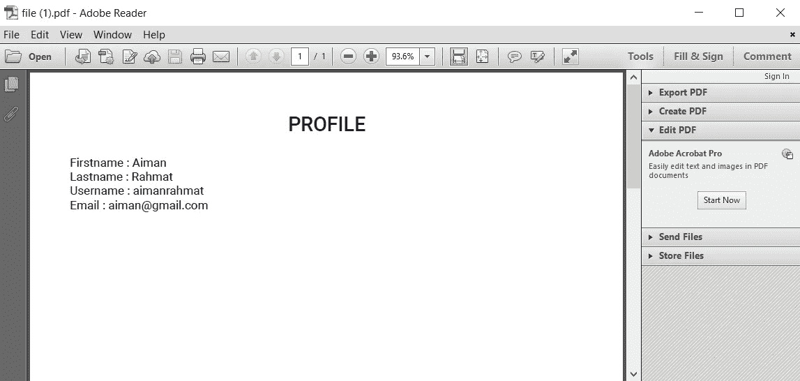
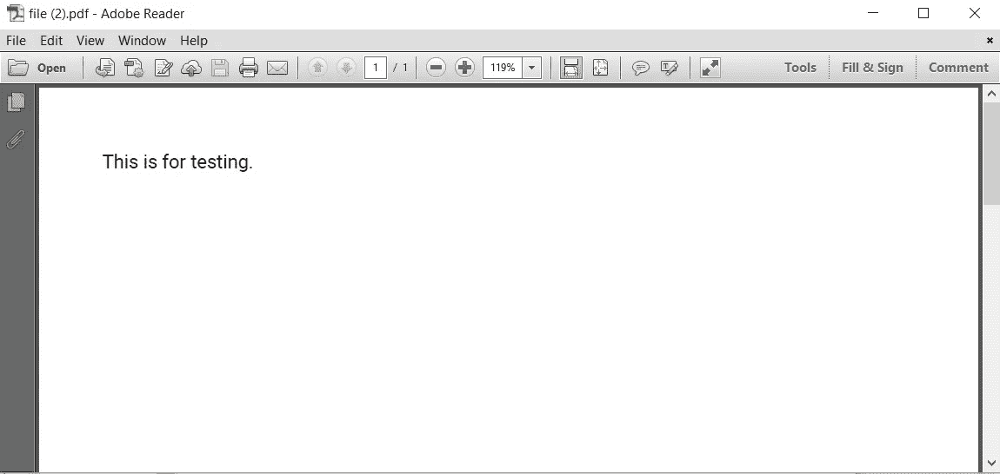

# 在 Angular 8 应用程序中使用 PDFMake 库导出到 PDF

> 原文：<https://levelup.gitconnected.com/export-to-pdf-with-the-pdfmake-library-in-an-angular-8-application-f0f83abfe703>

## 在 PDFfile 中打开、下载和打印您的配置文件信息的指南



最后结局

上图是这个简短教程的最终输出。

在本文中，我们将学习如何从注册表单中收到的信息生成 PDF 文件。我们将要使用的方法是**浏览器打印功能**。还有另一种方法是使用后端应用程序或第三方报告工具生成 PDF，然后在客户端下载。这里我们将重点讨论第一种方法。

我们将使用我在上一篇文章中创建的表单。你可以点击查看链接[。通过该链接，您可以了解如何使用反应式表单设置 Angular 8 应用程序。](/reactive-form-validation-with-smooth-scrolling-to-errors-in-angular-8-57fa63b2689d)

# 安装 PDFMake 库

首先，我们需要安装 PDFMake 库，这是一个用于客户端 PDF 生成的开源 JavaScript 库。只需运行以下命令。

```
npm install pdfmake --save
```

接下来，我们需要导入两个文件— `pdfmake.js`和`vfs_fonts.js`，它们来自上面的安装命令。在组件或服务的顶部插入下面的代码。这里我用的是`app.component.ts`文件。

**应用组件**

```
import pdfMake from 'pdfmake/build/pdfmake';
import pdfFonts from 'pdfmake/build/vfs_fonts';
pdfMake.vfs = pdfFonts.pdfMake.vfs;
```

# 在 PDF 中生成单行文本

为了测试我们的环境设置，我们将在 PDF 文件中生成一行文本。这将确保我们已经正确设置了环境。

创建一个函数

```
generatePdf(){
  const documentDefinition = { content: 'This is for testing.' };
  pdfMake.createPdf(documentDefinition).open();
}
```

创建一个“打开 PDF”按钮

```
<button (click)="generatePdf()">Open PDF</button>
```

这是从上面的命令生成的 PDF。



测试 PDF

因此，我们已经成功地设置了生成 aPDF 的环境。我们可以使用一些其他的内置方法来代替`open()`。

*   下载 PDF: `pdfMake.createPdf(documentDefinition).download();`
*   在同一窗口打开 PDF:`pdfMake.createPdf(documentDefinition).open({}, window);`
*   打印 PDF: `pdfMake.createPdf(documentDefinition).print();`

# 以 PDF 格式显示个人资料信息

我们将创建一个接口和 2 个函数来生成一个具有基本样式格式的 PDF。

**profile.ts**

```
export class Profile {
   firstname: string;
   lastname: string;
   username: string;
   email: string;
}
```

**应用组件**

```
import { Profile } from './profile';profile: Profile;generatePdf(action = 'open') {
   const documentDefinition = this.getDocumentDefinition(); switch (action) {
     case 'open': pdfMake.createPdf(documentDefinition).open();    
     break;
     case 'print': pdfMake.createPdf(documentDefinition).print(); 
     break;
     case 'download':     
     pdfMake.createPdf(documentDefinition).download(); 
     break; default: pdfMake.createPdf(documentDefinition).open(); 
     break;
   }
}getDocumentDefinition() {
   return {
     content: [
     {
       text: 'PROFILE',
       bold: true,
       fontSize: 20,
       alignment: 'center',
       margin: [0, 0, 0, 20]
     },
     {
     columns: [
       [{
         text: 'Firstname : ' + this.profile.firstname
       },
       {
         text: 'Lastname : ' + this.profile.lastname
       },
       {
         text: 'Username : ' + this.profile.username
       },
       {
         text: 'Email : ' + this.profile.email
       }] 
      ]
     }],
     styles: {
       name: {
         fontSize: 16,
         bold: true
     }
   }
 };
}
```

然后，我们可以在注册表单中输入所有信息后调用`generatePDF()`函数。

```
onSubmit() {
   this.submitted = true; if (this.signUpForm.invalid) {
     this.scrollToError();
   } else {
     this.profile = {
       firstname: this.signUpForm.value.firstname,
       lastname: this.signUpForm.value.lastname,
       username: this.signUpForm.value.username,
       email: this.signUpForm.value.email
     }; this.generatePdf("download");
   }
}
```

上面的一些代码来自[之前的教程](/reactive-form-validation-with-smooth-scrolling-to-errors-in-angular-8-57fa63b2689d)。基本上，我们将在 PDF 文件中只显示`firstname`、`lastname`、`username`和`email`。然后，我们可以得到如本教程开头所示的最终结果。

要生成具有更好样式格式的 PDF，可以检查这个[链接](https://www.ngdevelop.tech/angular-8-export-to-pdf-using-pdfmake/)。还有关于如何在 PDF 中添加表格和图片的信息。

但是，这个选项有一些限制。我们对 PDF 的格式和设计没有很强的控制。

# 结论

在这篇文章中，我们学习了如何从注册表单中收到的信息生成 PDF 文件。

如果你认为这篇文章是有帮助的，不要忘记与你的朋友分享。

# 资源

1.  [https://www . ng develop . tech/angular-8-export-to-pdf-using-pdf make/](https://www.ngdevelop.tech/angular-8-export-to-pdf-using-pdfmake/)