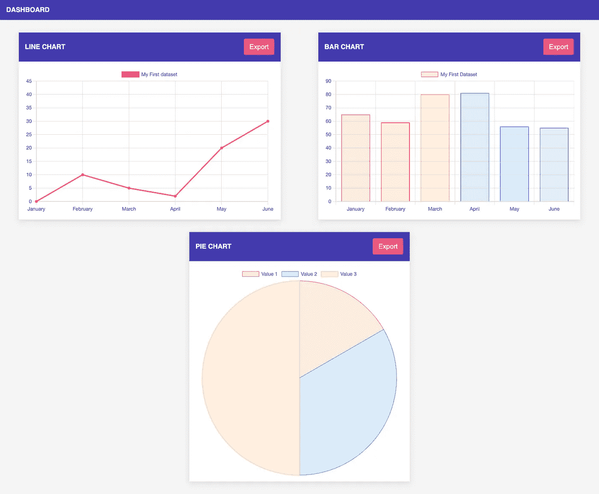

# 分 5 步将仪表板图表导出为 PDF。

> 原文：<https://levelup.gitconnected.com/exporting-dashboard-charts-to-pdf-638d3c8c5006>

在这里，我将解释使用一个开源 JavaScript 库和几行代码从 Dashboard 中提取图表是多么容易。

首先，我创建了一个简单的仪表板，包含三个图表:折线图、条形图和饼图。对于图表，我使用 ChartJS，但我们可以使用不同的图表库，如 D3，ECharts 等。在每个图表小部件的标题中，我们需要添加一个触发导出的按钮。以下是仪表板的外观:

下一步是实现导出功能。为此，我们可以使用 jsPDF。这是一个开源的 JavaScript 库，可以帮助我们将图表转换成 PDF 格式。它可以用于任何 JS 框架，但是在我的例子中，我将把它用于普通的 JavaScript。

可以使用 CDN 将库导入到项目中。单击导出按钮后，应该会调用功能。让我们在接下来的五个步骤中实现它:

1.  选择图表元素。
2.  把它转换成图像。
3.  用首选方向声明 jsPdf。
4.  使用 png 格式和适当的尺寸向 PDF 添加图像。
5.  保存 PDF。

下面是代码的样子:

为了避免代码重复，我已经将上面提到的所有步骤打包到一个单独的函数中。函数需要的一切都是元素和维度的 id。这些是作为参数传递的。顺便说一下，仪表盘的完整实现可以在我的 [GitHub](https://github.com/MaksymM92/graph-pdf-export) 中找到。

如你所见，实现只需要 5 行代码，功能就完成了。值得一提的是，这只是一个相当简单的例子。在真实的场景中，我们可能想要添加一些文本、标题、分页等等。这实际上是可能的，为此我们需要参考 jsPDF [文档](https://rawgit.com/MrRio/jsPDF/master/docs/index.html)。

希望我的快速指南有所帮助。自己试试吧，因为实践是最好的总结。干杯！