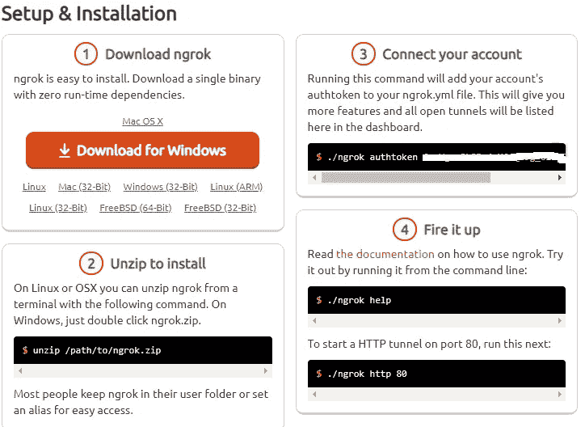
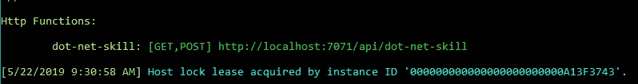
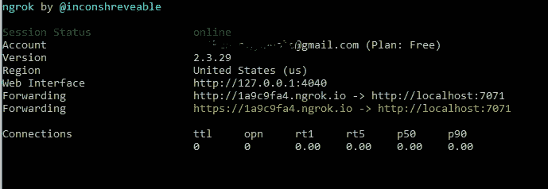
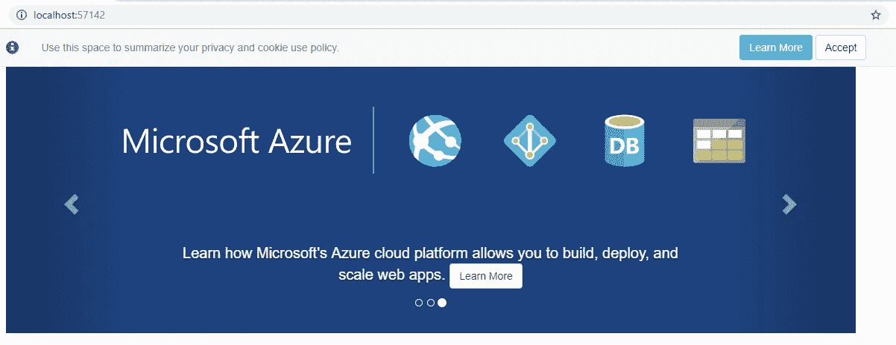
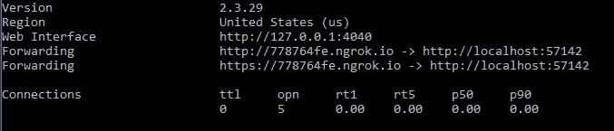
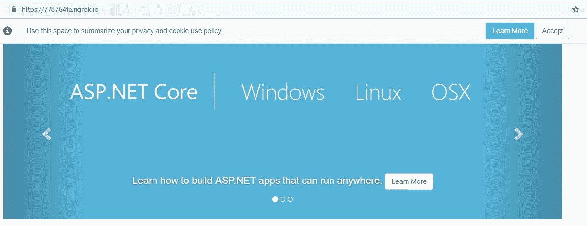

# 将 localhost 公开为公共 URL，并使用 ngrok 进行调试

> 原文：<https://levelup.gitconnected.com/expose-localhost-as-a-public-url-and-debug-using-ngrok-8912a91e6740>


ngrok 是一个非常棒的开源工具，它可以通过 SSL 将您的本地端口公开为一个公共 URL，您可以从 CLI 复制它。它提供了到本地主机服务器的安全通道。这意味着您的 localhost web 服务器将通过公共 URL 接收请求，如果您需要共享或演示或调试只接受公共 URL 的集成环境，这将非常方便。我们走一遍吧！

# Ngrok 设置

1.  登录[官方网站](https://ngrok.com/)并注册
2.  下载工具(这是一个单一的 exe 或 dmg 文件)
3.  在本地计算机上设置身份验证令牌
4.  您已经准备好公开您的本地端口



# 向公共 URL 公开 localhost REST API 并进行调试

这在集成中非常有用，因为其他部分只能接受公共 URL，而您希望调试 REST API，看看它是如何工作的。这个用例的一个例子是 Alexa 技能调试。

Alexa 技能开发人员控制台需要一个可公开访问的端点来处理请求。使用 ngrok，您可以将本地主机暴露给一个公共 URL，并在 Alexa 开发人员控制台中使用和调试它。

以下示例公开了一个 Azure 函数，使其可公开访问。这避免了将其部署到 Azure 进行集成测试，

1.  创建 Azure 函数
2.  运行函数并检查它运行的端口。



3.使用您的工具路径打开命令，并运行以下命令来显示您的本地端口

```
ngrok http 7071
```



现在，我可以在 Alexa dev 控制台中配置它，测试它，并根据需要将其分享给全世界。

# 将 localhost 作为 web 服务器公开给公共 URL 并进行调试

如果您正在为本地主机寻找一个临时的公共 URL，这将非常有用。您可以共享这个公共 URL 来演示它，也可以使用它来测试集成环境。最棒的是你可以调试它。这是你如何做它。

1.  创建一个 web 应用程序并在本地运行。我在用。NET Core Web app。检查它正在运行的端口。



2.使用您的工具路径打开命令，并运行以下命令来显示您的本地端口

```
ngrok http -host-header="localhost:57142" 57142
```



3.使用公共地址运行，并根据需要与全世界共享。



# ngrok 故障排除

如果 ngrok 不工作，可能是以下原因之一。

1.  如果您在代理之后，请检查您的代理和防火墙设置。
2.  总是暴露 HTTP 端口，ngrok 会给你 HTTPS 并正确重定向。
3.  免费帐户只会给你一个网址。

# ngrok 安全可靠吗？

关于安全问题有很多争论。它是开源的，可以监控你的流量。我只将它用于非敏感数据的开发测试。如果它让你更担心，那就在 [docker](https://github.com/gtriggiano/ngrok-tunnel) 用非敏感数据。