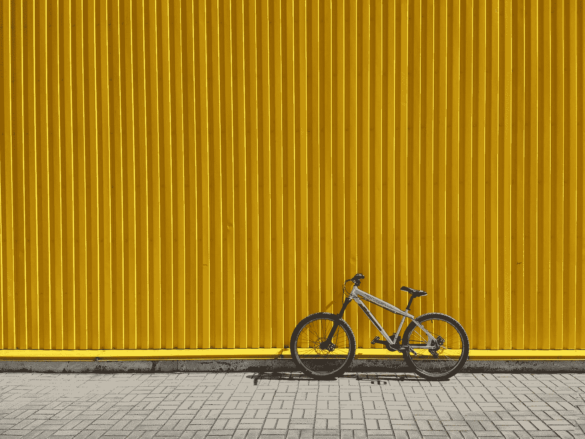

# 揭露谷歌校园特权

> 原文：<https://levelup.gitconnected.com/exposing-the-google-campus-perks-cf7ceffb2f14>

它们不是为谷歌员工准备的。

来自 Pexels 的卡伊奥

谷歌是最有声望的科技公司之一。从有竞争力的薪酬到优秀的工程文化，谷歌的额外津贴让该公司超越了竞争对手。对于那些不知道谷歌额外津贴和福利的人，他们包括:

*   免费午餐和晚餐
*   按摩椅
*   免费健身房准入
*   休息室
*   滑板车和自行车
*   音乐和视频游戏室

当然还有很多要列出来，但是我们可以把重点放在上面。虽然校园里有很多可以享受的东西，但以下是我注意到的作为软件工程师在谷歌工作的额外津贴

它们不是为谷歌员工准备的。

# 谷歌员工实际使用的额外津贴

由[城市教会克赖斯特彻奇](https://unsplash.com/@citychurchchristchurch?utm_source=medium&utm_medium=referral)在 [Unsplash](https://unsplash.com?utm_source=medium&utm_medium=referral) 上拍摄的照片

谷歌有太多的便利设施，无法一直使用它们。持续+80%的额外津贴如下所列。下面是实际使用的一个小列表，以及原因。

## 午餐、晚餐和微型厨房

不言而喻，在人生的每个阶段，免费的食物总是诱人的。省时的好处是不用做饭或打扫卫生，让你有更多的时间专注于工作。但比节省时间更重要的是建立团队化学。

当你所有的队友决定在中午 12:00 吃午饭时，很难拒绝他们，尤其是当你也饿了的时候。这给了团队一个相互交流和随意聊天的机会。

反过来，团队凝聚力和化学反应会发展，并导致更有成效的结果。

如果你在午餐和晚餐之间饿了，微型厨房里总有小吃和饮料。

## **健身房**

激励自己去健身房已经够难了。支付会员费也不会让事情变得更容易。

但是当你整天盯着电脑时，坐电梯下去做些运动感觉更好。免费向员工公开这一点是鼓励谷歌员工关心他们的福祉。

当然，这有助于所有员工明天更健康、更轻松地去上班。

# 未使用的谷歌特权

由[Vadim misyunko](https://unsplash.com/@vadimmisyuchenko?utm_source=medium&utm_medium=referral)在 [Unsplash](https://unsplash.com?utm_source=medium&utm_medium=referral) 上拍摄的照片

如果谷歌有这么多额外津贴，那么为什么谷歌员工不使用它们呢？以下是它们不切实际的原因

## 滑板车和自行车

标志性的谷歌滑板车和自行车只存在于选定的校园(即山景城和纽约)。如果校园不够大，这些私人车辆就不存在。

但是，即使你住在这样的校园里，除了你的办公室和自助餐厅，你还需要去哪里呢？

## 休息室

过去，人们不管累不累都必须来工作。如果需要的话，休息室会给员工提供休息的机会。如今，如果你累了，你会现实一点，在家工作一天来休息。

休息室是存在的，但很少有人使用。西雅图的午睡室只有 3 张床，我无法想象会有人来办公室午睡，而不是在家打盹。

## 音乐和视频游戏室

丽莎·克弗在 [Unsplash](https://unsplash.com?utm_source=medium&utm_medium=referral) 上的照片

经典的乒乓球桌在大多数试图变得“时髦”和“现代”的公司都很稳定。谷歌更进一步，在校园里增加了视频游戏和音乐室。

和其他人一起玩音乐和游戏更有趣。当周围唯一的其他玩家是其他员工时，如果他们忙于工作，你不应该感到惊讶。这使得大多数游戏和音乐室在一天中的大部分时间都是空的。

所有这些校园津贴和福利都是存在的，但它们很少被一贯地使用。

# 为什么谷歌有闲置的校园津贴

照片由[亚历克斯·科特利亚斯基](https://unsplash.com/@frantic?utm_source=medium&utm_medium=referral)在 [Unsplash](https://unsplash.com?utm_source=medium&utm_medium=referral) 上拍摄

谷歌员工的简单回答:**谷歌员工去办公室工作。**

谷歌员工和其他员工一样，每天都有工作要做。一天中的大部分时间是在他们的办公室、会议室或自助餐厅度过的。这样就没有时间玩视频游戏、午睡或在工作时骑自行车了。

下班后至少还有时间享受这些便利设施。但是大多数人下班后都想回家，这不应该让你感到惊讶。毕竟，津贴明天还是会有的。

明天它们会和今天一样空空如也。

# 结束语

我只能推测为什么这些校园津贴会存在。如果有的话，它似乎有助于谷歌品牌的潜在新员工。

但是当申请人想象自己利用了整个校园的时候，可悲的事实是我们都在办公室里度过了我们的日子，试图满足我们的项目期限。

你看到点击并按住拍手按钮会发生什么了吗？

帮助我进入 [**亚马逊**和**谷歌**的简历模板现已发售](https://alexcancode.gumroad.com/l/resumekit)！

如果你喜欢这种体验，考虑成为[会员](https://medium.com/@alexcancode/membership)以获得更多类似的内容！

Twitter 上有 1000 人在关注！

关注我在 LinkedIn 上的 10 万名粉丝

**在亚马逊和谷歌工作的区别:**

 [## 15 万美元的亚马逊工程师与 30 万美元的谷歌工程师

### 区别在于公司文化。

levelup.gitconnected.com](/150-000-amazon-engineer-vs-300-000-google-engineer-b0976793cf56)