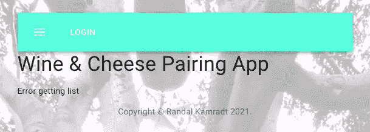
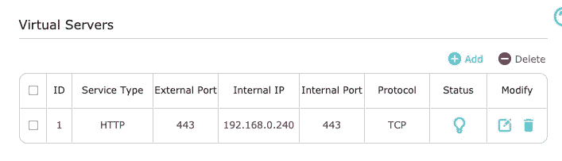
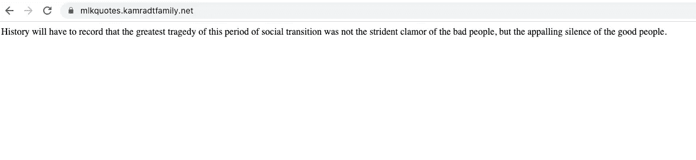

# 将您的家庭服务器暴露在恶劣的互联网环境中

> 原文：<https://levelup.gitconnected.com/exposing-your-home-server-to-the-big-bad-internet-5cb2878e8a17>

## 如何不陷入困境


图片由[皮克斯拜](https://pixabay.com/?utm_source=link-attribution&utm_medium=referral&utm_campaign=image&utm_content=1307227)的 Gerd Altmann 提供

它终于发生了，我在谷歌云的免费试用到期了，所以我所有的服务都关闭了。我并不急于让他们回来，他们都只是我写文章时使用的演示。但是我想有一个地方来托管它们，所以我在[网上的前端有一些数据。目前，我的葡萄酒和奶酪配对应用程序没有数据，所以你会看到这个悲伤的屏幕:](https://www.netlify.com/)



所以我决定将我的一台服务器暴露在互联网上。这是一个不太可能做出的决定，在你的路由器防火墙上打孔是一件必须小心谨慎的事情。并且您公开的服务器必须始终具有最新的安全补丁。即使这样，也不能保证，有很多坏人在寻找一个存储非法数据的地方，或者把你的电脑变成比特币挖矿僵尸。我以前做过，Nginx 日志很快就充满了漏洞探测，寻找安装了开箱即用的服务器并且懒得更改密码的人。

要完成本文，您需要一台服务器、一台允许您建立虚拟主机的路由器，以及一种控制 DNS 的方法。我使用 [Cloudflare](https://www.cloudflare.com/) ，他们也将为我提供 HTTPS 终端和到我们后端服务器的 HTTPS 通信。我对如何配置你的路由器的描述将是模糊的，因为所有的路由器都是不同的，所以你需要知道如何访问和配置你的路由器。如果你不使用 Cloudflare，你将不得不知道如何用你拥有的任何服务来控制你的 DNS。

我有一台翻新的机架式服务器，在亚马逊上相当便宜。在上面，我将使用我的旧文章[玩虚拟机和 Kubernetes](https://medium.com/better-programming/playing-with-vms-and-kubernetes-26ef93019c22) 作为指南来安装 Ubuntu 和 MicroK8s。除了我不会使用虚拟机，我将在裸机上安装 MicroK8s。我也不打算安装 SMTP 服务器、Nginx 服务器或 Jenkins 服务器，只是安装了 dns 和 metallb 插件的普通 MicroK8s。

我还将安装 Nginx Ingress 模块，如我的文章[如何使用 Kubernetes Ingress](https://medium.com/better-programming/how-to-expose-your-services-with-kubernetes-ingress-7f34eb6c9b5a) 中所述。我不需要处理 IPTables，因为我不会处理虚拟机上托管的 Kubernetes，也不会创建证书，我有其他的计划。安装 Nginx Ingress 的基本命令是:

```
kubectl apply -f [https://raw.githubusercontent.com/kubernetes/ingress-nginx/master/deploy/static/provider/baremetal/deploy.yaml](https://raw.githubusercontent.com/kubernetes/ingress-nginx/master/deploy/static/provider/baremetal/deploy.yaml)
```

安装完成后，您必须对其进行编辑，以便从 MetalLB 获取 IP。运行以下命令，将`spec.type`从`NodePort`更改为`LoadBalancer`。

```
kubectl edit service ingress-nginx-controller -n ingress-nginx
```

然后你可以得到 IP 地址

```
kubectl get services -n ingress-nginx
NAME                                 TYPE           CLUSTER-IP       EXTERNAL-IP     PORT(S)                      AGE
ingress-nginx-controller-admission   ClusterIP      10.152.183.191   <none>          443/TCP                      46h
ingress-nginx-controller             LoadBalancer   10.152.183.40    192.168.0.240   80:31704/TCP,443:30175/TCP   46h
```

在我的例子中，外部 IP 是 192.168.0.240，这是 MetalLB 提供的第一个 IP 地址。

现在，我无法向您详细介绍这一部分，因为每个路由器都不一样。我正好有一个部分允许我添加虚拟服务器，也就是说，如果路由器收到对某个端口的请求，它会将该请求转发到我们的内部服务器之一。它看起来是这样的:



服务类型的下拉列表不包括 HTTPS，所以我只使用 HTTP 并将内部和外部端口设置为 443。我将内部 IP 设置为上面列表中 Nginx 入口外部 IP 的 IP。这将为我提供端口 443 上的基本 TCP 协议，因此只会暴露最小的攻击面。

另一个问题是，我没有来自 ISP 的静态 IP，所以路由器列出的 IP 不能保证保持不变。但是根据我的经验，它相当稳定，所以我不会为一个静态 IP 地址额外付费

现在，我可以转到我的 Cloudflare DNS 页面，将我的一台主机连接到我的路由器报告的外部 IP。在每个 A 记录上设置 IP 非常容易，所以我不太担心我的路由器的外部 IP 改变，我将在 Cloudflare 上再次重置它们。

Cloudflare 根据我的主机名为我终止 HTTPS，因此我不必担心证书问题。但是我还希望在 Cloudflare 和我的路由器之间有 HTTPS。为此，我可以将 Cloudflare 设置为端到端加密，他们会为我生成一个证书和一个密钥文件。该证书是公开的，尽管它只被 Cloudflare 识别。密钥文件必须是私有的，即使 Cloudflare 不保留它的副本，因此请将其存储在安全的地方。我将证书剪切并粘贴到我的 Kubernetes 主机上的`kamradtfamily.net.pem`和`kamradtfamily.net.key`文件中。该主机上的所有服务都将向 Cloudflare 提供该证书。稍后我会和他们一起制作 Kubernetes `tls`秘密。

现在我需要一个服务来公开。因为我是在马丁·路德·金纪念日周末写这篇文章的，所以我将使用我的小报价生成服务，从他那里随机回复一条报价。当该服务托管在 GCP 上时，我使用我通常的计划，在 GitHub 存储库中创建 nginx.conf 和 docker-compose.yaml，我可以在 VM 上克隆它们，并在几分钟内运行。但是现在我将使用 Kubernetes，所以这将必须转换成带有入口的服务描述。我还想为每个服务或一组密切相关的服务使用单独的名称空间。在我的 Kubernetes 主机上，我运行以下命令:

```
kubectl create namespace mlkquotes
kubectl create secret -n mlkquotes tls 
     kamradtfamily 
     --key kamradtfamily.net.key 
     --cert kamradtfamily.net.pem
```

这将根据我的证书和密钥在`mlkquotes`名称空间中创建一个秘密。接下来，我将创建一个目录并编辑描述符文件:

```
mkdir mlkquotes-deploy
cd mlkquotes-deploy
vi mlkquotes.yaml
```

在`mlkquotes.yaml`中，您可以添加以下内容:

```
apiVersion: apps/v1
kind: Deployment
metadata:
  name: mlkquotes-deployment
  labels:
    app: mlkquotes
spec:
  selector:
    matchLabels:
      app: mlkquotes
  template:
    metadata:
      labels:
        app: mlkquotes
    spec:
      containers:
      - name: mlkquotes
        image: docker.io/rlkamradt/mlk-quotes-api
        ports:
        - containerPort: 80
---
apiVersion: v1
kind: Service
metadata:
  name: mlkquotes-service
spec:
  type: ClusterIP
  selector:
    app: mlkquotes
  ports:
  - port: 80
    targetPort: 80
---
apiVersion: networking.k8s.io/v1beta1
kind: Ingress
metadata:
  name: mlkquotes-ingress
  annotations:
    kubernetes.io/ingress.class: "nginx"
spec:
  rules:
  - host: mlkquotes.kamradtfamily.net
    http:
      paths:
      - backend:
          serviceName: mlkquotes-service
          servicePort: 80
        path: /
  tls:
  - hosts:
    - mlkquotes.kamradtfamily.net
    secretName: kamradtfamily
```

然后调出服务和入口:

```
kubectl apply -n mlkquotes -f mlkquotes.yaml
```

现在，您可以使用浏览器获取报价！



显然不是很漂亮，但是里面的东西很漂亮。如果您想要包含报价，可以在前端使用该服务。马丁·路德·金博士日快乐！