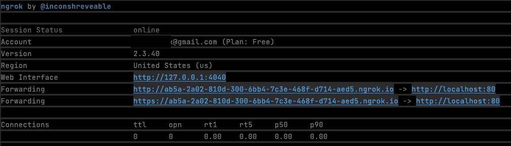
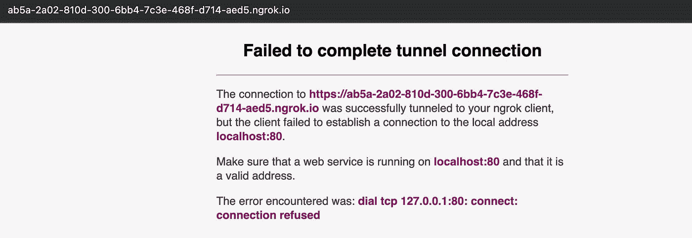
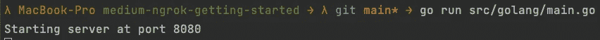
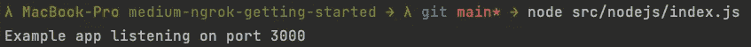
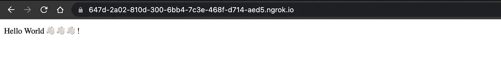
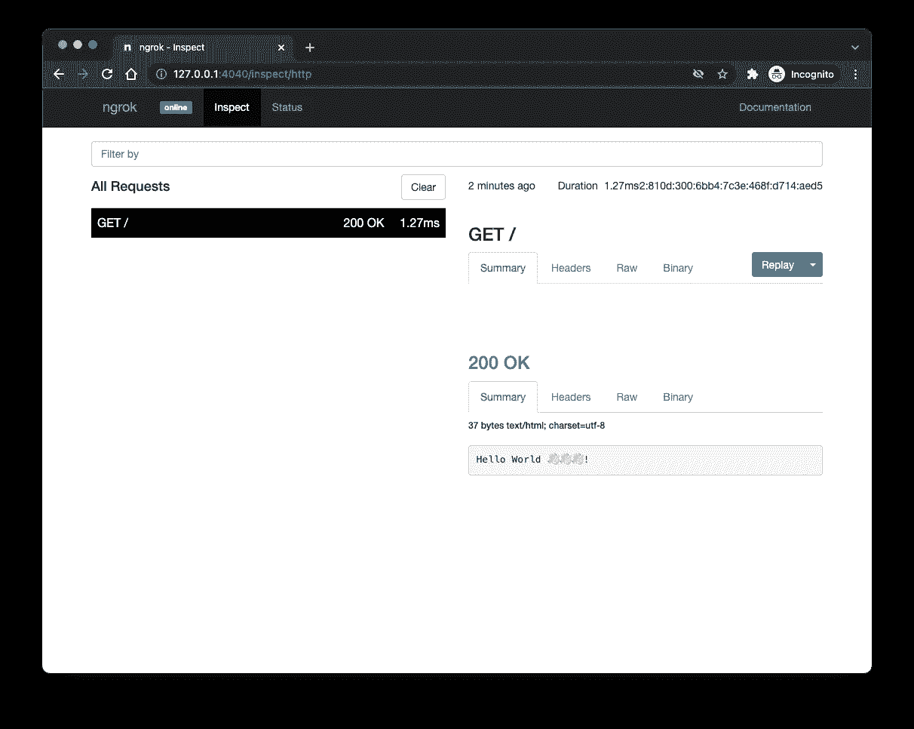

# 使用 ngrok 向公共互联网公开您的本地 Web 服务器

> 原文：<https://levelup.gitconnected.com/exposing-your-local-web-server-to-the-public-internet-using-ngrok-85f32652a87b>

关于使用 ngrok 将本地运行的 web 服务器暴露给公共互联网的简短介绍。

照片由 [JJ 英](https://unsplash.com/@jjying)在 [Unsplash](https://unsplash.com/)

**免责声明:**我与 [ngrok](https://ngrok.com/) 没有任何关系。我只觉得这是一个不可思议的地方发展工具，想分享一下。

**演示代码**

像往常一样，我准备了一个 [GitHub 库](https://github.com/Abszissex/medium-ngrok-getting-started)供您查看完成的代码库，并遵循本文中描述的步骤。

 [## GitHub-abszisex/medium-ngrok-入门

### 此时您不能执行该操作。您已使用另一个标签页或窗口登录。您已在另一个选项卡中注销，或者…

github.com](https://github.com/Abszissex/medium-ngrok-getting-started) 

## 什么是 ngrok，为什么要使用它？

简而言之，ngrok 创建了一个从您的本地机器到 ngrok 服务器的安全隧道，这些服务器暴露在公共互联网上，因此您可以向其他人或服务器提供对您的本地运行服务器的访问。

我主要使用 ngrok 为提供 webhooks 的产品编写集成。一个著名的例子是 GitHub webhooks。使用 GitHub webhooks 或任何其他 webhook 提供的产品，您总是希望在将代码推到某个地方之前，在本地机器上开发和测试 webhook 集成。您甚至可能没有一个可以作为 webhook 的目标插入的可达域。

对于这个用例，ngrok 相当完美。它为您提供了一个随机生成的公共可用(子)域，可在公共互联网上访问，因此您可以将 webhooks 指向该域，并让它们通过创建的隧道到达您本地运行的应用程序。

如果你想了解一下，你可以在这里找到它[ngrok](https://ngrok.com/)。

是否涉及任何成本？

简而言之:没有

长回答:看你的套餐了。幸运的是，ngrok 提供了一个免费的包(永远免费)，对于本地开发来说已经足够了。如果你经常使用 webhooks 或者有其他原因需要公开你的本地运行服务器，付费计划可能会有所帮助，因为每个付费计划除了许多其他功能外，还包括保留域名。如果你用的是免费版，域永远是随机的，每次启动 ngrok 都要在 webhook 配置中调整。

付费计划起价 5 美元/月，最高 12 美元/月。在我看来，价格还是很合理的。

**使用 ngrok**

ngrok 可用于所有主流系统，如 macOS、Windows、Linux、FreeBSD、Solaris，甚至还有 Docker 容器可用。

[在这里](https://ngrok.com/download)您可以为您的系统下载 ngrok，然后按照说明进行操作。你甚至不需要用 ngrok 创建一个帐户，但是你的 ngrok 会话会在一段时间后超时，因为有一个免费的软件包，我建议你创建一个免费的帐户。

当您在系统上安装了 ngrok 后，您可以通过键入`ngrok http 80`轻松启动它，您应该会看到类似如下的内容:

可以看到，有一些随机创建的域[http://ab5a-2a 02-810d-300-6 bb4-7c3e-468 f-d714-AE D5 . ngrok . io](http://ab5a-2a02-810d-300-6bb4-7c3e-468f-d714-aed5.ngrok.io)，它是公开可用的，并将所有请求转发到 [http://localhost:80](http://localhost:80) 。

如果您现在单击自动生成的域，您应该会在浏览器中看到以下内容:

这个错误消息是有意义的，因为您的本地机器上很可能还没有运行任何服务器，监听端口 80，所以 ngrok 不能传递请求。

**运行本地网络服务器**

如果没有可用的服务器，可以查看我为本文创建的 [GitHub 库](https://github.com/Abszissex/medium-ngrok-getting-started)。定义了两个 hello-world 服务器。一个是用 Go 写的，在 8080 端口监听。另一个是用 Node.js 写的，监听端口 3000。两者都只是处理路由`/`上的`GET`请求。

要运行 Go web 服务器，您可以

*   通过`go build src/golang/main.go`自行构建，然后在根级别运行创建的文件
*   或者通过`go run src/golang/main.go`直接运行源文件

要运行 Node.js 服务器，需要运行`src/nodejs`文件夹内的`npm install`，然后通过`node src/nodejs/index.js`运行`index.js`文件。

当其中一个服务器启动并运行后，您可以通过`ngrok http localhost:<PORT>`再次启动 ngrok，而`<PORT>`是您选择的端口(8080 用于 Go，3000 用于 Node.js)。

打开 URL，`ngrok`命令提供，在浏览器中，您应该看到一些来自服务器的 hello world 消息。

**网络图形用户界面**

但是 ngrok 不仅为您提供了将本地服务器暴露在互联网上的机会，而且它还有一个您甚至可以在免费版本中使用的 web 界面。

web 接口自动启动，并可在 [http://127.0.0.1:4040 到达。](http://127.0.0.1:4040.)

使用 web 界面，您可以检查通过 ngrok 隧道交付的所有请求和请求响应细节，就像使用 Chrome DevTools 的 network 选项卡一样。就你的服务器而言，在我个人看来，这是非常棒的。

## 摘要

在本文中，您应该已经了解了什么是 ngrok，以及如何使用 ngrok CLI 将您的本地运行服务器暴露给公共互联网，以便 webhooks 等外部服务可以访问它们。

## 你想联系吗？

如果你想联系我，请通过 LinkedIn 联系我。

另外，请随意查看我的书籍推荐[📚。](https://medium.com/@mr-pascal/my-book-recommendations-4b9f73bf961b)

 [## 我的书籍推荐

### 在接下来的章节中，你可以找到我对所有日常生活话题的书籍推荐，它们对我帮助很大。

mr-pascal.medium.com](https://mr-pascal.medium.com/my-book-recommendations-4b9f73bf961b)  [## 通过我的推荐链接加入 Medium—Pascal Zwikirsch

### 作为一个媒体会员，你的会员费的一部分会给你阅读的作家，你可以完全接触到每一个故事…

mr-pascal.medium.com](https://mr-pascal.medium.com/membership)