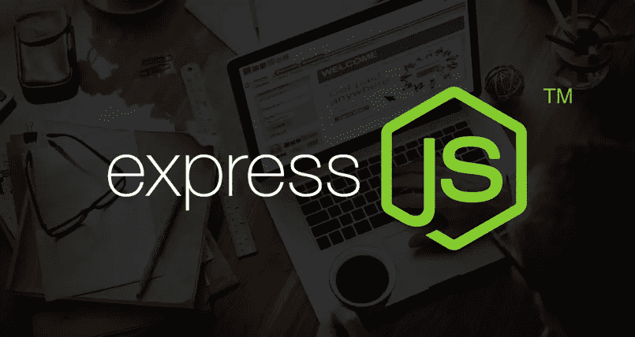
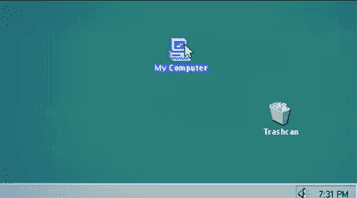

# 快递. js

> 原文：<https://levelup.gitconnected.com/express-js-9e17c6080fed>

## Node.js Web 应用程序框架



## 什么是 Express.js？

Express 是 Node.js 的一个 web 应用程序框架，它是为构建 web 应用程序和 API 而设计的，很像 Ruby on Rails 和其他后端/服务器端框架。Express 帮助您管理路线并处理请求和视图。

## 使用快递

在终端中安装 Express:

```
npm install express
```

将 Express 导入 JS 文件:

```
const express = require('express');
```

设置基本服务器:

```
const express = require('express');
const app = express();const PORT = process.env.PORT || 5000;app.listen(PORT, () => console.log(`Server started on port ${PORT}`));
```

## 处理请求

web 应用程序有四种基本的 HTML 请求:GET、POST、PUT/PATCH 和 DELETE。为了使用这些请求，我提供了样本数据来测试这些方法。

```
// Sample data
const members = [
  {
    id: 1,
    name: 'John Doe',
    email: 'john@gmail.com',
    status: 'active'
  },
  {
    id: 2,
    name: 'Bob Williams',
    email: 'bob@gmail.com',
    status: 'inactive'
  },
  {
    id: 3,
    name: 'Shannon Jackson',
    email: 'shannon@gmail.com',
    status: 'active'
  }
]
```

**获取请求:**

```
// Sample GET Requests// Get All Members
app.get('/api/members', (req, res) => {
   res.json(members)
}// Get Single Member
app.get('/api/members/:id', (req, res) => {
   const found = members.some(member => {
      member.id == req.params.id
   });
   if (found) {
      res.json(members.filter(member => {
         return member.id == req.params.id
      }))
   } else {
      res.status(400).json({ msg: `No member with the id of ${req.params.id}` })
}
```

GET 请求读取数据，通常将数据作为响应返回。在上面的例子中，一个 GET 请求返回数据中所有成员的数组。另一个 Get 请求返回具有特定“id”的单个成员的对象。


**发布请求:**

```
// Sample POST Request// Create Member
app.post('/api/members', (req, res) => {
  const newMember = {
    id: uuid.v4(),
    name: req.body.name,
    email: req.body.email,
    status: "active"
  }
  if (!newMember.name || !newMember.email) {
    res.status(400).json({ msg: 'Please include a name and email' })
  } members.push(newMember);
  res.json(members); // returns all members including new member
})
```

POST 请求创建一个新的数据对象，并将其添加到数据列表中。在上面的例子中，您看到一个新成员是通过接收用户在新成员的正文中请求的信息而创建的。然后，*将*推入成员数组，并返回所有成员的响应，包括新成员。


**上传请求:**

```
// Sample PUT Requestapp.put('/api/members/:id', (req, res) => { const found = members.some(member => {
      return member.id == req.params.id
   }) if (found) {
      const updateMember = req.body;
      members.forEach(member => {
         if (member.id == req.params.id) {
            member.name = updateMember.name ? updateMember.name : member.name;
            member.email = updateMember.email ? updateMember.email : member.email;
         res.json({ msg: 'Member updated', member })
         }
      })
   } else {
      res.status(400).json({ msg: `No member with the id of ${req.params.id}` })
   }
});
```

PUT 请求更新现有的数据对象，并根据用户的请求更改其属性。在上面的示例中，您看到一个成员的姓名或电子邮件被更改为用户要求编辑的不同姓名或电子邮件。


**删除请求:**

```
// Sample DELETE Request// Delete Member
app.delete('/:id', (req, res) => { const found = members.some(member => {
    return member.id == req.params.id
  }) if (found) {
    res.json({
      msg: 'Member Deleted',
      members: members.filter(member => {
        return member.id != req.params.id
      })
    })
  } else {
    res.status(400).json({ msg: `No member with the id of ${req.params.id}` })
  }
});
```

删除请求从数据列表中删除数据对象。在上面的例子中，目标成员是通过 *id* 找到的，非常类似于 PUT 请求，并使用 filter 方法删除，以包含与用户请求的 *id* 不具有相同 *id* 的所有成员。



## 管理路线

您可以在 Express 中管理您的路线。这很简单。您所要做的就是对您的应用程序进行一些更改。


制作路由器:

```
// index.js
const express = require('express');
const app = express();// Members API Routes
app.use('/api/members', require('./routes/api/members')); // members.js
const express = require('express');
const router = express.Router();router.get('/', (req, res) => {
   res.json(members)
}
```

变化:

*   将您的 HTML 请求移动到 *api* 和 *routes* 文件夹下的不同文件中
*   添加*成员 API 路由*代码片段
*   相应地更改您的 HTML 请求路由

这些更改使您的代码更有条理，并使您更容易编程。

## 渲染视图

快速渲染带有快速手柄的模板。

在候机楼安装快速把手:

```
npm install express-handlebars
```

使用快速把手:

```
// index.jsconst exphbs = require('express-handlebars);// Handlebars Middleware
app.engine('handlebars', exphbs({ defaultLayout: 'main' }));
app.set('view engine', 'handlebars');
```

在 index.js 中，导入`express-handlebars`，声明为变量。然后在“手柄中间件”下添加两行代码，以便使用它来渲染视图。在你的根文件夹中，在`views`下创建一个`views`文件夹和一个`layouts`文件夹。在这两个文件夹中，你可以制作扩展名为`.handlebars`的 HTML 模板。

```
// Sample .handlebars in layouts folder
<!DOCTYPE html>
<html lang="en">
  <head>
    <meta charset="utf-8">
    <meta name="viewport" content="width=device-width, initial-scale=1.0">
    <meta http-equiv="X-UA-Compatible" content="ie=edge">
    <link rel="stylesheet" href="[https://stackpath.bootstrapcdn.com/bootstrap/4.4.1/css/bootstrap.min.css](https://stackpath.bootstrapcdn.com/bootstrap/4.4.1/css/bootstrap.min.css)" integrity="sha384-Vkoo8x4CGsO3+Hhxv8T/Q5PaXtkKtu6ug5TOeNV6gBiFeWPGFN9MuhOf23Q9Ifjh" crossorigin="anonymous">
    <title>Members App</title>
  </head>
  <body>
    <div class="container-mt4">
      {{{ body }}}
    </div>
  </body>
</html>// Sample .handlebars in views folder
<h1 class="text-center mb-3">{{title}}</h1>
<form class="mb-4" action="/api/members" method="post">
  <div class="form-group">
    <label for="name">Name</label>
    <input type="text" name="name" class="form-control">
  </div>
  <div class="form-group">
    <label for="email">Email</label>
    <input type="email" name="email" class="form-control">
  </div>
  <input type="submit" value="Add Member" class="btn btn-primary btn-block">
</form>
<h4>Members</h4>
<ul class="list-group">
  {{#each members}}
    <li class="list-group-item">{{this.name}}: {{this.email}}</li>
  {{/each}}
</ul>
```

使用 Express Handlebars 允许用户查看页面来执行 HTML 请求。它基本上使应用程序与用户更具交互性。您可以通过页面创建新成员，而不是使用代码语言来创建成员。但是，当执行某些操作时，您必须呈现视图并重定向到其他视图。


您希望应用程序将用户重定向到不同的页面或重新呈现当前页面，而不是从服务器获得 JSON 作为响应。

```
// Changes to HTML Requests// comment 'res.json(members)' from POST request
res.redirect('/'); // <--- replace with this code
```

您希望将几乎所有的`res.json()`代码都改为`res.redirect()`，这样用户就会收到一个页面而不是 JSON 作为响应。当您创建成员、更新成员和删除成员时，您很可能希望重定向到某个页面。

## 结论

对于那些有后端编程经验的人来说，Express 是一个很好的服务器端 web 应用程序框架。对于想要了解后端的初学者来说可能很难，因为一些词汇可能会让新开发人员感到困惑。我是一个相当有经验的开发人员，我使用 Ruby on Rails 作为我的第一个后端框架。连我都不知道什么是‘车把’，直到我学会了快递。对于开始学习后端编程的开发人员，我推荐 Ruby on Rails。Express 似乎是为那些更有经验和使用 JavaScript 和 Node 的人提供的一个框架。

作为 MERN 的一部分，Express 与 Node.js、React 和 MongoDB 配合得非常好。我在 Node.js 和 React 上有几篇博文。我可能会在不久的将来发布一篇关于使用 MongoDB 的博文来完成 MERN 教程。

[](https://medium.com/@peterlin5301997/node-js-b6c382d3f72b) [## 节点. js

### Node.js 是什么，是做什么的？

medium.com](https://medium.com/@peterlin5301997/node-js-b6c382d3f72b) [](https://medium.com/@peterlin5301997/types-of-react-components-a38ce18e35ab) [## React 组件的类型

### 功能组件、类别组件、纯组件和高阶组件

medium.com](https://medium.com/@peterlin5301997/types-of-react-components-a38ce18e35ab)