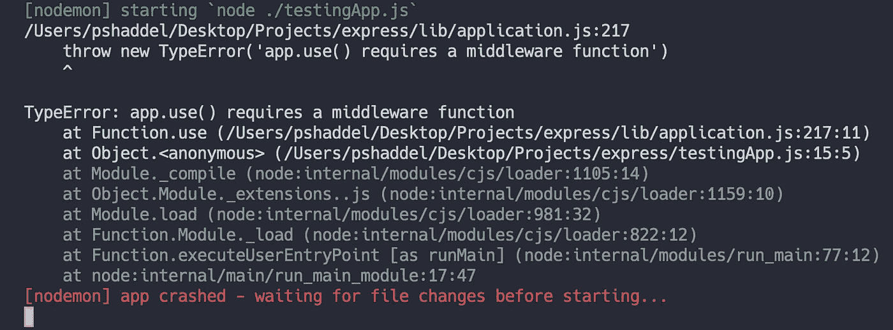

# ExpressJS 的幕后:深入了解 Nodejs 最受欢迎的库

> 原文：<https://levelup.gitconnected.com/expressjs-deep-dive-387f07c50d95>


快速 JS 内部

Express 是最常用的 Nodejs 库之一，真正了解这个库而不仅仅是一个用户是非常重要的。它不是一个复杂的库，在这篇文章中，我们想深入了解内部发生了什么。这可能有助于我们更好地了解我们的 express 应用程序何时出现问题。

# 你将在这篇文章中读到什么

本文假设您已经对 ExpressJS 有所了解，并且希望对 ExpressJS 有更深入的了解。

首先，我们来看看*为什么表达很重要，以及它的利弊。*

然后我们要检查一下 **ExpressJS** 的源代码，并指出重要的部分:

*   *创建快递应用*
*   *添加中间件*
*   *处理请求*
*   *下一个功能*

# 为什么要快递？

Express 仍然是世界上使用最多的后端框架之一，因此值得一试，看看它的优缺点，然后深入了解内部实现。


最流行的后端框架

我已经在 ExpressJS 工作了 5 年，根据我的个人经验，这些是优点和缺点。

## 赞成的意见

*   **广泛使用**:正如你在这个视觉报告中看到的，对工作机会的需求仍然很大。
*   **社区和大量集成工具**:由于有这么多人在使用 ExpressJS，你可以找到许多库来解决围绕 ExpressJS 的问题。
*   **简单**:初级开发人员需要花几分钟时间学会如何用 ExpressJS 创建一个简单的应用。
*   **中间件**:如今，中间件的思想已经在大多数框架中实现，这是一件好事，它解决了应用程序中一些重复出现的问题。

## 骗局

*   **性能**:你可以在基准测试中看到，它并不是 Nodejs 中最快的 HTTP 库，与类似 [**Fastify**](https://www.fastify.io/) 的东西相比，它要慢一些！
*   安全:默认情况下，它不提供一些安全检查所需的功能或验证，所以你需要自己实现或使用第三方库。


Nodejs 框架[基准](https://www.fastify.io/benchmarks/) 2022

# 让我们看看 Express 是如何处理请求的！

## 克隆 Express 的存储库

使用以下命令之一:

```
git clone https://github.com/expressjs/express.git
```

```
git clone git@github.com:expressjs/express.git
```

如果你不想克隆这个库，完全没问题，我把重要的代码放在这里。

## **当我们创建一个 Express app(创建应用程序功能)时会发生什么？**

我们通常这样创建我们的 Express 实例:

```
const app = require('express')();
```

我们正在运行默认的导出函数。我们可以在`[lib/express.js](https://github.com/expressjs/express/blob/master/lib/express.js)`中找到这个函数

```
var bodyParser = require('body-parser');
var EventEmitter = require('events').EventEmitter;
var mixin = require('merge-descriptors');
var proto = require('./application');
var Route = require('./router/route');
var Router = require('./router');
var req = require('./request');
var res = require('./response');

exports.json = bodyParser.json;
exports.text = bodyParser.text;
exports.raw = bodyParser.raw;
exports.urlencoded = bodyParser.urlencoded;

exports = module.exports = createApplication;

function createApplication() {
  var app = function(req, res, next) {
    app.handle(req, res, next);
  };

  mixin(app, EventEmitter.prototype, false);
  mixin(app, proto, false);

  // expose the prototype that will get set on requests
  app.request = Object.create(req, {
    app: { configurable: true, enumerable: true, writable: true, value: app }
  })

  // expose the prototype that will get set on responses
  app.response = Object.create(res, {
    app: { configurable: true, enumerable: true, writable: true, value: app }
  })

  app.init();
  return app;
}
```

所以默认功能是`createApplication`。

让我们看看这方面的进展:

`[body-parser](https://github.com/expressjs/body-parser)`库是导入的，使用过四种方法:`json`、`text`、`urlencoded`和`raw`。因此，每次您在 Express 应用程序中调用`res.json({ someData: true })`时，您实际上都在使用`body-parser`库。(如果你想知道这个库是如何解析你的请求体的，请查看这个文件)

在`createApplication`函数中有一个名为`[mixin](https://github.com/expressjs/express/blob/master/lib/express.js#L42)`的函数，它是`[merge-descriptors](https://github.com/component/merge-descriptors)`库。这个函数只是将第二个参数的方法添加到传递的第一个对象中。

```
const mixin = require('merge-describpto')
var thing = {
  get name() {
    return 'jon'
  }
};
var animal = {
};
mixin(animal, thing);
animal.name === 'jon'
```

两个对象与我们的 express 实例混合在一起。第一个是[事件发射器](https://javascript.plainenglish.io/how-we-can-use-node-js-event-emitter-5c9e39c38749)，用于事件发射行为(我们希望监听类似错误的事件，并且我们还希望发射一些事件来让监听器知道已经发生了一些事情)，第二个是`proto`，它是存储库中的这个文件:`[lib/application.js](https://github.com/expressjs/express/blob/master/lib/application.js)`

在`[createApplication](https://github.com/expressjs/express/blob/master/lib/express.js#L70)`的第三部分，它从这两个文件中分配`request`和`response`对象:

`[lib/request.js](https://github.com/expressjs/express/blob/master/lib/request.js)`和`[lib/response.js](https://github.com/expressjs/express/blob/master/lib/response.js)`。

你可以在这里找到的另一个方法是`listen`:

```
app.listen = function listen() {
  var server = http.createServer(this);
  return server.listen.apply(server, arguments);
};
```

在这里，您可以看到 express 将处理请求的对象传递到这里，并将所有逻辑传递到 Nodejs HTTP 核心库。

**快速路由器:添加中间件**

我们在 Express instance 上使用的一个重要方法是`use`函数，当我们想要在我们的应用程序上注册一个中间件时(`[lib/router/index.js](https://github.com/expressjs/express/blob/master/lib/router/route.js)`):

```
proto.use = function use(fn) {
  var offset = 0;
  var path = '/';

  // default path to '/'
  // disambiguate router.use([fn])
  if (typeof fn !== 'function') {
    var arg = fn;

    while (Array.isArray(arg) && arg.length !== 0) {
      arg = arg[0];
    }

    // first arg is the path
    if (typeof arg !== 'function') {
      offset = 1;
      path = fn;
    }
  }

  var callbacks = flatten(slice.call(arguments, offset));

  if (callbacks.length === 0) {
    throw new TypeError('Router.use() requires a middleware function')
  }

  for (var i = 0; i < callbacks.length; i++) {
    var fn = callbacks[i];

    if (typeof fn !== 'function') {
      throw new TypeError('Router.use() requires a middleware function but got a ' + gettype(fn))
    }

    // add the middleware
    debug('use %o %s', path, fn.name || '<anonymous>')

    var layer = new Layer(path, {
      sensitive: this.caseSensitive,
      strict: false,
      end: false
    }, fn);

    layer.route = undefined;

    this.stack.push(layer);
  }

  return this;
};
```

在这个函数的第一部分，它检查是否只有一个中间件被传递，或者它是否是一个数组。如你所知，我们可以这样使用它:

```
app.use(firstMiddleware, secondMiddleware);
app.use([firstMiddleware, secondMiddleware]);
```

然后，它检查并返回一个错误，如果没有中间件通过。如果我使用这样的代码，我会得到这个错误:

```
app.use(); // or app.use([])
```



没有向应用程序传递中间件时出错。使用函数

如你所见，这是我们得到的同一个错误:`requires a middleware function`。

在下一部分，你会看到**使**回调变平。这也很重要。我们甚至可以在嵌套数组中传递中间件。一个例子是这样的:

```
const app = require('./lib/express')();

const first = (req, res, next) => {console.log('first');next();}
const second = (req, res, next) => {console.log('second');next();}
const third = (req, res, next) => {console.log('third');res.send('text');}

app.use([first, [second, third]]);
```

因此`use`函数需要将这些中间件展平为一个数组，如下所示:

```
[1, [2, 3]] => Flatten => [1, 2, 3]
```

这就是这个**展平**功能正在做的事情。现在我们有了一组中间件，我们需要循环遍历它们，并添加它们以保存在某个地方。这是下一步:

```
var layer = new Layer(path, {
      sensitive: this.caseSensitive,
      strict: false,
      end: false
    }, fn);

layer.route = undefined;

this.stack.push(layer);
```

这一部分最重要的事情是，我们将这些中间件(以稍微不同的形式)添加到一个实现了`push`函数的对象或数组中，称为`stack`这是 Express 保存中间件并在需要时执行函数的地方。`[Layer](https://github.com/expressjs/express/blob/master/lib/router/layer.js#L33)`是一个简单的构造函数，以不同的形式保存中间件的数据:

你可以在这里找到图层:`[lib/router/layer.js](https://github.com/expressjs/express/blob/master/lib/router/layer.js#L33)`。如你所见，这只是一些任务，并没有真正重要的事情发生。

```
function Layer(path, options, fn) {
  if (!(this instanceof Layer)) {
    return new Layer(path, options, fn);
  }

  debug('new %o', path)
  var opts = options || {};

  this.handle = fn;
  this.name = fn.name || '<anonymous>';
  this.params = undefined;
  this.path = undefined;
  this.regexp = pathRegexp(path, this.keys = [], opts);

  // set fast path flags
  this.regexp.fast_star = path === '*'
  this.regexp.fast_slash = path === '/' && opts.end === false
}
```

## 快速路由器:处理请求和下一个功能

我们看到我们有一个名为`handle`的函数。

现在我们想看看请求是如何处理的。它调用这个文件`lib/router/index.js`中的`handle`函数。`proton.handle`:

我有意删除了 handle 函数的一些部分，以便我们可以专注于重要的部分:

```
proto.handle = function handle(req, res, out) {
  var self = this;
  var idx = 0;
  var sync = 0;
  // middleware and routes
  var stack = self.stack;
  // setup next layer
  req.next = next;
  next();
  // ... here is the next function implementation
};
```

`idx`用于跟踪中间件数组中的当前索引(`stack`)。它调用下一个函数。让我们看看**下一个函数**的实现。(同样在这里，删除了一些部分，以专注于主要部分)

```
 function next(err) {
    // no more matching layers
    if (idx >= stack.length) {
      setImmediate(done, layerError);
      return;
    }
    // find next matching layer
    var layer;
    var match;
    var route;
    while (match !== true && idx < stack.length) {
      layer = stack[idx++];
      // Match the current path and middlewares
      match = matchLayer(layer, path);
      route = layer.route;
      if (match !== true) {
        continue;
      }
      if (layerError) {
        // routes do not match with a pending error
        match = false;
        continue;
      }

      var method = req.method;
      var has_method = route._handles_method(method);
    }

    // no match
    if (match !== true) {
      return done(layerError);
    }

    // store route for dispatch on change
    if (route) {
      req.route = route;
    }

    // this should be done for the layer
    self.process_params(layer, paramcalled, req, res, function (err) {
      if (err) {
        next(layerError || err)
      } else if (route) {
        layer.handle_request(req, res, next)
      } else {
        trim_prefix(layer, layerError, layerPath, path)
      }

      sync = 0
    });
  }
```

它检查的第一件事是是否有更多应该检查的中间件:`if (idx >= stack.length)`所以如果没有更多需要检查的，它就返回。

下一步是检查哪些层符合当前请求。您会看到一个 *while 循环*，它会一直运行，直到找到匹配的中间件。在 while 循环中，您可以看到一个查找匹配的检查:`[match = matchLayer(layer, path);](https://github.com/expressjs/express/blob/master/lib/router/index.js#L226)`。

实现的最后一部分是调用`self.process_params`进行一些检查，如果没有错误，它最终调用`layer.handle_request`，这是您传递给匹配中间件的函数`(req, res, next)=>{...}`。如果该中间件返回响应，则处理该请求的过程完成，否则，它调用`next`函数，并再次进入相同的过程，只是值`idx`有一个简单的不同，因此它在中间件数组中找到下一个匹配。

# 摘要

尽管我们忽略了 ExpressJS 实现中的许多细节，但我们对 express 将中间件放在哪里以及如何处理每个请求有了更好的理解。

我们检查的第一件事是 Express 实例的创建，以及 Express 如何向该对象添加不同的功能，并最终用`listen`函数服务于 HTTP 服务器。

然后我们看到，通过调用 Express 实例上的`use`或方法函数，我们可以将这些中间件添加到一个名为`stack`的对象中。

为了处理一个请求，Express 调用 handle 函数，并在一些检查和参数改变之后调用*下一个函数*，并且*下一个函数*可以访问中间件所在的`stack`对象，然后它在中间件上循环，如果发现匹配，它就调用中间件。

[](https://statisticsanddata.org/data/most-popular-backend-frameworks-2012-2022/) [## 2012/2022 年最受欢迎的后端框架

### 最受欢迎的后端框架- 2012/2022。阅读更多了解 2012-2022 年最流行的后端框架。

statisticsanddata.org](https://statisticsanddata.org/data/most-popular-backend-frameworks-2012-2022/) [](https://www.fastify.io/benchmarks/) [## 基准

### 利用我们在 Node.js 性能方面的经验，Fastify 已经从头开始构建，速度可与…

www.fastify.io](https://www.fastify.io/benchmarks/)