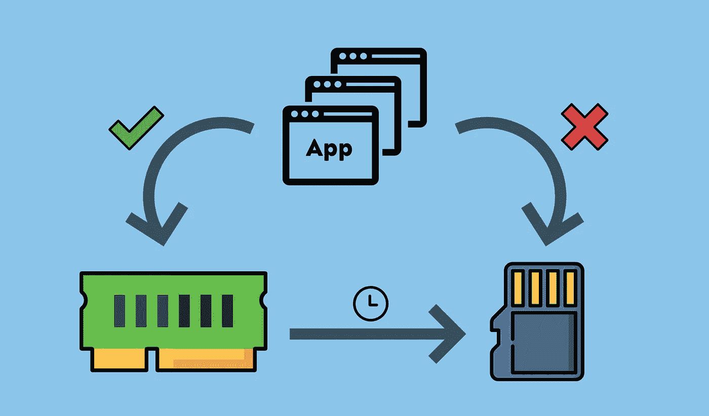
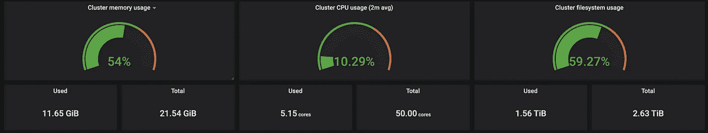
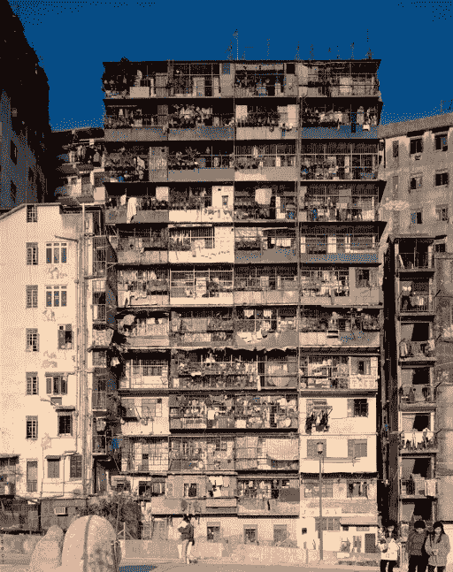

# 使用 log2ram 延长您的 Raspberry Pisd 卡的使用寿命

> 原文：<https://levelup.gitconnected.com/extend-the-lifespan-of-your-raspberry-pis-sd-card-with-log2ram-5929bf3316f2>

## Log2ram 是将日志重定向到内存而不是 SD 卡的软件。下面是我如何在我的树莓 Pi 中使用它来延长我的 SD 卡的寿命。



最初发布于 2020 年 10 月 24 日 [ikarus.sg](https://ikarus.sg/extend-sd-card-lifespan-with-log2ram/)

在我的[上一篇文章](https://ikarus.sg/using-zram-to-get-more-out-of-your-raspberry-pi/)中，我谈到了如何使用 *zram* 免费从你的树莓 Pi 中挤出更多内存。在这篇文章中，我将讨论如何使用额外的压缩内存来延长 Raspberry Pi 上 SD 卡的寿命。

## 使用 SD 卡的绝妙设计

自从树莓 Pi 问世以来，市场上几乎所有的*单板电脑*(SBC)都纷纷效仿，使用 SD 卡作为操作系统的主要存储介质。

在我看来，这样做的主要好处是:

1.  在操作系统发生灾难性故障时，无需断开设备连接并将设备移至您的计算机进行重置或刷新
2.  SD 卡的低价位支持在存储故障时廉价更换
3.  更快的迭代学习和功能集切换，设备可以通过交换 SD 卡扮演完全不同的角色，这需要切换操作系统。
    例如:➡️媒体中心桌面更换➡️物联网中心

## 当这种辉煌成为问题时

虽然 SD 卡的使用对于学习和小型个人项目非常有用，但由于树莓派基金会和所有其他 SBC 制造商之间的*规范军备竞赛*，现今的 SBC 已经*超越了它们最初的用例。*

例如，在撰写本文时，我们看到的是带有 8GB RAM 选项的 Raspberry Pi 4 Model B，这对于简单的物联网控制器来说太多了。因此，SBC 市场正在缓慢但肯定地增长，超过其原始用例，这并不令人惊讶。

## 我用单板机做什么

我目前在 11 台 SBC 上为我的家人和密友(最多 20 个用户)运行自托管 web 服务，总共多达 50 个内核，23GB 内存分布在两个集群上，[北海巨妖](https://ikarus.sg/how-i-built-kraken/)和利维坦。



我的 Grafana 仪表盘显示了我的集群的资源利用率

这是一个相当极端的例子，但是如果您的用例甚至与服务器的 24/7 运行有一点点联系，那么您肯定会在 SD 卡生命周期的某个时间点遇到可靠性问题。

## SD 卡的问题是

SD 卡在本质上与闪存盘和固态硬盘是一样的。所有 3 种存储解决方案都采用了我们所知的*基于 NAND 的闪存*来在没有电力的情况下保存数据。

SD 卡/闪存驱动器和更昂贵的固态硬盘之间的主要区别在于所使用的 NAND 闪存的底层技术。SD 卡和闪存驱动器通常使用 **MLC** ( *多级单元*)技术，其中*多位(最多 5 位)信息*存储在*单个存储元件*中，而固态硬盘通常使用 **SLC** ( *单级单元*)技术，其中仅 *1 位信息*存储在*单个存储元件*中。这类似于房屋租赁。

## 公寓出租类比

假设你拥有一栋有 100 套公寓的大楼。这栋建筑代表你的存储设备，公寓代表设备上的存储元素，租户代表你的数据。

## SLC 情景


新加坡的一室公寓([来源](https://www.royceresidences.cos.sg/))

如果你将每套公寓的最大入住人数设置为 1 人，那么这将导致租户的密度相对较低，而生活水平较高，因此人均成本较高，因为这栋建筑可能只能容纳 100 名租户。考虑到 1 个公寓总是对应 1 个租户，租户也可以快速定位。这种情况反映了固态硬盘中典型的 NAND 技术，基本上是优质、快速和可靠的存储。

## MLC 场景



九龙城寨中一栋人口密集的公寓大楼

如果你将每套公寓的最大入住率提高到 5 人，那么租户的密度将会增加 5 倍。尽管这种**将人均成本**降低到早期情景的五分之一，允许你的建筑容纳 500 名租户，**高密度**公寓往往会有较低的生活水平**。考虑到每个公寓可能住着多个房客，找到房客也更加麻烦。**

最重要的是，高密度的公寓也导致犯罪率上升，这一点在香港的 T42 九龙城寨中可以得到证明，该城在 1994 年被拆除前是世界上人口最稠密的聚居地。这里的犯罪率可以被视为类似于*数据损坏率*。这种情况反映了闪存驱动器中典型的 NAND 技术，存储价格便宜，但速度慢，数据损坏的可能性更高。

## 这一切意味着什么

与固态硬盘和其他存储介质相比，SD 卡会更早地经历磨损*的影响，这是因为它们的存储技术需要更短的寿命，尤其是如果您的使用是写入密集型的。不幸的是，除了简单的预定脚本之外，几乎所有东西都有一个写繁重的组件，所以你会期望平均每 2 年**更换一次你的 Raspberry Pi 上的 SD 卡**。*

然而，这并不意味着你的覆盆子就要完蛋了。

> 希望还是有的。

## 你好 log2ram

在典型的服务器中，大多数写操作不是来自资产本身，而是来自日志。来自 linux 内核、服务器守护进程、其工作进程以及您可能放在同一台机器上的其他软件的日志。

Log2ram 是一个 linux 软件，它将这种写入重定向到内存(ram)而不是磁盘(SD 卡)。它通过从内存( *ramdisk* )中留出的空间创建一个虚拟块设备，将现有的`/var/log`目录移动到`/var/log.hdd`，然后将 ramdisk 挂载到所有日志通常写入的`/var/log`上。这样，记录到内存对所有应用程序都是透明的，因为它们仍然记录到同一个目录。

## 日志的持久性

由于 RAM 是瞬时的，断电时其中的所有数据都会丢失，所以这些写入内存的日志最终也必须保存到磁盘上。Log2ram 通过使用默认每天运行的 *cron 作业*定期将`/var/log`同步到`/var/log.hdd`的磁盘来实现日志持久性。

## 一句警告

使用 log2ram 有一个缺点，在您的系统上实现它之前，您应该知道这一点。如果系统崩溃或断电，您可能会丢失崩溃前发生的事件的宝贵日志。

这是由于 RAM 的短暂性和使用 log2ram 时所需的持久性机制。崩溃/停机最有可能发生在将日志保存到磁盘的 cron 作业有机会运行之前，导致在 1 秒前*和早至*设置的同步频率*(默认为最后 1 天)之间的*日志*丢失。*

*如果日志对你的设置绝对重要，我建议要么*完全跳过 log2ram，要么设置一个非常频繁的同步间隔*(<1 小时)，尽管这严重限制了这项练习的好处。*

## *安装 log2ram*

*现在客套话说完了，让我们把手弄脏吧。安装步骤与 [zram-swap-config](https://ikarus.sg/using-zram-to-get-more-out-of-your-raspberry-pi/) 非常相似，原因我将在本文后面揭示。*

***确保安装了 git***

```
*$ sudo apt-get install git*
```

***克隆 zram-swap-config 库***

```
*$ git clone https://github.com/azlux/log2ram && cd log2ram*
```

***安装 zram-swap-config***

```
*$ chmod +x install.sh && sudo ./install.sh*
```

***清理安装文件***

```
*$ cd .. && rm -r log2ram*
```

## *配置 log2ram*

*log2ram 安装时有相同的缺省值。但是为了外面的修补狂们，这里有一些你可以调整它的方法。*

*编辑`/etc/log2ram.conf`并根据您的喜好修改以下参数。*

*到目前为止，您可能已经意识到我接下来要谈论的内容，但是为了那些度过了糟糕的一天或者正在经历高大脑延迟的人，下面是关于 log2ram 的更令人印象深刻的内容:*

> *Log2ram 与 zram 相集成，用于节省空间的日志存储(😱！！！1111oneone)*

## *好处:与 zram 集成*

*在我开始之前，对于不熟悉的人，我将花一点时间来解释为什么这是一件大事。*

## *这有什么了不起的？*

*文本数据和压缩总是密切相关的，因为压缩的工作原理是，文本，尤其是英文文本，是由相对较小的字符集(如果是 ASCII，大约 128 个字符)的大量字符排列组成的单词和句子。从机器的角度来看，这是大量的重复。通过存储字符及其位置信息，我们可以节省大量空间，这就是压缩的本质。*

*日志是这种可压缩数据的一个很好的例子。随着 CPU 指令集的进步，压缩已经成为现代处理器中相对廉价的操作，因此压缩不仅节省了空间，而且性能成本非常低。*

*我在这里说的是，我们可以在为 log2ram 保留的内存中的**相同数量的空间**中存储多达 **5X 的更多日志**。客观来看，**默认设置 40M 将允许 200M 的日志量**，这个数字你可能永远不会在树莓 Pi 上看到。*

## *为 zram-swap-config 配置 log2ram*

*如果你还没有安装 zram-swap-config，在继续阅读之前，请先参考我的[上一篇文章](https://ikarus.sg/using-zram-to-get-more-out-of-your-raspberry-pi/)来安装它。如果您已经这样做了，编辑`/etc/log2ram.conf`并修改以下参数以适合您的系统。*

*`LOG_DISK_SIZE`配置的预期压缩比([来源](https://github.com/azlux/log2ram)):*

*一旦你完成了 log2ram 的配置，**重启你的 Raspberry Pi** ，你就一切就绪了。*

## *我的配置为 Raspbian 对树莓派 3B*

```
*SIZE=100M
USE_RSYNC=false
MAIL=true
PATH_DISK="/var/log"
ZL2R=true
COMP_ALG=lz4
LOG_DISK_SIZE=400M*
```

*我的 log2ram 配置文件*

*   *`SIZE`设置为 100 米，因为我正在运行 Kubernetes，我倾向于每个节点平均有 10 个 pod。ramdisk 在较低的值下会耗尽空间。*
*   *`COMP_ALG`被设置为与 *zram-swap-config* 中使用的相同的压缩算法，其本身受到系统可用性的限制。*
*   *`LOG_DISK_SIZE`设置为 400M，估计真实世界的压缩比为 4.00。这明显高于上述理论比率，因为它们是从压缩混合数据中获得的，而在这种情况下，我们只压缩文本，而文本恰好是*非常可压缩的*。*

*就这样，你现在再也不用担心那些讨厌的 SD 卡寿命缩短了。享受你对你的树莓派的新的信心吧！*

*最初发表于 2020 年 10 月 24 日 [ikarus.sg](https://ikarus.sg/extend-sd-card-lifespan-with-log2ram/) 。*