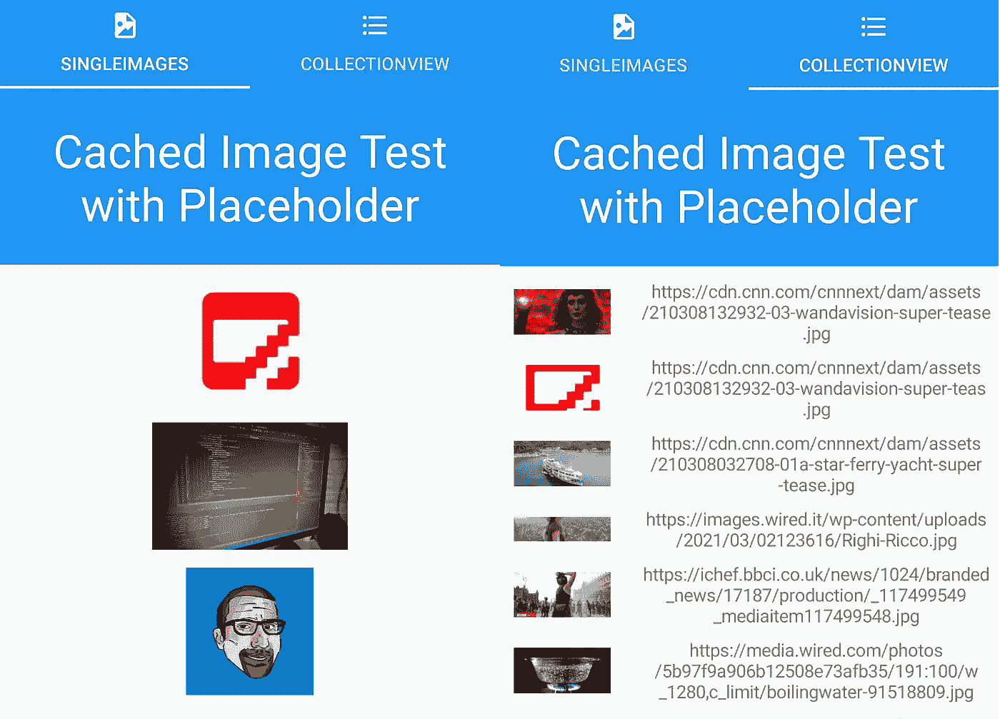

# 扩展 Android 上的 glidex.forms，为加载失败的图片加载一个占位符

> 原文：<https://levelup.gitconnected.com/extending-glidex-forms-on-android-to-load-a-placeholder-for-images-that-fail-to-load-6d16c1d22e03>



## 什么是 glidex.forms？

`glidex.forms`库是 [Glide](https://github.com/bumptech/glide) 的`Xamarin.Forms`实现，是 Android 上成像的准标准之一(甚至是 Google 推荐的)。幸运的是，来自微软的 Jonathan Peppers 热情地想要改善 T2，而 T3 也从中获益匪浅。他制作了`Xamarin.Android`绑定库以及`Xamarin.Forms`实现。[像以前一样用 Xamarin。Forms.Nuke](https://msicc.net/extending-xamarin-forms-nuke-to-load-a-placeholder-for-images-that-fail-to-load/) ，我了解了这个库，因为我用 Akavache 替换了我以前的图像缓存解决方案。

## 为什么我们需要扩建图书馆？

如果你想加载一个存储在你的 Android 项目资源中的占位符——没有必要。你可以在`glidex.forms`的`GlideExtensions`类中实现一个定制的钩子(我也将展示给你看)。但是如果你想从一个`Xamarin.Forms`资源或者一个字体中加载一个图像，我们需要稍微扩展一下`GlideExtensions`类。

顺便说一下，我试图使用现有的机制来实现这些目的的`IGlideHandler` ，但是由于时间问题，我从来没有能够加载这些类型的占位符，我通过扩展`GlideExtensions`类继续前进。

## 给我看看代码！

*使用安卓资源*

我们先来看看如何加载一个 Android 资源作为占位符(因为这是最简单的方法)。为此，我们只需要在 Android 项目中创建一个`IGlideHandler`的自定义实现，然后由`GlideExtensions`实现调用:

```
public class GlideWithAndroidResourcePlaceholder : IGlideHandler
{
    public GlideWithAndroidResourcePlaceholder()
    {
    }

    public bool Build(ImageView imageView, ImageSource source, RequestBuilder builder, CancellationToken token)
    {
        if (builder != null)
        {
            //easiest way - add the image to Android resources ....
            //general placeholder:
            //builder.Placeholder(Resource.Drawable.MSicc_Logo_Base_Blue_1024px_pad25).Into(imageView);

            //error placeholder:
            builder.Error(Resource.Drawable.MSicc_Logo_Base_Blue_1024px_pad25).Into(imageView);

            return true;
        }
        else
            return false;
    }
}
```

如您所见，`RequestBuilder`已经有了一个占位符机制。我们只是把它钩进去。如果您想要一个通用占位符(在下载过程中也显示图像)，请使用`Placeholder`方法。仅对于加载失败的图像，使用`Error` 方法。就是这样。

*使用 Xamarin。表单资源/FontImageSource*

然而，由于我们希望能够加载`FontImageSource`和`Xamarin.Forms`资源，我们需要走另一条路线。像我们在 iOS 上做的一样，我们需要给`Forms`类添加一个占位符属性:

```
public static ImageSource? PlaceholderImageSource { get; private set; }
```

要用`Xamarin.Forms`资源或`FontImageSource`填充我们的`ImageSource`，也要添加这两个方法:

```
public static void PlaceholderFromResource (string resourceName, Assembly assembly) =>
    PlaceholderImageSource = ImageSource.FromResource (resourceName, assembly);

public static void PlaceholderFromFontImageSource (FontImageSource fontImageSource) =>
    PlaceholderImageSource = fontImageSource;
```

现在我们已经有了`PlaceholderImageSource`，我们需要扩展`GlideExtensions`类。首先，我们为`FontImageSource`实现一个处理程序。`FontImageSource`的`Xamarin.Forms`处理程序为我们提供了一个位图，我们将用它作为占位符。我只在使用`AsDrawable`方法时得到了这个，因为`AsBitmap`方法不能将`Bitmap`转换为`Drawable`，所以它总是抛出一个异常(我没有做进一步的调查)。

```
private static async Task<RequestBuilder?> HandleFontImageSource (RequestManager request, Context? context, FontImageSource fontImageSource, CancellationToken token, Func<bool> cancelled)
{
    if (context == null)
        return null;

    var defaultHandler = new Xamarin.Forms.Platform.Android.FontImageSourceHandler ();

    var bitmap = await defaultHandler.LoadImageAsync (fontImageSource, context, token);

    if (token.IsCancellationRequested || cancelled())
        return null;

    if (bitmap == null)
        return null;

    return request.AsDrawable().Load (bitmap);
}
```

至于`HandleFontImageSource`方法，我还需要更改`HandleStreamImageSource`方法的返回值以使用`AsDrawable`方法，否则我们将得到与`FontImageSource`相同的异常:

```
static async Task<RequestBuilder?> HandleStreamImageSource (RequestManager request, StreamImageSource source, CancellationToken token, Func<bool> cancelled) { //code omitted for readability return request.AsDrawable().Load (memoryStream.ToArray ()); }
```

使其全部工作的最后步骤在`LoadViaGlide`方法中完成。首先，添加另一个`RequestBuilder?`变量，并将其命名为`errorBuilder`:

```
RequestBuilder? errorBuilder = null;
```

在处理`source`参数的开关之后，添加以下几行代码:

```
switch(Forms.PlaceholderImageSource) { case StreamImageSource streamSource: errorBuilder = await HandleStreamImageSource (request, streamSource, token, () => !IsActivityAlive (imageView, Forms.PlaceholderImageSource)); break; case FontImageSource fontImageSource: errorBuilder = await HandleFontImageSource(request, imageView.Context, fontImageSource, token, () => !IsActivityAlive (imageView, Forms.PlaceholderImageSource)); break; default: errorBuilder = null; break; } if (errorBuilder != null) builder?.Error (errorBuilder);
```

我们处理我们的`PlaceholderImageSource`就像我们处理我们想要加载的`ImageSource`一样。如果我们有一个有效的`errorBuilder`，我们把它传递给整个过程。至此，我们已经万事俱备。让我们看看如何在您的应用程序中使用它。

## 如何在您的 Xamarin 中使用它。表单— Android 项目

转到您的 Android 项目中的`MainActivity`类，并添加以下方法:

```
private void AttachGlide() { Android.Glide.Forms.Init(this, null, false); //recommended way of loading resource images=> //Android.Glide.Forms.Init(this, new GlideWithAndroidResourcePlaceholder(), false); //Xamarin Forms resource image //Android.Glide.Forms.PlaceholderFromResource("CachedImageTest.MSicc_Logo_Base_Blue_1024px_pad25.png", Assembly.GetAssembly(typeof(MainViewModel))); //FontImageSource Android.Glide.Forms.PlaceholderFromFontImageSource(new FontImageSource { Glyph = XfNativeCachedImages.Resources.MaterialDesignIcons.ImageBroken, FontFamily = "MaterialDesignIcons", Color = Xamarin.Forms.Color.Red }); }
```

Glide 库需要初始化。根据您使用的方法，有不同的方法可以实现。上面的方法展示了它们，你只需要修改注释的代码，就可以在示例中使用它了。这个机制就像我在 iOS 和 Nuke 包中使用的一样。

如果您继续操作(或下载示例)，您应该会看到与此类似的结果:

## 结论

正如我们在 iOS 上所做的那样，我们现在也在 Android 上使用原生缓存和图像处理。我花了相当长的时间让它运行起来，但这是值得的努力。该示例将超过 500 个远程图像加载到一个`CollectionView`中。检查滚动有多平滑(即使有数据绑定！).

你可以在 Github 的这里[找到样例，而](https://github.com/MSicc/XFNativeCachedImages)[glide x . forms 的修改版可以在](https://github.com/MSiccDev/glidex)这里找到。一如既往，我希望这篇文章对你们中的一些人有所帮助。

## 直到下一个帖子，大家编码快乐！

*原载于 2021 年 3 月 26 日*[](https://msicc.net/extending-glidex-forms-on-android-to-load-a-placeholder-for-images-that-fail-to-load/)**。**