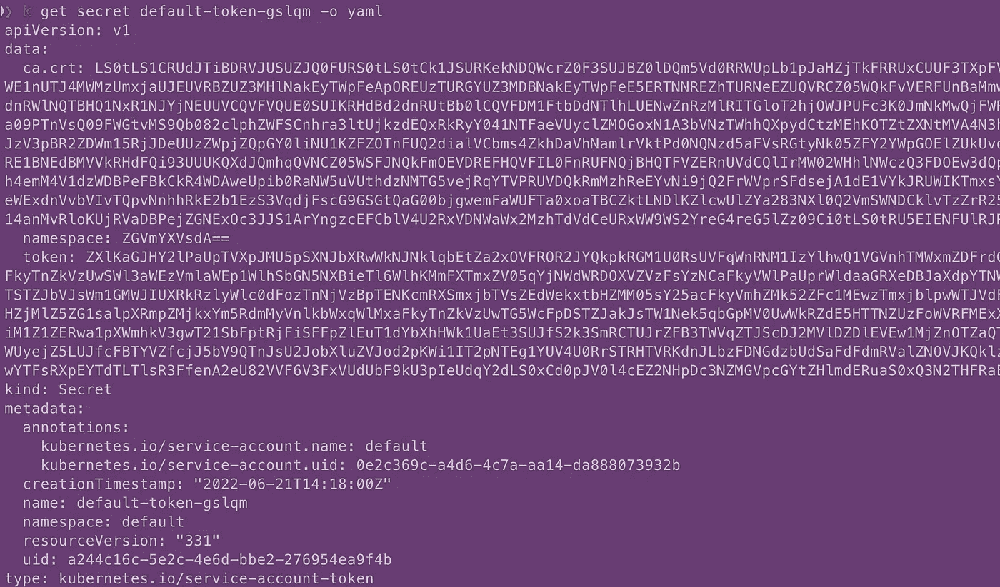
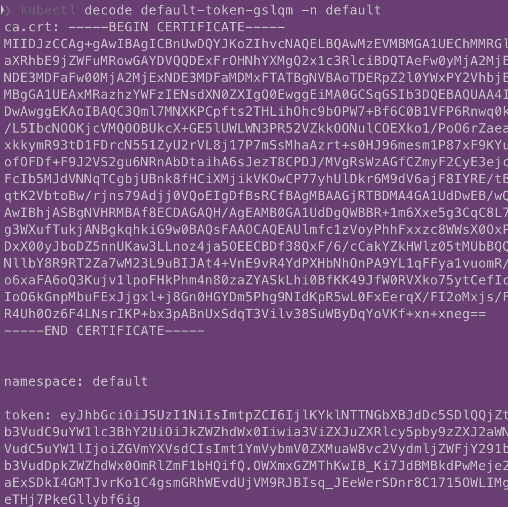

# 用插件扩展 Kubectl

> 原文：<https://levelup.gitconnected.com/extending-kubectl-with-plugins-a9bf2d065441>


照片由[内森·达席尔瓦](https://unsplash.com/@silvawebdesigns?utm_source=medium&utm_medium=referral)在 [Unsplash](https://unsplash.com?utm_source=medium&utm_medium=referral) 上拍摄

插件是软件扩展，可以加载到程序中以改进其功能。`kubectl`是一个工具，可以让你执行几乎所有与 Kubernetes 相关的任务。该工具用于列出集群和调试节点中的所有 pod。kubectl 的功能可以在插件的帮助下进行扩展。您可以创建 kubectl 插件来解决一些本质上复杂的用例。

# 但是 kubectl 插件是什么呢？

插件是一个独立的可执行文件，其名称以`kubectl-`开头。要安装一个插件，把它的可执行文件移动到你的`PATH.`上的任何地方。Krew 是`kubectl`插件的包管理器，也是 Kubernetes SIG，旨在解决`kubectl.`的包管理问题

# 成为插件的标准

有两个重要的标准可以成为一个 kubectl 插件

1.  插件二进制名称必须以`kubectl-`开头，后跟插件名称。Ex `kubectl-decode`，`kubectl-count`。
2.  插件二进制文件必须出现在`PATH`变量中，这样 kubectl 才能识别它是插件。

# **用例**

我们将创建一个 kubectl 插件来解码 Kubernetes 的秘密。我们都知道 Kubernetes 以 base64 解码格式存储秘密，如果要查看这些秘密的值，我们需要提取 base64 编码值，然后用纯文本解码。



*以 base64 格式存储的 Kubernetes 秘密*

# 预期

让我们首先设置我们将要开发的插件的期望/预期输出。我们希望插件以纯文本形式返回 base64 编码的秘密。此外，它应该支持指定 Kubernetes 名称空间的方式。



kubectl 解码插件

# 履行

对于本文，我们将使用 shell 脚本来创建这个插件，但是使用任何编程语言都可以做到这一点。

我们希望这个插件像一个普通的 kubectl 命令一样工作，其中用户指定操作(创建、更新、删除和获取)和资源(pod、部署、配置映射、秘密)，用户也可以提供他想要执行该操作的名称空间，但是如果没有提供名称空间，则考虑默认名称空间。

[我用 GoLang 制作了一个关于创建 kubectl 插件的视频](https://youtu.be/2epdFWbiE_c)

1.  我们将创建一个名为`kubectl-decode`的文本文件，其中 decode 是我们插件的名称。
2.  接下来，将使用 kubectl 命令本身来获取秘密，在 go-template 的帮助下，我们可以迭代秘密并解码它们。
3.  将插件放在`PATH`变量中，这样 kubectl 就可以识别它是插件。

```
#!/bin/bashif [ $# -lt 1 ]
then
  echo "invalid argument "
  exit 1
fi
NAMESPACE="default"
if [ "$2" = "-n" ]
then
   if [ $# -eq 3 ]
   then
     NAMESPACE=$3
    fi
fikubectl get secrets "$1" -o go-template='{{range $k,$v := .data}}{{printf "%s: " $k}}{{if not $v}}{{$v}}{{else}}{{$v | base64decode}}{{end}}{{"\n\n"}}{{end}}' -n "$NAMESPACE"
```

# 总结

当我们使用这个库时，我们可以将繁琐的任务简化得非常简单。kubectl 插件对你来说可能看起来很复杂，但是相信我，它们会让你的生活变得更容易。

基于 bash 的插件有一些缺点，但是当您使用任何编程语言如 go、java 或 nodejs 时，这些缺点都可以很容易地解决。

在本文中，我们学习了 kubectl 插件的基础知识，以及成为一个 kubectl 插件需要具备的条件，还了解了如何创建一个 kubectl 插件。

# 资源

1.  **【实现】**该模式在本[***GitHub repo***](https://github.com/adityajoshi12/kubernetes-development/tree/main/kubectl-plugins)中完全实现
2.  **【视频】**详细的视频讲解可以在[这里](https://youtu.be/QO7TRRPc1AY)找到。
3.  **【GoLang】**实现可以在[这里找到](https://youtu.be/2epdFWbiE_c)

感谢您的阅读，我希望您能发现这是有用的！