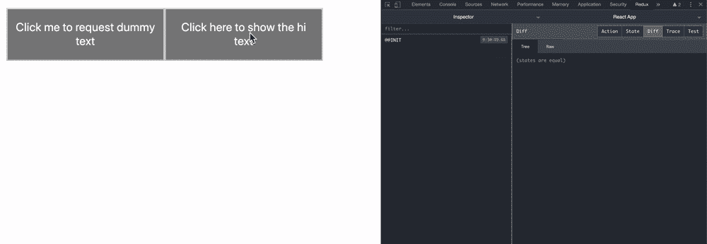
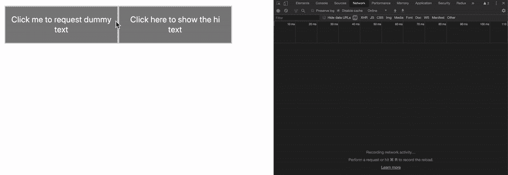
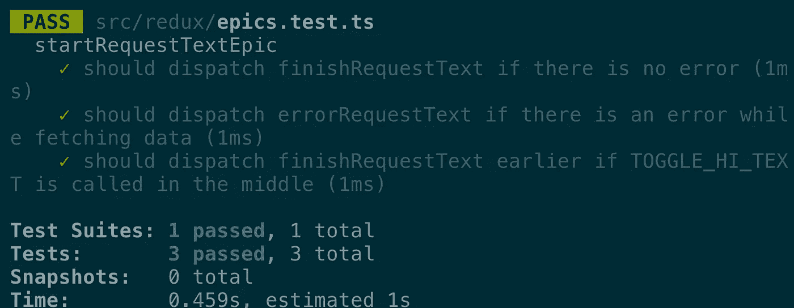
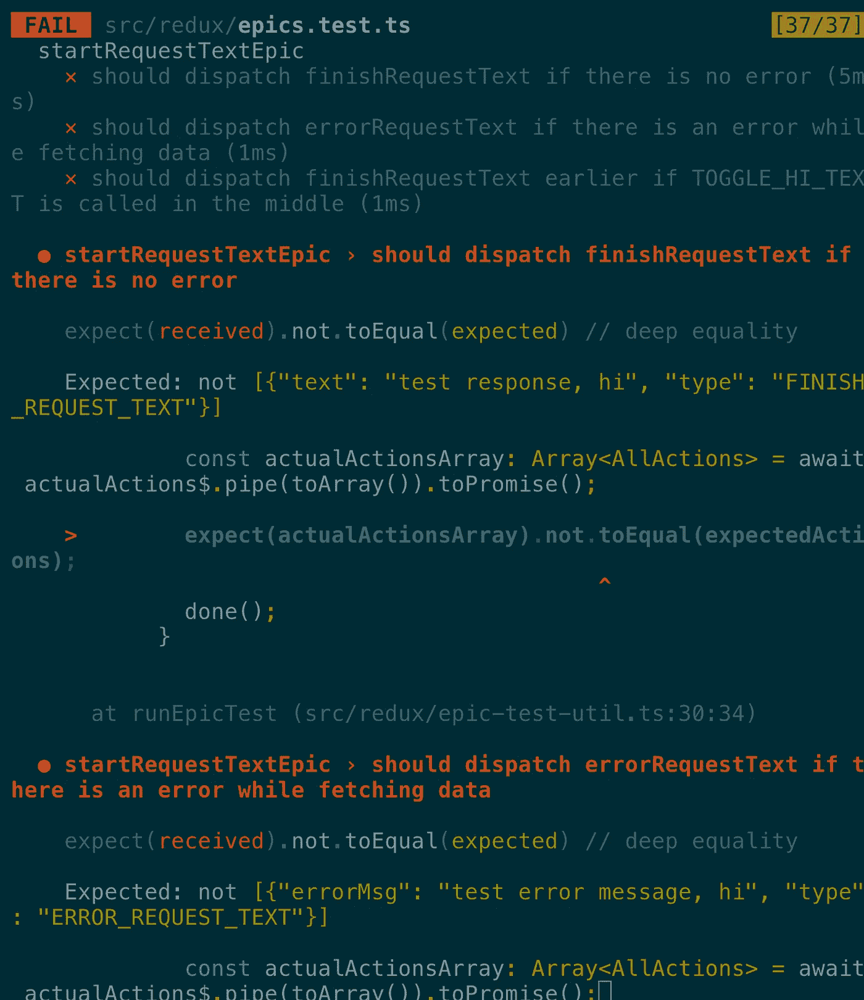

# 广泛介绍为什么以及如何使用和测试 redux-observable

> 原文：<https://levelup.gitconnected.com/extensive-introduction-to-why-and-how-you-might-want-to-use-and-test-redux-observable-1f2987407166>

和其他人一样，只是一张随机的图片(鸣谢:[来自 unsplash 的 Genessa Panainte](https://unsplash.com/@genessapana)

我在我的公司努力为可重复观测的操作编写一些测试。大多数网络请求由 RxJS 管理，没有一个被测试覆盖。我想写测试，但是不知道怎么写。

但是我真的只想从基础开始——我的意思是，非常基础的，包括为什么，以及我们可能想要如何使用`redux-observable`。

# TL；博士；医生

如果你想直接进入源代码，这里有[。](https://github.com/9oelM/redux-observable)

# 什么是反应式编程？

[反应式编程](https://gist.github.com/staltz/868e7e9bc2a7b8c1f754#reactive-programming-is-programming-with-asynchronous-data-streams)是用异步数据流编程。

*   典型的事件是异步事件流，您希望观察它们
*   您有一些有用的函数来组合/创建/过滤这些流

**流**是按时间顺序排列的一系列正在进行的事件。它可以发出三种不同的东西:一个值(某种类型)、一个错误或一个“完成”信号。

我们只异步地捕获这些发出的事件，通过**定义一个在发出一个值时执行的函数，**定义另一个在发出一个错误时执行的函数，以及定义另一个在“完成”时执行的函数。

所以这实质上是回到了观察者设计模式。

# 何必用 RxJS？

## 抽象

如果你使用 RP，你不必真的担心实现细节，因为它给你一个高层次的抽象层。所以你再也不用担心 javascript 中的`Promise`和`await`了。只需要声明性地实现你想做的事情，就可以了。

## 异步工作变得更加简单

如今，异步操作已经变得很常见，因为你可能需要处理 UI 交互&大量的网络请求。

所以它很有可能非常适合基于网络的应用程序(包括前端和后端)。

## 大量的助手函数以声明的方式简化工作

你有专门的助手函数来实现你想要做的事情，否则你可能会以一种非常复杂的方式来完成。即使你现在还没有完全意识到这一点，当你阅读这篇文章时，你会注意到这一点。

# 何必和 Redux 一起用呢？

现在我们对使用 RxJS 的优势有了一个简单的了解。现在，我们想在 Redux 中处理动作，但并不是所有的动作都是同步的。

举个简单的例子，我编写了一个应用程序，它从服务器获取文本并显示出来，如下所示:

> *我假设你事先了解一些 Typescript 和 React 基础知识，包括钩子。*

这是项目结构(省略不重要的):

## 先还原相关的东西

为了能够理解使用 redux-observable 的真正好处，我们需要首先了解 redux 是如何工作的，这样我们就可以进行比较(如果您已经知道如何使用 bare redux 处理异步操作，可以跳过这一部分)

在 redux 中，如你所知，我们主要有 actions 和 reducers。我创建了三种类型的操作:

1.  `StartRequestText`:我将在从虚拟文本 API 中`fetch`出来之前`dispatch`这个。
2.  `FinishRequestText`:收到短信后我会马上`dispatch`。
3.  `ErrorRequestText`:我会在上述过程中一遇到错误就`dispatch`这样做。

以上动作在`actions.ts`中是这样实现的:

我在`constants.ts`中简单定义了一些动作类型:

把它们放进`reducer.ts`一点都不难。我们只需要更新每个不同动作的状态。你可以看到我正在根据一个`action`的每个`type`分别更新`isLoading`、`text`和`errorMsg`:

`reducer.ts`

同样，在`store.ts`中没有那么多。只需组合减速器(尽管我们只有一个，这在生产环境中并不常见)并配置 redux devtools 扩展，然后创建存储。

`store.ts`

我在`types.ts`中定义了我们需要的类型:

`App.tsx`在父组件中，我们只想显示两样东西:按钮和文本。

`DummyTextRequestButton.tsx`

在这个组件中，我们有调度我们前面定义的所有动作的逻辑。你必须认识到，我们希望将`handleClick`中的逻辑移植到以后的`redux-observable`中，因为现在它根本没有反应。

`DummyTextViewer.tsx`

该组件消耗 redux 状态。基于状态显示错误、文本或加载。

# 用 RxJS 和 redux-observable？

首先，我们将向我们的项目介绍相关模块:

然后，我们想去掉`DummyTextRequestButton.tsx`内部有些复杂的逻辑:

我们可以像上面这样做，因为我们要将我们的逻辑移植到`redux-observable`。

然后，我们将在`redux`文件夹中创建一个名为`epics.ts`的东西:

> *一个* ***史诗*** *其实就是监听一个 redux 动作，并相应输出其他动作的东西。*

那么上面的代码是如何做到的呢？我们可以看到`startRequestTextEpic`正在监听一个名为`C.START_REQUEST_TEXT`的动作。所以这段代码不会被执行，如果 redux 分派了其他动作。

好了，暂时忘掉`mergeMap`，然后我们继续。我们可以看到，我们正在使用 RxJS 自己的名为`fromFetch`的`fetch`方法，本质上只是将`fetch`变成一个可观察的。

现在您处理来自`fetch`的响应，响应中的`text`将成为`finishRequestText`动作的有效负载。

否则，如果您在`fetch`运行时出错，该错误将被捕获，并会调度`errorRequestText`操作。

通过这种方式，我们已经成功地将我们在`handleClick`中的实现移植到 epic 内部，剩下我们要做的就是实际配置`store.ts`中的一些东西，以便能够在我们的项目中使用`redux-observable`:

所以，加上`redux-observable`之后，现在我们有了一些好处:

1.  反应性。在 redux 中，通过对被调度的动作做出反应，可以很容易地处理异步动作和状态更新。
2.  关注点分离。现在你不必关心`DummyTextButton`中的`startRequestText`之后做什么，因为所有的逻辑都已经移植到`startRequestTextEpic`了。
3.  伟大的工具链。现在我们只使用了 RxJS 中的几个函数，但是许多函数的组合将使处理数据流变得更加容易。

# 通过利用 RxJS 所拥有的进一步扩展

现在我们有一个小问题:当用户在如此短的时间内多次点击按钮时，请求将被发送多次，这可能是无用的，如下图所示:

我点击了三次按钮，但实际上你们所需要的只是一个请求。所以你可以这么做:

我们刚刚添加了`debounce`，它将在一秒钟内只过滤掉一个类型为`START_REQUEST_TEXT`的动作，这意味着即使你在一秒钟内点击按钮三次，请求也只会被发送一次，如下图所示:

或者，你更想要的其实是`switchMap`；它将取消任何未决请求，并切换到最后一个请求:

现在，假设您有另一个按钮来显示其他文本，如下所示:

因为我们现在有了一个额外的 UI，所以我们需要处理一个特殊情况(我们不打算讨论其他情况，尽管有很多):**您单击了请求虚拟文本按钮，但是您改变主意看到 hi 而不是**。然后，您需要**取消并完成**您的操作。

为了简单起见，我不打算展示整个代码，而是用`epics.ts`来演示(您仍然可以从 Github 库查看[整个代码库):](https://github.com/9oelM/redux-observable/tree/master/redux-observable)

我们现在有两个主要部分:`sendRequest$`和`cancelRequest$`。在`cancelRequest$` ovservable 中，我们将强制完成请求文本，因为如果您已经切换到查看`hi`文本，就不再需要请求文本了。

`race`如果其他行动结束，将取消任何其他正在进行的行动。就像 javascript 里的`Promise.race`一样！所以，我们用 gif 来看看这个:

## 检查站

你现在明白为什么要使用 redux-observable 了吗？它为您提供了一套很好的工具，用于在 redux 中调度操作后执行副作用。否则，用普通的 javascript 手动管理像取消这样的事件将会非常痛苦。

但是，嘿，我们还没完呢。让我们以如何测试这些史诗的指南来结束它。

# 测试你的史诗

## 方法 1:基于输入动作测试输出动作。

喔，有很多事情要经历，对吧？但基本上，我们所做的只是:

1.  **模仿某些模块的功能，使它们按照我们的目的工作**。我们嘲笑`rxjs.race`和`FF.fromFetch`,因为对于`race`,我们不希望 race 在测试环境中不能很好地工作，我们可以决定发出哪个可观测值，而不是依赖于代码本身，对于`fromFetch`,我们不希望使用真正的`fetch`,因为这将毫无意义地花费更多时间。
2.  **运行带有初始动作和状态的 epic**。史诗会运行，结果会吐出另一组动作。
3.  **测试输出动作与预期的**是否相等。我们只需要测试 epic 是否给出了预期的动作集。

差不多就是这样！但是我们需要测试更多，那么为什么不用一个简单的函数来简化这个过程呢？：

现在，我们可以把测试变成:

更少的样板，对不对？

现在我们也可以写出其他东西的测试，就像这样:

现在你必须看到你所有的测试都通过了:

## 方法 2:使用大理石测试

以前，我们只使用了一些基本的方法来测试史诗。使用 marble 测试可以让你在和*发生什么事情的时候更加关注*。**

如果你不熟悉大理石图，请参考[react vex 对大理石图的解释](http://reactivex.io/documentation/observable.html)。或者，网上还有许多其他好的资源。

关于大理石语法，请参考 [rxjs API 文档](https://rxjs-dev.firebaseapp.com/guide/testing/marble-testing#marble-syntax)。

## 热对比冷观察

有一篇关于媒介的很棒的文章简化了冷热可观测量的定义[，所以我摘录了其中的定义](https://medium.com/@bencabanes/marble-testing-observable-introduction-1f5ad39231c#f123)。(或者看 [rxjs API 文档](https://rxjs-dev.firebaseapp.com/guide/testing/marble-testing))

cold:测试开始时开始订阅。

> `*cold(--a--b--|, { a: 'Hello', b: 'World' })*`*→30 毫秒发出“Hello”，60 毫秒发出“World”，90 毫秒完成。*

hot:从插入符号处开始订阅。

> `*hot(--^--a--b--|, { a: 'Hello', b: 'World' })*` *→订阅从插入符号开始，然后在 30 毫秒时发出“Hello ”,在 60 毫秒时发出“World ”,在 90 毫秒时完成。*

## 测试与时间相关的事件

使用方法 1 我们无法真正回答的是类似“如果有多个动作输入，动作真的可以被取消吗，因为我们使用了`switchMap`？”

因为我们可以控制时间，这是完全可能的。

这个真的很基础；我们请求文本，为了测试，我们通过`1` ms 延迟了来自`fromFetch`的响应。然后我们运行`START_REQUEST_TEXT`，并期望在另一个`1` ms 过去后输出动作为`FINISH_REQUEST_TEXT`。简单。对吗？

但是对于一些更复杂的测试呢，比如因为`switchMap`而取消的动作？：

在上面的代码中，我们再次伪造`fromFetch`，这一次它将在`5` ms 之后得到您的响应。现在您决定在`4ms`中连续四次使用`START_REQUEST_TEXT`，每次使用`1ms`。

那么应该发生的是所有的`a`、`b`、`c`都被取消，因为它们被紧随其后的动作取消，而此时`fromFetch`还没有返回响应。这正是`switchMap`所要做的。它会取消其他的可观测，只发射最体面的投射可观测，也就是`d`(在`5ms`之后)。

所以基本就是这样！当然，我们可以再次对这个测试逻辑进行抽象，就像我们对`runEpicTest`所做的那样，但是太糟糕了——我现在太累了，所以我将把这项工作留给你。:)

# 结论

到目前为止，我们已经介绍了:

1.  为什么你可能想要使用`rxjs`和`redux-observable`(也许你可以在评论区提出更多的理由)
2.  如何将基于`redux`的代码替换成基于`redux-observable`的代码
3.  使用`redux-observable`的可扩展性(好处)，特别是对于复杂的逻辑
4.  测试你的`epic`的两种方法

# 附录

只是给你一些遗言。

## 对“永远是通行证”的怀疑

有时，很难知道您的测试是否真的有效，或者只是通过了测试，因为 jest 比您想要的时间更早地完成了测试。[确保你使用了](https://jestjs.io/docs/en/asynchronous) `[done](https://jestjs.io/docs/en/asynchronous)`，如果你仍然不确定，试着通过把`expect(...).toEqual(...)`改成`expect(...).not.toEqual(...)`来打破测试。那么您应该会看到这样的内容:

如果你的测试仍然通过，那就有问题了。

## 我不应该测试 epic 如何改变状态吗？

不。因为你应该在*上测试一个动作集如何输出另一个动作集。*

您将在 reducer 的测试中测试这一点，因为 reducer 实际上是操作将改变状态的地方。

epic 真正做的只是直到调度动作。当然，它与状态有关，因为它使用它，但它不直接修改状态。那就要留给减速器的角色了。

## 源代码库

*   [redux 实现](https://github.com/9oelM/redux-observable/tree/master/redux-only)
*   [redux-observable 实现和测试](https://github.com/9oelM/redux-observable/tree/master/redux-observable)

还有…谢谢你的阅读！

*最初发表于*[*https://9oelm.github.io/2020-01-24-基本但广泛-介绍-为什么和如何你可能想要使用-redux-observable-for-async-actions/*](https://9oelm.github.io/2020-01-24--Fundamental-yet-extensive-introduction-to-why-and-how-you-might-want-to-use-redux-observable-for-async-actions/)*。*