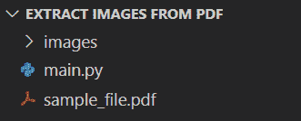
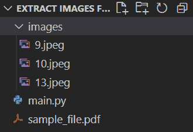

# 使用 Python 从 PDF 中提取图像

> 原文：<https://levelup.gitconnected.com/extract-images-from-pdf-using-python-97e2ad31c7f1>

## 在本教程中，我们将探索如何使用 Python 从 PDF 文件中提取图像。


照片由 [Soragrit Wongsa](https://unsplash.com/@invictar1997?utm_source=unsplash&utm_medium=referral&utm_content=creditCopyText) 在 [Unsplash](https://unsplash.com/s/photos/pictures?utm_source=unsplash&utm_medium=referral&utm_content=creditCopyText) 上拍摄

**目录**

*   介绍
*   示例 PDF 文件
*   使用 Python 从 PDF 中提取图像
*   完全码
*   结论

# 介绍

从 PDF 文件中提取图像是一项非常常见的任务，在处理不同的报告时经常会执行这项任务。

如果您使用可用的软件和在线工具对每个文件进行手动操作，这将是一项繁琐的任务。

在本教程中，我们将探索如何使用 Python 从 PDF 文件中提取图像。

要继续学习本教程，我们需要以下 Python 库:PyMuPDF 和 Pillow。

如果您没有安装它们，请打开“命令提示符”(在 Windows 上)并使用以下代码安装它们:

```
pip install PyMuPDF
pip install Pillow
```

# 示例 PDF 文件

以下是我们将在本教程中使用的 PDF 文件:

[https://pyshark . com/WP-content/uploads/2022/11/sample _ file . pdf](https://pyshark.com/wp-content/uploads/2022/11/sample_file.pdf)

这个 PDF 文件将与我们的代码一起存放在与 **main.py** 相同的文件夹中。

我们还需要创建一个空文件夹 **images** 来保存提取的图像，因此文件夹结构应该如下所示:



作者图片

# 使用 Python 从 PDF 中提取图像

让我们从导入所需的依赖项开始:

```
#Import required dependencies
import fitz
import os
from PIL import Image
```

定义 PDF 文件的路径:

```
#Define path to PDF file
file_path = 'sample_file.pdf'
```

使用 fitz 模块打开文件并提取所有图像信息:

```
#Open PDF file
pdf_file = fitz.open(file_path)

#Calculate number of pages in PDF file
page_nums = len(pdf_file)

#Create empty list to store images information
images_list = []

#Extract all images information from each page
for page_num in range(page_nums):
    page_content = pdf_file[page_num]
    images_list.extend(page_content.get_images())
```

现在，让我们来看看我们提取的图像信息:

```
print(images_list)
```

您应该得到:

```
[(9, 0, 640, 491, 8, 'DeviceRGB', '', 'Image9', 'DCTDecode'),
(10, 0, 640, 427, 8, 'DeviceRGB', '', 'Image10', 'DCTDecode'),
(13, 0, 640, 427, 8, 'DeviceRGB', '', 'Image13', 'DCTDecode')]
```

其中每个元组表示以下内容:

```
(xref, smask, width, height, bpc, colorspace, alt. colorspace, name, filter)
```

现在让我们添加一些错误处理代码，以防我们处理的 PDF 文件没有图像:

```
#Raise error if PDF has no images
if len(images_list)==0:
    raise ValueError(f'No images found in {file_path}')
```

从 PDF 文件中提取图像信息后，我们可以提取实际图像并将其保存在计算机上:

```
#Save all the extracted images
for i, image in enumerate(images_list, start=1):
    #Extract the image object number
    xref = image[0]
    #Extract image
    base_image = pdf_file.extract_image(xref)
    #Store image bytes
    image_bytes = base_image['image']
    #Store image extension
    image_ext = base_image['ext']
    #Generate image file name
    image_name = str(i) + '.' + image_ext
    #Save image
    with open(os.path.join(images_path, image_name) , 'wb') as image_file:
        image_file.write(image_bytes)
        image_file.close()
```

运行代码后，您应该看到提取的图像出现在**图像**文件夹中:



作者图片

# 完全码

```
#Import required dependencies
import fitz
import os
from PIL import Image

#Define path to PDF file
file_path = 'sample_file.pdf'

#Define path for saved images
images_path = 'images/'

#Open PDF file
pdf_file = fitz.open(file_path)

#Get the number of pages in PDF file
page_nums = len(pdf_file)

#Create empty list to store images information
images_list = []

#Extract all images information from each page
for page_num in range(page_nums):
    page_content = pdf_file[page_num]
    images_list.extend(page_content.get_images())

#Raise error if PDF has no images
if len(images_list)==0:
    raise ValueError(f'No images found in {file_path}')

#Save all the extracted images
for i, img in enumerate(images_list, start=1):
    #Extract the image object number
    xref = img[0]
    #Extract image
    base_image = pdf_file.extract_image(xref)
    #Store image bytes
    image_bytes = base_image['image']
    #Store image extension
    image_ext = base_image['ext']
    #Generate image file name
    image_name = str(i) + '.' + image_ext
    #Save image
    with open(os.path.join(images_path, image_name) , 'wb') as image_file:
        image_file.write(image_bytes)
        image_file.close()
```

# 结论

在本文中，我们探索了如何使用 Python 和 [PyMuPDF](https://pymupdf.readthedocs.io/en/latest/) 从 PDF 文件中提取图像。

如果你有任何问题或对编辑有任何建议，请随时在下面留下评论，并查看我的更多 [Python 编程](https://pyshark.com/category/python-programming/)教程。

*原载于 2022 年 11 月 28 日*[*【https://pyshark.com】*](https://pyshark.com/extract-images-from-pdf-using-python/)*。*