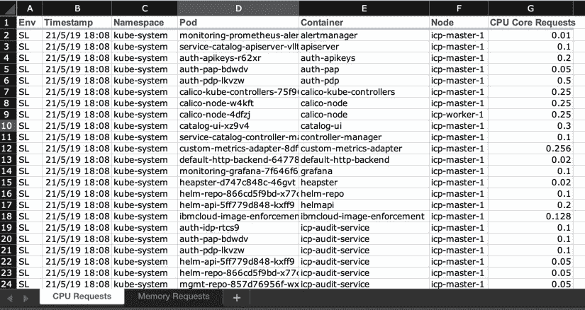

# 将普罗米修斯指标提取到电子表格中

> 原文：<https://levelup.gitconnected.com/extract-prometheus-metrics-to-spreadsheet-a22e1c549635>


不管喜欢与否，电子表格格式在企业环境中非常普遍。在我的一个项目中，我需要提取普罗米修斯的数据，并将其保存为电子表格格式，以供进一步分析。

Prometheus 提供 HTTP API 来查询数据，并以 JSON 格式返回。我想使用 Prometheus HTTP API 的[客户端直接查询指标，而不是解析 JSON 数据。此外，我想使配置足够灵活，所以我的用户可以根据自己的需要定义电子表格。这就引出了我在 GitHub 上发表的工具，](https://github.com/prometheus/client_golang#client-for-the-prometheus-http-api) [prom2Sheet](https://github.com/zhiminwen/Prom2Sheet) 。

## 定义电子表格内容

我以 yaml 格式定义了下面的电子表格配置文件。

```
---
sheets:
- name: CPU Requests
  query: kube_pod_container_resource_requests_cpu_cores
  columns:
    - name: Env
      type: OS.Environment
      value: P_ENV
    - name: Timestamp
      type: Prometheus.Timestamp
    - name: Namespace
      type: Prometheus.Metric
      value: namespace
    - name: Pod
      type: Prometheus.Metric
      value: pod
    - name: Container
      type: Prometheus.Metric
      value: container
    - name: Node
      type: Prometheus.Metric
      value: node
    - name: CPU Requests
      type: Prometheus.Value- name: Memory Requests
  query: kube_pod_container_resource_requests_memory_bytes
  columns:
    - name: Env
      type: OS.Environment
      value: P_ENV
    - name: Timestamp
      type: Prometheus.Timestamp
    - name: Namespace
      type: Prometheus.Metric
      value: namespace
    - name: Pod
      type: Prometheus.Metric
      value: pod
    - name: Container
      type: Prometheus.Metric
      value: container
    - name: Node
      type: Prometheus.Metric
      value: node
    - name: Memory Requests
      type: Prometheus.Value
```

sheets 数组定义了如何创建电子表格文件中的每个工作表。

查询字段是 Prometheus 查询，它将返回 Prometheus 矢量数据，该数据只有一个时间戳和值对。如果您执行一个范围查询，那么您需要应用一些聚合函数来确保查询返回一个向量数据。例如，使用以下查询

`avg_over_time(kube_pod_container_resource_requests_memory_bytes[1h])`

检索数据时，我使用配置中定义的列在电子表格中创建数据列。

名称字段设置列的标题。有几种类型的列定义了单元格数据应该如何设置。

*   **OS。环境**:通过读取由值字段定义的 OS 环境变量来设置单元数据。这带来了在工作表中添加额外列的灵活性，尤其是当我们将它作为 Kubernetes 作业运行时。
*   **普罗米修斯。时间戳**:用返回的查询结果的时间戳设置单元格数据。
*   **普罗米修斯。度量**:使用普罗米修斯度量设置单元数据。指标值基本上是字典键/值对中的值。键名在值字段的配置中定义。例如，对于以下配置，

```
- name: Pod
  type: Prometheus.Metric
  value: pod
```

单元格值将是度量结果的 pod 名称，如“`kube-dns-22p7s`

*   **普罗米修斯。值**:指标查询的实际浮点数。

## 导入的模块

我正在使用下面的 Prometheus 客户端 API 模块。对于电子表格处理，我使用 tealeg 的 xlsx。

```
"github.com/prometheus/client_golang/api" 
v1 "github.com/prometheus/client_golang/api/prometheus/v1"
"github.com/prometheus/common/model""github.com/tealeg/xlsx"
```

## 连接普罗米修斯

在 IBM Cloud Private 中，Prometheus 通过客户端证书认证来保护。我们必须使用同一个 CA 生成的证书与 Prometheus 对话。以下函数显示了如何使用客户端证书构建基于 https 的连接。

```
func NewClient(promUrl, caFile, certFile, keyFile string) v1.API {
 caCert, err := ioutil.ReadFile(caFile)
 if err != nil {
  log.Fatalf("Could not read CA file:%v", err)
 } caCertPool := x509.NewCertPool()
 caCertPool.AppendCertsFromPEM(caCert) cert, err := tls.LoadX509KeyPair(certFile, keyFile)
 if err != nil {
  log.Fatalf("could not load client cert and key file:%v", err)
 } transport := &http.Transport{
  TLSClientConfig: &tls.Config{
   RootCAs:      caCertPool,
   Certificates: []tls.Certificate{cert},
  },
 }
 client, err := api.NewClient(api.Config{
  Address:      promUrl,
  RoundTripper: transport,
 })
 if err != nil {
  log.Fatalf("Failed to create prometheus client: %v", err)
 } return v1.NewAPI(client)
}
```

## 将 Prometheus 查询保存到工作表中

通过传递查询字符串可以直接调用查询。

```
func SaveSheet(sheet *xlsx.Sheet, promApi v1.API, sheetConfig Sheet) error {
 value, err := promApi.Query(context.Background(),   sheetConfig.Query, time.Now())
 if err != nil {
  log.Printf("error: %v", err)
  return err
 }
 var row *xlsx.Row
 var cell *xlsx.Cell row = sheet.AddRow()
 for _, col := range sheetConfig.Columns {
  cell = row.AddCell()
  cell.SetString(col.Name)
 } for _, v := range value.(model.Vector) {
  row = sheet.AddRow()
  for _, col := range sheetConfig.Columns {
   cell = row.AddCell()
   switch col.Type {
   case "OS.Environment":
    cell.SetString(os.Getenv(col.Value))
   case "Prometheus.Timestamp":
    cell.SetDateTime(v.Timestamp.Time())
   case "Prometheus.Metric":
    cell.SetValue(string(v.Metric[model.LabelName(col.Value)]))
   case "Prometheus.Value":
    cell.SetFloat(float64(v.Value))
   }
  }
 } return nil
}
```

一旦结果 value 成功返回，首先我们将标题行添加到电子表格中。将值转换为 vector 数据类型，循环遍历它们，它们中的每一个都将保存为工作表中的一行。

基于列定义，相应地创建它的值。对于“`Prometheus.Metric`”的类型，我们需要将来自`string`的定义投射到`model.LabelName`中，并从`v.Metric`映射中获取其值。

## 样本结果

[](https://gitconnected.com/learn/golang) [## 学习围棋-最佳围棋教程(2019) | gitconnected

### 22 大围棋教程-免费学习围棋。课程由开发者提交和投票，使您能够找到…

gitconnected.com](https://gitconnected.com/learn/golang)