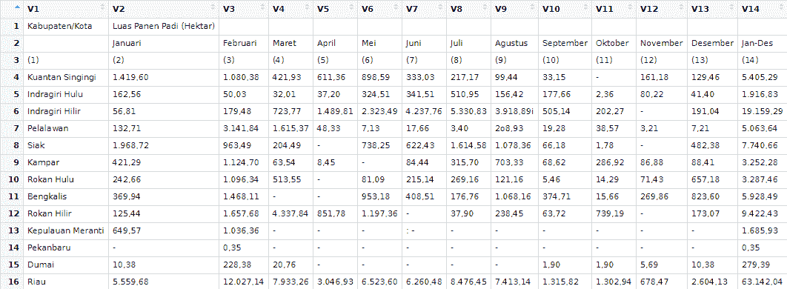
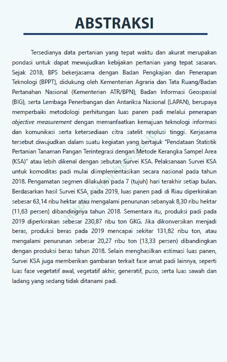
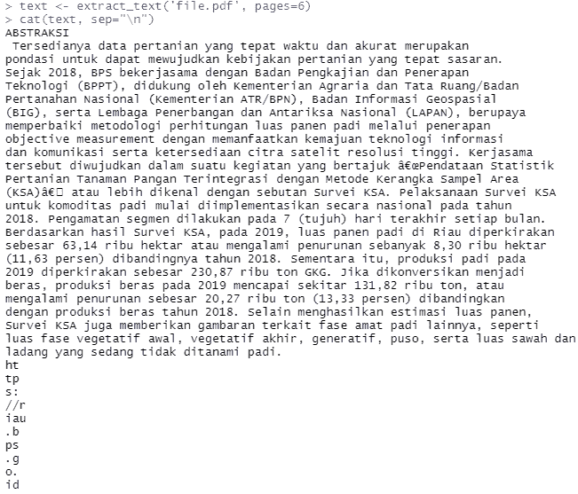
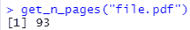
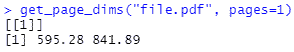
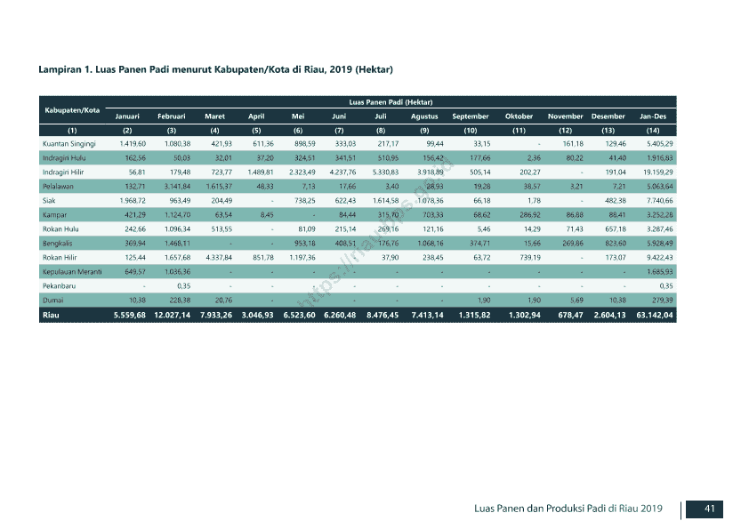

# 在 R 中从 PDF 文件中提取表格和文本

> 原文：<https://levelup.gitconnected.com/extract-tables-and-text-from-pdf-files-in-r-3b7a07d2f5b6>

## 介绍 Tabulizer:用于处理 PDF 文件的 R 库。


比阿特丽斯·佩雷斯·莫亚在 [Unsplash](https://unsplash.com/s/photos/documents?utm_source=unsplash&utm_medium=referral&utm_content=creditCopyText) 上的照片

# 动机

假设你有一个进行数据分析的想法。但是当您搜索数据时，您会发现这些数据不是 CSV 或电子表格格式。数据是 PDF 格式的。

如果数据是那种格式，你打算怎么办？您可能会在电子表格应用程序中手动从头开始输入数据，或者您会完全复制数据，然后将它们复制到电子表格中进行清理。

这些过程会花费很多时间，更糟糕的是，你可能会出现人为错误。例如，您可能会输入错误的数据。

幸运的是，有一个叫做 tabulizer 的 R 库可以帮助你在短时间内自动从 PDF 文件中提取表格或文本。

在本文中，我将使用 R 库向您介绍 tabulizer 库。此外，我还想向您展示这个库还能做些什么。没有进一步，让我们开始吧！

# 履行

## 安装并加载库

我们要做的第一件事是安装软件包。我们可以使用 install.packages 函数来安装这个库。之后，我们可以使用库函数加载库。下面是代码的样子，

```
install.packages('tabulizer')
library(tabulizer)
```

> 请注意:在我们使用这个库之前，请确保您已经在计算机上安装了 java。这是因为该库是一个名为 tabula java 的 java 库的绑定。你可以从[这里](https://www.java.com/en/download/)下载 java。

## 数据

对于本文，我将使用 Badan Pusat Statistik (BPS)的一个 PDF 文件，名为“Luas 潘恩和 Produksi Padi di Provinsi Riau 2019”。

PDF 文件包含廖内省 2019 年水稻产量的数据。这些数据也按地区和月份分类。你可以在这里访问 PDF 文件[。](https://riau.bps.go.id/publication/download.html?nrbvfeve=ZGZhODVlNTVjMjNiMTUzODdlMmE5OTNi&xzmn=aHR0cHM6Ly9yaWF1LmJwcy5nby5pZC9wdWJsaWNhdGlvbi8yMDIwLzEyLzMwL2RmYTg1ZTU1YzIzYjE1Mzg3ZTJhOTkzYi9sdWFzLXBhbmVuLWRhbi1wcm9kdWtzaS1wYWRpLWRpLXByb3ZpbnNpLXJpYXUtMjAxOS5odG1s&twoadfnoarfeauf=MjAyMS0wNS0yMyAwOTo1MToyNQ%3D%3D)

在下一节中，我将把该文件称为“file.pdf”。

## 提取表格

现在让我们用 tabulizer 库来处理 PDF 文件。我们可以做的第一件事是从 PDF 文件中提取表格。例如，我们将从第 60 页提取表格。

要提取表，我们可以使用 extract_tables 函数。该函数将返回一个包含一个或多个表的列表。代码看起来像这样，

```
**# Extract the table**
tabel <- extract_tables('file.pdf', pages = 60)
**# Extract the first element of the variable**
View(tabel[[1]])
```

这是结果的预览，



作者捕捉到的

接下来我们还可以交互提取表格。为此，我们可以使用 extract_areas 函数以交互方式提取表。下面是命令的样子，

```
extract_areas('file.pdf', pages=60)
```

这是过程和结果，


作者捕捉到的

## 提取文本

除了提取表格，我们还可以从 PDF 文件中提取文本。我们可以使用 extract_text 函数来收集文本数据。下面是命令的样子，

```
cat(extract_text('file.pdf', pages=6), sep="\n")
```

左边是 PDF 文件的预览，右边是代码结果，



左:PDF 文件页面，右:提取结果(作者捕获)

## 其他功能

这个库还有其他功能。第一个特征是提取页数。您可以使用 get_n_pages 函数来提取它。下面是命令的样子，

```
get_n_pages("file.pdf")
```

这是结果的预览，



第二个功能是提取 PDF 文件的大小尺寸。您可以使用 get_page_dims 函数来检索尺寸。下面是命令的样子，

```
get_page_dims("file.pdf", pages=1)
```

这是结果的预览，



您可以使用该库的最后一个功能是将 PDF 文件的页面转换为图像。您可以使用 make_thumbnails 功能来更改格式。下面是命令的样子，

```
make_thumbnails("file.pdf", "<FILE_PATH>", pages=60)**OUTPUT:
>> "<FILE_PATH>/file60.png"**
```

这是预览的样子，



# 结束语

恭喜你！您已经学习了如何使用 tabulizer 库从 PDF 文件中提取表格和文本。我希望这对您有用，并且您可以将它用于其他情况。

如果你对我的帖子感兴趣，你可以在 Medium 上关注我，或者如果你想就数据科学或类似的问题与我交谈，你可以在 LinkedIn 上与我联系。

谢谢你看我的文章！