# 用 Python 提取和分析 Spotify 曲目

> 原文：<https://levelup.gitconnected.com/extracting-and-analysing-spotify-tracks-with-python-d1466fc1dfee>


除了 Spotify 上绝大多数图书馆的流媒体音乐，如果我们能分析我们听的歌曲会怎么样？在这个小教程中，我们将看看如何在应用程序编程接口(API)的帮助下通过 Python 来实现这一点。

类似于人类可以通过发送笔记和请求来相互交流，计算机也可以通过 API 来实现。它帮助计算机与另一台计算机通信，并通过调用和请求获得各种信息。

在这种情况下，我们将使用 Web API ( [Spotipy](https://spotipy.readthedocs.io/en/2.16.1/) )从 Spotify 获取并分析曲目。首先，我们必须登录并注册一个 Spotify 开发者账户:【https://developer.spotify.com/dashboard/


进入后，继续点击“创建应用程序”,继续填写条目以创建您自己的 Spotify API 数据应用程序。

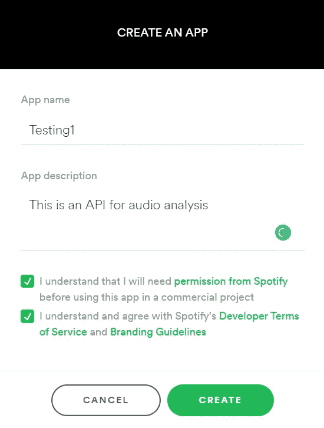

我们需要从 API 获得的密钥信息通常由一个“客户端”和一个“秘密”密钥组成。这将允许您进行身份验证，并使用 API 通过端点进行各种类型数据的调用和请求。

密钥可以在您的应用程序的仪表板中找到，单击以显示客户端密钥。确保不要随意共享 API 密钥，因为这可能导致滥用调用，最终可能会被禁止。

这样，我们就可以开始了！

如果您还没有安装 Spotipy，您可以在 anaconda 提示符下通过 pip 安装它。

```
pip install spotipy
```

我们将导入以下库来帮助我们格式化和分析数据。

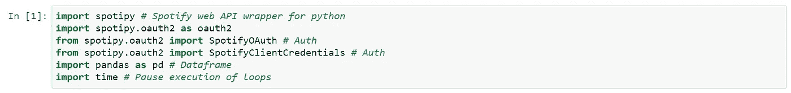

我们可以将客户端和密钥赋给一个变量，例如 auth_manager，而不是使用 SpotifyClientCredientals()函数为每个调用设置客户端和密钥。

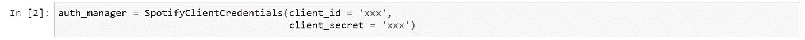

对于我们的第一个例子，让我们使用 **artist()** 函数收集一个艺术家的信息，给定一个艺术家的 ID、URI 或 URL。要获取您想要的艺术家 Spotify URL，右键单击 Spotify 桌面应用程序上的艺术家姓名，然后选择>复制 Spotify URI。

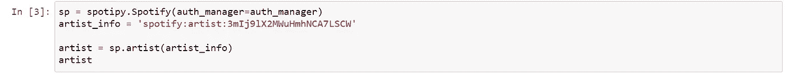

输出是:

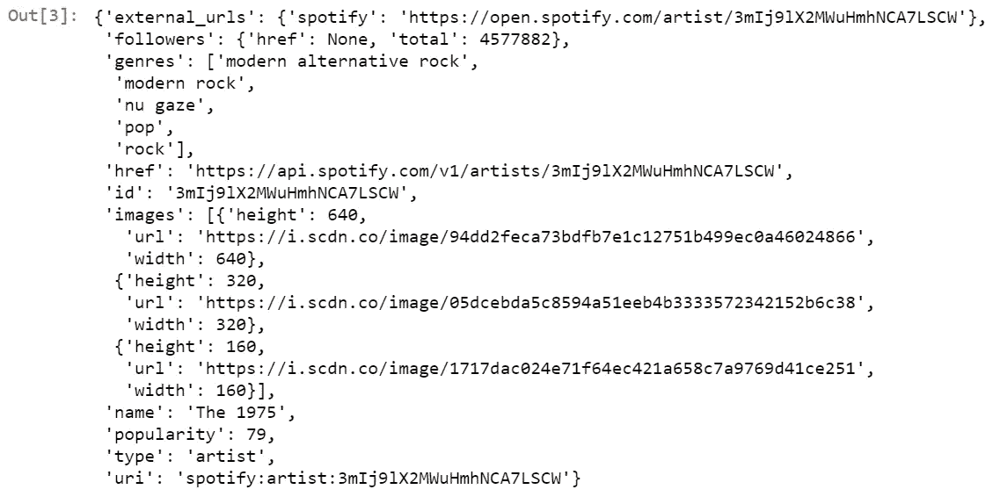

我们还可以使用 **artist_albums()** 函数收集特定艺术家的所有专辑。

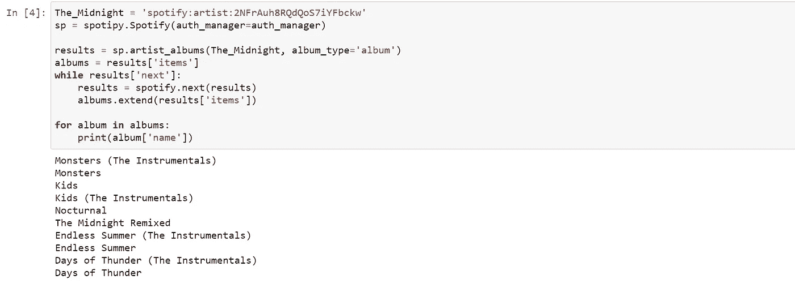

我们甚至可以使用 **artist_top_tracks()** 函数按国家收集某个艺术家的热门曲目、音乐预览和专辑封面艺术。例如，美国艺术家的前 5 首歌曲。对于可用国家代码的完整列表，我们可以使用 **country_codes()** 函数。

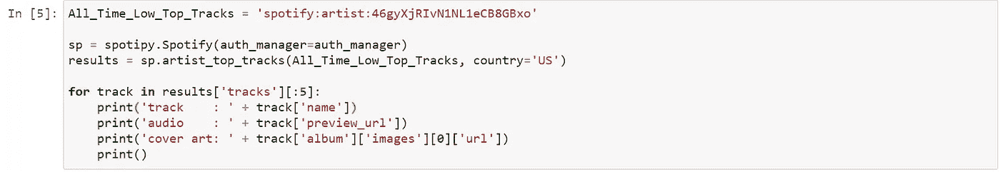

和输出

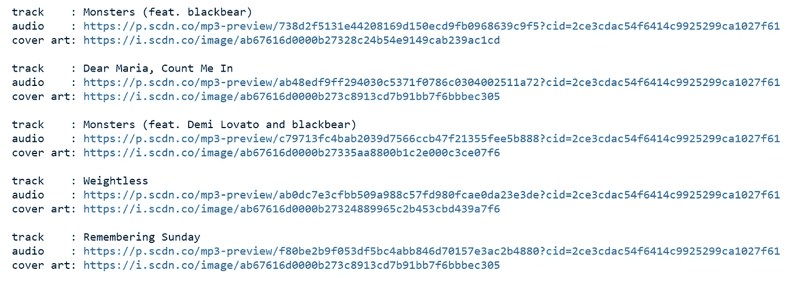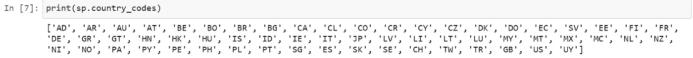

根据你的计划，Spotipy 还有很多其他功能，你可以在 https://spotipy.readthedocs.io/en/2.16.1/继续阅读

让我们继续本文的主题，Spotify 曲目的音频分析！

我们可以借助 **audio_features()** 函数来实现。

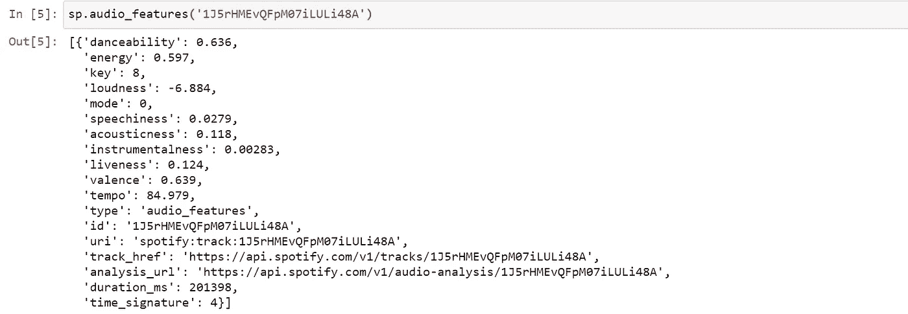

从函数中，我们可以看到曲目往往具有诸如“可跳舞性”、“能量”、“活性”等特征。但是，它似乎缺少歌曲名称、艺术家和专辑等信息。我们可以使用 pandas 和 **track()** 函数收集这些数据，并将所有数据组合成一个整洁的小数据框。

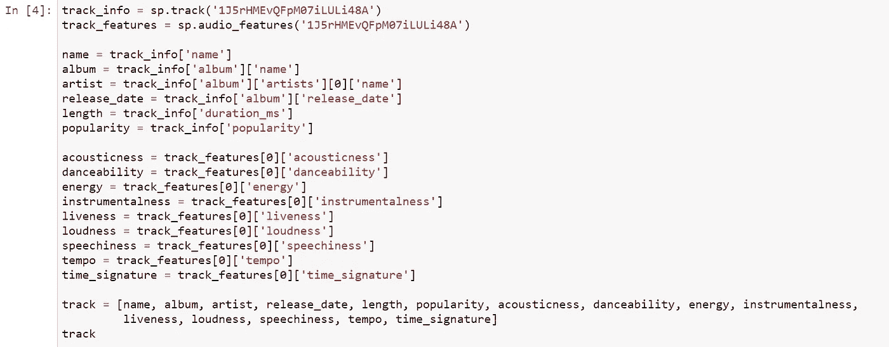

单个列中的输出，在将列分配给相应的值之前，我们必须将它转置到单个行中。

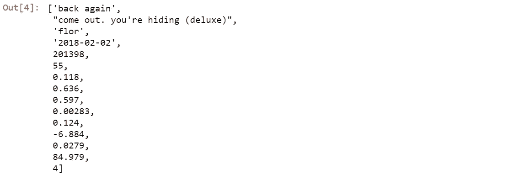

移调并转换为数据帧后的输出:

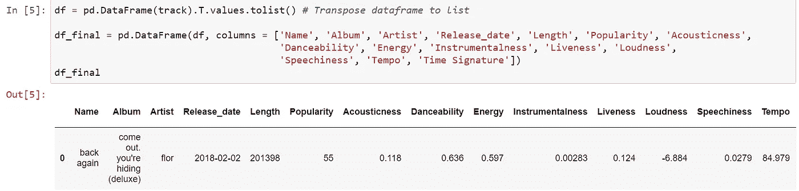

除了一首曲目，我们还可以在定义的变量和循环的帮助下为播放列表收集类似的数据。让我们从获取圣诞播放列表的曲目 id 开始，因为它就在眼前。


我们首先定义一个函数来获取曲目 id，这将有助于我们获取名称、专辑、艺术家等信息。

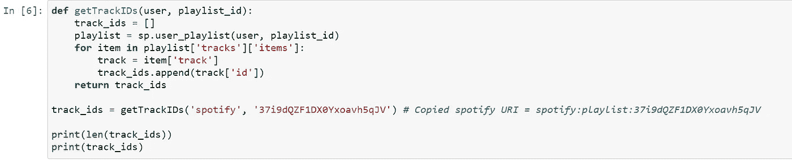

从播放列表中，我们可以看到我们的列表相应地包含 100 首歌曲和 100 个曲目 id。

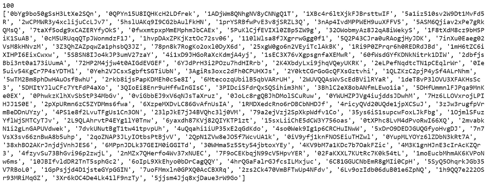

接下来，我们将定义另一个函数，该函数允许我们使用 return 语句来获取播放列表中曲目的特性，以结束函数调用的执行。

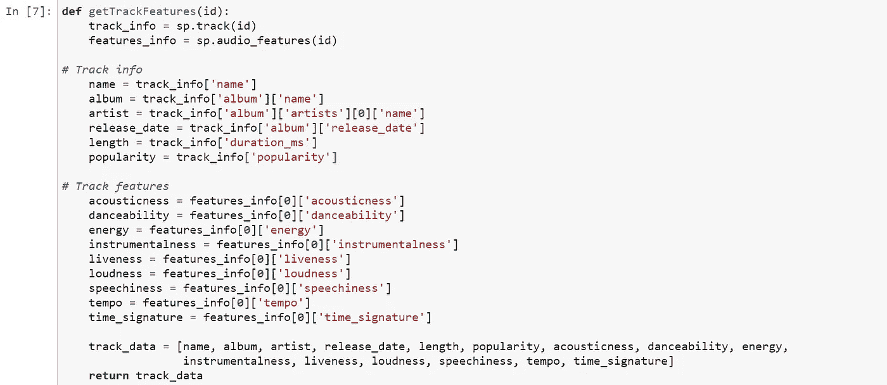

之后，我们将使用 for 循环，并在将每个轨迹的轨迹特征与我们的轨迹信息组合之前，将其附加到一个列表中。

通过 **time.sleep()** 函数添加了一个延迟，该函数将当前线程的执行暂停给定的秒数。这是为了防止在一段时间内发送过多的请求。

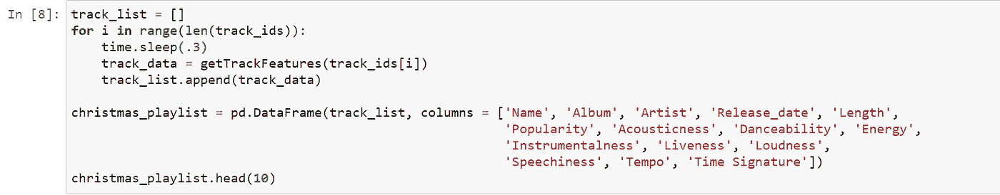

输出是一个数据帧，允许简单的数据可视化/导出等。

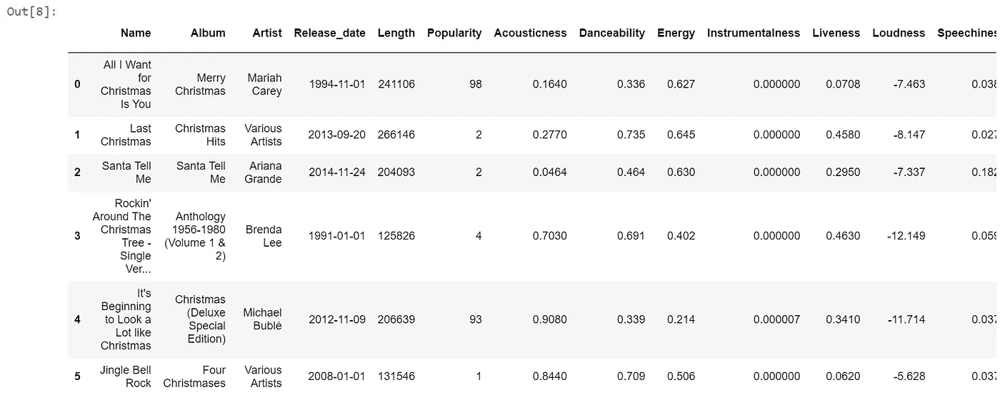

我们甚至可以推断出 5 首受欢迎程度最低的歌曲，这是用 0 到 100 的分数来衡量的，其中 0 是最不受欢迎的歌曲，反之亦然。根据端点引用，这些值是由算法计算出来的，并且主要基于该曲目的播放总数以及这些播放的最近时间。

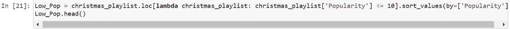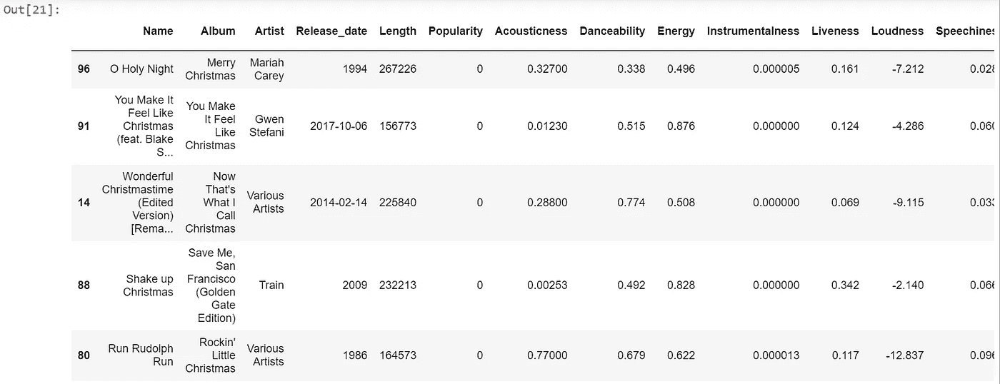

而对于在这个特定播放列表中具有最高流行度的歌曲。

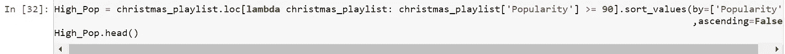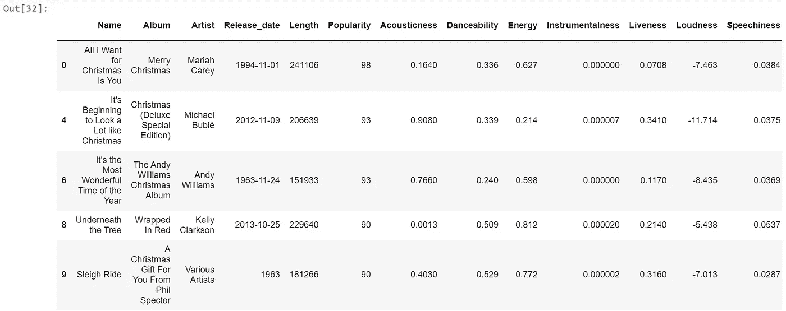

最后，我们可以使用数据框中的数据执行一些基本的数据可视化。为此，我们将利用 **plotly express** 库。

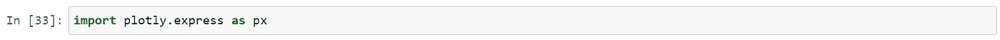

在绘制简单的散点图之前检查各列的数据类型。

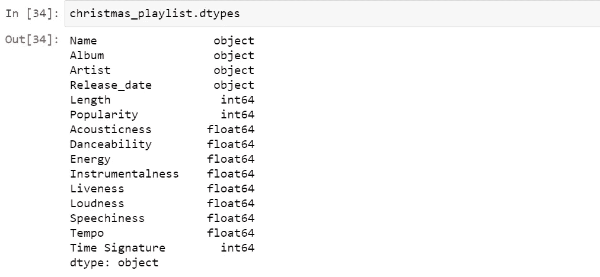

## 散点图

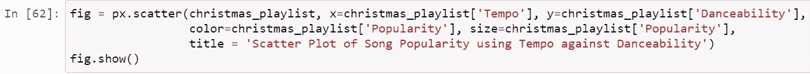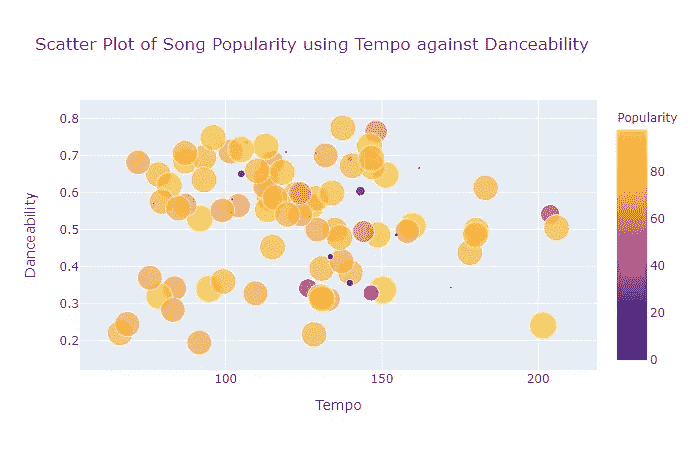

## 圆形分格统计图表

按艺术家显示该播放列表中流行度得分为 90 或更高的歌曲。

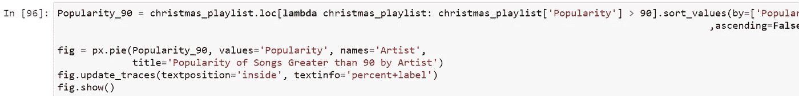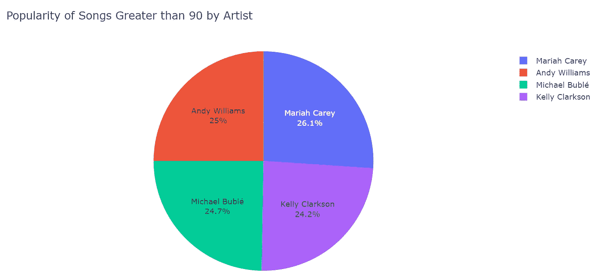

## 柱状图

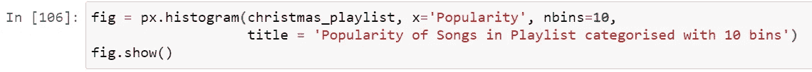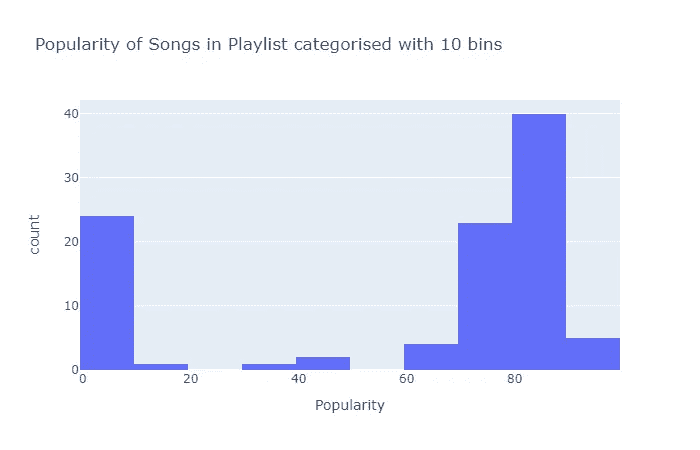

这就是本指南的全部内容，我希望您在探索通过诸如 Spotipy 之类的 API 获取和分析数据时获得了乐趣并学到了新的东西。

好奇的学习者？释放你在媒体上学习的全部潜力，用不到一杯咖啡的钱支持像我这样的作家。

[](https://lzpdatascience.medium.com/membership) [## 通过我的推荐链接加入媒体——杰森·LZP

### 作为一个媒体会员，你的会员费的一部分会给你阅读的作家，你可以完全接触到每一个故事…

lzpdatascience.medium.com](https://lzpdatascience.medium.com/membership) 

刚接触 R 编程，不知道从哪里开始？看看我的电子书一步一步的指南！

[](https://lzpdatascience.medium.com/r-for-data-science-a-beginners-guide-pdf-ebook-a5fe11009443) [## 数据科学入门指南(PDF /电子书

### 有一段时间了，我希望每个人都保持安全和健康。本月初，由于封锁，我…

lzpdatascience.medium.com](https://lzpdatascience.medium.com/r-for-data-science-a-beginners-guide-pdf-ebook-a5fe11009443)