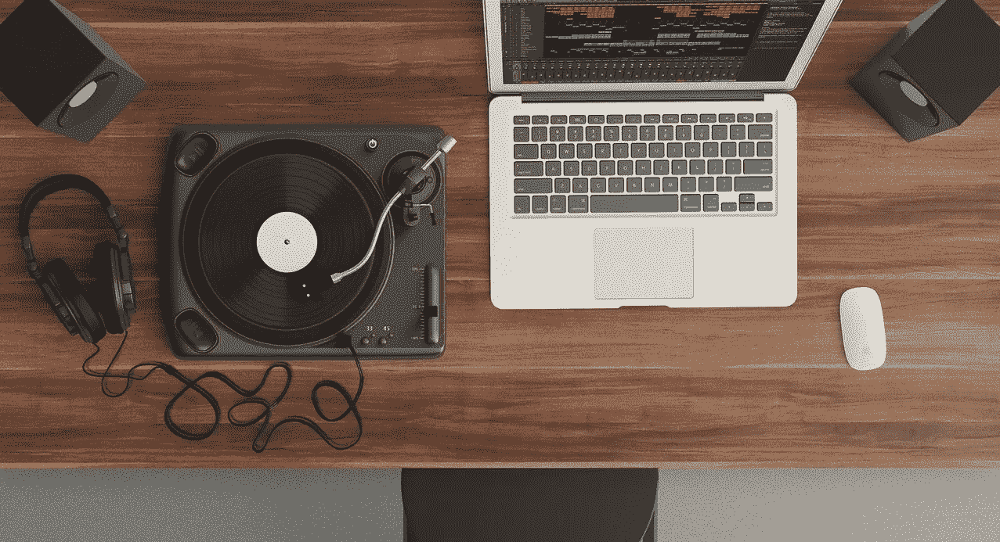
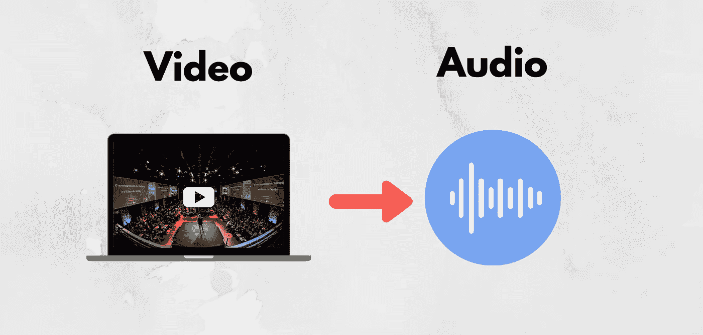

# 使用 YouTubeDL 包从视频中提取音频

> 原文：<https://levelup.gitconnected.com/extracting-audio-from-a-video-using-youtubedl-package-e98dc109f5d3>

## 使用 Python 的简单音频提取项目



照片由[像素](https://www.pexels.com/photo/macbook-white-164716/?utm_content=attributionCopyText&utm_medium=referral&utm_source=pexels)的[皮克斯拜](https://www.pexels.com/@pixabay?utm_content=attributionCopyText&utm_medium=referral&utm_source=pexels)拍摄

在这篇文章中，我将向你展示如何创建一个程序来下载 YouTube 视频的音频文件。这将是一个简单的项目，可以开始使用 YouTubeDL 包。使用 Python 可以做的事情是无限的，这也是 Python 成为一门引人注目的编程语言的原因。

在我的帖子中，我展示了可以使用 Python 构建的各种项目，比如下面的:[人脸识别器](https://towardsdatascience.com/building-a-face-recognizer-in-python-7fd6630c6340)到[条形码阅读器](https://towardsdatascience.com/building-a-barcode-qr-code-reader-using-python-360e22dfb6e5)。如果你有一个想法，你可以用 python 来实现它。你的项目不需要完美；找一个你想解决的问题就好了。然后，开始编程。



作者设计

## 目录:

*   ***Python***
*   ***YouTube EDL 库***
*   ***主程序***
*   ***转换文件类型***
*   ***结论***

# 计算机编程语言

Python 是一种通用编程语言，在分析数据方面越来越受欢迎。Python 还能让您快速工作，更有效地集成系统。世界各地的公司都在利用 Python 从他们的数据中收集知识。官方 Python 页面如果你想[了解更多](https://www.python.org/about/)。

# YouTubeDL 库

我们将只需要一个图书馆；换句话说，这个项目的一个包。我提到这将是一个毫不费力的项目。我们将安装以下 python 包: [**YouTube DL**](https://pypi.org/project/youtube_dl/#description) 。

YouTubeDL 是一个开源软件项目，主要从 YouTube 下载视频和音频，但它可以在不同的平台上工作。

使用 PIP (python 包管理器)安装包:

```
pip install youtube_dl
```

安装完成后，我们可以将其导入到我们的程序中。我们将在代码编辑器中添加以下代码行。

```
from youtube_dl import YoutubeDL
```

完美！让我们进入下一步，开始编写主程序。

# 主程序

我们将有两个部分:定义音频下载器和 while 循环。我将分享代码中发生的事情的简短描述。

```
audio_downloader = YoutubeDL({'format':'bestaudio'})while True: 
  try: 
    print('Audio Downloader'.center(40, '_')) 
    URL = input('Enter the url of the video: ') 
    audio_downloader.extract_info(URL)except Exception: 
    print("Couldn\'t download the audio")finally: 
    option = int(input('\n 
    1.Download another audio \n 
    2.Exit Program \n\nChoose your option :'))if option != 1: 
      break
```

*   首先，我们定义音频下载器实例。至于格式，我们选择“最佳音频”。你可以从他们的 github [文档](https://github.com/ytdl-org/youtube-dl/blob/master/README.md)中了解更多关于 YouTubeDL 的信息。
*   其次，我们正在启动一个 while 循环，这意味着它将一直运行，直到我们通过按“1”来打破循环。在循环中，程序要求用户输入我们希望程序下载的视频的 url。在终端窗口中粘贴网址后，程序开始下载 YouTube 视频的音频。这是通过“ *extract_info* ”方法完成的。
*   最后，程序会询问用户是继续下载还是退出程序。这是一个交互式的程序，这使得它对用户更友好。

这一步就到此为止，让我们进入下一步，在这里我们将读取下载的音频文件。

# 转换文件类型

在这一步，我们将把下载的文件转换成音频格式。下载的格式是 WebM。这是一种专门为网络设计的媒体格式。我们必须转换成常规的音频格式，如 MP3、M4A 或 WAV，才能打开 WebM 文件。

以下是 WebM 格式的简短定义:

*WebM 定义了文件容器结构、视频和音频格式。WebM 文件由使用 VP8 或 VP9 视频编解码器压缩的视频流和使用* [*Vorbis*](https://xiph.org/vorbis/) *或*[*Opus*](https://www.opus-codec.org/)*音频编解码器压缩的音频流组成。(参考:*[](https://www.webmproject.org/about/)**)**

*回到转换，您可以使用在线转换工具将 WebM 文件转换为音频文件。随意找一个在线平台来完成这项工作。*

# *结论*

*恭喜你。！您创建了一个程序，可以从 YouTube 下载视频音频。我们通过使用一个 python 包做到了这一点。这个包也可以用于不同的项目。现在，您已经了解了如何将想法转化为实际项目。*

*从事像这样的动手编程项目是提高编码技能的最好方式。如果你今天学到了新东西，我会很高兴。*

**谢谢，**

## *资源*

*   *[Python 官方文档](https://www.python.org/about)*
*   *[YouTubeDL 官方文档](https://github.com/ytdl-org/youtube-dl/blob/master/README.md)*
*   *[WebM 关于页面](https://www.webmproject.org/about)*