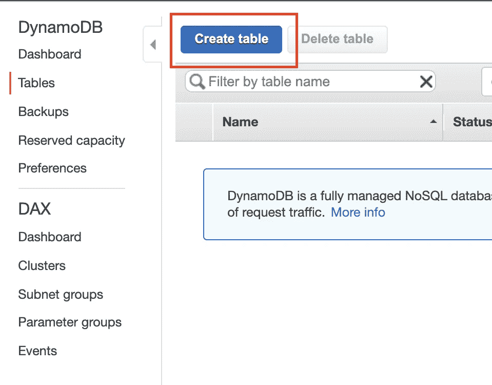
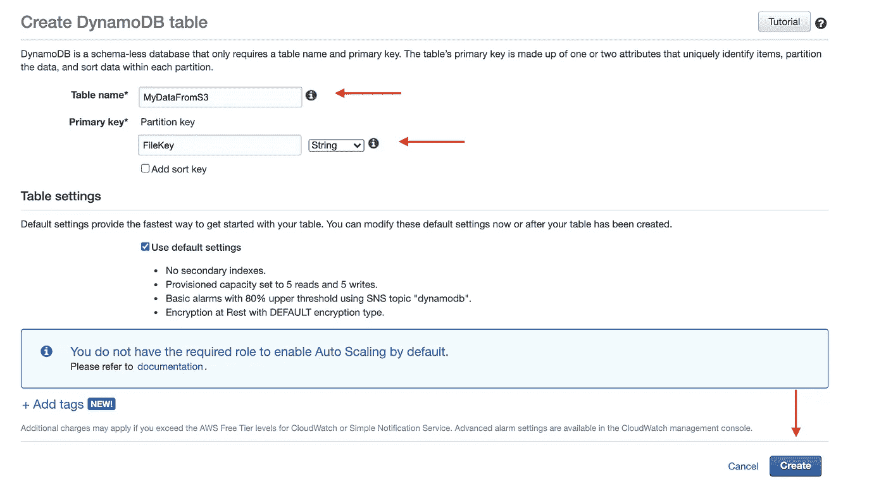
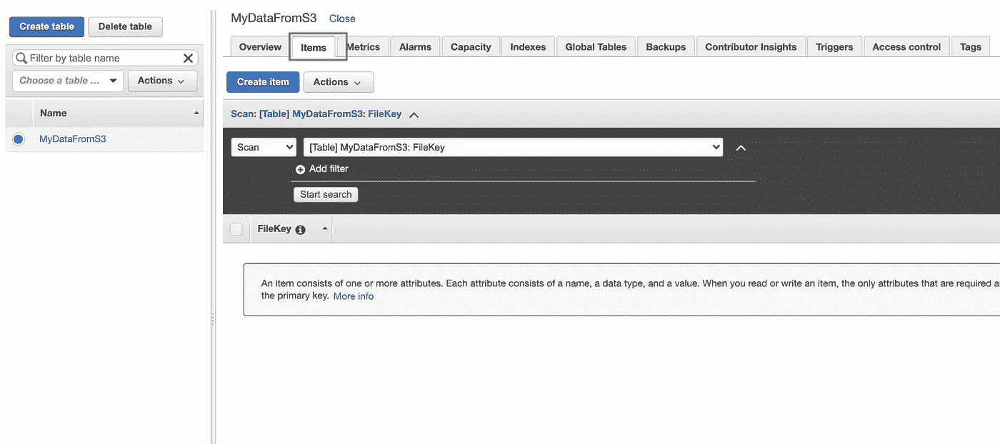
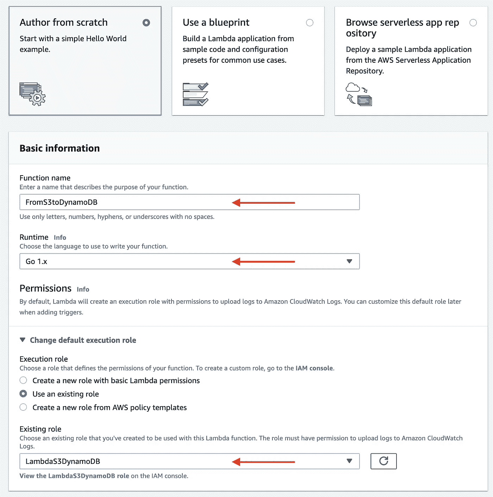
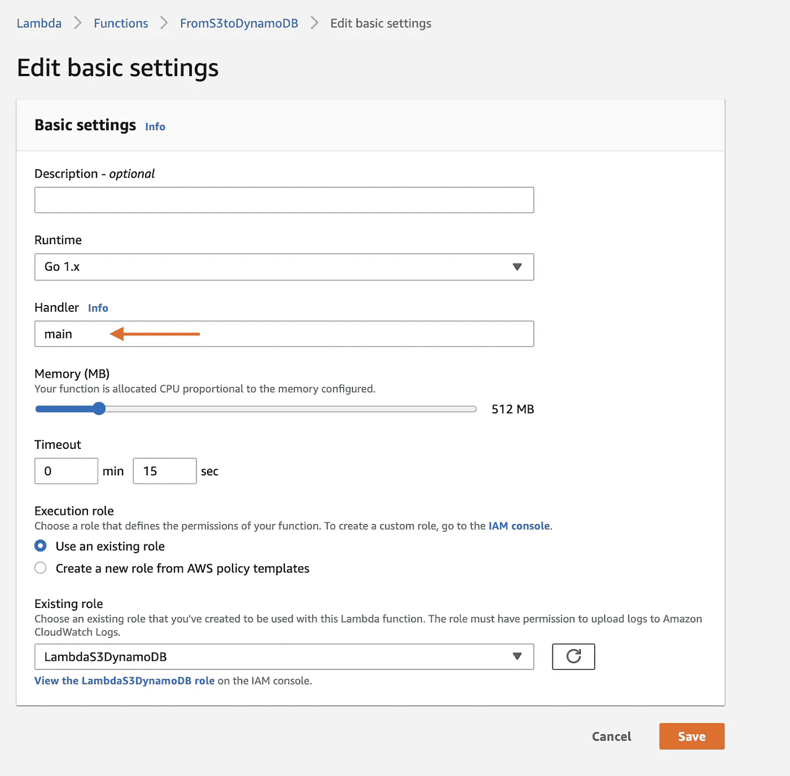
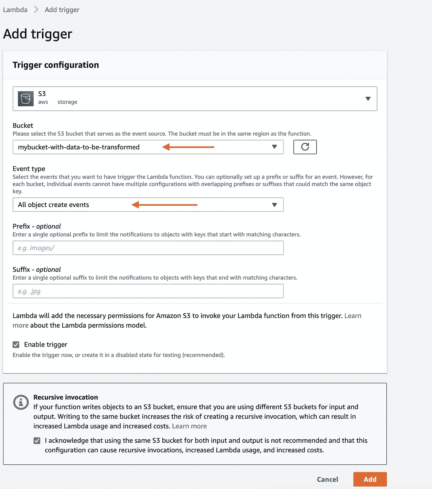
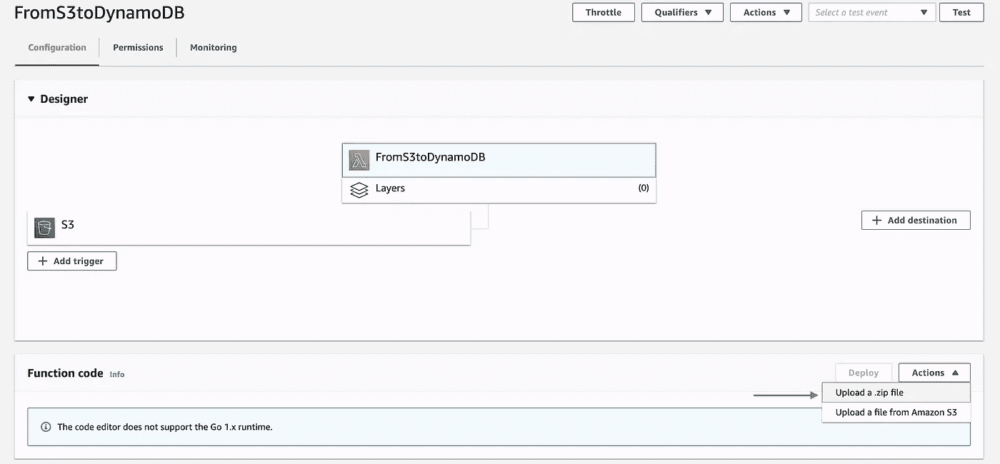
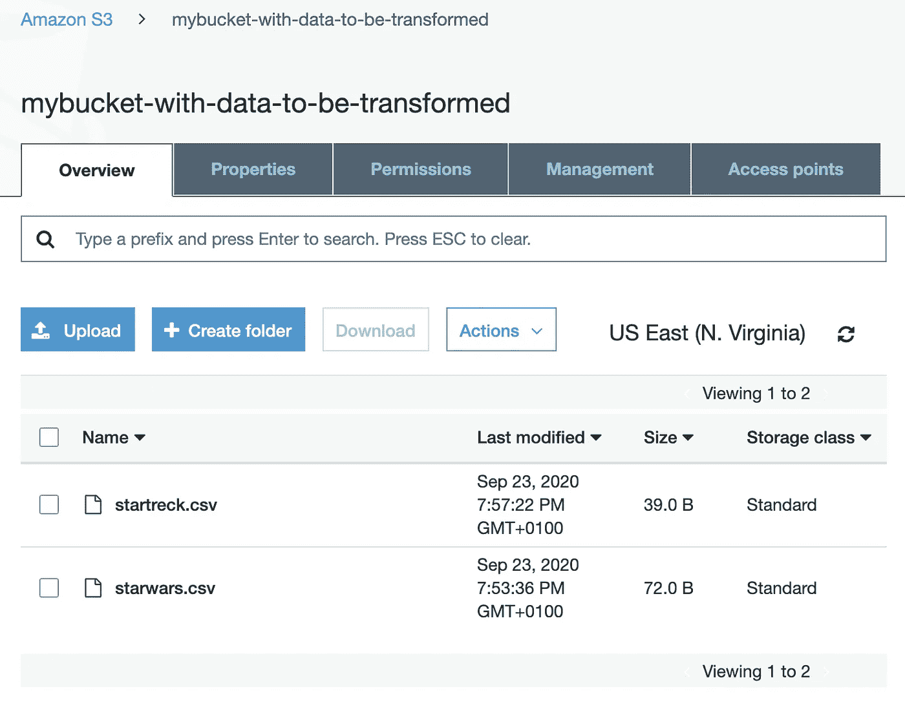
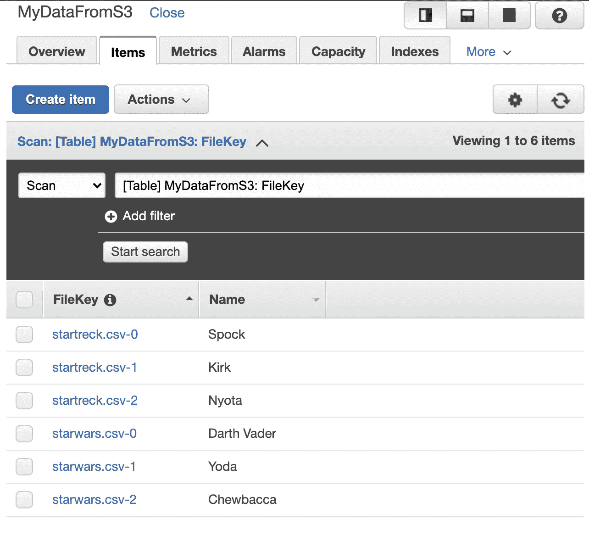

# 使用 AWS Lambda + Golang 从 S3 提取数据到 DynamoDB

> 原文：<https://levelup.gitconnected.com/extracting-data-from-s3-to-dynamodb-using-aws-lambda-golang-bc0832ce5fbb>


卡斯帕·卡米尔·鲁宾在 [Unsplash](https://unsplash.com?utm_source=medium&utm_medium=referral) 上的照片

我想说，在 web 开发中，很少会出现不需要文件存储和数据库的情况。

文件存储可用于处理简单的情况，如应用程序设置、连接字符串和一些客户数据。同时，这种资源可以用于数据归档/分析等复杂场景，甚至可以用于静态内容。

但是，如果您需要存储复杂的数据、性能和可伸缩性，数据库可能是正确的选择。

# 场景

因此，让我们想象一种情况，当需要从你的文件存储中提取数据，并把它放入你的数据库，就这么简单。

其次，我们将假设我们的文件存储是 [AWS 简单云存储(S3)](https://aws.amazon.com/s3/) ，数据库是 [Amazon Dynamo DB。](https://aws.amazon.com/dynamodb/)

最后，让我们假设文件不太大(小于 500MB)，并且它们是 [CSV](https://en.wikipedia.org/wiki/Comma-separated_values) 格式，遵循模式: *UserIdentifier，Username，Language。*数据的一个例子可以是:

```
123456,Darth Vader,Python
774477,Yoda,Golang
999000,Chewbacca,Javascript
```

## 工具

有几种方法可以用来解决我们的问题，比如:

[AWS 数据管道](https://docs.aws.amazon.com/data-pipeline/index.html)

> 轻松自动化数据的移动和转换。

[AWS 数据粘合](https://aws.amazon.com/glue/)

> 简单、灵活且经济高效的 ETL

[亚马逊雅典娜](https://aws.amazon.com/athena/)

> 立即开始查询数据。几秒钟内获得结果。只为您运行的查询付费。

因此，所有这些工具都很棒，可以毫无问题地用来实现我们正在寻找的东西。

尽管如此，有些情况下我们不需要用铲子去爆气球，对吧？我们用针就可以了:)

# 简单的解决方案——λ函数

假设我们想要一个简单的解决方案，易于维护，并且仅限于小型/中型文件，Lambda 函数非常适合这种情况。

这个想法很简单，我们的 lambda 函数将被 S3 触发，并将这些数据保存在 DynamoDB 中。

好，我们开始吧！

## DynamoDB 表

第一步是创建我们的表，在 DynamoDb 部分，单击 Create Table:



创建表格

现在，让我们定义表名和主键:



表名和主键

我们的表名将是 *MyDataFromS3* 和主键 *FileKey。* 现在，我们的表已经创建好了，我们可以点击*项*选项卡来检查数据。



DynamoDB 项目

很好，现在我们的表已经创建好了，我们可以进入下一步了。

## IAM 角色

另一个重点是 IAM 的角色。我们可以添加的策略如下:

```
{
    "Version": "2012-10-17",
    "Statement": [
        {
            "Effect": "Allow",
            "Action": [
                "dynamodb:PutItem",
                "dynamodb:GetShardIterator",
                "dynamodb:DescribeStream",
                "dynamodb:ListStreams",
                "dynamodb:GetRecords",
                "s3:List*",
                "s3:Get*",
                "logs:CreateLogGroup",
                "logs:PutLogEvents",
                "logs:CreateLogStream"
            ],
            "Resource": "*"
        }
    ]
}
```

之后，我们可以创建一个名为 *LambdaS3DynamoDB* 的角色，并附加为该角色创建的策略。

## λ函数

由于 Lambda 函数是这项任务的主要部分，我们将把它分成 4 个小函数:

1 —处理程序

处理程序是起点，lambda 触发器将从 S3 注入数据，其结构基于 [AWS 示例](https://github.com/aws/aws-lambda-go/blob/master/events/README_S3.md):

2 —从 S3 获取数据

在这一步中，我们将通过参数接收桶和文件名，并创建一个会话来下载文件并以字符串形式返回内容。
记住将 *<您的存储桶区域>* 替换为创建您的存储桶的区域:

3-提取我们想要插入的数据

现在，有了字符串数据，我们可以只提取我们想要的部分，并作为字符串数组返回:

4 —插入到 DynamoDB 中

最后，插入 DynamoDB:

DynamoDB，小技巧:

*   为了避免使用 [dynamodbattribute](https://docs.aws.amazon.com/sdk-for-go/api/service/dynamodb/dynamodbattribute/#Marshal) ，最好使用 PascalCase 作为列名
*   通常，在传统的 SQL 数据库中，我们有*插入*和*更新*操作，使用 DynamoDb 只有 [PutItem](https://docs.aws.amazon.com/amazondynamodb/latest/APIReference/API_PutItem.html)
*   和大多数 NoSQL 数据库一样，这个数据库也是无模式的

所以，最后一个功能:

现在，我们需要构建我们的函数:
如果你使用 Linux / macOS，只需运行下面的命令，如果你使用 windows，检查[这个链接](https://docs.aws.amazon.com/lambda/latest/dg/golang-package.html)。

```
GOOS=linux GOARCH=amd64 go build -o main main.go && zip main.zip main
```

现在，我们已经压缩了项目，并准备好进行部署。

## 配置λ函数

创建好一切后，让我们来配置函数:



Lambda —创建

下一步是配置 handler:
转到，权限>执行角色>编辑
在“编辑基础设置”中设置 handler 为 main:



λ—基本设置

假设我们已经创建了一个 S3 存储桶，我们可以添加触发器:



λ-触发器

最后，是时候更新函数中的 zip 文件了:



λ—上传功能

太好了！现在，一旦我们将一个文件上传到我们的 Bucket，我们就可以在 DynamoDB:



S3 — CSV 文件

和 DynamoDB:



DynamoDB 项目

所以，就这样了！俗话说:最完美的解决方案是适合你的:)

希望这篇文章能有用。

你怎么想呢?它是否适用于您的场景？你在使用另一种方法吗？

非常感谢您抽出时间