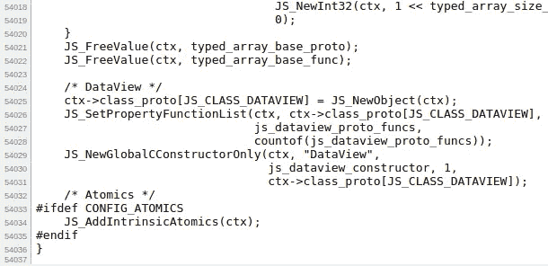

# 由个人发起的非凡的开源项目

> 原文：<https://levelup.gitconnected.com/extraordinary-open-source-projects-initiated-by-individuals-5ae7cc27a5df>

## 有时候，开发者建造的项目吸引了全世界的注意力。

约书亚·阿拉贡在 [Unsplash](https://unsplash.com/s/photos/programmer?utm_source=unsplash&utm_medium=referral&utm_content=creditCopyText) 上拍摄的照片

大型科技公司通常会启动大型复杂的开源项目。首先，他们创新项目供内部使用。之后，他们将整个项目或项目的一部分作为开源来从开源社区中获益。此外，个人开发者也发起开源项目来帮助其他开发者，为了好玩，或者作为一种副业——来获得收入流(主要来自捐赠)。我们经常称那些开发者为开源爱好者或贡献者。他们发起了各种各样的开源项目。有些项目非常复杂，让世界上的每个开发人员都印象深刻。

我最喜欢的爱好之一是浏览流行的 GitHub 库。我总是喜欢研究那些流行的 GitHub 项目内部是如何工作的。我在浏览 GitHub 时发现了以下非凡的项目。事实上，个人程序员发起了这些令人印象深刻的开源项目。毫无疑问，对于一个程序员来说，这些项目既耗时又复杂。

# Temple OS

Temple OS 是由 Terry A. Davis 编写的免费、开源、64 位、轻量级公共域操作系统。它最初是在 2005 年作为 J 操作系统发布的。Terry 用他自己创造的 HolyC 编程语言独自编写了 Temple OS。Temple OS 的 16 色图形用户界面看起来像是微软 DOS 和 Borland Turbo C IDE 的混合体。这个操作系统有几个预装软件，如文件管理器、终端和一系列有趣的游戏。

按照特里的想法，他从上帝那里得到的指令中准备了一些 Temple OS 的说明书。他还为 Temple OS 创建了自己的文件系统，名为 *RedSea* 。同时，Temple OS 也支持众所周知的 FAT32 文件系统。如果只有一个人参与开发过程，编写编程语言、操作系统和文件系统是非常复杂和耗时的。请参见下面的 HolyC 代码片段，它摘自 Temple OS 内核的内存管理模块。

Temple OS 源代码的一部分。作者截图。

可悲的是，Temple OS 的创作者在 2018 年去世了。

# 宁静操作系统

Serenity OS 是一个免费、开源、32 位、多线程的 Unix 操作系统，由 Andreas Kling 创建。这个操作系统中的每个组件都是用 C/C++从头开始编写的。Serenity OS 像任何其他流行的操作系统一样，带有预建的软件。它有一个 web 浏览器、集成开发环境(IDE)、调试器、PDF 查看器、终端和其他典型计算机用户所需的软件。图形用户界面看起来像 90 年代左右创建的操作系统。换句话说，Serenity OS 的用户界面实现类似于 Windows 95 和 Mac OS 7 等知名的 90 年代操作系统。

Serenity OS 的默认网络浏览器有一个从头实现的 JavaScript 引擎。同样，代码库中没有使用第三方依赖项。此外，代码库具有组织良好的代码结构。这个项目是 2018 年开始的，有 21k 多的提交。Serenity OS 的作者在一条推文中提到，他辞去了全职工作，专注于他的操作系统。

对于一个人来说，从头开始实现一个全功能的操作系统是一项巨大的工作量。检查以下结构良好的代码库。

Serenity OS 结构良好的代码库。作者截图。

然而，现在 Serenity OS 有多个维护者来审查代码并合并来自社区的 pull 请求。此外，许多贡献者最近为 Serenity OS 实现了显著的特性。

# Linux 内核

Linux 内核是一个免费的、开源的、单片的、多任务的、类似 Unix 内核的操作系统内核，最初由 Linus Torvalds 编写。Torvalds 将 Linux 内核实现为 Unix 内核的免费替代品。与计算机硬件紧密配合的内核是任何操作系统的核心。另一方面，操作系统指的是内核、核心库和应用程序。托沃兹在他还是大学生的时候就创建了一个工作内核。他的目标是为 Unix 创建一个替代的操作系统。他能够通过将 Linux 内核与理查德·斯托尔曼的 GNU 实用程序集成来实现他的目标。

当他向开源社区发布第一个正式版本时，他有一个具有初始操作系统特性的功能内核。比如当时他已经把 Bash 终端解释器和 GNU C 编译器移植到 Linux 内核上了。对于一个大学生来说，从头开始编写一个内核确实是复杂且耗时的。因此，Linux 内核也是一个由个人程序员发起的非凡项目。

莱纳斯最初提到，

> 我在 clones 为 386(486) [做一个(免费的)操作系统(只是爱好，不会像 gnu 那样大而专业)。](https://en.wikipedia.org/wiki/IBM_Personal_Computer/AT)

现在互联网的大部分运行在 Linux 上。此外，许多流行的操作系统，如 Ubuntu、Debian、Android 和 Chrome OS，都是由 Linux 内核驱动的。

# QuickJs

QuickJs 是一个轻量级、可嵌入、快速的 JavaScript 引擎，由著名的 FFmpeg 项目发起人法布里斯·贝拉创建。QuickJs 通过异步生成器、代理、模块和 BigInt 类支持 ECMAScript 2020 规范。内置的 JavaScript 库 API 是用 C 库包装器实现的，以保持引擎的小型和可嵌入性。您还可以使用 QuickJs 将 JavaScript 编译成没有依赖关系的可执行文件。这个 JavaScript 引擎提供了许多 CLI 标志来完成各种操作，就像其他 JavaScript 运行时一样。

对于一个程序员来说，通过实现自己的解析器和代码生成器来从头实现 JavaScript 引擎是复杂而耗时的。之前我发现 GCC C 解析器作为 GitHub 上最大的 C 源文件(22176 个代码行)——不，不是。QuickJs 项目的`[quickjs.c](https://github.com/bellard/quickjs/blob/master/quickjs.c)`文件有 54037 行代码，占用磁盘 1.67 兆。

quickjs.c 文件有 54037 行代码。作者截图。

# 结论

个人程序员最初编写上述项目。后来全球很多开发者几乎贡献了上面提到的所有项目。毫无疑问，开源软件开发是协作工作。贡献者通过应用有价值的补丁、提出新的想法和提交错误报告，每天都在使开源项目变得更好。然而，Temple OS 却暗藏玄机。这确实是一个开源项目，但它只由一个人编写——一个人。