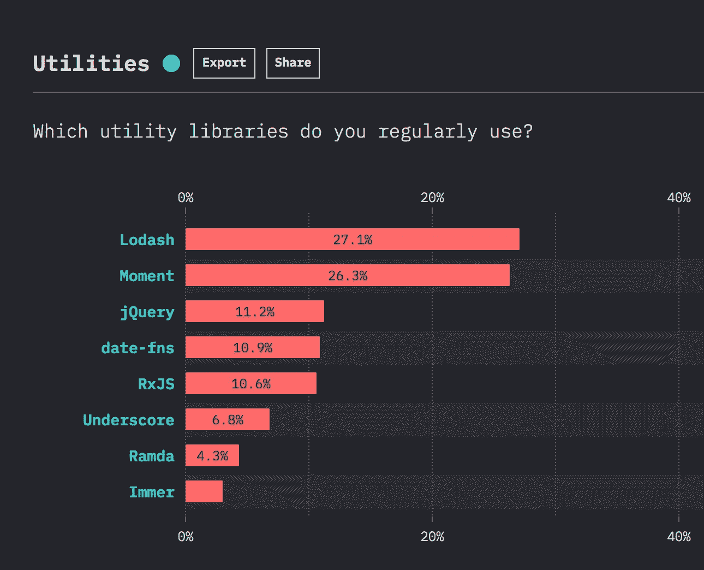

# 非常有用的 lodash 方法

> 原文：<https://levelup.gitconnected.com/extremely-useful-lodash-methods-b38f121fea7e>

理解为什么每个人都喜欢这个小工具库


Lodash 是世界上使用最广泛的实用程序库，因为它提供了许多使编码简单快捷的方法。

根据 Javascript 2019 调查结果的[状态，lodash 位居榜首:](https://2019.stateofjs.com/other-tools/)



在本文中，我们将看到 lodash 提供的不同方法，这些方法使编码变得容易。

**安装:**

1.  使用 CDN:

```
<script src="[https://cdn.jsdelivr.net/npm/lodash@4.17.15/lodash.min.js](https://cdn.jsdelivr.net/npm/lodash@4.17.15/lodash.min.js)"></script>
```

2.使用 npm:

```
npm install --save lodash
```

让我们探索 lodash 提供的一些最有用的方法。

1.  **isEqual:**

`isEqual`方法执行两个值之间的深度比较。

语法:

```
_.isEqual(value, other)
```

看看下面的代码:

```
const obj1 = {
  name: 'Ram',
  age: 20,
  location: {
    city: 'NY',
    state: 'NY'
  }
};

const obj2 = {
  name: 'Ram',
  age: 20,
  location: {
    city: 'NY',
    state: 'NY'
  }
};

console.log(_.isEqual(obj1, obj2)); // true
```

演示:[https://codepen.io/myogeshchavan97/pen/WNbmboE?editors=0012](https://codepen.io/myogeshchavan97/pen/WNbmboE?editors=0012)

**现实生活应用:**

如果您在用户登录到系统时显示预填充的用户配置文件数据，并且如果您在用户单击 save 按钮时进行 web 服务 API 调用以保存已更改的用户详细信息，那么在使用 lodash 的`isEqual`方法进行 API 调用之前，您可以很容易地检查用户是否更改了某些内容。

**性能:**

在比较两个嵌套很深的对象时，`isEqual`比其他方法要快得多。比较两个对象的其他方法是手动比较每个属性或使用`JSON.stringify`方法。

2. **isEmpty:**

`isEmpty`方法检查`value`是否为空对象、集合、映射或集合。

语法:

```
_.isEmpty(value)
```

看看下面的代码:

```
const obj1 = { name: 'David' };
console.log(_.isEmpty(obj1)); // false

const obj2 = {};
console.log(_.isEmpty(obj2)); // true

const array1 = [];
console.log( _.isEmpty(array1)); // true

const array2 = [2, 3];
console.log(_.isEmpty(array2)); // false

const nullValue = null;
console.log(_.isEmpty(nullValue)); // true

const undefinedValue = undefined;
console.log(_.isEmpty(undefinedValue)); // true
```

演示:[https://codepen.io/myogeshchavan97/pen/PowLwWG?editors=001](https://codepen.io/myogeshchavan97/pen/PowLwWG?editors=0012)2

如您所见,`isEmpty`方法可以快速测试空值。与使用`Object.keys(obj1).length === 0`检查空对象不同，`isEmpty`使检查变得容易。

3.**获取:**

`get`方法获取`object`的`path`处的值。如果解析的值是`undefined`，则`defaultValue`返回到它的位置。

语法:

```
_.get(object, path, [defaultValue])
```

看看下面的代码:

```
const user = {
      "gender": "male",
      "name": {
        "title": "mr",
        "first": "brad",
        "last": "gibson"
      },
      "location": {
        "street": "9278 new road",
        "city": "kilcoole",
        "state": "waterford",
        "postcode": "93027",
        "coordinates": {
          "latitude": "20.9267",
          "longitude": "-7.9310"
        },
        "timezone": {
          "offset": "-3:30",
          "description": "Newfoundland"
        }
      }
};

console.log(_.get(user, 'location.timezone', {})); // {'offset':'-3:30','description':'Newfoundland'}
console.log(_.get(user, 'name.middlename', '')); // ''
```

演示:[https://codepen.io/myogeshchavan97/pen/jOEJEXp?editors=0012](https://codepen.io/myogeshchavan97/pen/jOEJEXp?editors=0012)

洛达什的`get`方法的伟大之处在于，如果用户对象中不存在 location 属性，那么以`user.location.timezone` 的形式直接访问它会抛出一个错误，但是如果使用洛达什的`get`方法，它不会抛出一个错误，而是会返回默认值。

```
const user = {
      "gender": "male",
      "name": {
        "title": "mr",
        "first": "brad",
        "last": "gibson"
      }
};
// This will work and will return the default value specified
console.log('timezone:',_.get(user, 'user.location.timezone', '')); // Error: Cannot read property 'timezone' of undefined
console.log('timezone:',user.location.timezone);
```

4.**排序依据:**

`sortBy`方法创建了一个元素数组，按照集合中每个元素在每个迭代中的运行结果进行升序排序。

语法:

```
_.sortBy(collection, [iteratees=[_.identity]])
```

看看下面的代码:

```
const users = [
  { 'user': 'fred',   'age': 48 },
  { 'user': 'barney', 'age': 36 },
  { 'user': 'fred',   'age': 40 },
  { 'user': 'barney', 'age': 34 }
];

//sort users by age
console.log(_.sortBy(users, [function(user) { return user.age }])); // output: [{'user':'barney','age':34},{'user':'barney','age':36},{'user':'fred','age':40},{'user':'fred','age':48}]
```

演示:[https://codepen.io/myogeshchavan97/pen/wvBOKYM?editors=0012](https://codepen.io/myogeshchavan97/pen/wvBOKYM?editors=0012)

5.**排序依据:**

`orderBy`方法类似于 sortBy，但它允许我们指定降序或升序排序。对于降序排序，我们指定 **desc** ，对于升序排序，我们指定 **asc** 。

语法:

```
_.orderBy(collection, [iteratees=[_.identity]], [orders])
```

看看下面的代码:

```
const users = [
  { 'user': 'fred',   'age': 48 },
  { 'user': 'barney', 'age': 36 },
  { 'user': 'fred',   'age': 40 },
  { 'user': 'barney', 'age': 34 }
];

// sort by user in descending order
console.log(_.orderBy(users, ['user'], ['desc']));

// sort by user in ascending order and age by descending order
console.log(_.orderBy(users, ['user', 'age'], ['asc', 'desc']));
```

演示:[https://codepen.io/myogeshchavan97/pen/oNgVYwZ?editors=0012](https://codepen.io/myogeshchavan97/pen/oNgVYwZ?editors=0012)

6.**工会:**

`union`方法从所有传递的数组中返回唯一值。

语法:

```
_.union([arrays])
```

示例:

```
console.log(_.union([1], [1, 2, 3], [-1, 0, 4], [2, 2, 3])); // [1, 2, 3, -1, 0, 4]
```

演示:[https://codepen.io/myogeshchavan97/pen/PowLbaB?editors=0012](https://codepen.io/myogeshchavan97/pen/PowLbaB?editors=0012)

7.**克隆的深度:**

方法递归地返回一个对象的克隆/拷贝。如果您不想更改原始对象，而是创建对象的副本以向其添加额外的属性，这将非常有用。

语法:

```
_.cloneDeep(value)
```

示例:

```
const obj = {
  name: {
    title: "Ms",
    first: "Hannah",
    last: "Ennis"
  },
  location: {
    city: "Flatrock",
    state: "British Columbia",
    country: "Canada",
    postcode: "P1X 7D3",
    coordinates: {
      latitude: "-62.3907",
      longitude: "37.8088"
    },
    timezone: {
      offset: "+5:30",
      description: "Bombay, Calcutta, Madras, New Delhi"
    }
  }
};
const clone = _.cloneDeep(obj);console.log(obj.name === clone.name); // false
console.log(clone === obj); // false
```

演示:[https://codepen.io/myogeshchavan97/pen/vYyqjxg?editors=0012](https://codepen.io/myogeshchavan97/pen/vYyqjxg?editors=0012)

从上面`clone.name`和`obj.name`的比较中可以看出，`_.cloneDeep`创建了完全不同的对象，这是一个复制/克隆

8.**去抖:**

`debounce`方法允许我们在几毫秒后调用一个函数。

语法:

```
_.debounce(func, [wait=0], [options={}])
```

**注意:去抖方法返回一个函数，我们调用这个函数进行后续调用。**

这是一个非常有用的方法，它允许我们最小化对服务器的 API 调用。

让我们构建一个搜索功能，用户键入一些信息作为输入，我们将对服务器进行 API 调用以获得基于输入的结果。

## 不使用去抖的演示:

[https://codepen.io/myogeshchavan97/pen/zYxbEPv?editors=0010](https://codepen.io/myogeshchavan97/pen/zYxbEPv?editors=0010)

在上面没有去抖的例子中，你可以看到在每一次击键时，我们都在进行 API 调用。所以我们不必要地增加了服务器 API 调用。如果服务器返回数据花费了更多的时间，您可能会看到以前的结果，即使您正在期待基于您的输入值的新结果。

为了解决这个问题，我们可以使用去抖动，当用户停止输入时，我们只在 300 毫秒后发出一个 API 请求，这样更有好处。它将保存不必要的请求，也将保存之前短时间显示的 API 调用结果。

## 使用去抖进行演示:

[https://codepen.io/myogeshchavan97/pen/YzPgExJ?editors=0010](https://codepen.io/myogeshchavan97/pen/YzPgExJ?editors=0010)

在上面的代码中，`debounce`方法返回一个我们存储在`debFunction`变量中的函数

```
const debFunction = _.debounce(onSearchText, 1000);
```

然后对于每一个按键变化事件，我们在 300 毫秒后调用存储在`debFunction`变量中的函数，一旦用户停止输入。在内部调用`debFunction,`，调用`onSearchText`函数，我们实际上是在调用 API。

> 想知道如何在 React 应用中使用去抖来提高搜索性能吗？查看我的[这篇文章](https://dev.to/myogeshchavan97/using-debouncing-to-improve-the-performance-of-your-application-s-search-functionality-31j7)。

*你可以在这里* *探索 lodash* [*的所有其他方法。*](https://lodash.com/docs/4.17.15)

今天到此为止。希望你今天学到了新东西。

**别忘了直接在你的收件箱** [**这里**](https://yogeshchavan.dev) **订阅我的每周时事通讯，里面有惊人的技巧、诀窍和文章。**