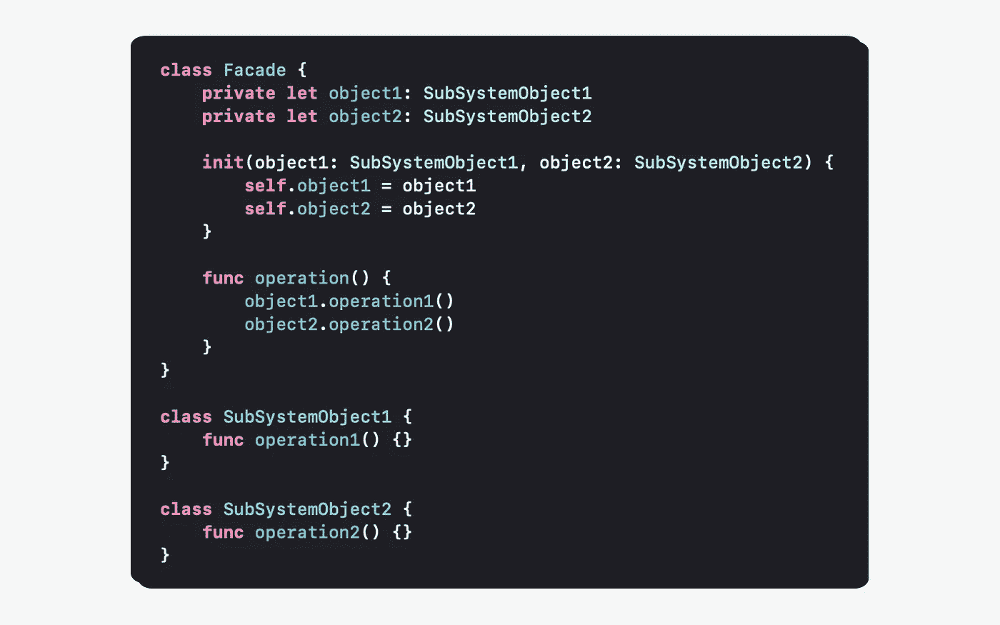
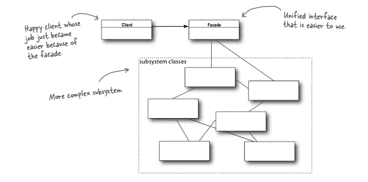
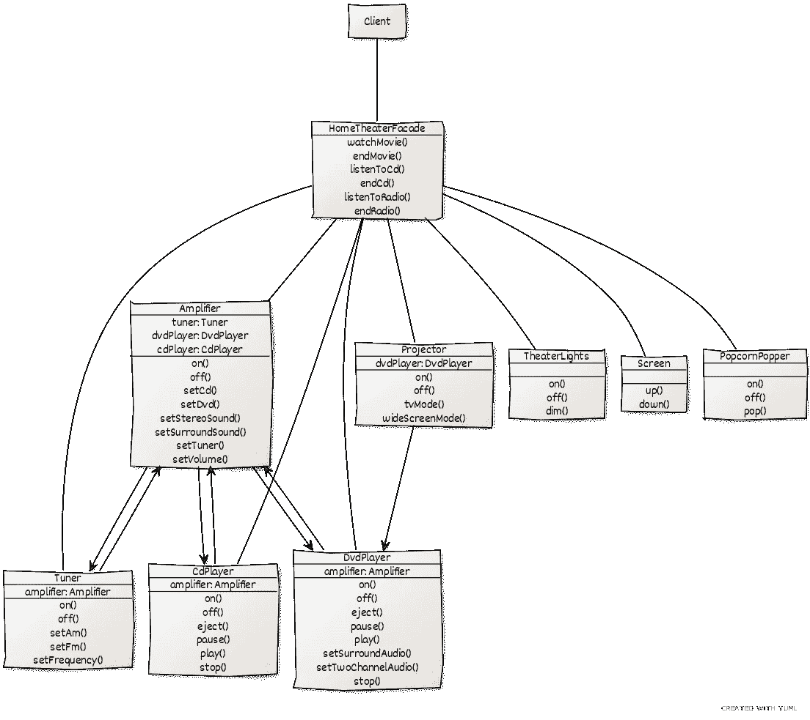

# Swift 中的“外观”模式

> 原文：<https://levelup.gitconnected.com/facade-pattern-in-swift-11b5b7af7d4b>



# 定义

“Facade”模式是一种改进大型系统结构的结构设计模式。结构模式对于使独立开发的系统一起工作是有用的。

**‘Facade’模式定义了一个表示子系统的对象。这个对象是一个负责与子系统交互的接口。**

[1]系统是由子系统组成的。子系统包含一个接口并封装类。一个类包含状态和操作。

# 我们什么时候应该使用这种模式？

## 为复杂的子系统提供简单的接口

当有可能提供比现有子系统更简单的接口时，应该使用这种模式。一个复杂的子系统需要以特定的方式工作才能正常工作。将这种复杂性转移到一个界面上简化了其功能的使用。这个接口称为 facade，它向客户端隐藏了复杂性。

## 将子系统从客户端和其他子系统中分离出来

当一个系统有许多依赖的子系统时，应该使用这种模式。它解耦了它们的实现细节。它减少了依赖性，使代码更容易使用、理解、维护和测试。

## 定义子系统的入口点

当子系统相互依赖时，应该使用这种模式。facade 模式只公开一个简单的统一 API，而不是将客户端公开给一个库、一个框架或一组类及其 API。子系统在不知道外观的情况下实现功能。它们在系统内相互作用。因此，子系统的实现细节可以改变，而不会影响 facade API。它不需要任何改变，因为 facade 处理的是接口而不是实现。它增加了一个抽象层(入口点)来提高代码的可用性、可读性和架构。

[1]从属子系统是指一个系统对另一个系统具有依赖性/参考性。

[2]相互依赖的子系统是指一个系统依赖于另一个系统才能工作。

# 我们应该如何使用这种模式？

客户端通过外观与子系统通信。它是一个简单的接口，将工作委托给适当的子系统。



图片来自 Eric Freeman、Elisabeth Freeman、Kathy Sierra 和 Bert Bates 的 Head First 设计模式

如果子系统类可以高度解耦，遵循*单一责任原则*并应用设计模式，我们最终会得到许多越来越小的组件。这使得它们更易于重用和定制。然而，根据组件的数量和要实现的任务的复杂程度，使用它们变得越来越困难。️:对客户来说，完成这项任务可能有些困难。我们之所以使用 facade 模式，是因为它向客户端提供了子系统的简单视图。

## 具体例子

假设我们有一个家庭影院系统，它控制着诸如 DVD 播放器、投影仪等设备…这是反映上述结构的 UML 图。



我们有一个复杂的系统，其中有多个相互作用的类。在拥有门面之前，客户必须直接与所有适当的功能/类进行交互，例如为了开始一部电影。打个比方，把门面想象成一个遥控器。

# 履行

为了实现 facade，我们用子系统对象创建了一个 facade 对象。

## “外观”实现

```
**class** HomeTheaterFacade {
    **private** **let** amp: Amplifier
    **private** **let** tuner: Tuner
    **private** **let** dvd: DvdPlayer
    **private** **let** cd: CdPlayer
    **private** **let** projector: Projector
    **private** **let** lights: TheaterLights
    **private** **let** screen: Screen
    **private** **let** popper: PopcornPopper **init**(**_** amp: Amplifier,
         **_** tuner: Tuner,
         **_** dvd: DvdPlayer,
         **_** cd: CdPlayer,
         **_** projector: Projector,
         **_** lights: TheaterLights,
         **_** screen: Screen,
         **_** popper: PopcornPopper) {
        **self**.amp = amp
        **self**.tuner = tuner
        **self**.dvd = dvd
        **self**.cd = cd
        **self**.projector = projector
        **self**.lights = lights
        **self**.screen = screen
        **self**.popper = popper
    } // MARK: **Facade methods** **func** watchMovie(movie: String) {
        print("Get ready to watch a movie...")
        popper.on()
        popper.pop()
        lights.dim(10)
        screen.down()
        projector.on()
        projector.wideScreenMode()
        amp.on()
        amp.setDvd(dvd)
        amp.setSurroundSound()
        amp.setVolume(5)
        dvd.on()
        dvd.play(movie)
    }    

    // other methods here
}
```

我们通过构造函数注入来组合我们的 facade，从而为 facade 提供子系统所需的所有组件。

## 客户端实现

```
// instantiate components here**let** homeTheater = HomeTheaterFacade(amp, tuner, dvd, cd, projector, lights, screen, popper)homeTheater.watchMovie(movie: "Raiders of the Lost Ark")
```

在这里，客户端通过简化的接口与子系统通信，而另一个客户端仍然可以完全使用子系统的功能。

## 在操场上运行代码

这里有一个[在线 Swift 游乐场](http://online.swiftplayground.run)，所以不需要创建 Xcode 游乐场来测试“Facade”模式的实现。然后，复制下面的代码，该代码对应于我们家庭影院系统的“门面”模式的完整实现。

```
**class** Amplifier {
    **var** tuner: Tuner
    **var** dvdPlayer: DvdPlayer
    **var** cdPlayer: CdPlayer **init**(tuner: Tuner,
         dvdPlayer: DvdPlayer,
         cdPlayer: CdPlayer) {
        **self**.tuner = tuner
        **self**.dvdPlayer = dvdPlayer
        **self**.cdPlayer = cdPlayer
    } **func** on() { 
        print("Amplifier on") 
    } **func** setDvd(**_** dvd: DvdPlayer) {
        print("Amplifier setting DVD player") 
    } **func** setSurroundSound() {
        print("Amplifier surround sound on") 
    } **func** setVolume(**_** volume: Int) {
        print("Amplifier setting volume to \(volume)") 
    } // other Amplifier methods...
}**class** DvdPlayer {
    **var** movie: String = "" **func** on() { 
        print("DVD Player on") 
    } **func** play(**_** movie: String) { 
        **self**.movie = movie
        print("DVD PLayer playing \"\(movie)\"")
    } // other DvdPlayer methods...
}**class** TheaterLights {
    **func** dim(**_** level: Int) { 
        print("Theater Ceiling Lights dimming to \(level)%") 
    } **func** on() { 
        print("Theater Ceiling Lights on") 
    } // other TheaterLights methods...
}**class** Projector {
    **var** dvdPlayer: DvdPlayer **init**(dvdPlayer: DvdPlayer) {
        **self**.dvdPlayer = dvdPlayer
    } **func** on() { 
        print("Projector on") 
    } **func** wideScreenMode() { 
        print("Projector in widescreen mode (16x9 aspect ratio)") 
    } // other Projector methods...
}**class** Tuner {
    // Tuner methods...
}**class** Screen {
    **func** down() { 
        print("Theater Screen going down") 
    } // other Screen methods...
}**class** PopcornPopper {
    **func** on() {
        print("Popcorn Popper on") 
    } **func** pop() { 
        print("Popcorn Popper popping popcorn!") 
    } // other PopcornPopper methods...
}**class** CdPlayer {
    // CdPlayer methods...
}**class** HomeTheaterFacade {
    **private** **let** amp: Amplifier
    **private let** tuner: Tuner
    **private let** dvd: DvdPlayer
    **private let** cd: CdPlayer
    **private let** projector: Projector
    **private let** lights: TheaterLights
    **private let** screen: Screen
    **private let** popper: PopcornPopper **init**(**_** amp: Amplifier,
         **_** tuner: Tuner,
         **_** dvd: DvdPlayer,
         **_** cd: CdPlayer,
         **_** projector: Projector,
         **_** lights: TheaterLights,
         **_** screen: Screen,
         **_** popper: PopcornPopper) {
        **self**.amp = amp
        **self**.tuner = tuner
        **self**.dvd = dvd
        **self**.cd = cd
        **self**.projector = projector
        **self**.lights = lights
        **self**.screen = screen
        **self**.popper = popper
    } // MARK: **Facade methods
    func** watchMovie(movie: String) {
        print("Get ready to watch a movie...")
        popper.on()
        popper.pop()
        lights.dim(10)
        screen.down()
        projector.on()
        projector.wideScreenMode()
        amp.on()
        amp.setDvd(dvd)
        amp.setSurroundSound()
        amp.setVolume(5)
        dvd.on()
        dvd.play(movie)
    } // other methods here...
}// instantiate components here
**let** tuner = Tuner()
**let** dvd = DvdPlayer()
**let** cd = CdPlayer()
**let** amp = Amplifier(tuner: tuner, dvdPlayer: dvd, cdPlayer: cd)
**let** projector = Projector(dvdPlayer: dvd)
**let** screen = Screen()
**let** lights = TheaterLights()
**let** popper = PopcornPopper()**let** homeTheater = HomeTheaterFacade(amp, tuner, dvd, cd, projector, lights, screen, popper)homeTheater.watchMovie(movie: "Raiders of the Lost Ark")
```

最后，粘贴并运行代码。