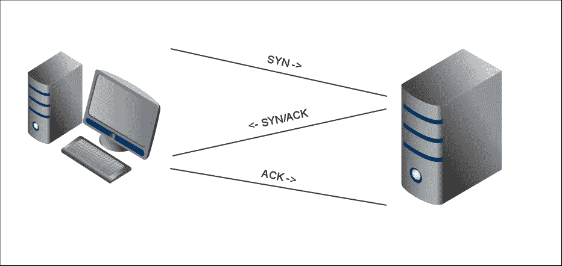
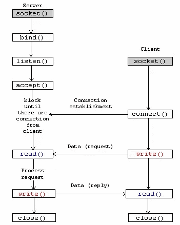
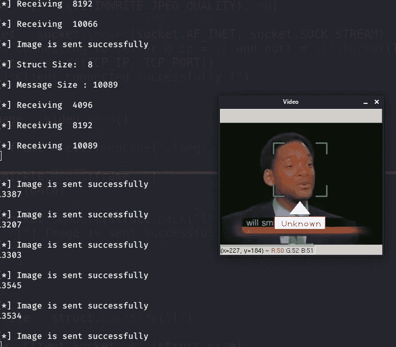

# Python 中的人脸识别、套接字编程和多线程

> 原文：<https://levelup.gitconnected.com/face-recognition-socket-programming-and-multithreading-in-python-6f9717fa2864>

## ⏳在下面的材料中，我们将说明网络套接字(特别是 TCP)的机制，并在此基础上构建一个具有多线程服务器的人脸识别应用程序。


在 [Unsplash](https://unsplash.com?utm_source=medium&utm_medium=referral) 上由 [Neven Krcmarek](https://unsplash.com/@nevenkrcmarek?utm_source=medium&utm_medium=referral) 拍摄的照片

# 👉套接字通信

[**套接字**](https://en.wikipedia.org/wiki/Network_socket) 是进程间的一种通信方式。它与其他进程的主要区别在于，它可以实现两个或多个不同主机、机器、节点……(不同 IP 地址)之间的 [**进程间通信**](https://en.wikipedia.org/wiki/Inter-process_communication) 。为了完成通信，套接字总是存在于我们的网络中，例如，我们每天上网、流式传输、发送和接收电子邮件等。

关于进程通信最重要的事情是每个进程必须被唯一地标识。例如，在 TCP/IP 网络协议中，进程由(IP 地址、协议(TCP 或 UDP)、端口号)三元组来标识。

# 👉TCP 协议

TCP 是面向连接的 [**传输层**](https://en.wikipedia.org/wiki/Transport_layer) 协议。TCP Socket 基于一种[](https://en.wikipedia.org/wiki/Client%E2%80%93server_model)****的客户-服务器模型(或者更一般地说是**生产者-消费者模型**)。服务器处理客户端的连接请求，并在连接建立后传输数据(**三次握手):******

********

****Wireshark 捕获的图像:id = 443 和 id =47976 的两个进程之间的 3 次握手****

********

****服务器和客户端之间的 3 次握手****

# ****👉python 中的套接字****

****为了使用套接字，我们需要导入相应的内置模块。****

```
**import socket**
```

****现在您需要创建 socket 对象的一个实例:****

```
**server_socket = socket.socket(socket.AF_INET, socket.SOCK_STREAM)**
```

****可调用函数套接字接受两个参数作为输入:****

> ******地址族**:三个主要值之一:****

```
**+-------------------+--------------------+
| **Address family**  |   ** Explanation **    |
+-------------------+--------------------+
|  socket.AF_INET   |    IPv4 socket     | 
|  socket.AF_INET6  |    IPv6 socket     |
|  socket.AF_UNIX   |  IPC(local socket) | 
+-------------------+--------------------+
IPC : Inter-Process Communication**
```

> ******插座类型:**四个值之一:****

```
**+---------------------+--------------------+
| **Socket type**    |   ** Explanation **    |
+---------------------+--------------------+
|  socket.SOCK_STREAM |    TCP  socket     | 
|  socket.SOCK_DGRAM  |    UDP  socket     |
|socket.SOCK_SEQPACKET|  sequenced packet  | 
|  socket.SOCK_RAW    |   raw protocols    |
+---------------------+--------------------+**
```

****该函数返回一个表示套接字 id 的整数，否则返回-1，表示发生了错误。****

****通信是通过这种套接字类型和地址族的组合来建立的。****

****例如，**插座。AF_INET** 和**插座。SOCK_STREAM** 启用 **IPv4** 地址和 **TCP** 通信。****

****现在我们在**套接字** **变量**中有了一个**套接字**，我们可以用它来做进一步的工作。****

# ****👉TCP 套接字服务器****

****TCP 协议背后的主要思想是一个程序与另一个程序建立连接，它们交换数据，没有丢失。完成后，应该关闭连接。****

********

****会议闭幕****

****在 TCP 中，数据以字节为单位进行交换。程序应该把它分成单独的消息。****

****为了创建服务器，您需要将一个套接字与计算机上的一个或所有主机(IP 地址)和一些空闲端口号([已分配端口列表](https://www.webopedia.com/quick_ref/portnumbers.asp#:~:text=Port%20numbers%20range%20from%200,process%20as%20its%20contact%20port.))相关联。Ip 地址“0.0.0.0”表示*本地机器上的所有 IPv4 地址*。如果指定“127.0.0.1”或“localhost”(环回地址)，则只能从同一台计算机连接。****

****现在你需要将 IP 地址绑定到套接字上。这个方法采用 2 元组作为参数:IP 地址或主机名，以及端口号。这就是传统上所说的[](https://linux.die.net/man/2/bind)****

```
****HOST = "localhost"
PORT = 5555 
server_socket.bind((HOST, PORT))****
```

******此时，我们需要在调用 **accept** 方法之前指出连接队列中可用的最大连接数。这可以通过使用**监听**功能来完成:******

```
**server_socket.listen(5) # 5 connections can only be available in the queue**
```

****在**成功**时，它将返回**零**。否则，返回 **-1** 。****

****现在使用 accept 函数接受连接。这个函数阻塞服务器，直到出现一个传入的连接，并返回与之相关联的套接字对象和所连接主机的地址。**地址**是由 **IP 地址**和**端口号**组成的数组。****

```
**client_socket, addr = server_socket.accept()# addr is an array
print('\n[*] Connected from ip: {} and port : {} '.format(addr[0],addr[1]))**
```

****使用 client_socket 对象，我们的服务器可以与客户机交换数据。****

> ******addr [0]** :连接客户端的 IP 地址。****
> 
> ******addr[1]** :套接字的端口号，可以在其中与连接的客户端交换数据。(服务器端端口)****

****要建立与新客户机的新连接，您需要调用 accept 函数。所以我们需要一个循环来接受无限数量的连接。****

```
**while True:
  print('\n[*] Waiting for client...')
  # Wait to accept a connection - blocking call
  client_socket, addr = server_socket.accept()**
```

****在这一点上，我们的服务器看起来很棒。****

****现在要从客户端读取传入的数据，您需要使用 **recv()** 方法。****

```
**Bytes_Number = 8 * 1024 # Number of bytes to receive, 8 kilo-bytes
# 1 byte is equivalent to 8 bits
data = client_socket.recv(Bytes_Number)** 
```

****换句话说，“字节数”是网络缓冲区的大小。****

****从套接字接收的数据类型是字节，如下所示:****

```
**data = b’\xed0\x00\x00\x00\x00\x00\x00'# byte array of hex values
data = data.hex()# convert to **hexadecimal** values.**
```

****现在数据的值变成了十六进制表示的“d02900000000000”。注意，这个表示是以**大端**格式。所以为了找到这个数的十进制值，你需要以这样的方式交换字节，最高有效位变成最低有效位。****

```
**data = 00000000000029d0 # equivalent to 10704 in decimal**
```

****在这个项目中，这个数字表示客户端发送的图像的大小。请继续阅读，了解更多关于这个数字的信息。****

****使用 **send()** 函数，可以向 socket 发送数据。它也接受字节，所以要发送一个字符串，你必须对它进行编码。****

```
**str = "Hi"
client_socket.send (b "Hello From Server" ) 
client_socket.send (b "Your data:"  + str.encode ( "utf-8" ))**
```

****如您所见，在这两个函数 **send** 和 **recv 的帮助下，数据可以在整个 TCP 连接中进行交换。******

****您还可以使用 **sendall()** 方法来发送您作为参数传递的整个缓冲区。事实上，您可以使用 **send()** 方法重新实现这个方法，如下所示:****

```
**def sendall(socket, data):
    ret = socket.send(data) # return the nb of bytes sent
    while ret > 0:
        ret = socket.send(data[ret:])
    return None**
```

# ****👉TCP 套接字客户端****

****在客户端，创建套接字的方式与在服务器端完全相同:****

```
**client_socket = socket.socket(socket.AF_INET, socket.SOCK_STREAM)**
```

****现在，区别存在于客户端，我们需要连接到服务器已经打开的套接字，而不是监听套接字。为此，我们使用**连接**方法:****

```
**HOST = 'localhost' 
TCP_PORT = 5555 # the port number that is opened by the server
Client_Socket.connect((HOST, TCP_PORT))**
```

****在服务器端， **accept** 方法将打开与之前连接的客户端的连接。****

```
**client_socket, addr = server_socket.accept() #server side connection**
```

********

****客户端-服务器工作流****

****然后一切如常。****

****现在回到我们的主要目标，我们需要创建一个能够发送图像和接收可识别图像的客户端。根据我的经验，要做到这一点，有两种发送图像的方法。****

******1-将图像作为二进制文件加载，并以字节块的形式发送，如下所示:******

******程序的工作流程:******

```
**CLIENT                                             SERVER
                   Send chunks of Image
load image   ---------------------------------->  Read Bytes
                        Send b'0' 
as binary    ---------------------------------->  End of Image
                  Send the received image
Read Bytes   <----------------------------------  Read and Save
                        Send b'0'
End of Image <----------------------------------

Read + Save  ---------------------------------->  Closing the socket
                   Client Closes Socket**
```

******server.py******

******client.py******

****运行服务器将生成以下输出:****

```
 **(base) harmouch@kali:~/Desktop$ python3 server.py[*] Socket successfully created[*] Socket is now listening[*] Connected from ip: 127.0.0.1 and port : 51126 
Image received and recreated
Sending image data...
Length Data sent:4096
Length Data sent:4096
Length Data sent:2270
Length Data sent:0----------------Connection Closed-------------------**
```

****现在，运行客户端将提示以下内容:****

```
**(base) harmouch@kali:~/Desktop$ python3 client.py[*] Socket successfully created[*] Connecting to server @ ip = localhost and port = 3333[*] Sending image as bytes...
1
4096
4096
2269[*] Finish sending the image...----------------------------------------------------------------Receving data-------------------------------------------------------------------[*] Length of Data received: 4096[*] Length of Data received: 4096[*] Length of Data received: 2270[*] Length of Data received: 1**
```

******2-第二种方法:******

****将图像作为三维数组(RGB)读取，并使用 cv2.imencode 将其编码为某种格式(jpeg、jpg、png…)。****

```
**image = cv2.imread("img.jpg")
encode_param = [int(cv2.IMWRITE_JPEG_QUALITY), 90]
result, frame = cv2.imencode('.jpeg', image, encode_param)**
```

****在本例中， **cv2.imencode()** 函数将用 jpeg 压缩将图像格式转换成字节，并将其分配给某个内存缓存。****

****现在，我们需要发送压缩图像的大小及其字节表示，以让网络的另一端(服务器)知道他需要接收多少字节。这可以通过使用 **struct.pack** 函数来完成:****

```
**Client_Socket.sendall(struct.pack("l",size) + data)**
```

******struct.pack r** 返回一个包含值 **size** 的 bytes 对象，用 **long** 格式打包，发送图像的所有字节及其大小。****

****此时，服务器可以检索套接字缓冲区中存在的字节，如下所示:****

```
**CHUNK_SIZE = 4 * 1024 # 4 kB
encode_param = [int(cv2.IMWRITE_JPEG_QUALITY), 90]
# struct_size is 8 bytes
struct_size = struct.calcsize("l")
img_size= client_socket.recv(struct_size) # reads 8 bytes to store #the size of the image 
# struct.unpack retrun a tuple 
img_size = struct.unpack("l", img_size)[0] # 8 bytes
# read 4 kB from the buffer each time untill img_size
while len(data) < img_size:
  data += client_socket.recv(CHUNK_SIZE)
  print("\n[*] Receiving ",len(data))
frame_data = data[:img_size]
data = data[img_size:]
frame=pickle.loads(frame_data)
frame = cv2.imdecode(frame, cv2.IMREAD_COLOR)**
```

******代码******

******Server.py******

******Client.py******

******程序的工作流程:******

```
**CLIENT                                             SERVER

Read frame     Encode,Send The Image with size
of the video ---------------------------------->  Read Bytes,decode         

Read Bytes                                        predict the label
              Encode,Send The Recognized Image 
End of Image <----------------------------------** 
```

****程序的输出看起来会像这样:****

********

****我们的服务器只能处理一个客户端，所以要处理下一个客户端，它应该等到上一个客户端服务完成之后。我们能改进它吗？？****

****答案是肯定的，通过利用物理资源(CPU 线程)。****

> ****该识别算法先前在本文 **的 [**中讨论过。**](https://medium.com/dev-genius/face-recognition-based-on-lbph-algorithm-17acd65ca5f7)******

# **👉**多线程****

**多线程是一个低级编程概念，所有高级编程语言都支持它。**

****

## **什么是线程？**

**处理器有一个或多个内核，每个内核有一个或多个线程。线程是具有独立指令集的最小执行单元。它是进程的一部分，运行在与内存相同的上下文共享程序的可执行资源上。**

## ****多线程**的优点:**

**1-它提高了多核系统的计算速度**

**2-所有进程线程可以共享全局变量。因此，如果一个全局变量在一个线程中发生变化，它会影响其他线程。**

**3-它允许程序在单独处理一个或多个线程时保持响应。**

## ****多线程**的缺点:**

**1-在单处理器中，系统性能可能会下降。**

**2-增加内存和处理器的使用。**

**3-增加了程序的复杂性。**

**在 python 中，有两个允许多线程的模块:**

*   *****螺纹*****
*   *****穿线*****

**要创建一个线程，可以使用下面这段代码:**

```
t = threading.Thread(target=function, args=(arg1,arg2 ...))
t.start()
```

**因此将创建一个线程来处理目标**函数**以及该函数的**参数** arg1，arg2…参数。**

**现在，您可以运行多个客户端进行人脸识别:**

****

**现在你可能会问:我们可以运行多少个线程？**

**答案取决于您的 CPU 能力:处理器有多少个内核或线程，就有多少个线程可以同时运行。**

# **👉结论**

**我希望这个基本的 Python 网络/多线程帖子非常有趣和直观。此外，我在本文中添加了几个插图，这些插图无疑会帮助您提高 Python 技能。**

**你可以随时在 GitHub 上查看我的项目代码。请随意叉我的回购，并为这个项目作出贡献，以便改善它，如果你想。**

**[](https://github.com/Harmouch101/Face-Recogntion-Detection) [## harmouch 101/人脸识别检测

### 这个项目实现了一个人脸检测算法，使用皮肤分割 RGB-YCrCb-HSV，viola jones 和人脸…

github.com](https://github.com/Harmouch101/Face-Recogntion-Detection) 

> 寓意:“一个代码可以建立一个完整的世界，另一个可以摧毁一个，而你就是那个决定的人……”**