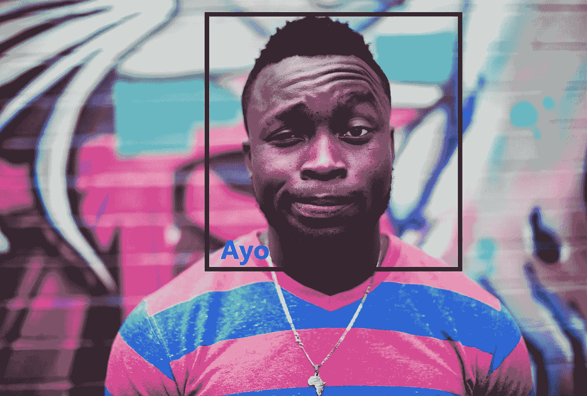
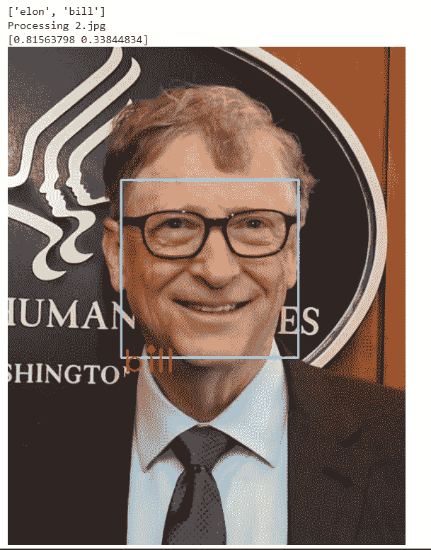

# 使用 Google Colab 的人脸识别系统

> 原文：<https://levelup.gitconnected.com/face-recognition-system-using-google-colab-ccca1d56f5f3>

在人脸识别库的帮助下，只需不到 35 行代码



照片由 [Ayo Ogunseinde](https://unsplash.com/@armedshutter?utm_source=medium&utm_medium=referral) 在 [Unsplash](https://unsplash.com?utm_source=medium&utm_medium=referral) 上拍摄

在这篇博客中，我们将看看一个非常简单的方法，开始使用 python 和 open cv 进行人脸识别。

## 打开简历

Open cv 是计算机视觉中最流行的库。它最初是用 C 和 C++编写的，现在也可以用 python 编写了。它最初是由英特尔开发的。该库是一个跨平台的开源库。它是免费使用的。Open cv 库是一个高度优化的库，主要关注实时应用。Open cv 也用于创建人脸识别系统。

该库拥有超过 2500 种优化算法。其可用于检测和识别面部、识别物体、使用视频对人类动作进行分类、跟踪相机运动、跟踪运动物体、提取物体的 3D 模型、将图像拼接在一起以产生整个场景的高分辨率图像、从图像数据库中找到相似的图像、从使用闪光灯拍摄的图像中去除红眼、跟随眼睛运动等

它有大约 47，000 人的用户社区，估计下载次数超过 1，800 万次。许多大公司像谷歌、亚马逊、特斯拉、微软、本田等。使用 Open cv 使他们的产品更好，更受人工智能驱动。

## 人脸识别

人脸识别是一种识别照片中人的名字的技术。它包括两个步骤。第一步是检测人脸，第二步是识别人脸。

人脸识别是由[亚当·盖特基](https://github.com/ageitgey)开发的 python 库。这个库为我们提供了一个最简单的方法来检测和识别人脸。人脸识别库为它检测到的每张人脸生成总共 128 个数字指纹。随后，这些指纹被编码成一些矢量编码，这些矢量编码可用于随后对指纹进行解码，并将它们进行比较，以获取该人的标签(姓名)。

你可以在 Adam 的解释媒介 [post](https://medium.com/@ageitgey/machine-learning-is-fun-part-4-modern-face-recognition-with-deep-learning-c3cffc121d78) 中阅读更多关于库和深层概念的内容。

让我们从为我们自己创建一个人脸识别开始。在这篇博客中，我们主要关注从图像中识别人脸。我们将使用[google collab](https://colab.research.google.com/)，因此如果您没有 Google collab 帐户，请创建一个。

首先，我们需要一些已知的图像和一些未知的图像，通过它们我们可以检测和识别人脸。

从本地计算机中选择您自己的图像并上传到 colab，或者简单地去 Google 复制任何 3-4 个已知人的图像的链接，然后再下载 3-4 个图像来测试相同的人。

在 google colab 中创建一个新的代码外壳，并将下面的代码复制到代码外壳中，创建两个目录，一个是已知的，另一个是未知的。请记住，我们需要将已知的人物图像重命名为他们的名字。

```
!mkdir known!wget https://upload.wikimedia.org/wikipedia/commons/e/ed/Elon_Musk_Royal_Society.jpg -O **known/elon.jpg**!wget https://pbs.twimg.com/profile_images/988775660163252226/XpgonN0X_400x400.jpg -O **known/bill.jpg**!wget https://pmcvariety.files.wordpress.com/2017/05/mark-zuckerberg.jpg?w=681&h=383&crop=1 -O **known/mark.jpg**
```

现在让我们为未知创建一个目录，这里我们不需要重命名任何东西，因为我们要在这些图像上测试我们的代码。

```
!mkdir unknown!wget https://cdn.vox-cdn.com/thumbor/4QtOwnOxCdwESvt1-CpQSTZvHHA=/1400x1400/filters:format(jpeg)/cdn.vox-cdn.com/uploads/chorus_asset/file/19932738/1206292068.jpg -O **unknown/1.jpg**!wget  https://upload.wikimedia.org/wikipedia/commons/a/a0/Bill_Gates_2018.jpg -O **unknown/2.jpg**!wget https://api.time.com/wp-content/uploads/2019/04/mark-zuckerberg-time-100-2019.jpg?quality=85&zoom=2 -O **unknown/3.jpg**
```

下一步是在笔记本中安装库。使用 pip，我们可以在笔记本环境中轻松安装库。

```
!pip install face_recognition
```

导入所有必需的库

```
import face_recognition   **##Detecting and recogniting faces**import cv2     **## intracting with images**import os       **## For Reading the file name**from google.colab.patches import cv2_imshow **##** **we are importing cv2_imshow from google.colab.patches because google colab doesn't support cv2.imshow() funciton.**
```

现在，我们将创建一个可用于读取和整形图像的函数。它只接受文件路径作为输入。

```
def read_img(path):
   img = cv2.imread(path) **## reading image**
   (h,w) = img.shape[:2]  **## fetching height and width**
   width = 500            **## hard coding width**
   ratio = width / float(w) **## preparing a ration for height**
   height = int(h * ratio)  **## generating new height**
   return cv2.resize(img,(width,height)) **##return the reshaped image**
```

Face_recognition 库通过为每个已知人脸和未知人脸生成不同的编码来识别人脸，然后比较这两种编码，无论哪种编码匹配，它都会将标签名称显示为输出。

为已知面孔准备编码

```
known_encodings = [] 
known_names = []
known_dir = 'known' **##Known directory path**
for file in os.listdir(known_dir):
  img = read_img(known_dir + '/' + file) **##Reading all the images**
  img_enc = face_recognition.face_encodings(img)[0] **##face encodings** known_encodings.append(img_enc) 
  known_names.append(file.split('.')[0])print(known_names) **## Printing all the known labels**
```

下一步也是最后一步是为未知人脸准备编码，将它们与已知编码进行比较，并用已知名称在未知人脸上画一个矩形。

```
unknown_dir = 'unknown' **##UNknown Images Directory**for file in os.listdir(unknown_dir): print("Processing",file) img = read_img(unknown_dir + '/' + file)**##reading images** img_enc = face_recognition.face_encodings(img)[0]**##Encodings** results = face_recognition.compare_faces(known_encodings,img_enc)
 **##Comparing Known Encodings with Unknown encoding**
 print(face_recognition.face_distance(known_encodings,img_enc))
 **## Printing Face Distances** res = [i for i, val in enumerate(results) if val] name = known_names[res[0]]

 '''
**Drawing a rectangle box around the faces of unknown images using  face_locations function in library
'''** (top,right,bottom,left) = face_recognition.face_locations(img)[0] cv2.rectangle(img,(left,top),(right,bottom),(255,255,100),2)
 **##Drawing Rectangle** cv2.putText(img,name,(left+2,bottom+20),cv2.FONT_HERSHEY_PLAIN,3, (100,0,255),2) **##Putting labels(names) on the rectangle** cv2_imshow(img) **##showing images**
```



"按作者输出图像"

**感谢阅读😀**

> 如果你有错误或相关的问题，请在评论区提问。

## 完整代码

# 关于作者

我是 Abhay Parashar，一个迷上 AI 的 python 爱好者。我是一名计算机专业的学生。一个狂热的作家和程序员。我发布关于 python，机器学习，NLP，以及更多与 AI 相关的文章。我也张贴不同种类的关于机器学习的端到端项目。

我的人生格言很简单:学习、分享和成长。你可以在 [LinkedIn](https://www.linkedin.com/in/abhay-parashar-328488185/) 上和我联系，你也可以关注我的刊物 [**代码系列**](https://medium.com/code-series) ，在那里我发布了一系列关于学习编程及其用例的文章。

## **未来阅读**

[](https://medium.com/@ageitgey/machine-learning-is-fun-part-4-modern-face-recognition-with-deep-learning-c3cffc121d78) [## 机器学习很好玩！第 4 部分:具有深度学习的现代人脸识别

### 更新:本文是系列文章的一部分。查看完整系列:第 1 部分、第 2 部分、第 3 部分、第 4 部分、第 5 部分、第 6 部分…

medium.com](https://medium.com/@ageitgey/machine-learning-is-fun-part-4-modern-face-recognition-with-deep-learning-c3cffc121d78) [](https://github.com/ageitgey/face_recognition) [## 年龄/面部识别

### You can also read a translated version of this file in Chinese 简体中文版 or in Korean 한국어 or in Japanese 日本語. Recognize and…

github.com](https://github.com/ageitgey/face_recognition)