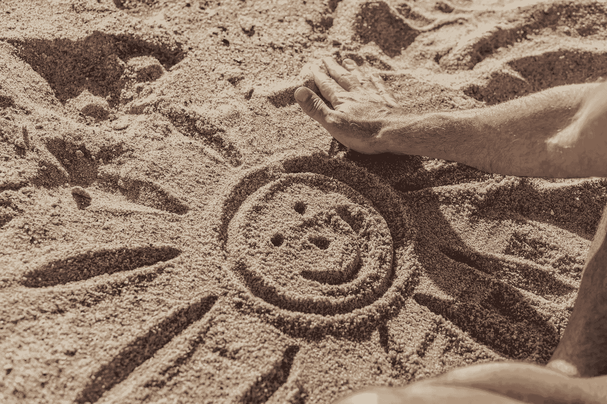
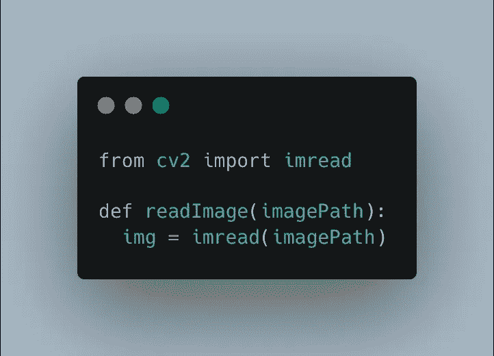
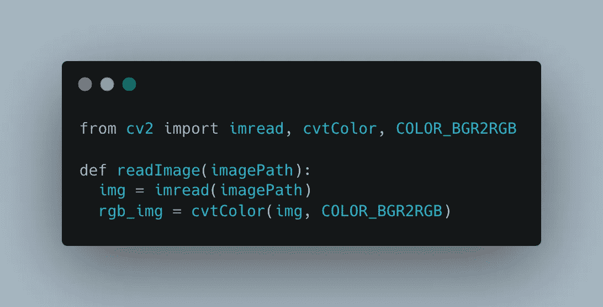
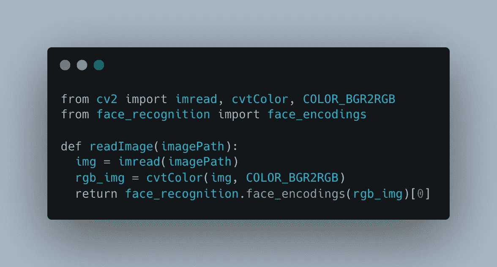
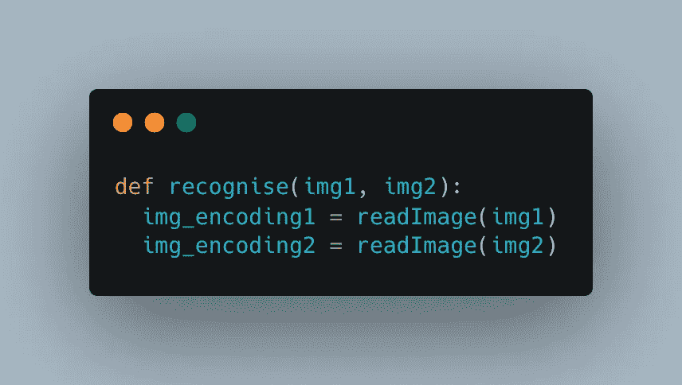
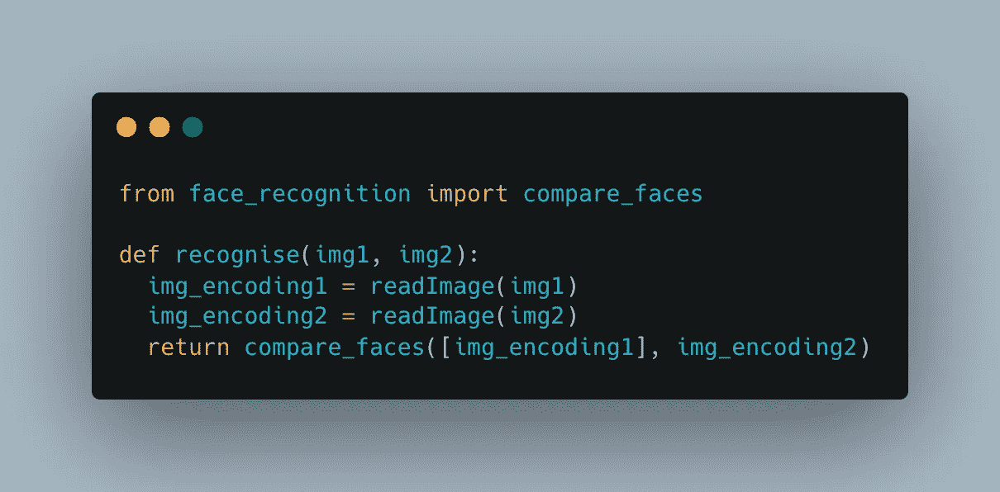
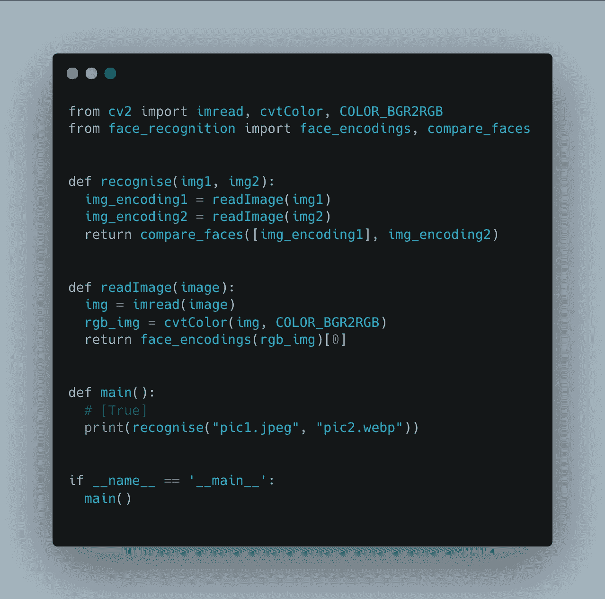

# 基于 OpenCV 的人脸识别

> 原文：<https://levelup.gitconnected.com/face-recognition-with-opencv-e93350876c84>

## 比较两张图像，确定两张图像上的人是否是同一个人



金德尔传媒摄影:[https://www . pexels . com/photo/person-drawing-smiling-sun-on-sand-7938450/](https://www.pexels.com/photo/person-drawing-smiling-sun-on-sand-7938450/)

在之前的一篇文章中，我写了如何在 Mac 电脑上设置 OpenCV。

[](https://remy-villulles.medium.com/setup-opencv-for-python-on-mac-aeb898c28adf) [## 在 Mac 上为 Python 设置 OpenCV

### 一种对 M1 和英特尔都有效的特殊方法！

remy-villulles.medium.com](https://remy-villulles.medium.com/setup-opencv-for-python-on-mac-aeb898c28adf) 

今天我们就来看看 OpenCV 的用法之一:**图像上的人脸识别**。

## 安装附加依赖项

由于这篇文章部分基于我的上一篇文章。我假设你已经安装了 **miniforge 和**兼容的 python 版本** (3.8 或 3.9 也可以)**

现在，让我们打开一个终端并**激活**我们的环境:

```
conda activate cv
```

一旦完成，我们将安装我们需要的**两个依赖项**:

```
conda install -c conda-forge opencv-python face_recognition
```

就是这样！我们拥有完成这篇文章所需的所有工具。让我们开始编码吧！

## 从图像中提取数据

对于这篇文章，我们需要**三张图片**。**同一个人的两张**(但图像不同)第三张**来自别人**。我选择用《奇异博士》作为我的两张图，托尼·斯塔克作为第三张！

首先，我们需要用 OpenCV 打开并分析图像。我们将导入它并调用`**imdread**`函数，将执行脚本的**相对路径**作为参数:



很好，现在我们需要“简化”图像，使人脸识别脚本更容易识别这个人的脸。



最后，一旦图像被简化，我们希望通过使用我们的`**face_recognition**`库对面部进行编码，以**检测面部**并将其转换为**数据**。



> 因为我们在这里只使用了**一张人脸**，我们只是得到了由`**face_encodings**`返回的编码数组的**第一个元素，然而在我们想要识别多张人脸的情况下，你可能想要做不同的事情**

## 比较这两幅图像

现在我们的`**readImage**`函数已经完成，我们将处理第二个函数，该函数将**使用由`**readImage**`和**返回的来自两幅图像**的数据，将它们匹配在一起**。

让我们创建一个名为`recognise`的函数，并在其中运行以下代码:



现在，我们将匹配这些数据



所以，`compare_faces`需要两个参数:

*   编码的**数组**
*   一个**单个**编码

这意味着我们总是**将 X 个编码**与**匹配，只有一个**。

现在让我们一起来看看代码



开始了。如果您运行这段代码，您将能够在控制台中看到**【真】**或**【假】**

> 当我们比较 **X 编码和**X 编码时，我们得到了一个**布尔值**数组。

而这就是你如何不费吹灰之力就能做到简单的人脸识别！

我希望这篇文章对你有用！留下一个掌声或跟随，如果它这样做，这将是非常有益的！

感谢您的阅读！