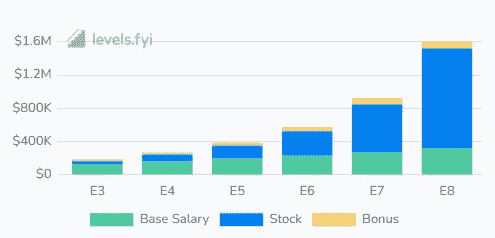

# 脸书软件工程师面试手册(2023)

> 原文：<https://levelup.gitconnected.com/facebook-software-engineer-interview-handbook-2022-7d8deafc5674>

了解一下 2023 年在脸书面试软件工程师是什么感觉。

在这本全面的手册中，你会发现在脸书面试过程中到底会发生什么。您还可以找到如何回答一些最常见的脸书问题的详细信息。

让我们让你的面试更上一层楼吧！

# 美国脸书薪酬结构

以下是美国脸书软件工程师的平均工资:

*   SDE (E3): 186K
*   SDE (E4): 267K
*   老 SDE(E5):38.5 万

脸书薪金(参考:levels.fyi)

# 脸书面试流程

以下是在脸书面试软件工程师时会遇到的情况:

## **◈招聘人员预演**(20-30 分钟)

基于简历的初步筛选。与你的职业经历、值得关注的项目和成就相关的问题。没有编码。

## **◈技术电话采访**(45-60 分钟)

您将使用在线编辑器解决一个编码问题。你的面试官可能会问你一个后续的问题，或者给当前的问题增加限制。常见主题包括数据结构、算法和时间/空间复杂性。

## **◈现场循环**(4-5 次访谈)

编码、设计和行为问题。

*   **忍者**(编码，2 次采访):45 分钟内在白板上解决 1-2 个编码问题。
*   **盗版**(设计，2 次面试):与面试官协作讨论。在白板上绘图来解决系统设计问题。初级工程师没有任何设计面试。
*   **绝地**(行为):关于你的动机、人际交往、挑战和职业道德的问题。

## **◈午餐**

这不是采访。面试官会带你四处看看，并与你共进午餐。

# 面试技巧

1.  **数据结构** —练习数据结构，如堆、散列表、树、链表、栈、队列和图。
2.  **算法** —练习递归、合并排序、快速排序、广度优先搜索、深度优先搜索、分治和动态编程
3.  **解释你的思维过程**——极其重要。练习清晰简明地描述您的解决方案和设计决策。
4.  合作——不要忘记讨论，提出多种解决方案，并从面试官那里得到暗示。

# 脸书顶级编码模式

1.  [两堆](https://designgurus.org/path-player?courseid=grokking-the-coding-interview&unit=grokking-the-coding-interview_1628743988970_61Unit)
2.  [推拉窗](https://designgurus.org/path-player?courseid=grokking-the-coding-interview&unit=grokking-the-coding-interview_1627871350324_0Unit)
3.  [合并间隔](https://designgurus.org/path-player?courseid=grokking-the-coding-interview&unit=grokking-the-coding-interview_1628743615987_20Unit)
4.  [树宽优先搜索](https://designgurus.org/path-player?courseid=grokking-the-coding-interview&unit=grokking-the-coding-interview_1628743615987_20Unit)
5.  [K 路合并](https://designgurus.org/path-player?courseid=grokking-the-coding-interview&unit=grokking-the-coding-interview_1628744404940_107Unit)

# LeetCode 上最近脸书标记的编码问题

以下是最常见的编码问题:

## 1.二叉树的右视图(简单)

[钻研编码面试](https://designgurus.org/path-player?courseid=grokking-the-coding-interview&unit=grokking-the-coding-interview_1628743902403_52Unit)

**语句:**给定一棵二叉树，返回其右视图中包含节点的数组。二叉树的右视图是从右侧看树时可见的一组**节点。**

## 2.合并“K”个排序列表(中等)

[寻找编码面试](https://designgurus.org/path-player?courseid=grokking-the-coding-interview&unit=grokking-the-coding-interview_1628744411540_108Unit)

**语句:**给定一个 K 个排序的 LinkedLists 数组，将它们合并成一个排序的 list。

## 3.二叉查找树迭代器(中等)

[寻找编码面试](https://designgurus.org/path-player?courseid=grokking-the-coding-interview&unit=grokking-the-coding-interview_62ba9052bfabbUnit)

**语句:**为二叉查找树(BST)的有序遍历实现一个迭代器。也就是说，给定一个 BST，我们需要实现两个函数:

*   **bool haNext()** :如果在 BST 的有序遍历中至少留下一个元素，则返回 true。
*   **int next()** :返回 BST 的有序遍历中的下一个元素

## 4.路径数之和(中等)

[钻研编码面试](https://designgurus.org/path-player?courseid=grokking-the-coding-interview&unit=grokking-the-coding-interview_1628743939828_56Unit)

**语句:**给定一棵二叉树，其中每个节点只能有一个数字(0–9)值，每条从根到叶的路径将代表一个数字。求所有路径代表的所有数字的总和。

## 5.合并间隔(中等)

[钻研编码面试](https://designgurus.org/path-player?courseid=grokking-the-coding-interview&unit=grokking-the-coding-interview_1628743622133_21Unit)

**语句:**给定一个区间列表，合并所有重叠的区间，产生一个只有互斥区间的列表。

## 6.二叉树的直径(简单)

[钻研编码面试](https://designgurus.org/path-player?courseid=grokking-the-coding-interview&unit=grokking-the-coding-interview_1628743963987_59Unit)

**语句:**给定一棵二叉树，求其直径的长度。树的直径是任意两个叶节点之间最长路径上的节点数。一棵树的直径可以穿过也可以不穿过树根。

## 7.滑动窗中间(硬)

[钻研编码面试](https://designgurus.org/path-player?courseid=grokking-the-coding-interview&unit=grokking-the-coding-interview_1628744001784_63Unit)

**语句:**给定一个数字数组和一个数字“k”，求该数组所有“k”大小的子数组(或窗口)的中值。

## 8.**排序矩阵中第 k 个最小的数(硬)**

[寻找编码面试](https://designgurus.org/path-player?courseid=grokking-the-coding-interview&unit=grokking-the-coding-interview_1628744424045_110Unit)

**语句:**给定一个*N*∫*N*矩阵，其中每行和每列都按升序排序，求矩阵中第 k 个最小元素。

## 9.**相等子集和划分(中等)**

[钻研编码面试](https://designgurus.org/path-player?courseid=grokking-the-coding-interview&unit=grokking-the-coding-interview_1628743622133_21Unit)

**语句:**给定一组正数，求是否可以把它分成两个子集，使得两个子集的元素之和相等。

## 10.外星人词典(硬)

[钻研编码面试](https://designgurus.org/path-player?courseid=grokking-the-coding-interview&unit=grokking-the-coding-interview_1628744560693_125Unit)

**陈述:**有一本词典收录了来自外星语言的单词，我们不知道这些单词的字母顺序。写一个方法找出外语中字母的正确顺序。假设输入是一个有效的字典，并且其字母之间存在排序。

# 前 FB 系统设计问题

以下是最常见的系统设计问题:

1.  [设计脸书新闻提要](https://designgurus.org/path-player?courseid=grokking-the-system-design-interview&unit=grokking-the-system-design-interview_1626970300115_9Unit)
2.  [设计 Facebook Messenger](https://designgurus.org/path-player?courseid=grokking-the-system-design-interview&unit=grokking-the-system-design-interview_1626970153011_2Unit)
3.  [设计 Instagram](https://designgurus.org/path-player?courseid=grokking-the-system-design-interview&unit=grokking-the-system-design-interview_1626970106319_0Unit)
4.  [设计脸书状态搜索](https://designgurus.org/path-player?courseid=grokking-the-system-design-interview&unit=grokking-the-system-design-interview_1626970258715_7Unit)
5.  [设计附近的朋友](https://designgurus.org/path-player?courseid=grokking-the-system-design-interview&unit=grokking-the-system-design-interview_1626970328123_10Unit)

# 最常见的 FB 行为面试问题

以下是你必须准备好答案/故事的 7 大行为问题:

1.  说说你做过的让你骄傲的事。
2.  告诉我一个你最近参与的/有趣的项目。
3.  当你不是经理时，你是如何展示领导力的？
4.  你最喜欢的脸书产品是什么，你会如何改进它？
5.  你喜欢如何给予和接受反馈？
6.  告诉我一次你在一项出乎意料的任务中担任领导的经历。
7.  你有过哪些出色的合作？

面试愉快🚀

# 参考

*   [钻研编码面试](https://designgurus.org/course/grokking-the-coding-interview)
*   [进行系统设计面试](https://designgurus.org/course/grokking-the-system-design-interview)
*   [探寻面向对象设计面试](https://designgurus.org/course/grokking-the-object-oriented-design-interview)
*   [脸书面试](https://www.metacareers.com/life/preparing-for-your-software-engineering-interview-at-facebook/)

 [## 不要只是 LeetCode 请遵循编码模式

### 面试前不喜欢练 100 个编码题怎么办？

levelup.gitconnected.com](/dont-just-leetcode-follow-the-coding-patterns-instead-4beb6a197fdb)  [## 系统设计面试生存指南(2023):准备策略和实用技巧

### 2023 年系统设计面试剧本。

levelup.gitconnected.com](/system-design-interview-survival-guide-2023-preparation-strategies-and-practical-tips-ba9314e6b9e3)  [## 搜索 LeetCode:准备编码面试的更聪明的方法

### 要 LeetCode 还是不要 LeetCode？如果你不想在下次编码前练习 100 道编码题怎么办…

medium.com](https://medium.com/interviewnoodle/grokking-leetcode-a-smarter-way-to-prepare-for-coding-interviews-e86d5c9fe4e1)