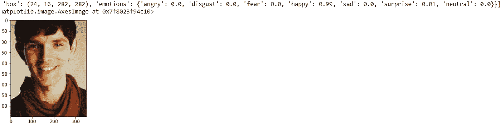
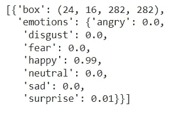
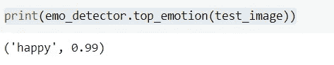
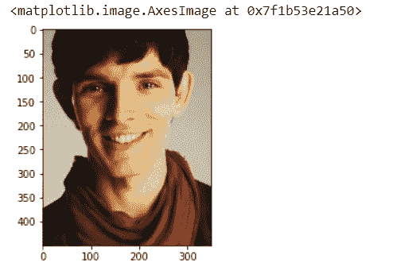
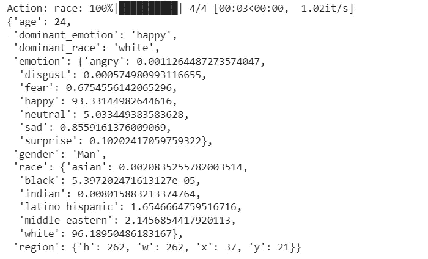
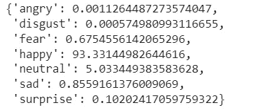

# 面部情感识别

> 原文：<https://levelup.gitconnected.com/facial-emotion-recognition-7e2706ad7843>

## 检测人脸面部情绪的两种不同方法


作者 GIF

> 面部情绪可以作为一种非语言的交流方式引入。人们通过语言来表达他们的感受和表情，但是面部表情可以用来加强交流。面部情感识别是近来的一个时髦话题。基本上可以识别的面部情绪有**快乐、悲伤、愤怒、中性、恐惧、厌恶、惊讶**，加在一起共有 7 种。
> 
> 人脸情感识别可以实时实现，也可以使用静态图像实现。本文通过两种主要方法为您提供了使用静态图像来检测面部情绪的方法。我用 Google Colab 练习了以下代码。

## [1。FER 图书馆](https://pypi.org/project/fer/)

这是一个基于深度神经网络构建的 Python 库，使用了 *Tensorflow、Keras 库*，使用的数据集来自 *Kaggle 的表征学习竞赛挑战:面部表情识别挑战*。FER 要求依赖关系为 ***Python > 3.6，OpenCV > =3.2*** ，以及***tensor flow>= 1 . 7 . 0****。*如果您没有安装 OpenCV 和 Tensorflow，请使用下面的命令。

```
**pip install opencv-contrib-python
pip install tensorflow**
```

然后安装 FER 库，

```
**pip install fer**
```

尝试遵循代码片断。

```
**from fer import FER
import matplotlib.pyplot as plt
%matplotlib inline****test_image = plt.imread("/content/Merlin_1.jpg")**# Faces by default are detected using OpenCV's Haar Cascade classifier. To use the more accurate MTCNN network, add the parameter
**emo_detector = FER(mtcnn=True)**# Capture all the emotions on the image
**captured_emotions = emo_detector.detect_emotions(test_image)**# Print all captured emotions with the image
**print(captured_emotions)
plt.imshow(test_image)**
```

你会得到如下结果。



作者图片

此外，您可以使用下面的代码来获取图像中提取的情感，

```
**captured_emotions**
```



作者捕捉的情感图片

然后使用下面的代码片断从你的图像中提取出大部分情感

```
**print(emo_detector.top_emotion(test_image))**
```



作者图片-最高情感

## [2。DeepFace](https://pypi.org/project/deepface/)

它是一个用 Python 编写的轻量级面部识别和面部属性分析框架，它是由脸书的一个研究小组创建的一个深度学习面部识别系统。使用 DeepFace，我们可以分析*面部属性，如年龄、性别、情感和种族*。值得一提的是，使用 DeepFace 可以达到一个***97.35%***0.25%的准确率水平。下面重点讲一下如何在 Python 中处理 DeepFace。

```
**pip install deepface**
```

安装 deepface 后，使用以下代码加载图像并绘制图像。

```
**from deepface import DeepFace
import cv2
import matplotlib.pyplot as plt
img_path = 'Merlin_1.jpg'
img = cv2.imread(img_path)
plt.imshow(img[:, :,::-1])**
```



作者图片

然后使用以下命令，您可以找到图像的人口统计信息。

```
**demography = DeepFace.analyze(img_path)
demography**
```



按作者分类的图像-图像的人口统计信息

然后，我们可以使用下面的命令只提取情感数据。

```
**demography['emotion']**
```



按作者分类的图像-图像的情感数据

那么如果想提取图像最突出的情感，就用下面的代码。

```
**demography['dominant_emotion']**
```


作者主导情感的图像

完成了伙计们…😀

我们已经讨论了两种可以用来识别人脸面部情绪的方法。

希望你能收集一些关于使用 Python 中的 FER 和 DeepFace 识别面部情绪和表情的重要事实。

未来的文章将重点关注听力受损群体中面部情感识别的差异，以及如何训练数据集来收集实时面部情感识别。

感谢您的阅读，如果您喜欢这篇文章，请鼓掌。🙌