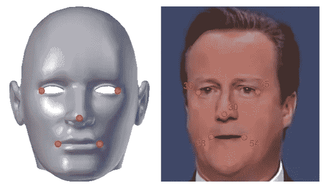
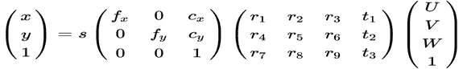
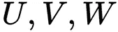
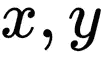

# OpenCV4 中的人脸标志检测

> 原文：<https://levelup.gitconnected.com/facial-landmark-detection-in-opencv4-616f9c1737a5>

*在这篇由 Roy Shilkrot 撰写的文章中了解 OpenCV4 中的面部标志检测，他是石溪大学计算机科学的助理教授，领导着人类交互小组。Shilkrot 博士的研究领域是计算机视觉、人机界面以及这两个领域的交叉，由美国联邦政府、纽约州和行业拨款资助。*

# 面部标志和姿势与面部模块

人脸标志检测是在人脸图像中寻找兴趣点的过程。它最近在计算机视觉领域发展迅速，因为它有许多引人注目的应用。例如，我们已经展示了通过面部姿态来检测情绪的能力，估计凝视方向，改变面部外观(**面部交换**)，用图形增加面部，以及操纵虚拟角色。

我们可以在今天的智能手机和 PC 网络摄像头程序中看到许多这样的应用。为了实现这一点，地标探测器必须找到面部的几十个点，如嘴角、眼角、下颚的轮廓等等。许多算法都是在 OpenCV 中开发和实现的。在本文中，我们将讨论使用`cv::face`模块检测面部标志(也称为**面部标志**)的过程，该模块提供了一个用于推理的 API，以及面部标志检测器的训练。我们将看到如何应用面部标志检测器来定位三维人脸的方向。

本文的代码文件可以从[https://github . com/packt publishing/Mastering-OpenCV-4-Third-Edition](https://github.com/PacktPublishing/Mastering-OpenCV-4-Third-Edition)下载。您将需要以下技术和安装来构建代码:

*   OpenCV v4(用`face contrib`模块编译)
*   升压版本 1.66+

要运行 facemark 检测器，需要一个预先训练好的模型。尽管使用 OpenCV 中提供的 API 来训练检测器模型是完全可能的，但还是提供了一些预先训练好的模型供下载。一个这样的模型可以从[https://raw . githubusercontent . com/kurnianggoro/gsoc 2017/master/data/lbf model . YAML](https://raw.githubusercontent.com/kurnianggoro/GSOC2017/master/data/lbfmodel.yaml)获得，由算法实现的贡献者提供给 OpenCV。

面部标志检测器可以处理任何图像。然而，我们可以使用面部照片和视频的指定数据集，用于测试 facemark 算法。这样一个数据集是 **300-VW** ，可以通过**智能行为理解小组** ( **iBUG** )，一个伦敦帝国理工学院的计算机视觉小组[https://ibug.doc.ic.ac.uk/resources/300-VW/](https://ibug.doc.ic.ac.uk/resources/300-VW/)获得。它包含了媒体中数百个面部出现的视频，并仔细标注了 68 个面部标志点。该数据集可用于训练 facemark 检测器，以及了解我们使用的预训练模型的性能水平。以下节选自 300-VW 视频中的一段，带有地面真相注释:


图像在知识共享许可下复制

# OpenCV 中的人脸标志检测

地标检测从**面部检测**开始，在图像中寻找面部及其范围(边界框)。面部检测长期以来一直被认为是一个已解决的问题，OpenCV 包含了第一批免费向公众提供的健壮的面部检测器之一。事实上，在早期，OpenCV 主要因其快速人脸检测功能而为人所知和使用，实现了规范的 Viola-Jones boosted 级联分类器算法(Viola et al. 2001，2004)，并提供了预训练模型。虽然人脸检测在早期已经有了很大的发展，但是在 OpenCV 中检测人脸的最快和最简单的方法仍然是通过`core`模块中提供的`cv::CascadeClassifier`类来使用捆绑的级联分类器。

我们实现了一个简单的助手函数来使用级联分类器检测人脸，如下所示:

我们可能需要调整控制人脸检测的两个参数:金字塔比例因子和邻居数量。金字塔比例因子用于创建图像金字塔，检测器将尝试在其中查找人脸。这就是多尺度检测的实现方式，因为裸检测器具有固定的孔径。

在图像金字塔的每一步中，图像都按此因子缩小，因此较小的因子(接近 1.0)将产生许多图像，运行时间更长，但结果更准确。我们还可以控制多个邻居的下限。当级联分类器具有多个非常接近的正面人脸分类时，这就起作用了。

这里，我们指示总体分类只返回一个人脸边界，如果它至少有三个相邻的正面人脸分类。较低的数字(接近 1 的整数)将返回更多检测，但也会引入误报。

我们必须从 OpenCV 提供的模型中初始化级联分类器(序列化模型的 XML 文件在`$OPENCV_ROOT/data/haarcascades`目录中提供)。我们在正面人脸上使用标准训练的分类器，如下所示:

下面的屏幕截图显示了人脸检测器的可视化结果:


面部标志检测器将在检测到的面部周围工作，从边界框开始。但是，我们必须首先初始化`cv::face::Facemark`对象，演示如下:

`cv::face::Facemark`抽象 API 用于所有的地标检测器风格，并根据特定算法为推理和训练的实现提供基础功能。加载后，`facemark`对象可通过其`fit`函数找到脸型，如下图所示:

地标检测器(使用`cv::face::drawFacemarks`)结果的可视化显示如下截图所示:


## 测量误差

从视觉上看，效果似乎非常好。然而，由于我们有地面真实数据，我们可以选择分析比较它与检测，并得到一个误差估计。我们可以使用标准的平均欧几里德距离度量( )来判断每个预测的地标平均有多接近地面真实情况:

```
float MeanEuclideanDistance(const vector<Point2f>& A, const vector<Point2f>& B) {float med = 0.0f;for (int i = 0; i < A.size(); ++i) { med += cv::norm(A[i] - B[i]);}return med / (float)A.size();}
```

叠加了预测(红色)和地面实况(绿色)的可视化结果，如以下屏幕截图所示:


我们可以看到，对于这些特定的视频帧，所有界标的平均误差大约只有一个像素。

# 从地标估计面部方向

获得面部标志后，我们可以尝试找到面部的方向。2D 面部标志点基本上符合头部的形状。因此，给定一个普通人类头部的 3D 模型，我们可以找到一些面部标志的近似对应 3D 点，如下图所示:



## 估计姿态计算

从这些 2D-3D 对应关系中，我们可以通过**点 n 透视** ( **PnP** ) 算法计算头部相对于摄像机的 3D 姿态(旋转和平移)。拍摄前一张照片的相机有一个**刚性**变换，这意味着它已经从对象移动了一定的距离，并且相对于对象有所旋转。从广义上讲，我们可以将图像上的点(靠近相机)和物体之间的关系写成如下:



这是一个等式



是对象的 3D 位置，而



是图像中的点。这个方程还包括一个投影，由摄像机固有参数(焦距 ***f*** 和中心点 ***c*** )控制，将 3D 点转换为 2D 图像点，达到比例*。假设我们通过校准摄像机获得了固有参数，或者我们对它们进行了近似，我们需要为旋转和平移找到 12 个系数。*

*如果我们有足够的 2D 和 3D 对应点，我们可以写一个线性方程组，其中每个点可以贡献两个方程，来求解所有这些系数。事实上，我们不需要六个点，因为旋转的自由度少于九个，我们只需要四个点就可以了。OpenCV 提供了一个实现，通过`calib3d`模块的`cv::solvePnP`函数找到旋转和平移。*

*我们排列三维和 2D 点，并使用`cv::solvePnP`:*

*相机固有的 ***K*** 矩阵我们根据前面图像的大小进行估计。*

## *将姿势投影到图像上*

*获得旋转和平移后，我们从物体坐标空间向前面的图像投影四个点:鼻尖， ***x*** 轴方向， ***y*** 轴方向， ***z*** 轴方向，并绘制前面图像中的箭头:*

*这导致面部所指方向的可视化:*

**

**如果你觉得这篇文章很有趣，你可以探索* [*掌握 OpenCV 4*](https://www.amazon.com/Mastering-OpenCV-comprehensive-processing-applications-ebook/dp/B07LCNRC8S?utm_source=levelup.gitconnected&utm_medium=referral&utm_campaign=ThirdPartyPromotions) *从事实用的计算机视觉项目，涵盖高级对象检测器技术和现代深度学习和机器学习算法。* [*掌握 OpenCV 4*](https://www.packtpub.com/application-development/mastering-opencv-4-third-edition?utm_source=levelup.gitconnected&utm_medium=referral&utm_campaign=ThirdPartyPromotions) *，现在是第三版，目标是计算机视觉工程师朝着掌握 OpenCV 迈出第一步。**

*[](https://levelup.gitconnected.com)**[](https://gitconnected.com/learn/c-plus-plus) [## 学习 C++ -最佳 C++教程(2019) | gitconnected

### 20 大 C++教程-免费学习 C++。课程由开发者提交并投票，使您能够找到…

gitconnected.com](https://gitconnected.com/learn/c-plus-plus)*