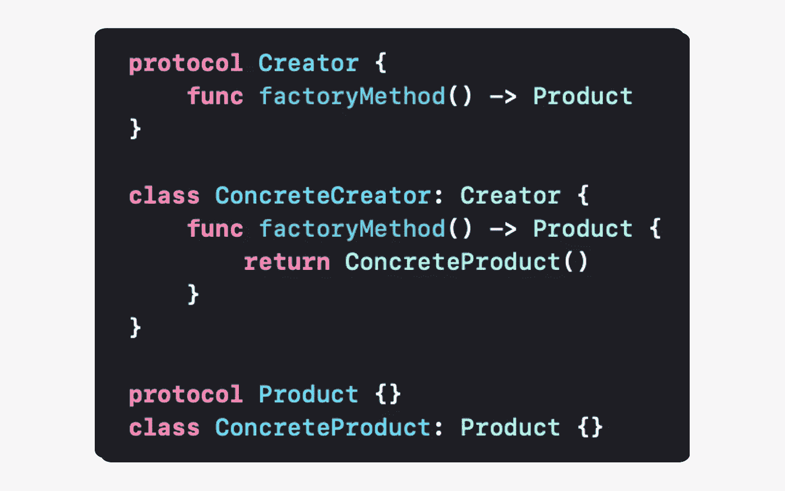
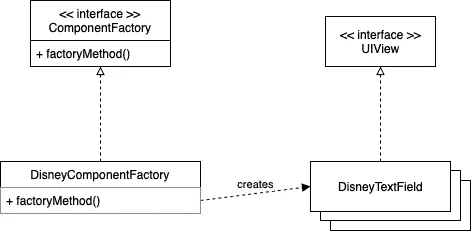

# Swift 中的“工厂方法”模式

> 原文：<https://levelup.gitconnected.com/factory-method-pattern-in-swift-1f1b73488072>



# 定义

“工厂方法”模式是一种创造性的设计模式，它抽象了实例化过程。创建模式控制谁创建一个对象，以及什么/如何/何时创建它。

**“工厂方法”模式定义了创建对象的接口，并将对象创建委托给子类。**

# 我们什么时候应该使用这种模式？

## 提供创建对象的接口

当我们有很多以不同方式使用的不同对象时，应该使用这种模式。它们的实例化可能很复杂，需要计算才能创建它们。“工厂方法”模式封装了它们的实例，以便简化它们在不同地方的创建。

## 为实例化定义单个位置

当一个类不能预测它需要 create️.的对象类型时，应该使用这种模式如果我们有一个已经在做我们需要的事情的对象，我们必须在代码中的某个地方重用和实例化它。将这些实例化从客户端类转移到一个接口，使类依赖抽象而不依赖底层组件(*依赖倒置原则)。这个接口叫做工厂方法，它有逻辑来决定我们需要实例化哪种类型的对象。此外，将创建逻辑委托给子类可以避免代码重复，并提供一个单独的维护位置。*

## 将对象的实现与其使用分离

当客户机完成创建逻辑和实例化时，应该使用这种模式。如果一个对象的类型在它的类中被使用，那么这个客户端就是与这个对象紧密耦合的。通过移动子类中对象的逻辑和实例化，我们保护代码免受 API 变化的影响。如果对一个具体的类及其 API 进行一些修改，客户端代码不会受到它不关心的变化的影响。通过实现一个接口，工厂方法返回一个抽象而不是一个具体的类型，所以我们保护代码不受实现细节的影响。

# 我们应该如何使用这种模式？

让我们从这种模式的一种常见方法开始。在这个例子中，我们正在开发一个移动应用程序，我们想要创建一个负责创建 UI 组件的工厂方法。

```
**class** ComponentFactory {
    **private** **init**() {} **static** **func** createView(component: ComponentType) -> UIView {       
        **switch** component {
        **case** .textfield:
            **let** textfield = UITextField()
            // textfield customatization...
            **return** textfield **case** .switch:
            **let** `switch` = UISwitch()
            // `switch` customatization...
            **return** `switch` **case** .button:
            **let** button = UIButton()
            // button customatization...
            **return** button **case** .label:
            **let** label = UILabel()
            // label customatization...
            **return** label **case** .image:
            **let** image = UIImageView()
            // image customatization...
            **return** image
        }
    }
}
```

第一种方法通过一个接口抽象出详细的实现。createView 方法是工厂方法，它采用一个参数来标识要创建的对象的类型。所有创建的对象共享一个公共的 UIView 界面。

然而，这段代码只关心对象的创建，而不关心如何管理它。这意味着我们不能继承和改变 createView 方法的行为。这段代码不是“工厂方法”模式的实现，而是简单/静态工厂的实现。

# 履行

## 工厂方法

比方说，在我们的移动应用程序中，根据播放器主题设置，我们有不同的外观组件。

为了创建 createView 方法的不同行为，我们需要创建一个接口，这样就可以创建许多具有所需行为的工厂方法。让我们创建一个抽象层来实现子类。

```
**protocol** ComponentFactory {
    **func** createView(component: ComponentType) -> UIView
}
```

在其设置中，玩家选择显示迪士尼世界主题的组件。让我们构建一个负责创建这些组件的工厂方法。为此，我们需要定义一个符合该接口的类:

```
**class** DisneyComponentFactory: ComponentFactory {
    **func** createView(component: ComponentType) -> UIView {
        **switch** component {
        **case** .textfield: **return** DisneyTextField()
        **case** .switch: **return** DisneySwitch()
        **case** .button: **return** DisneyButton()
        **case** .label: **return** DisneyLabel()
        **case** .image: **return** DisneyImageView()
        }
    }
}
```

## “工厂方法”UML 图



该图中的关键元素是 ComponentFactory 和 UIView 抽象。为了创建组件，客户必须对它们进行子类化。在我们的示例中，我们创建 DisneyComponentFactory 子类，它负责创建迪士尼特定的组件。“工厂方法”模式允许客户端只知道一个接口，但是它实例化了具体的类。因此，客户机并不决定它需要创建的对象，而是由工厂方法来决定。

## 在操场上运行代码

这里有一个[在线 Swift 游乐场](http://online.swiftplayground.run/)，因此不必创建 Xcode 游乐场来测试“工厂方法”模式的实现。然后，复制下面的代码，该代码对应于我们带有迪士尼组件的移动应用程序的“工厂方法”模式的完整实现。

```
**//** ‼️ This online playground is platform agnostic, so we need to declare a UIView interface and its subclasses. **protocol** UIView {}
**class** UITextField: UIView {}
**class** UISwitch: UIView {}
**class** UIButton: UIView {}
**class** UILabel: UIView {}
**class** UIImageView: UIView {}**class** DisneyTextField: UITextField {}
**class** DisneySwitch: UISwitch {}
**class** DisneyButton: UIButton {}
**class** DisneyLabel: UILabel {}
**class** DisneyImageView: UIImageView {}**enum** ComponentType {
    **case** textfield
    **case** `switch`
    **case** button
    **case** label
    **case** image
}**protocol** ComponentFactory {
    **func** createView(component: ComponentType) -> UIView
}**class** DisneyComponentFactory: ComponentFactory {
    **func** createView(component: ComponentType) -> UIView {
        **switch** component {
        **case** .textfield:
            print("DisneyTextField created")
            **return** DisneyTextField() **case** .switch:
            print("DisneySwitch created")
            **return** DisneySwitch() **case** .button:
            print("DisneyButton created")
            **return** DisneyButton() **case** .label:
            print("DisneyLabel created")
            **return** DisneyLabel() **case** .image:
            print("DisneyImageView created")
            **return** DisneyImageView()
        }
    }
}// Client
**let** disneyFactory = DisneyComponentFactory()
disneyFactory.createView(component: .label)
```

最后，粘贴并运行代码。