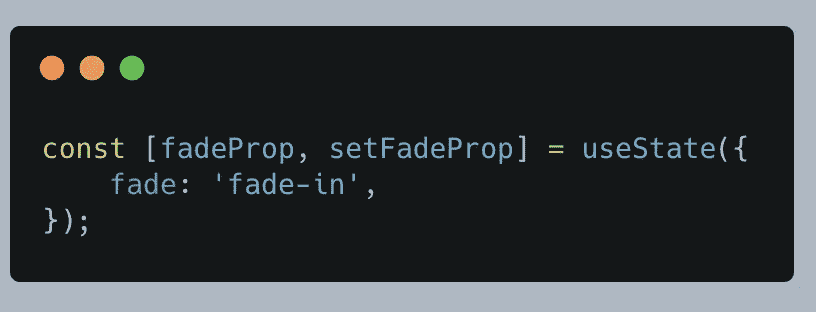

# React 中的淡入淡出文本

> 原文：<https://levelup.gitconnected.com/fade-in-out-text-in-react-fa8fc7a2a0b1>

*此处:*[*https://flatteredwithflutter.com/fade-in-out-text-in-react/*](https://flatteredwithflutter.com/fade-in-out-text-in-react/)

react 中的淡入淡出文本

点击此处观看演示

***网址:***[***https://funwithreact.web.app/***](https://funwithreact.web.app/)

我们将经历以下步骤

1.  添加 CSS
2.  创建推子组件
3.  淡入淡出逻辑
4.  清除副作用


react 中的淡入淡出文本

## 添加 CSS

让我们从添加 CSS 开始，它将帮助我们实现淡入淡出的效果。

```
.fade-in {
    transition: opacity 1s ease;
}.fade-out {
    opacity: 0;
    transition: opacity 1s ease;
}
```

类名是不言自明的！

## 创建推子组件

我们创建了一个可重用的组件，并将其命名为 **Fader。**该组件将包括 UI +业务逻辑，以实现淡入淡出。

**定义道具**

*   这个组件将接受一个文本属性，它的类型是 string
*   我们还为文本属性分配了一个默认值

```
Fader.defaultProps = {
    text: 'Hello World!'
}Fader.propTypes = {
    text: PropTypes.string,
}
```

*   在组件内部导入 CSS 文件(在我们的例子中是 **App.css** )

**初始状态**

*   我们从 React 导入[使用状态](https://reactjs.org/docs/hooks-state.html)钩子。
*   将我们属性的初始值设置为`fade-in`



设置初始状态

*   我们利用这个属性，并把它赋给 Html 元素的类名。

```
return (
    <>
      <h1 className={fadeProp.fade}>{text}</h1>
    </>
)
```

**fade prop . fade**:CSS 类名

**文本**:是推子属性

## 淡入淡出逻辑

让我们带上[使用效果](https://reactjs.org/docs/hooks-effect.html)挂钩

当且仅当依赖关系数组`[prop, state]`中的任何值已经改变时，在将改变提交给 DOM 和*之后，`useEffect(callback, [prop, state])`调用`callback`。*

```
useEffect(() => {
     const timeout = setInterval(() => {
        if (fadeProp.fade === 'fade-in') {
           setFadeProp({
                fade: 'fade-out'
           })
        } else {
             setFadeProp({
                fade: 'fade-in'
             })
        }
     }, 4000);return () => clearInterval(timeout)
}, [fadeProp])
```

*   我们使用 [setInterval](https://javascript.info/settimeout-setinterval) ，它接收回调和持续时间(在我们的例子中是 4 秒)
*   在 setInterval 回调中，我们检查当前的 css 类名
*   因为我们将初始类指定为`fade-in`,所以我们对此进行检查并相应地更改类
*   注意回调或 if/else 每 4 秒执行一次

## 清除副作用

如果`useEffect(callback)`的`callback`返回一个函数，那么`useEffect()`认为这是一个*效果清理*:

```
return () => clearInterval(timeout)
```

*   我们添加这一行是为了清理效果。
*   这将在启动新计时器之前取消之前的计时器。

清理的工作方式如下:

1.  初始渲染后，`useEffect()`调用有副作用的回调。在我们的例子中，`timeout`

2.在后来的渲染中，在调用下一个副作用回调之前，`useEffect()` *调用*之前副作用执行的`clearInterval`函数，然后运行当前的副作用。

3.最后，在卸载组件后，`useEffect()` *从最新的副作用中调用*`clearInterval`函数


```
*Hosted URL:* [*https://funwithreact.web.app/*](https://funwithreact.web.app/)[*Source code*](https://github.com/AseemWangoo/expriments_with_react)
```

感兴趣的文章:

[](/show-push-notifications-in-react-449949e98e01) [## 在 React 中显示推送通知

### 在 React 中显示推送通知

在 Reactlevelup.gitconnected.com 显示推送通知](/show-push-notifications-in-react-449949e98e01) [](/deploy-react-and-aws-amplify-1db36c625d73) [## 部署 React 和 AWS Amplify

### 部署 React 和 AWS Amplify

部署 React 和 AWS Amplifylevelup.gitconnected.com](/deploy-react-and-aws-amplify-1db36c625d73) [](/i-tried-react-in-2021-here-are-my-thoughts-51256e6f595d) [## 我在 2021 年试过 React。以下是我的想法

### 以下是我从 React 中学到的 5 个要点。

levelup.gitconnected.com](/i-tried-react-in-2021-here-are-my-thoughts-51256e6f595d)