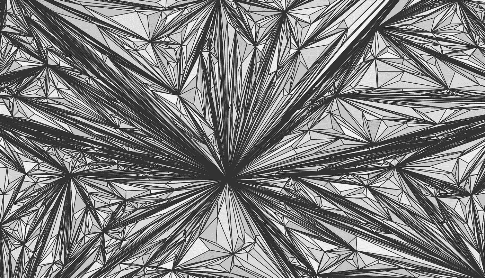
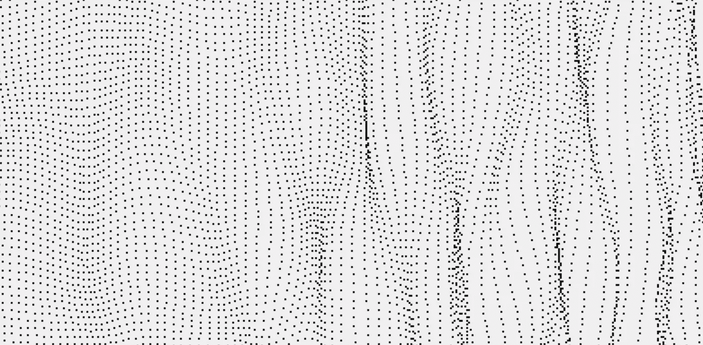
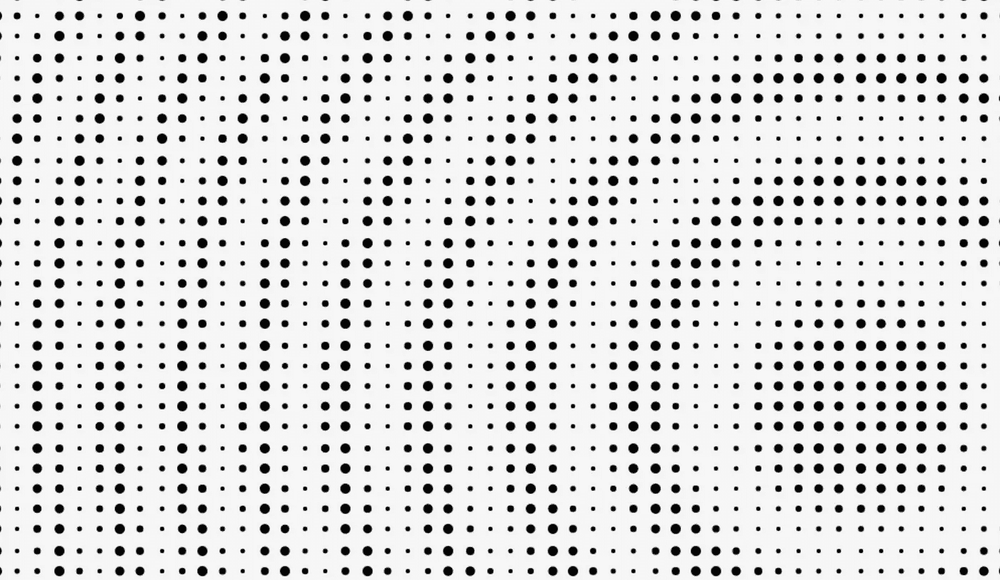
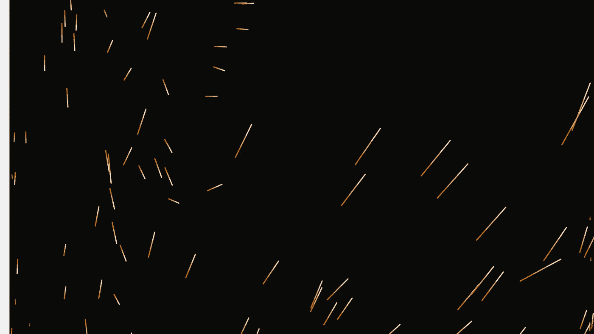

# 成功失败——学习生成艺术

> 原文：<https://levelup.gitconnected.com/failing-successfully-my-process-of-learning-generative-art-a440dded40a>

尝试学习新事物的过程可能从极其简单到极其困难。我从经验中知道——我试图学习植物护理，结果在两周内全部死亡。我试着学习烹饪，将一批荞麦面煮成一个完美的锅状面条立方体。

失败是学习新技能必不可少的一部分，你可能会不断从你最喜欢的 Twitter 骗子、你最喜欢的教授和研究员，甚至你的父母那里听到这一点。

现实是:糟透了。能减少吗？

我试图学习一种新技能，即生成艺术，同时尽量减少挫折和失败，专注于让自己保持动力。有些事情成功了，有些则彻底失败了，但最重要的是:我得到了结果，并且乐在其中。以下是我如何应对可控失败的。

如果你只是想玩玩我做的很酷的实验，你可以看看这里的。

# 从教程开始

*挫折水平:* ***10%，*** *激励水平:* ***25%***

将一个多边形细分成更小的三角形！

我的大部分生成性作品都是通过跟随教程开始的，或者只是找到一些很酷的东西并试图复制它。例如， [Wblut 有这个恶心的教程](https://wblut.com/cracking/)把一个三角形细分成越来越小的块。

这个阶段总是最有趣的。我只是看着代码，自己把它打出来，这样我就不会变成一只盲目复制粘贴的猴子，看着东西在我的屏幕上移动！

最棒的部分是 10%的挫败感。我真的只是搞砸了错别字或只是可笑的愚蠢。我能够用最少的努力创造出很酷的结果。虽然如果编码像这样就好了，但我需要在这些教程中加入更多我自己的个性。

# 采取下一步行动

*挫折水平:* ***40%，*** *激励水平:* ***80%***

[波浪圆点！](https://g.noahfiner.com/dots)(改编自他们从中间出来的一个教程)

生成艺术有“艺术”这个词在里面。这是关于创造力和做酷的事情，而不是盲目相信网上网站告诉你做的事情。

对我来说，下一步是加入我自己的创造力。也许是把一种算法从三角形变成了多边形。也许是给我的形状细分添加了随机的颜色。也许它在移动点，所以看起来像是有生命的东西。

由于不再有明确的目标，挫折感也随之增加。更多的是尝试一些东西，直到它们看起来很酷，但大多数时候它们并不酷。更多的是翻转负数，移动数字，实际上是试图创建我自己的数学方程(这是令人惊讶的困难！)

# 飞得离太阳太近

*挫折水平:* ***80%*** *，激励水平:* ***60%***

[圆点多的圆点！](https://g.noahfiner.com/circles)

这是我每次实验中事情变得疯狂的地方。这包括我移动我写的所有行，就像我知道我在做什么一样，直到意识到在我的实验中我已经完全破坏了代码库。

我试图遵守 20/80 法则，即 20%的努力可以让你走完 80%的路。这是我做了一些看起来很酷的东西的地方，尽管并不完美。我能够保持理智，看到自己走得太远的地方，知道为自己所拥有的感到高兴

# 真正的东西——从零开始

*挫折水平:****75%****，激励水平:* ***110%***

[我的极度破碎流体模拟](http://g.noahfiner.com/fluid)

在前面的步骤中进行了大量的低挫折水平的练习，并在教程的帮助下看到了实际的成功之后，我的动力急剧增长。我准备接受完全疯狂的挑战。

在练习完教程后，我特别决定尝试使用我以前学过的策略进行流体模拟。我在网上找到了一些方程，看到了一个例子(没有任何代码)，然后就开始写速度、矢量场和扩散算法。

以上内容听起来可能非常复杂。如果我做得对的话，本来是可以的。

粒子在完全随机的方向上移动，经过几个小时的调试，我注意到将一个特定的常数设置为 7 会使粒子处于一个相对体面的平衡状态。由于非常强调“相对体面”，我决定结束这个项目，并在我建造的东西上盖上我自己的认可印章。20%的努力换来 80%(嗯，更像是 50%)的结果。

# 我学到了什么？

当然，我学会了如何摆弄 JavaScript、p5js 和一些很酷的数学概念。但我真正从中学到的是我自己学习新的、困难的技能和概念的过程。

我意识到，我不能只是跳入疯狂的失败，而是需要找到一些方法来引导我，并保持我的动力。在遵循一些基本的东西之后，只有那时我才能开始做我自己的更大更复杂的创造性的改变。在那之后，我准备好投身其中，自己创造一些东西。

谁知道我会在哪里应用这个？也许我正在学习一种新的、晦涩的工作工具。也许稍微改变一下鸡肉食谱，直到我发明出自己的鸡肉。或者也许有一天我会写一本自己的指南。

我所知道的是，我每学到一件新东西，剩下的就会越来越容易。或者如果没有，也许我只是需要为自己找到更多的教程。

# 关于我

Noah Finer 是密歇根大学计算机科学专业的大三学生，也是 Shift Creator Space 的前联合主管。他来自博尔德县，喜欢徒步旅行、滑雪、摄影和向朋友谈论字体。他也是崭露头角的说唱歌手 MC Finer Flame 的幕后推手。