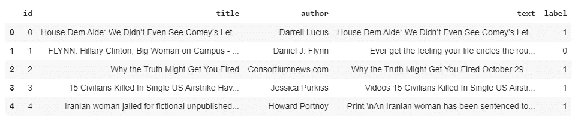

# 假新闻检测器:NLP 项目

> 原文：<https://levelup.gitconnected.com/fake-news-detector-nlp-project-9d67e0177075>

在下面的帖子中，我们将讨论如何创建一个 NLP 分类器来检测新闻是真是假。

如今，假新闻已经成为一种普遍趋势。即使是可信的媒体机构也因传播假新闻而闻名，并正在失去其可信度。那么，我们怎么能相信任何新闻是真的还是假的呢？


在这个项目中，我建立了一个分类器模型，可以识别新闻的真假。为此，我使用了 Kaggle 的数据，但是您可以使用任何数据按照相同的方法来构建这个模型。

## 资料组

[Kaggle Data](https://www.kaggle.com/c/fake-news/data)
train.csv:一个完整的训练数据集，具有以下属性:

*   id:新闻文章的唯一 id
*   标题:新闻文章的标题
*   作者:新闻文章的作者
*   正文:文章的正文；可能不完整
*   标签:将文章标记为潜在不可靠的标签。
    其中 1:不可靠，0:可靠。

## 读取数据

```
import pandas as pd
train = pd.read_csv('train.csv')train.head()
```



这是训练数据的样子

我们可以看到“标题”、“作者”和“文本”这些特征都很重要，而且都是文本形式的。因此，我们可以将这些特征组合成一个最终特征，用于训练模型。让我们称这个特征为“总的”。

```
# Firstly, fill all the null spaces with a space
train = train.fillna(' ')
train['total'] = train['title'] + ' ' + train['author'] + ' ' +
                 train['text']
```


添加“总计”列后，数据如下所示

## 预处理/清理数据

为了预处理数据，我们需要一些库。

```
import ntlk
from ntlk.corpus import stopwords
from ntlk.stem import WordNetLemmatizer
```

下面解释了所有这些库的用途。

**停用词:**停用词是那些在文本中多次出现且无助于机器理解文本的常用词。我们不希望这些词出现在我们的数据中。所以，我们去掉这些词。

所有这些停用词都以不同的语言存储在 ntlk 库中。

```
stop_words = stopwords.words('english')
```

**分词:**单词分词是将大样本文本拆分成单词的过程。
例如:

```
word_data = "It originated from the idea that there are readers who prefer learning new skills from the comforts of their drawing rooms"nltk_tokens = nltk.word_tokenize(word_data)
print(ntlk_tokens)
```

它会将字符串 word_data 转换成这个:
['It '，' originated '，' from '，' the '，' idea '，' that '，' there '，' are '，' readers '，' who '，' prefer '，' learning '，' new '，' skills '，' from '，' comforts '，' of '，' thes '，' drawing '，' rooms']

**词汇化:**词汇化是将同一个词根词的不同词形变化组合在一起的过程，这样它们就可以作为一个单项进行分析。
词汇化的例子:
游泳→游
岩石→岩石
更好→好

```
lemmatizer = WordNetLemmatizer()
```

下面的代码是为了我们的测试数据的词汇化，同时排除了停用词。

```
for index, row in train.iterrows():
    filter_sentence = ''
    sentence = row['total'] # Cleaning the sentence with regex
    sentence = re.sub(r'[^\w\s]', '', sentence) # Tokenization
    words = nltk.word_tokenize(sentence) # Stopwords removal
    words = [w for w in words if not w in stop_words] # Lemmatization
    for words in words:
        filter_sentence = filter_sentence  + ' ' +
                         str(lemmatizer.lemmatize(words)).lower() train.loc[index, 'total'] = filter_sentencetrain = train[['total', 'label']]
```


这是预处理后的数据

```
X_train = train['total']Y_train = train['label']
```

最后，我们已经对数据进行了预处理，但它仍然是文本形式的，我们无法将其作为输入提供给我们的机器学习模型。为此我们需要数字。怎么才能解决这个问题？答案是矢量器。

## 矢量器

为了将文本数据转换成数字数据，我们将使用两个矢量器。

1.  **计数矢量器** 为了使用文本数据进行预测建模，必须对文本进行解析以删除某些单词——这个过程被称为**标记化**。这些单词需要被编码为整数或浮点值，作为机器学习算法的输入。这个过程叫做**特征提取(或矢量化)**。
2.  **TF-IDF 矢量器** TF-IDF 代表**词频—逆文档频率**。它是用于信息检索的最重要的技术之一，用来表示特定的单词或短语对给定的文档有多重要。
    点击阅读更多关于此[的信息。](https://www.geeksforgeeks.org/sklearn-feature-extraction-with-tf-idf/)

```
from sklearn.feature_extraction.text import TfidfTransformer
from sklearn.feature_extraction.text import CountVectorizer
from sklearn.feature_extraction.text import TfidfVectorizercount_vectorizer = CountVectorizer()
count_vectorizer.fit_transform(X_train)
freq_term_matrix = count_vectorizer.transform(X_train)
tfidf = TfidfTransformer(norm = "l2")
tfidf.fit(freq_term_matrix)
tf_idf_matrix = tfidf.fit_transform(freq_term_matrix)
```

上面写的代码将为你提供一个代表你的文本的矩阵。它将是一个稀疏矩阵，具有大量压缩稀疏行格式的元素。

## 系统模型化

现在，我们必须决定哪种分类模型最适合我们的问题。
首先，我们将拆分数据，然后训练模型，以预测我们的模型有多准确。

```
from sklearn.model_selection import train_test_splitX_train, X_test, y_train, y_test = train_test_split(tf_idf_matrix,
                                   Y_train, random_state=0)
```

我们将在这里实现三个模型，并比较它们的性能。

1.  逻辑回归

```
from sklearn.linear_model import LogisticRegressionlogreg = LogisticRegression()
logreg.fit(X_train, y_train)Accuracy = logreg.score(X_test, y_test)
```

2.朴素贝叶斯

```
from sklearn.naive_bayes import MultinomialNBNB = MultinomialNB()
NB.fit(X_train, y_train)Accuracy = NB.score(X_test, Y_test)
```

3.决策树分类器

```
from sklearn.tree import DecisionTreeClassifierclf = DecisionTreeClassifier()
clf.fit(X_train, y_train)Accuracy = clf.score(X_test, Y_test)
```

## 表演


模型在测试集上的性能

正如我们所看到的，决策树分类器在训练集上表现最好，准确率为 97%。

我还在不属于训练集的不同测试集上测试了该模型，它给出了 96.98%的准确率，这是相当不错的。

感谢阅读。我希望你喜欢我的文章，并发现它是有帮助的。如果你有任何问题或建议，请随时写在评论区。你可以在这里和我连线:[伊桑·朱亚尔](https://www.linkedin.com/in/juyalishant/)