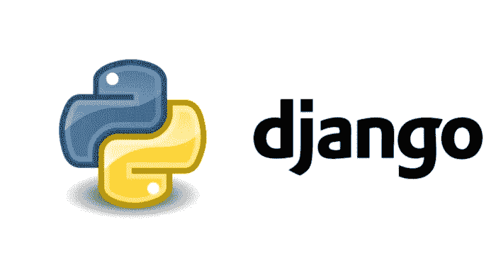

# Django 中的回退对象和响应——优化 Django，第 7 部分

> 原文：<https://levelup.gitconnected.com/fallback-objects-and-responses-a-few-ways-to-implement-them-optimising-django-part-7-6741f75557fd>

# Django 中的回退对象和响应——实现它们的几种方法——优化 Django，第 7 部分



姜戈太棒了。

当您在 Django 中提供对象时，有时您希望在对象不存在的情况下提供某种默认数据。这可能有多种原因:也许您只需要在处理函数的其余部分时模拟下游客户端的响应，或者您需要根据一些查询用户的配置文件为他们提供数据，但是在您构建配置文件时需要一些通用的东西来为新用户提供服务。

在本文中，我将介绍使用 Django 实现这一点的几种方法，提供不同程度的复杂性和功能。

# 第一个:空响应！

这是其中最简单的一个。

```
class MyTodoView(APIView):
    def get(self, request, *args, **kwargs):
        # Just show the endpoint exists.
        return Response(status=200, data={}) """  work on the rest of your code here  """
```

大多数 Django 开发人员可能都熟悉这种快速的方法，在他们让视图的其余部分工作的同时，向客户端提供 200+的响应状态。

如果你真的需要提供一些东西，比如 API 期望提供的数据格式的例子，那么更进一步就是提供一个样本 JSON，就像这样:

```
class MyTodoView(APIView):
    def get(self, request, *args, **kwargs):
        # Just show the endpoint is reachable plus some sample data.
        return Response(status=200, data={'title': 'A todo.',
                                          'description': 'blah.'})"""  work on the rest of your code here  """
```

尽管如此，这只是一个静态的反应；这里所有东西都是硬编码的。如果你想改变数据，你不能通过 Django admin 来改变它；你必须改变代码。

接下来，让我们看看如何提供一个可以在后端更改的默认响应。

# 第二个:默认对象！

这一次，我们要做一个 up 并实际创建要服务的对象。这将是一个多一点的工作，因为预计你已经有了整个视图和序列化工作。

```
class MyTodoView(APIView):
    def get(self, request, *args, **kwargs):
        obj = self.get_object()
        if not obj:
            # Get your default object.
            obj = self.get_queryset().filter(is_default=True).first()
    return self.get_serializer(obj).data
```

这很好，因为现在您可以在 Django admin 中更改数据。

请注意，您决定哪个对象是默认对象的逻辑是由您自由决定的。您可以使用数据库中的第一个对象，或者采用第一个包含 null 或空字段的对象。例如，如果您提供翻译对象，默认情况下您可以提供英语对象:

```
from .models import Translationclass MyTodoView(APIView):
  def get(self, request, *args, **kwargs):
    language = kwargs['language']
    id = kwargs['id'] obj = Translation.objects.filter(id=id,
                                     language=language).first()
    if not obj:
      obj = Translation.objects.filter(id=id,
                                       language='en').first() return self.get_serializer(obj).data
```

这很好，但是有一个问题:无论何时需要 fallback 对象，都必须进行第二次 DB 查询。幸运的是，有一种方法可以自动获得回退对象，而不需要第二次数据库命中！

# 还有优化！

先快速看一下代码:

```
from .models import Translation
from django.db.models import Case, When, Q, IntegerFieldclass MyTodoView(APIView):
  def get(self, request, *args, **kwargs):
    language = kwargs['language']
    id = kwargs['id'] qs = Translation.objects.filter(id=id) # This annotation is key to the optimization.
    qs = qs.annotate(order=Case(When(Q(language=language),then=2),
                                When(Q(language='en'), then=1),
                                default=0,
                                output_field=IntegerField())) # Filter out other languages which are set to 0 by default.
    qs = qs.filter(order__gt=0).order_by('-order') # And serve the intended obj, or if it's missing, the fallback.
    obj = qs.first() return self.get_serializer(obj).data
```

好了，让我们来看看到底是怎么回事！

一切都是典型的注释。这就是棘手的事情发生的地方。基本上，我们使用注释来决定我们首先提供哪个翻译。Case 和 When 用于确定排序顺序，具体的逻辑是根据具体情况注入的。结果可能看起来很笨拙，但是在需要非常具体的逻辑来排序查询集的情况下，这可能是一个非常强大的工具。

当然，这一招不仅限于服务回退对象！您可以使用它按照特定的逻辑对整个 QuerySet 结果进行排序。例如，如果您想首先显示用户自己的对象列表，然后显示他们团队成员的对象，这是一个很好的 QuerySet 驱动的解决方案。

我目前能想到的唯一警告是，由于增加了逻辑，产生的单个查询会更昂贵。然而，我相信总的来说，从性能角度来看，这仍然比进行两个单独的查询要便宜。

# 感谢您通读！

如果您想知道在 Django 中使用序列化程序时如何[解决](/dealing-with-the-n-1-problem-optimising-django-part-4-f02010c7931d?source=friends_link&sk=34dfcc4f324f48a9e6e4b234d7e7635e) `[n+1](/dealing-with-the-n-1-problem-optimising-django-part-4-f02010c7931d?source=friends_link&sk=34dfcc4f324f48a9e6e4b234d7e7635e)` [问题的解决方案，请不要再找了！](/dealing-with-the-n-1-problem-optimising-django-part-4-f02010c7931d?source=friends_link&sk=34dfcc4f324f48a9e6e4b234d7e7635e)或者如果你想通过 Django 中的控制台日志调试你的 SQL，[看看这个快速指南吧！](/django-sql-debugging-with-an-sql-log-middleware-optimising-django-part-1-ca3b5c20d892?sk=263f4d36dde6377b91df0acf4e5208aa)