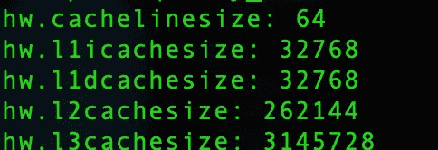
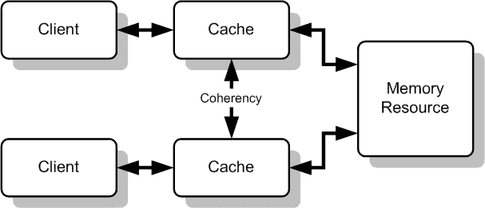
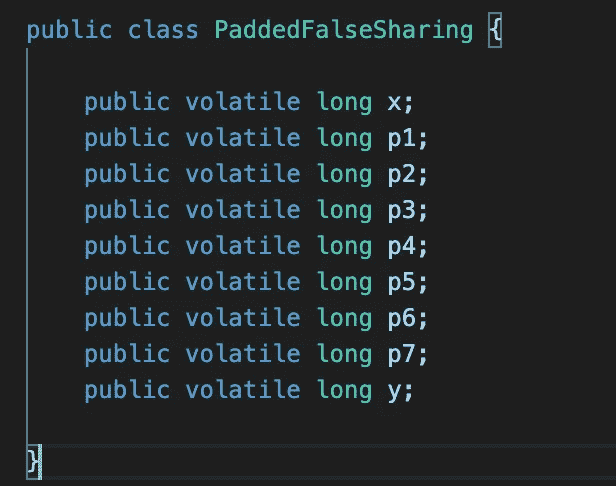
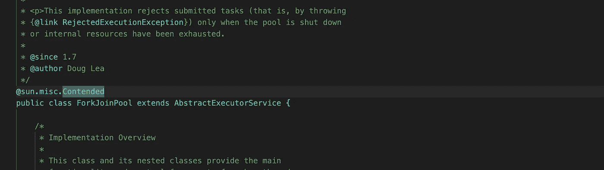
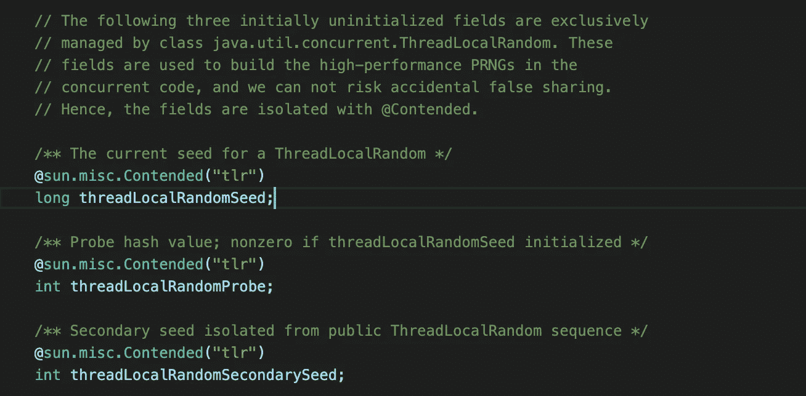

# 虚假分享——鲜为人知的性能杀手

> 原文：<https://levelup.gitconnected.com/false-sharing-the-lesser-known-performance-killer-bbb6c1354f07>

在这篇文章中，我们将研究伪共享的概念，以及它如何影响应用程序的性能。我们还将探索一些相关的概念，如缓存一致性、缓存行和 Java 的防止错误共享的竞争注释。

图片来源:U[n flash](https://images.unsplash.com/photo-1589779255718-3c459da9ffeb?ixid=MnwxMjA3fDB8MHxwaG90by1wYWdlfHx8fGVufDB8fHx8&ixlib=rb-1.2.1&auto=format&fit=crop&w=2089&q=80)

# 什么是虚假分享？

让我们看看维基百科是如何定义这个概念的:

> ***假共享*** *是一种降低性能的使用模式，在具有分布式、* [*一致高速缓存的系统中会出现这种情况*](https://en.wikipedia.org/wiki/Cache_coherence) *，其大小为由高速缓存机制管理的最小资源块。当系统参与者试图定期访问永远不会被另一方更改的数据，但这些数据与*被*更改的数据共享一个缓存块时，缓存协议可能会迫使第一个参与者重新加载整个单元，尽管缺乏逻辑必要性。高速缓存系统不知道该块内的活动，并强制第一个参与者承担真正共享访问资源所需的高速缓存系统开销。*

在深入探讨虚假分享之前，让我们先看看一些相关的概念。

# 硬件缓存和缓存线

我们都知道从机器内存中读写是一个缓慢的过程，尽管比从硬盘中读取要快得多。为了解决这种缓慢的内存访问，当今大多数处理器都使用缓存来提高性能。

现在的机器使用多级缓存，称为 L1、L2、L3 和 L4。L1 是最快的，但也是最昂贵的，所以机器往往有低大小的 L1 缓存。另一方面，L2 与 L1 相比速度较慢，但成本较低，因此机器倾向于拥有较大的 L2 缓存。

当从内存中读取数据时，所请求的数据及其周围的数据从内存加载到缓存中，然后从缓存中提供程序。这被称为高速缓存行。高速缓存行被正式定义为高速缓存和主存储器之间的数据传输单位。这种加载整个缓存行而不是单个字节的方式可以显著提高应用程序的性能。在我们的笔记本电脑上，L1 和 L2 的缓存行大小都是 64 字节。由于应用程序经常以顺序的方式从内存中读取字节，所以它们可以通过在缓存行中加载一系列数据来避免每次请求都命中主存。这增加了所需数据已经存在于缓存中的机会。

您可以通过运行以下命令 sysctl -a | grep cache 来检查便携式计算机的硬件缓存细节。我的系统(Macbook pro 2015)有 32KB 的 L1 缓存(L1I 和 L1D)，256KB 的 L2 缓存和 3MB 的 L3 缓存

命令:sysctl -a | grep 缓存

# 缓存一致性

在共享内存的多处理器系统中，每个处理器都有一个单独的高速缓存，共享数据可能有多个副本:一个副本在主内存中，另一个在请求它的每个处理器的本地高速缓存中。当其中一个数据副本发生更改时，其他副本必须反映该更改。缓存一致性是一种机制，可以确保共享数据中的更改及时传播到整个系统。这确保了主存储器中的高速缓存数据与其他高速缓存中的数据同步

src:[https://en . Wikipedia . org/wiki/Cache _ coherence #/media/File:Cache _ coherence _ generic . png](https://en.wikipedia.org/wiki/Cache_coherence#/media/File:Cache_Coherency_Generic.png)

**MESI 协议**是缓存一致性协议，也是最常见的协议之一。在 MESI 协议中，**每条高速缓存线可以处于以下四种不同状态之一:已修改、独占、共享或无效。**

让我们通过一个示例来进一步了解该协议:

1.  两个内核内核 X 和内核 Y 试图从主内存中读取长值 X 和 Y。让我们假设 x 和 y 彼此靠近，并且位于相同的高速缓存行中。
2.  内核 X 从主存储器中读取 X 的值。如前所述，这个内核将从内存中获取更多的值，并将它们存储到缓存行中。然后，它将该高速缓存线标记为**独占**，因为核心 X 是在该高速缓存线上操作的唯一核心。现在，只要有可能，这个内核将从高速缓存行读取值，而不是从主存储器读取效率较低的值。
3.  现在假设核心 Y 也决定从主存中读取 Y 的值。因为 y 和 x 在同一个高速缓存行中，所以两个内核都将其高速缓存行标记为**共享**
4.  假设现在核心 X 决定修改 X 的值，它修改其本地缓存，并将其缓存行的状态更改为 **modified。**
5.  核心 X 将其更改传达给核心 Y，核心 Y 会将其缓存线标记为**无效。**这样，核心 X 和 Y 都是一致的。

# 虚假分享

现在，让我们回到虚假分享的话题。让我们以上面解释的例子来看看错误共享是如何发生的。

1.  简单回顾一下，我们的核心 X 缓存行处于修改状态，而核心 Y 缓存行处于无效状态。
2.  现在，假设内核 Y 想要再次读取 Y 的值。由于高速缓存行无效，它不能从高速缓存中读取值，而必须从主存储器中进行低效读取(高速缓存未命中)。
3.  这将迫使核心 X 刷新它的存储缓冲区。现在两者都将更新的高速缓存线标记为共享状态。你可能会想什么是存储缓冲区。通常，处理器在将修改刷新回主存之前，会在它们的*存储缓冲区*中缓冲修改。它将一堆小写操作(比如 8 字节写操作)打包成一个更大的事务(一个 64 字节的缓存行)，然后发送到内存系统。批量缓冲和刷新可以极大地提升性能。
4.  这种缓存未命中的现象，即使数据块驻留在不同的内存位置并且没有直接更新，也称为假共享。即使两个内核不在同一个内存位置上运行，这也会对一个内核造成缓存未命中，并对另一个内核造成早期缓冲区刷新

通过增加高速缓存未命中的数量和从主存储器更频繁地访问数据，系统的性能受到负面影响。

# 避免错误共享

现在，我们知道了什么是虚假分享以及它是如何发生的，让我们看看如何避免它。我们还将看看 java 为解决这个问题提供了哪些支持

从前面的例子可以看出，整个问题的发生是因为两个值 x 和 y 位于同一个缓存行。解决这个问题的一个简单方法是**在这两个值周围添加填充符**，这样这两个值就位于不同的缓存行中。

因为我们的高速缓存行大小是 64 字节，而 long 是 8 字节。我们知道现有的 x 和 y 变量都是长变量。因此，通过添加 7 个长变量作为填充，我们可以确保长 y 在不同的缓存行。

使用 volatile 降低了我们填充的未使用变量被 JVM 移除的风险。**死代码消除**是由 JVM 完成的一项优化，删除不影响程序结果的代码。避免**死代码消除**现象的另一种方法是通过日志记录。

## @有争议的注释(特定于 Java)

Java 通过@ Contended 注释在内部处理错误的共享。Java 代码将该注释描述如下-

> *表示对象和/或其字段预计会遇到内存争用的注释，一般以“假共享”的形式出现。* ***这个注释作为一个提示，这样的对象和字段应该驻留在与其他对象或字段隔离的位置。对内存争用的敏感性是对象和字段的预期用途的属性，而不是它们的类型或限定符。这种注释的效果几乎总是会给对象增加大量的空间开销。***

[@ contributed](http://twitter.com/Contended)是一个 sun.misc 注释，这意味着理想情况下我们不应该在代码中使用它

一些核心 java 代码(java 8)的例子，其中@ Contended 被广泛使用

1.  **ForkJoinPool**

2.**threadlocalrrandom**

伙计们，这都是我的观点。我希望这篇文章对你有意义。快乐编码:)
请不吝反馈。

*原载于 2021 年 5 月 14 日*[*https://www . about all . tech*](https://www.aboutall.tech/false-sharing.html)*。*