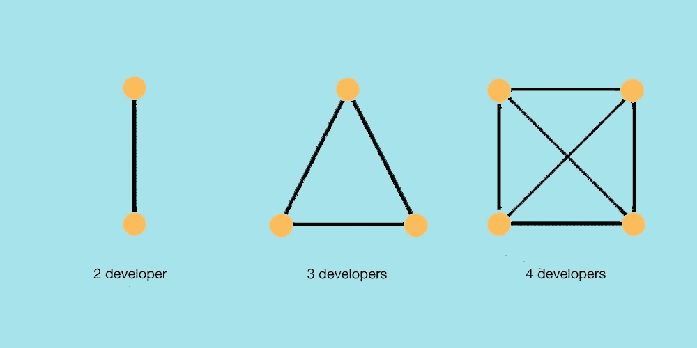
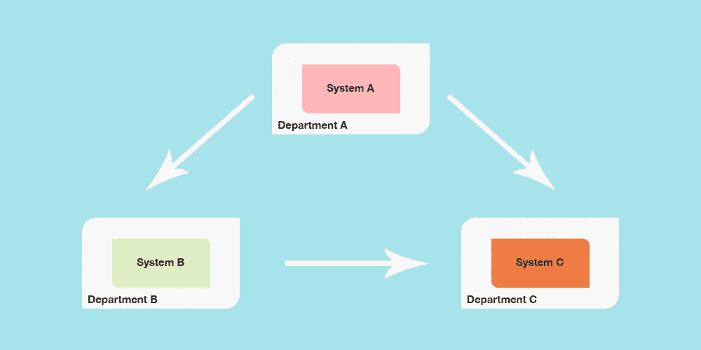
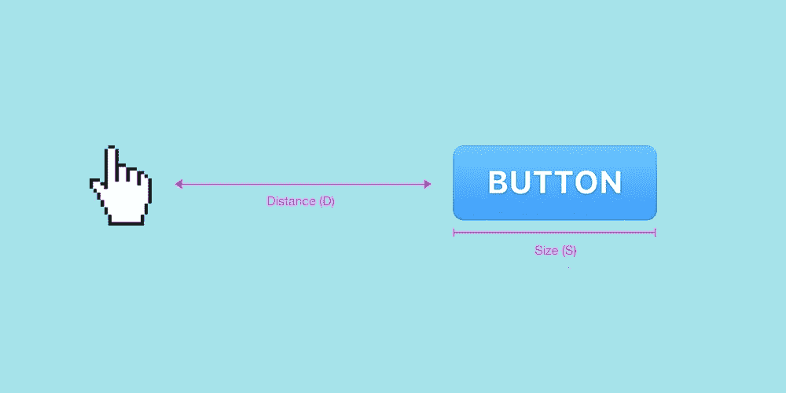
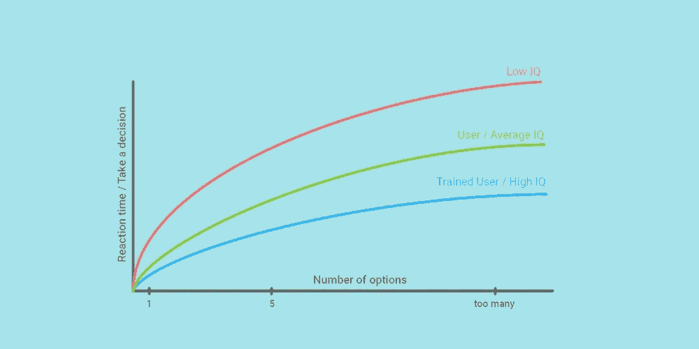
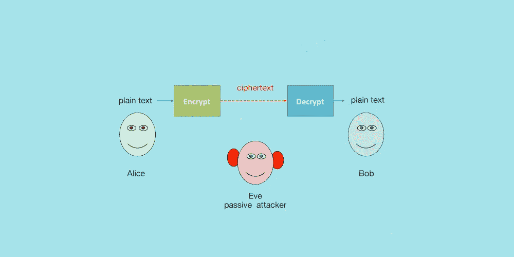
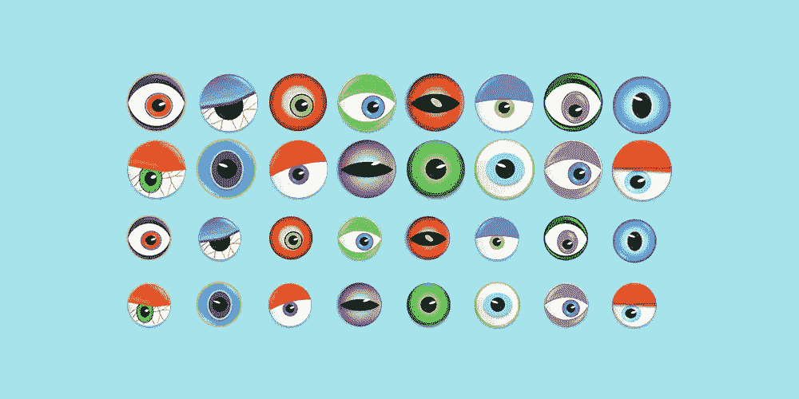
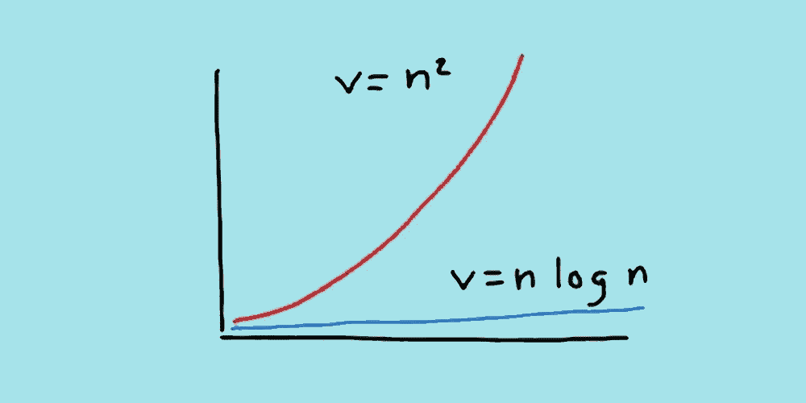

# 软件开发的著名定律

> 原文：<https://levelup.gitconnected.com/famous-laws-of-software-development-3aec49691677>

## 大自然从不违背自己的法则

像盖房子一样看建筑软件

在软件开发过程中，组织需要了解一些法律。这些法律可能不会改变你今天要做的决定，但它们应该告诉你如何思考和组织你的团队。我将按字母顺序介绍最著名的软件开发定律。

# 布鲁克斯定律

沟通渠道和团队规模

它是由弗雷德·布鲁克斯在他 1975 年的著作《人月神话》中创造的。他说“*增加人力到一个后期的软件项目会使它变得更晚*”。

> 一个孩子的出生需要九个月，不管分配多少妇女。

这个想法完全出乎意料，因为当一个项目落后于计划时，一个显而易见的策略是尝试从组织的其他部门添加人员或全新的员工来帮助支持这项工作。

事实上，在团队中增加成员会增加沟通成本，因为新员工会发展技能，并在以下方面对现有员工提出要求:检测错误、解释代码、阅读设计文档等。我们可以通过一个 XP 环境来解决这些问题，在这个环境中，开发人员学习得更快，并在一周内而不是一个月内为团队生产力做出贡献。

# 康威定律

组织结构=系统的架构

大约 50 年前，梅尔·康威在《数据化》杂志上发表了一篇名为“委员会如何发明”的论文在该书中，他探讨了组织结构和由此产生的系统设计之间的关系。这个想法是系统的架构将由公司的通信和组织结构决定。

> 如果你有四个组在一个编译器上工作，你将得到一个 4 遍编译器。

*公司的组织结构是由其产品的架构决定的*‘是康威法则的逆法则。在该定律首次提出 50 多年后，它和它的逆定律似乎仍然成立。

# 费茨定律

费茨定律中的距离和大小

*获取目标的时间是距离和目标大小的函数*。这就是所谓的费茨定律。根据他的定律，由于速度和精度之间的权衡，快速移动和小目标会导致更大的错误率。

> 时间= a + b log~2~ ( D / S + 1)

1978 年，施乐公司的员工利用费茨定律来发现哪种输入设备最适合他们的计算机系统。你可能想做以下一些事情来将菲特定律应用到你的用户界面设计中:

*   不要把按钮做得太小，应该把重要的按钮做得大一些，以便于点击。
*   在光标位置弹出菜单有助于减少移动距离，从而缩短移动时间。

# 希克定律

根据希克定律做决定的时候到了

希克的 Law⁴说，用户做出决定所花的时间取决于他们可能选择的数量。该法律声称，用户从一个包含 10 个项目的菜单中做出选择比从两个各包含 5 个项目的菜单中做出选择更快。

> 时间= b log~2~(n + 1)

该法律还规定，做出决定所需的时间受以下两个因素的影响:

*   用户的知识与选择，如来自重复使用。
*   选择的形式是声音还是单词，视频还是按钮？

# 霍夫斯塔德定律

花很长时间

认知科学家道格拉斯·霍夫斯塔德在他的著作《哥德尔、埃舍尔、Bach⁵》中创造了霍夫斯塔德定律:

> 即使将霍夫斯塔德定律考虑在内，其耗时也总是比您预期的要长。

当我们计划设计、构建、部署等时。当然，没有法律规定一切都必须枯燥、乏味、枯燥或乏味。但是当执行的时候，一切都出错了，而且花的时间比我们预期的要长。

# 克尔克霍夫原理

秘密科学

Kerckhoffs 的 Principle⁶指出,*密码系统的安全性必须只在于选择它的密钥；其他一切(包括算法本身)都应被视为公共知识*。

> 在密码学中，一个系统应该是安全的，即使除了一小部分信息——密钥——之外的所有信息都是公开的。

这是公钥加密的主要原理。它被广泛接受，并意味着一个算法必须有许多可能的密钥，密钥空间必须非常大。

# 莱纳斯定律

眼球本身并不足以解决所有主要问题和安全缺陷

这项法律是由埃里克·s·雷蒙德在他的论文和著作《大教堂和 bazaar⁷》(1999)中制定的，并以 Linus Torvalds(Linux 操作系统的主要开发者)的名字命名。

> 如果有足够的眼球，所有的臭虫都是浅的。

他认为，错误最好通过被尽可能多的人识别和纠正来解决。

# 梅特卡夫定律

梅特卡夫定律和齐夫定律

Metcalfe 的 Law⁸指出,*系统的价值随着系统用户数量的平方而增长。*

> 网络中的总连接数为(N(n1))/2 ~ N

换句话说，如果您将认识的人数增加一倍，您的网络价值将翻两番。

# 摩尔定律

照片由 M[AC vector](https://www.freepik.com/macrovector)在 [FreePik](https://www.freepik.com) 上拍摄

这条以英特尔创始人戈登·摩尔命名的定律预测，半导体晶体管的数量将每 18-24 months⁹.翻一番

> 每单位成本的计算机能力每 24 个月翻一番。

今天，硅芯片上安装的晶体管每 18 个月翻一番，而不是每 24 个月。专家们一致认为，计算机应该在 21 世纪 20 年代的某个时候达到摩尔定律的物理极限。

# 帕累托原则

输入和输出

帕累托原则，也就是 80/20 法则，⁰，你听说过吗？反映出“ *80%的效果是 20%的原因*的产物。

> 大多数人倾向于在任务上花费 80%的时间来产生 20%的结果。

这一原则可以普遍适用于商业领域，也可以在社会的所有部门找到。我们甚至可以在日常生活的大部分领域使用它。例如，20%的员工生产了 80%的工作，或者 20%的产品产生了 80%的利润。

这个列表并不是对“软件法则”的详尽讨论，我相信你可以添加更多的，也许还可以对我讨论的一些问题挑毛病。

# 参考

[1]弗雷德·布鲁克斯(1975)。神话中的人月:软件工程论文集。国际标准书号 978–8178082530。

[2]梅尔文·e·康威(1968)。委员会是如何发明的？汤普森出版公司。

[3]费茨，P. M. (1954 年)。人类运动系统控制运动幅度的信息容量。实验心理学杂志，47(6)，381–391。

[4]希克，w . e .(1952 年 3 月 1 日)。论信息的获取速度。实验心理学季刊。4 (1): 11–26.

[5]道格拉斯·霍夫施塔特(1999 年)。哥德尔，埃舍尔，巴赫:一条永恒的金色辫子。国际标准书号 978–0465026562。

[6]petit colas f . a . p .(2011)Kerckhoffs 的原则。载于:van Tilborg H.C.A .，Jajodia S .(编辑)《加密和安全百科全书》。马萨诸塞州波士顿斯普林格

[7]雷蒙德，E. Know Techn Pol (1999 年)。大教堂和集市。荷兰斯普林格。

[8]大卫·史密斯；斯凯利，c . a .(2006 年夏天)。“全球化转型”，田纳西商业杂志:17–19。

[9]戈登·e·穆尔(1965 年 4 月至 19 日)。将更多的元件塞进集成电路。电子学。

[10]维尔弗雷多·帕累托，洛桑大学政治经济学课程，第一卷，1896 年；第二卷，1897 年。