# 细长的自定义复选框

> 原文：<https://levelup.gitconnected.com/fancy-checkboxes-in-svelte-d633a2a31619>


[苗条的标志](https://github.com/sveltejs/svelte)

普通的复选框很无趣。当然，它们可以工作，但是它们不能被风格化，并且它们的原始外观在不同的浏览器和设备之间有所不同。

这个问题有一个相对简单的解决方案——我们可以使用 CSS 创建自定义的复选框，与应用程序中 UI 的其余部分相匹配。

Svelte 是一个用于构建 web 应用程序的框架，正在迅速获得关注。我不会在这篇文章中讨论苗条身材的任何好处，那超出了我的范围，但我只想说我喜欢它。我真的很喜欢它。

在这篇文章中，我们将建立一个苗条的组件。一个奇特的复选框组件。

好了，我们走吧！

## 第一步:设置

最重要的事情——建立一个新项目。最简单的方法是使用 [npx](https://www.npmjs.com/package/npx) 和 [degit](https://github.com/Rich-Harris/degit) :

```
npx degit [sveltejs/template](https://github.com/sveltejs/template) fancy-checkbox-article
```

这个命令创建了一个空项目，为我们开始编码做好了准备。嗯，几乎所有的事情。

在这个例子中，我将使用 SCSS，因此我们需要安装更多的工具来提供帮助。

```
npm i -D node-sass svelte-preprocess autoprefixer
```

如果您还没有这样做，运行`npm install`以确保所需的一切都已安装。

最后的设置步骤是建立一个 SCSS 预处理。别担心，这真的很快。我们需要对我们的 rollup.config.js 做一个小小的修改。

首先，我们添加以下导入:

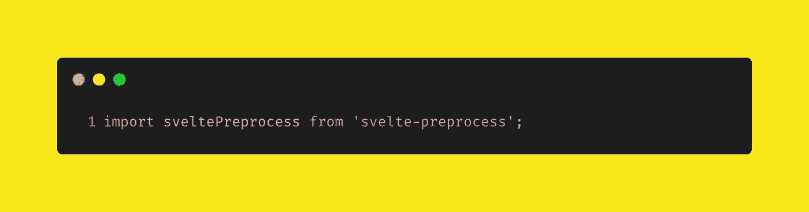

导入苗条预处理包

接下来，我们创建一个常数，保存预处理器的一些配置细节:

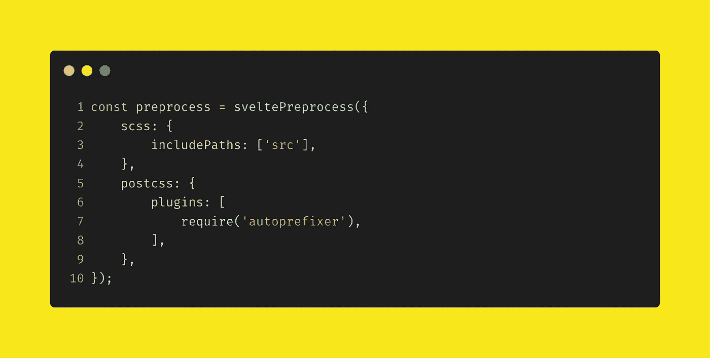

预处理器配置常数

最后，我们将我们的新常数插入到卷式配置中——特别是在苗条配置部分。完整的 rollup.config.js 应该如下所示:

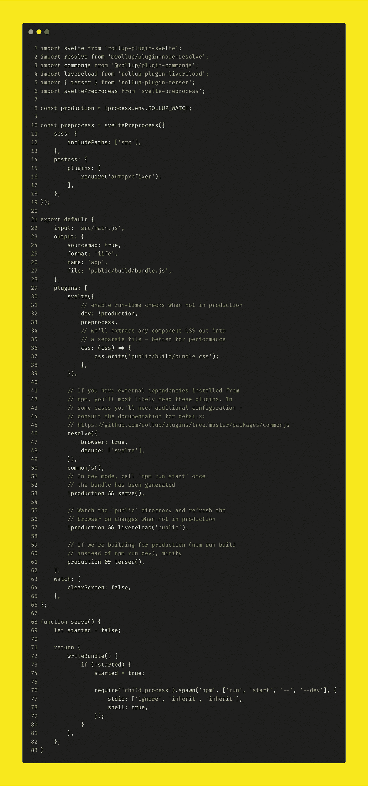

完成 rollup.config.js

您可以在第 33 行看到，我们已经添加了自己创建的`preprocess`常量。

## 第二步:标记

没错，设置完成后，我们就可以实际编写一些代码了。

在`src`目录下创建一个新文件——这将是我们奇特的复选框组件。我们称之为**花式复选框。**

我们要做的第一件事是创建标记。这里真的没有太多东西，我喜欢先处理容易拿到的水果。

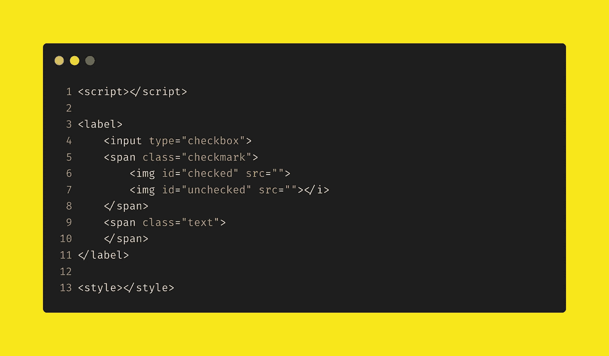

我们奇特的复选框组件的标记

这是怎么回事？我们创建了一个标签，在标签中有一个复选框和两个范围。这是创建一个定制的、仅用于 CSS 的复选框的一种相当常见的模式。

带有类`checkmark`的 span 包含两个图像标签。由于这是一个奇特的复选框，我们将使用选中和未选中状态的图像。我正在使用这些，但是你想用什么就用什么吧！

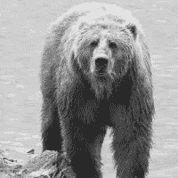

熊将处于未检查状态


小猫将处于选中状态

将这些图片或您自己选择的图片保存在应用程序的`public`目录中，并将图片的`src`属性设置为图片的 URL:

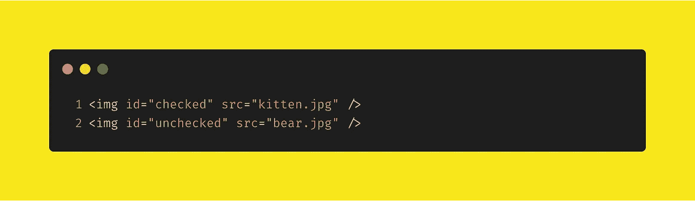

填充的 src 属性

现在标记已经完成了，让我们把它连接到主组件`App.svelte`中来看看。

打开并修改`App.svelte`,使其看起来像这样:

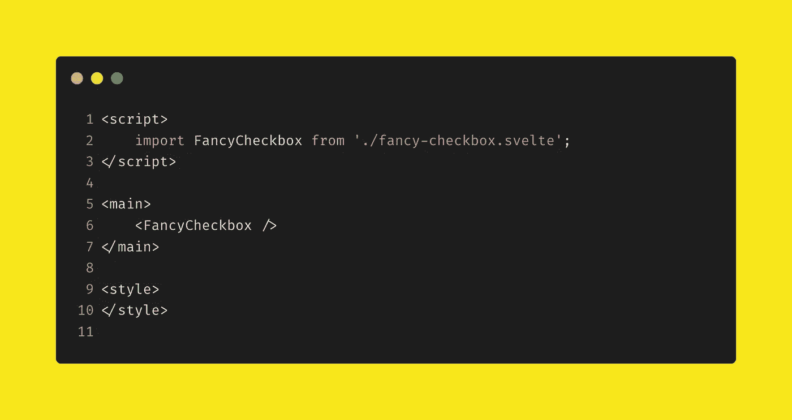

好的——让我们启动开发服务器，看看事情是什么样子的。运行以下命令，在浏览器中打开一个新标签，指向`localhost:5000`

```
npm run dev
```

您应该会看到两张漂亮的图片(如果您正在使用本文中的图片，则是一只小猫和一只熊)和一个小复选框。如果您的图像没有显示，请检查 src 属性值。

## 第三步:风格

这才是真正重要的工作——样式标签。我们保持纯粹的 css(是的，我们使用 SCSS，但编译成 CSS)，所以大部分工作发生在这里是有意义的。

这是完整的样式标签。我们一会儿就来看一下。

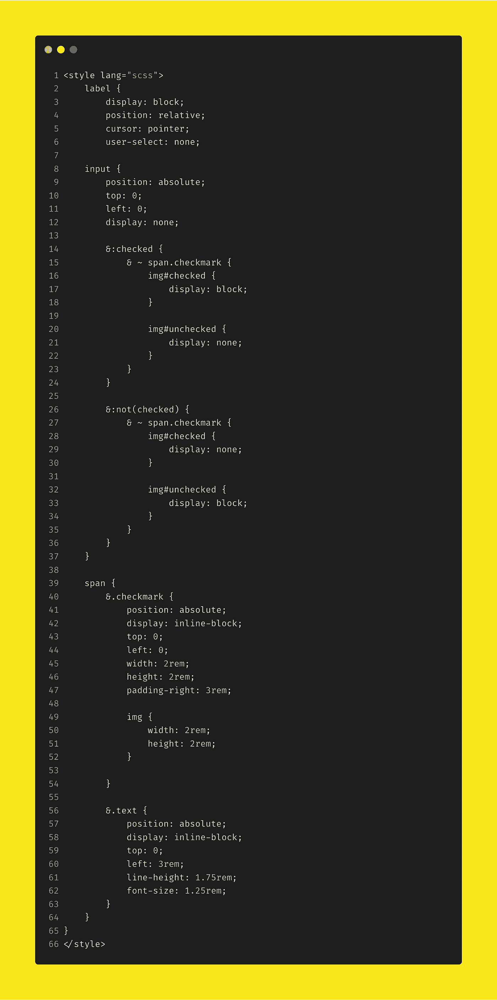

花式复选框组件的完整样式部分

首先要注意的是第 1 行。当我们使用 SCSS 时，我们需要告诉编译器样式标签中的代码是 SCSS，而不仅仅是普通的 CSS。这就是`lang="scss"`的作用。

我不会遍历这个标记的每一行，但是对关键部分的概述将是有用的。

在高层次上，我们在这里做的是隐藏复选框输入，并根据其选中状态，显示或隐藏图像。因为所有内容都包含在标签中，所以点击标签会被视为点击复选框输入本身。

第 14 到 24 行使用复选框的`:checked`属性来显示和隐藏正确的图像。第 26 行到第 37 行以同样的方式工作，但是在被检查的属性上使用 CSS `not`选择器。

第 56 到 64 行为我们喜欢的复选框设置了“标签”。我们现在就处理这个问题。

## **第四步:添加标签**

如果我们要求用户从列表中选择某样东西，给他们一些文本信息，告诉他们选择的是什么，这是一个好主意。

让我们添加一个标签。

将以下内容添加到脚本标记中:

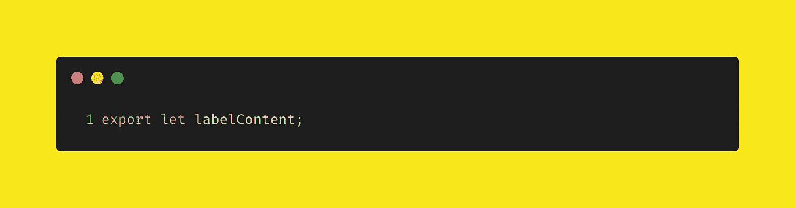

为我们的标签内容设置道具

因为我们正在创建一个可重用的组件，我们不能硬编码一个文本值，我们需要传入一个。这就是这个变量出现的地方。

改变`App.svelte`以便我们的复选框有一个标签。

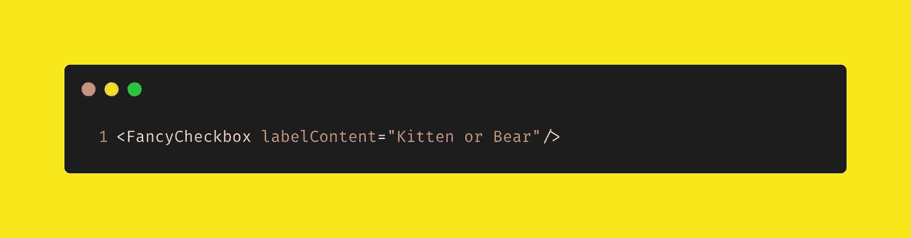

将值从 App 组件传递到 fancy 复选框

最后一步是在我们的 checkbox 组件中呈现我们传递的值*“小猫或熊”*。这是超级简单的苗条。

更改`fancy-checkbox.svelte`的标记部分，以便呈现`labelContent`变量。

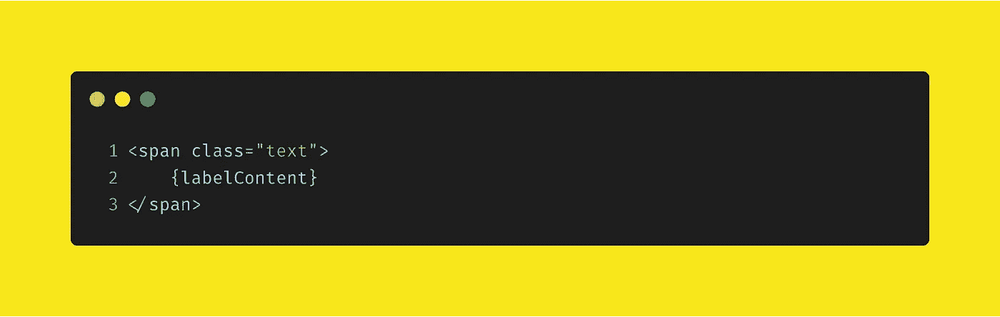

呈现标签文本

如果您还没有这样做，请检查您的浏览器——您现在应该有一个漂亮的带有标签值的复选框。点击它应该会改变图像。

## 第五步:反应

如果我们不能得到它的值，复选框或任何输入都没有任何用处。所以，让我们增加一些反应性。

向 fancy 复选框的脚本标签添加一个变量。这将存储检查的值，并将其转发给应用程序组件。

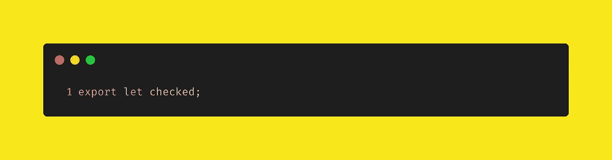

声明一个导出变量—一个属性—来存储和转发选中的状态

现在，我们将该变量绑定到输入的选中状态。我们这样做:

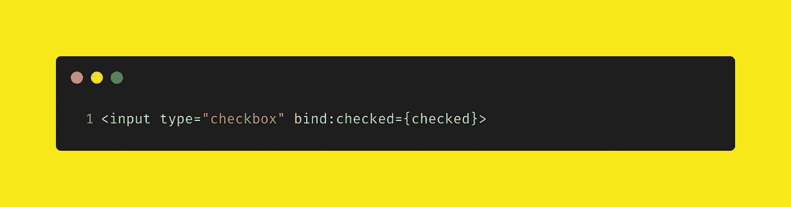

Checked 现在绑定到，嗯，checked

太好了，我们快到了。我们现在需要将绑定值转发给 app 组件。苗条使这真的很容易。

返回到 app 组件，在脚本部分添加以下内容。

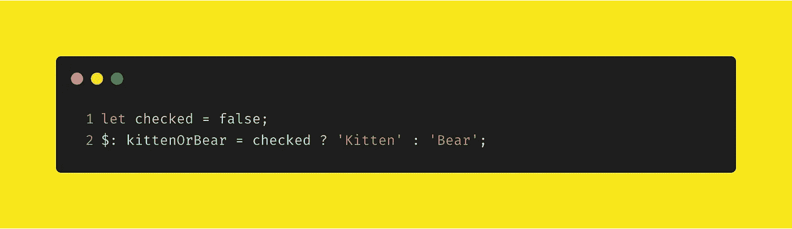

保存检查值的变量和使用它的反应变量

如果你对语法不熟悉，不用担心，我们现在可以跳过它——但是一定要在[苗条网站](https://svelte.dev/)上查看教程。简单地说，使用标签语法表明我们将要做一些需要反应性的事情。

最后，对`App.svelte`做一些额外的补充，如下所示:

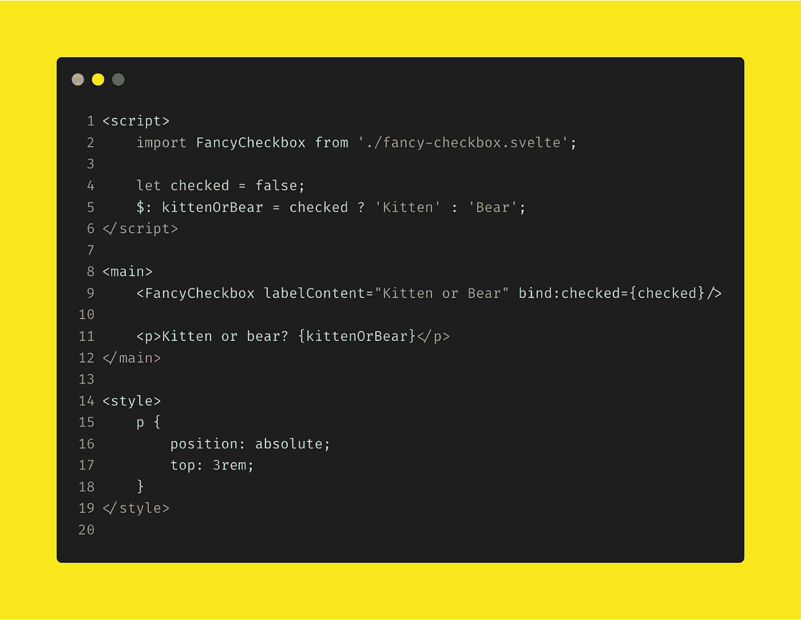

App.svelte 的最终状态

您会注意到在第 9 行添加了`FancyCheckbox`标记。我们将花哨的复选框组件的`checked`属性绑定到第 4 行声明的`checked`属性。

在第 11 行，我们通过使用第 5 行声明的反应变量提供了一些输出——用户选择了一只小猫还是一只熊？

## 好了

跳回浏览器，欣赏手工作品。一个纯 css 的自定义复选框，和一点小糖来连接东西。可爱的东西。

*关于可访问性的快速说明。为了这个例子的目的，输入通过使用* `*display:none*` *被“隐藏”,对于一个例子来说这是好的。但是在生产中要小心使用它，因为屏幕阅读器可能很难为那些有视觉障碍的人翻译你的网站。*