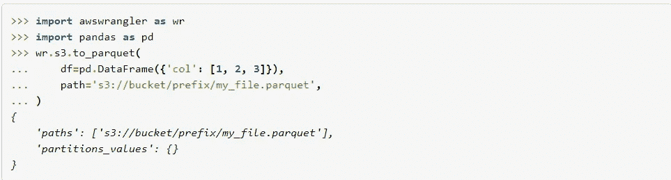
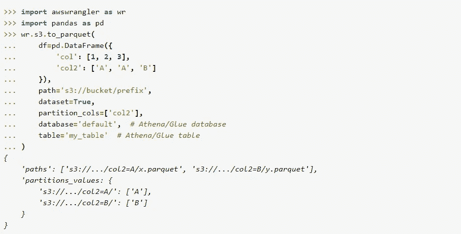
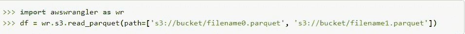
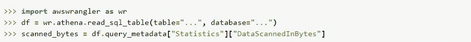

# 再见了 boto3，你不会被错过的！

> 原文：<https://levelup.gitconnected.com/farewell-boto3-you-wont-be-missed-93302e4168f9>

## 我甚至数不清为了封装 boto3 我不得不做了多少次辅助函数…但是痛苦终于结束了！

如果你经常使用 Python 和 AWS，我敢打赌你和我一样，创建几十个库来帮助管理 boto3。这里有一个很好的例子:

这一切都是因为我想把《秘密》当成一本字典…应该没那么难吧！

# 见见 awswrangler！boto3 库应该是

和许多其他人一样，我已经盲目地使用 boto3 很长时间了…但是最近被介绍到 AWS 的新的[**awswrangler**](https://github.com/awslabs/aws-data-wrangler)**库(一个 *n AWS 专业服务开源倡议)*，现在我只是不能相信我们被迫忍受 boto3 这么长时间…**

****

**让我们来看看一些最终变得简单的事情！**

## **获取秘密作为字典？这很简单，先生…**

**字面上的进口和一个班轮…**

## **读/写拼花文件，并使用并发请求推送到 S3**

**使用 pandas 数据帧，一行代码就足以创建拼花地板并推送到 s3。**

****

**AWS 示例见 [s3.to_parquet 文档](https://aws-data-wrangler.readthedocs.io/en/2.4.0-docs/stubs/awswrangler.s3.to_parquet.html#awswrangler.s3.to_parquet)**

**您还可以做更多事情，您可以即时创建/使用/更新 Glue metastore 信息:**

****

**AWS 示例见 [s3.to_parquet 文档](https://aws-data-wrangler.readthedocs.io/en/2.4.0-docs/stubs/awswrangler.s3.to_parquet.html#awswrangler.s3.to_parquet)**

**还有阅读…再一次，非常简单！**

****

**AWS 示例见 [s3.read_parquet 文档](https://aws-data-wrangler.readthedocs.io/en/2.4.0-docs/stubs/awswrangler.s3.read_parquet.html#awswrangler.s3.read_parquet)**

## **从 Glue Metastore 获取所有主要配置**

**[https://gist . github . com/Joao-marques-at-databeyond/1ec 294051d 7197d 911679 c2ac 7376d 07](https://gist.github.com/joao-marques-at-databeyond/1ec294051d7197d911679c2ac7376d07)**

## **从 S3 文件夹复制多个文件到红移**

**[https://gist . github . com/Joao-marques-at-databeyond/4476 c 201 be 47 a 2707444 f 761 a 62 CDC 88](https://gist.github.com/joao-marques-at-databeyond/4476c201be47a2707444f761a62cdc88)**

## **查询雅典娜**

****

**AWS 示例见 [athena.read_sql_table 文档](https://aws-data-wrangler.readthedocs.io/en/2.4.0-docs/stubs/awswrangler.athena.read_sql_table.html#awswrangler.athena.read_sql_table)**

## **还有更多！**

**awswrangler 目前有简单的接口函数**

*   **机密管理器和安全令牌服务(STS)**
*   **EMR，Glue，Athena，S3**
*   **Redshfit，Postgres，MySql，SQL Server**
*   **DynamoDB，时间流**
*   **CloudWatch 日志**
*   **快速瞄准**

# **结论**

**我真的不认为自己会回到 boto3，除非是非常特殊的用例。新的 awswrangler 似乎真的解决了你想用 AWS 做的大部分日常工作，它真的很有效。**