# FastAPI 基础——利用 FastAPI 提高速度

> 原文：<https://levelup.gitconnected.com/fastapi-fundamentals-getting-faster-with-fastapi-866545b841ca>


[https://fastapi.tiangolo.com/](https://fastapi.tiangolo.com/)

FastAPI 是一个现代、快速(高性能)的 web 框架，用于使用 Python 3.7+基于标准 Python 类型提示构建 API。

## 什么是 API？

API 是**应用编程接口**的首字母缩写，它是一个软件中介，允许两个应用程序相互对话。

在 API 的上下文中，接口可以被认为是两个应用程序之间的服务契约。该契约定义了两者如何使用请求和响应相互通信，这些响应消息可以是任何支持的格式，如 XML、JSON、CSV 等。

想象一下，你和你的搭档去一家餐馆吃饭，你想点菜。你会怎么做？打电话给服务员，下订单。现在，后端会发生什么？服务员去找厨师，告诉他点的菜的细节。当菜准备好了，他把它们带给你。这就是 API 通常的工作方式。API 允许客户端访问后端或服务器的特定资源。

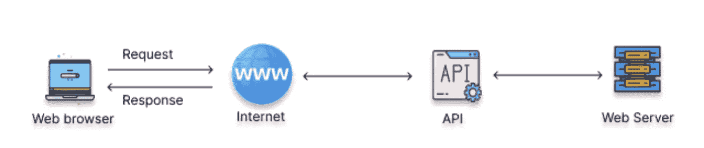

信用:【https://www.analyticsvidhya.com/】T4

# **为什么选择 FastAPI？**

我不会告诉你我们崇拜 FastAPI 的原因是因为它是👇

*   **快**
*   **快速去码**
*   **更少的 bug**
*   **直观**
*   **简单**
*   **短**
*   **健壮**
*   **基于标准的**

你已经知道了，这就是为什么你在读这篇文章📜对吗？？

# 怎么安装？


**通过 pip 安装**

Uvicorn 是 Python 的一个 **ASGI** ( *异步服务器网关接口* ) web 服务器实现。ASGI 是 WSGI 的精神继承者，旨在提供支持异步的 Python web 服务器、框架和应用程序之间的标准接口。

# 让我们创建一个基本的 fastAPI🚀

创建一个基本的 python 脚本，我们将其命名为 *main.py.* 在这个脚本中，我们将导入 fastAPI 并创建一个函数，当通过端点调用时，该函数将返回“Hello World”。这将确保我们已经成功安装了 fastAPI，并且它已经开始运行了&—**【Hello World】**的通用目标😁

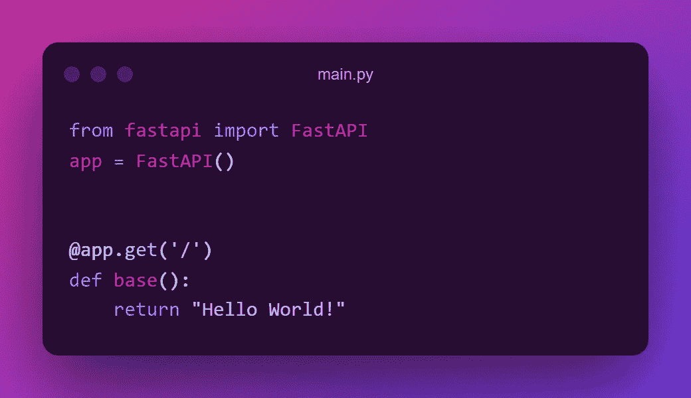

现在为了运行服务器，我们需要在终端中以下面的语法运行 uvicorn。

```
**uvicorn main:app — reload**
```

" **main** " →是模块/脚本名即 main.py(我们不用写。这里的 py 扩展)& " **app** " →是我们在上面的代码片段中创建的类 *FastAPI* 的实例变量。


```
[http://127.0.0.1:8000/](http://127.0.0.1:8000/) 👈running this in a browser( local machine ) will fetch the response of the above API.
```

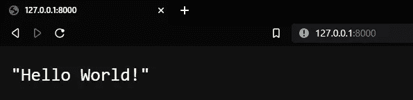

FastAPI 提供了一个叫做 Swagger UI 的交互式 API 文档。对于运行 Swagger UI 在浏览器中运行→[**http://127 . 0 . 0 . 1:8000/docs**](http://127.0.0.1:8000/docs)**。您将看到自动交互 API 文档。**

**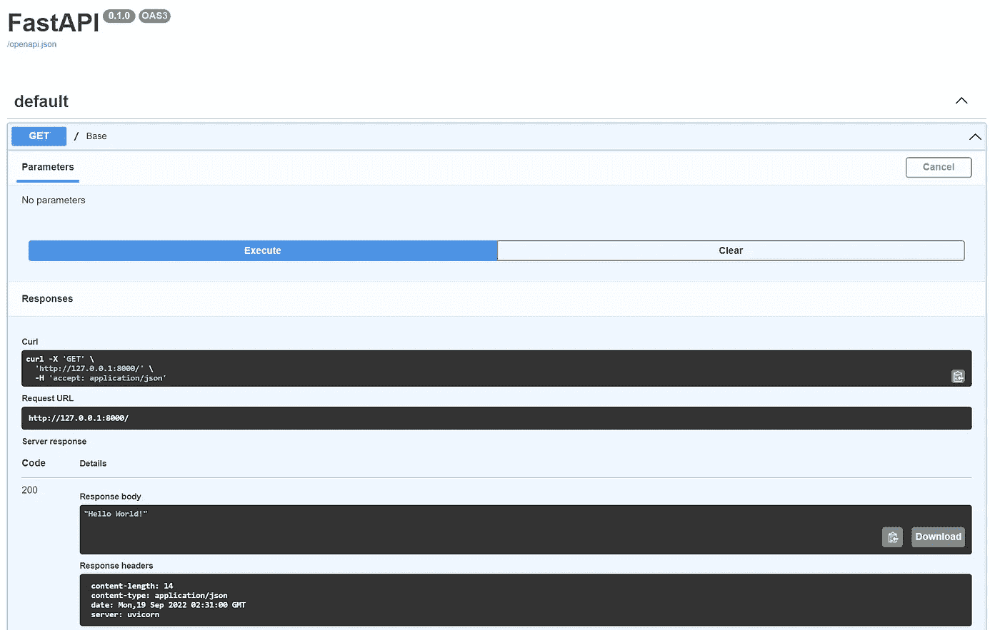**

****霸气 UI****

**所以我们的 API 返回了正确的消息✅，但是等一下，这里刚刚发生了什么⁉️⁉️**

# ****了解路径操作****

# **什么是路径？**

**此 url 的最后一部分👉[http://127 . 0 . 0 . 1:8000/](http://127.0.0.1:8000/)8000 后开始的。所以这里的**“/”**也是一条路径。也被称为**端点/路由/api** 。**

# **什么是手术？**

**操作参考 [HTTP 方法](https://developer.mozilla.org/en-US/docs/Web/HTTP/Methods)。有很多方法，但最常用的 HTTP 方法如下:**

```
**POST :** Create data.**GET :** Retrieve/Read data.**PUT :** Update the data.**DELETE :** Delete data.
```

**这些操作组合在一起称为 ***CRUD*** 操作。**

**回到我们的应用程序。“***@ app . get('/')”***decorator*给出了 **FastAPI** 两条信息。1.这是一个 ***得到*** 的操作。2.路径参数为***“/”。*** 一个 ***装饰器*** 总是被定义在一个函数之上，它接受这个函数并对它做一些事情。这里，每当 **FastAPI** 使用 GET 操作接收到对 URL***"/***的请求时，函数 ***base*** 将被调用。***

***现在我们知道了如何创建端点/路径以及如何在任何函数上修饰它，让我们探索一些使用 GET & POST 方法的例子。***

# ***路径参数***

***路径参数是我们通过路径/端点传递的参数/变量/值。我们需要在 ***{}*** 中声明参数，同样的变量需要在函数中声明为参数。所以端点/路径上的变量将作为参数传递给函数。***

***FastAPI 集成了 Pydantic，因此我们可以获得使用 Python 类型注释进行类型验证的所有好处。我们只需要定义类型，不需要担心后台的数据验证。***

***让我们创建一些端点/API，并查看响应来证明上述陈述。***

*****例 1:*****

***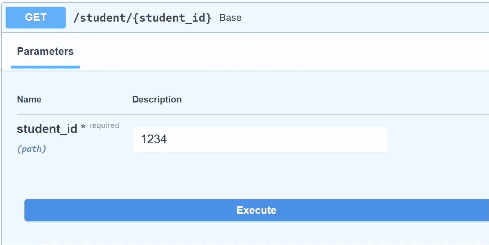***

*****API 文档— Swagger UI*****

******

*****请求 URL &响应正文*****

***注意到了什么👆尽管我们将 1234 作为路径参数传递，但它被解析为一个字符串，当我们在 python 脚本中接受输入时会发生什么呢？是的，我们在这里面临着同样的问题。但是在这里，它们是 URL 的一部分，它们是“自然”的字符串。如果我们传递一个 float 或 date 对象会发生什么？好奇？？自己测试一下——这是唯一的学习方法！！！***

***现在让我们看看第二个例子，我们已经处理了类型👇。***

*****例 2:*****

***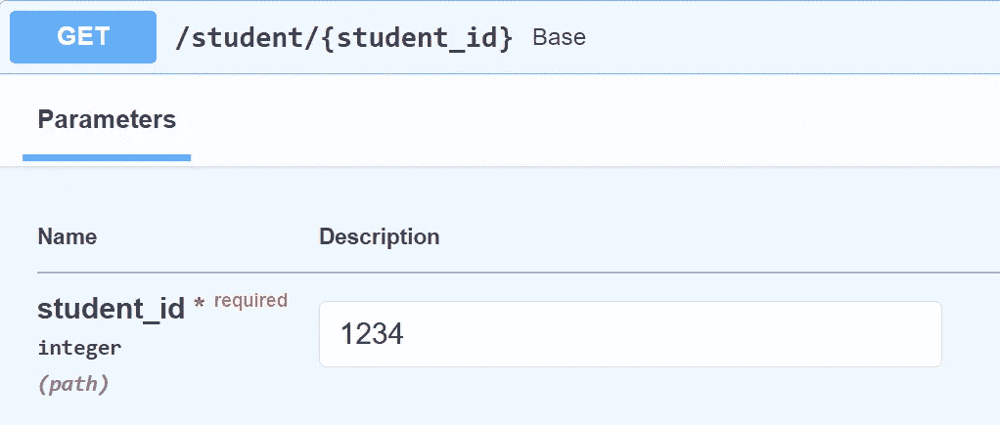***

*****API 文档— Swagger UI*****

***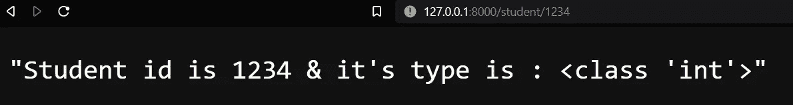***

*****请求 URL &响应正文*****

***结果在意料之中🌟。这是因为当我们声明数据类型时，首先将它们转换成该类型，然后根据它进行验证。但是如果我们传递除了 int 以外的任何值，会发生什么呢？我们去看看。***

***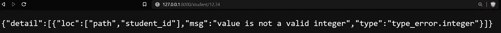***

*****当通过一个浮动时*****

***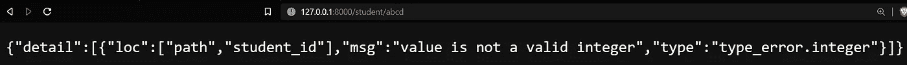***

*****当传递了一个字符串*****

# ***查询参数***

***你有没有在搜索引擎上输入一个地址，结果却是它返回一个又长又复杂的带有等号和问号的东西？***

***查询参数可以定义为出现在**"？"之后的可选键-值对**在 URL 中由**、&、**字符分隔。***

***问号符号用于分隔路径和查询参数。***

## ***路径和查询参数之间的区别？***

1.  ***路径参数出现在**"？"**在 URL 中，而查询参数跟在它后面。***
2.  ***路径参数标识特定的资源，而查询参数用于排序/过滤资源。***
3.  ***您不能省略路径参数中的值，但在查询中可以。***

***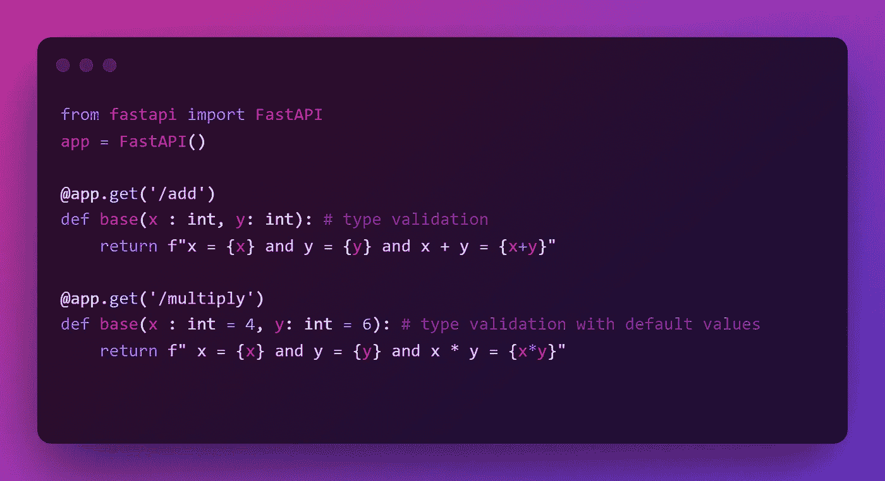***

*****查询参数示例*****

***我们已经定义了两个端点一个 **"/add"** ，它需要两个查询参数 x & y，我们已经使用类型注释处理了类型，另一个是 **"/multiply"** ，它也是一样的，除了它有一个默认值，我们也可以使用 None 定义一些可选参数，但是我们将在 **POST** 方法中介绍。***

***当我们用 Python 类型声明参数时，它们被转换成该类型并根据该类型进行验证。***

***让我们在[迅雷客户端](https://www.thunderclient.com/)中测试一下。***

***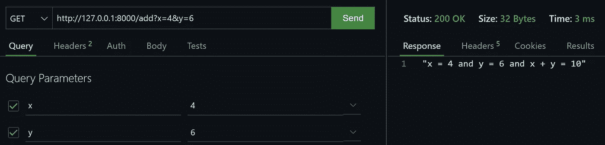***

*****带类型验证的查询*****

***“/add”的网址为: [http://127.0.0.1:8000/add？x=4 & y=6](http://127.0.0.1:8000/add?x=4&y=6)***

***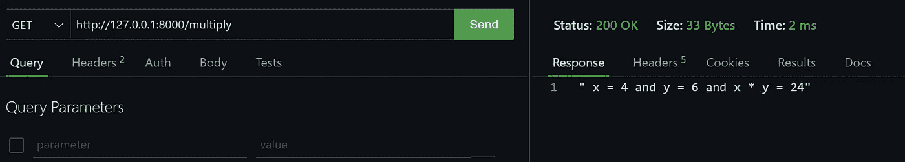***

*****用默认值查询*****

***“/multiply”的 URL 是:[http://127 . 0 . 0 . 1:8000/multiply](http://127.0.0.1:8000/multiply)，这里的 URL 是不同的，没有“？”或“&”符号，这要归功于默认值，当不通过任何查询时使用默认值，如果我们提供一个，它会覆盖默认值。请参见下面的查询***

***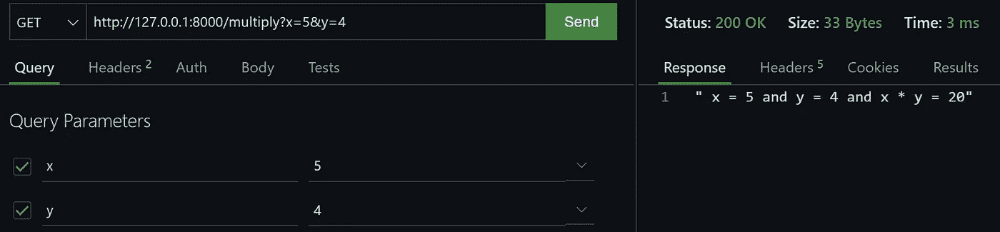***

*****覆盖默认值*****

# ***请求正文***

***响应的反面是一个请求，其中客户端需要通过 API 向服务器端发送数据。为了发送数据，我们通常使用 POST 方法。同样为了数据验证，我们使用 pydantic 的*基本模型*。使用 ***BaseModel*** 我们定义一个类/模型，并声明所有需要的数据/字段及其类型。如果一些值被初始化，则不需要，否则需要&我们可以通过使用 *None 使一个值可选。*点击阅读更多关于 Pydantic [的信息。](https://pydantic-docs.helpmanual.io/)***

***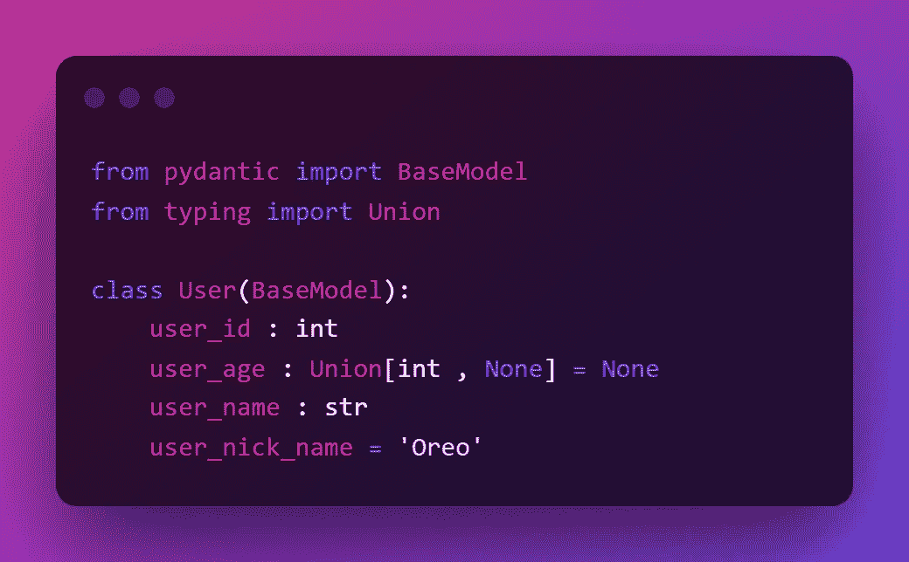***

*****使用基本模型的模型类*****

***这里👆：***

1.  ***user_id 是必需的，并且必须是整数数据类型。***
2.  ***user_age 是一个可选值，如果传递需要一个整数。***
3.  ***user_name 是必需的，并且必须是字符串数据类型。***
4.  ***user_nick_name 是必需的&传递时需要是一个字符串，如果没有传递任何内容，则它的默认值为‘Oreo’。***

***默认值的类型自动设置字段的类型。***

***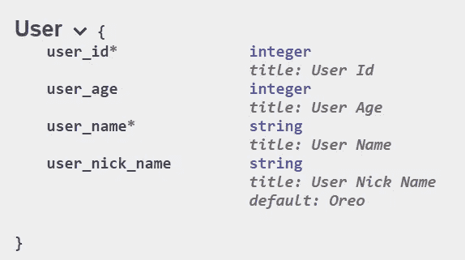***

*****JSON 模式*****

***首先，我们将通过所有字段。***

***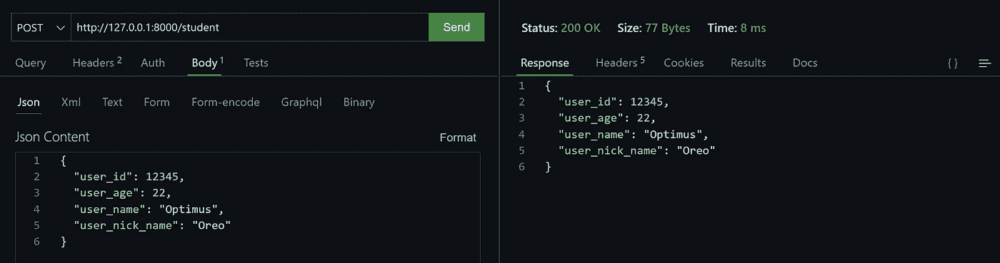***

***在上面的例子中，只有 user_age 是可选的，所以让我们发送一个请求，丢弃可选值。***

***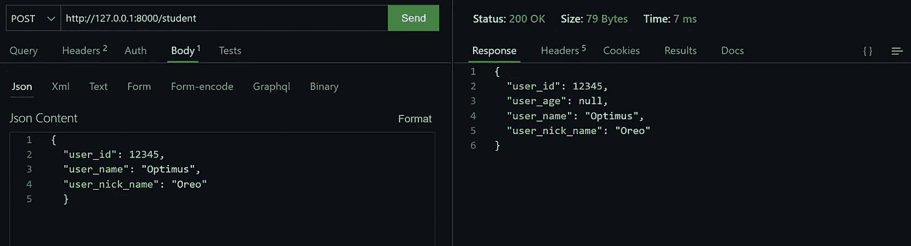***

***所以，这几乎是你开始使用 FastAPI 所需要知道的所有基础知识。我希望你喜欢这篇文章。另一个话题再见👋***

## ***感谢阅读🙏继续学习🧠保持敬畏🤘***