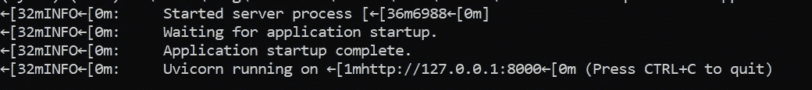
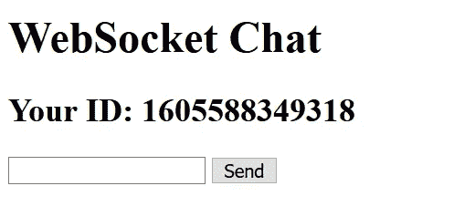
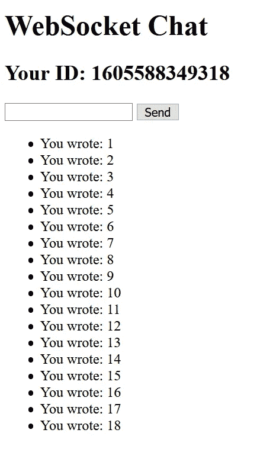

# FastAPI:如何成批处理传入的请求

> 原文：<https://levelup.gitconnected.com/fastapi-how-to-process-incoming-requests-in-batches-b384a1406ec>

在 FastAPI 中利用 WebSockets、Queue 和 APScheduler 进行批处理


由[米赫利·克勒斯](https://unsplash.com/@mihaly_koles?utm_source=unsplash&utm_medium=referral&utm_content=creditCopyText)在 [Unsplash](https://unsplash.com/s/photos/queue?utm_source=unsplash&utm_medium=referral&utm_content=creditCopyText) 拍摄的照片

在本教程中，我将分享一个我在周末进行的简单实验。基本思想是将所有传入的请求排队，每次以一定的时间间隔分批处理。为此，我们将

1.  通过 WebSockets 在客户端和我们的服务器之间建立双向连接。
2.  将传入的请求存储在队列中
3.  运行调度程序并成批处理请求
4.  通过 WebSockets 将响应返回给用户

该架构相当简单，对于我们的案例研究来说已经足够好了。请注意，如果您正在寻找生产就绪的解决方案，您应该根据您的用例使用 RabbitMQ(消息代理)或 Celery(分布式任务队列)。

让我们继续下一部分，开始安装必要的模块

# 设置

## 安装 FastAPI

强烈建议您在继续之前创建一个虚拟环境。激活您的虚拟环境并运行以下命令来安装 FastAPI。

```
pip install fastapi
```

## 安装 Uvicorn

为了运行 FastAPI，您需要有一个 ASGI 服务器。我将使用 Uvicorn，因为它是推荐的 ASGI 服务器。

您可以选择最小安装或标准安装。对于标准安装，运行以下命令

```
pip install uvicorn[standard]
```

对于最小依赖性，您可以如下安装:

```
pip install uvicorn
```

然而，最小软件包没有基于 Cython 的依赖项和其他额外选项，如 WebSockets。让我们按如下方式手动安装它:

```
pip install websockets
```

## 安装日程安排器

接下来，运行下面的命令来安装 apscheduler，这是一个进程内任务调度器，具有类似 Cron 的 Python 功能。

```
pip install apscheduler
```

之前我写过一篇关于它的教程，名为[APS cheduler](https://medium.com/better-programming/introduction-to-apscheduler-86337f3bb4a6)介绍。请随意查看。

# 履行

在本节中，我们将实现我们的 FastAPI 服务器。实现基于 FastAPI [官方文档](https://fastapi.tiangolo.com/advanced/websockets/?h=+webs#handling-disconnections-and-multiple-clients)中提供的 WebSockets 教程。创建一个名为`myapp.py`的新 Python 文件。你可以随意给它取任何你喜欢的名字。

## 添加导入

在 Python 文件的顶部添加以下导入语句

```
from typing import List
import queue
from fastapi import FastAPI, WebSocket, WebSocketDisconnect
from fastapi.responses import HTMLResponse
from apscheduler.schedulers.asyncio import AsyncIOScheduler
```

`AsyncIOScheduler`用于运行基于本机协同程序(异步定义)的作业。

## 初始化变量

初始化下列变量。

```
app = FastAPI()
app.queue_system = queue.Queue()
app.queue_limit = 5
```

*   `queue_system` —应用级队列对象。我们将把所有数据存储在里面，以便以后处理。
*   `queue_limit` —单个批次中要处理的项目数量。在这种情况下，它将在每个调度期间处理队列中的 5 个传入请求。

接下来，让我们为 HTML 文档创建一个长字符串。它包含调用我们的 FastAPI 服务器所需的 HTML 元素和 JavaScript 代码。我们将把它作为前端网页，以获得用户的输入。或者，您可以使用 Jinja2 模板引擎为其提供服务，或者使用 React/Angular/Vue 构建前端应用程序。

## 正在创建 ConnectionManager 类

让我们创建一个新的 Python 类来处理`websocket`连接。初始化一个新实例，并将其赋给一个变量。我们以后会用到它。

## 创建任务计划程序

为我们的调度程序创建一个新的`async`函数。你可以给它起任何你喜欢的名字。在这个函数中，我们将根据之前设置的`queue_limit`循环执行我们的流程。

检查队列是否为空以及相应的 websocket 是否仍处于活动状态非常重要。这可以确保我们的服务器可以正常运行，如果用户在您完成执行之前关闭浏览器并断开与您的服务器的连接。

之后，实现您自己的自定义执行，并通过我们在`ConnectionManager`类中定义的`send_personal_message`函数将结果发送回用户。

下一步是设置我们的调度函数。初始化一个新的`AsyncIOScheduler` 实例，并通过`add_job`功能向其添加一个新任务。我把它设置成每 5 秒钟运行一次。通过调用`start`函数正常启动。

正确的做法是，一旦使用完调度程序实例，就应该优雅地关闭它。您可以通过使用 [atexit 模块](https://medium.com/better-programming/create-exit-handlers-for-your-python-appl-bc279e796b6b)或 [FastAPI 事件处理程序](/4-useful-advanced-features-in-fastapi-f08e4db59637)轻松实现它。

## 实现 FastAPI 路由

最后，让我们实现两条 FastAPI 路线:

*   `main` —将我们的 HTML 长字符串作为 HTMLResponse 提供给用户的路径
*   `websocket_endpoint` —用于处理来自用户的传入 websocket 请求的路由。它将所有传入的请求作为字典存储在`queue_system`变量中。

## 正在启动 FastAPI 服务器

保存文件并运行以下命令来启动它。相应地修改名称。

```
uvicorn myapp:app
```

您应该在控制台上看到以下输出



作者图片

在浏览器中打开以下 URL

```
[http://localhost:8000/](http://localhost:8000/)
```

用户界面看起来像这样。请注意，ID 会有所不同，因为它是基于当前时间戳的。



作者图片

让我们向我们的服务器发送几条消息。我将发送一个从 1 到 18 的数字。通过这样做，我们将知道响应是否

*   按顺序(应该返回 1，2，3，4，5，… 17，18)
*   每 5 秒钟分批处理 5 个请求

你必须尽快去验证它。如果有问题，请尝试以下方法:

*   减少`queue_limit`的值
*   增加调度程序的间隔时间

在一天结束时，您应该从 FastAPI 服务器得到以下响应，表明这些响应实际上是有序的，并且是成批处理的。



作者图片

你可以在下面的 [Github gist](https://gist.github.com/wfng92/f7a125808ea3b2f9ee0ee84976da694b) 找到完整的代码。

强烈建议查看以下文章，了解有关 FastAPI 的更多信息:

*   [从烧瓶顺利迁移到 FastAPI】](https://medium.com/better-programming/migrate-from-flask-to-fastapi-smoothly-cc4c6c255397)
*   [FastAPI 中 4 个有用的高级特性](/4-useful-advanced-features-in-fastapi-f08e4db59637)
*   [FastAPI 中的元数据和附加响应](https://medium.com/better-programming/metadata-and-additional-responses-in-fastapi-ea90a321d477)
*   [如何在 FastAPI 中保存上传的文件](/how-to-save-uploaded-files-in-fastapi-90786851f1d3)
*   [如何用 Bash 脚本重启 FastAPI 服务器](/how-to-restart-fastapi-server-with-bash-script-f05a5bfcec5c)

# 结论

祝贺您完成本教程。让我们回顾一下今天所学的内容。

我们首先简要介绍了案例研究的概况和架构。基本要点是成批处理传入的请求，并将响应发送回用户。

接下来，我们通过`pip install`为我们的项目安装必要的模块。

我们继续实现并编写了一个简单的 FastAPI 服务器文件，总共不到 100 行。最后，我们在浏览器上对它进行了测试，以确保它能够正常工作。

感谢你阅读这篇文章。希望在下一篇文章中再见到你！

# 参考

1.  [Mozilla 编写 Websocket 客户端应用](https://developer.mozilla.org/en-US/docs/Web/API/WebSockets_API/Writing_WebSocket_client_applications)
2.  [FastAPI WebSockets](https://fastapi.tiangolo.com/advanced/websockets/?h=+webs#handling-disconnections-and-multiple-clients)