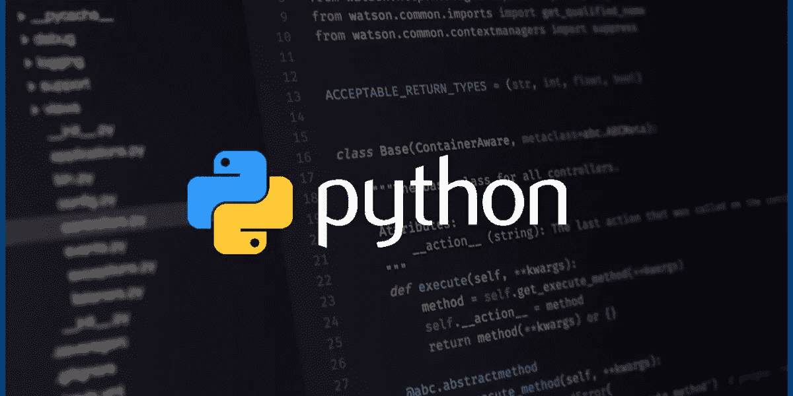

# 使用 Python 缓存加快代码速度

> 原文：<https://levelup.gitconnected.com/faster-code-with-python-caching-8da6e8a92ae9>



大家好！在本文中，我将讨论 python 中的缓存。我将主要谈论来自`functools`标准图书馆的`cached_property`和`lru_cache`装饰者。

## 什么是缓存？

缓存是将一些结果/数据存储到内存(非易失性:硬盘驱动器和 SSD，或易失性:ram 和 CPU 缓存)中的操作，以便在下次需要时快速检索它们(不需要重新计算结果)。

## 如何在 python 中使用？

假设您有下面这个简单的类，它包含了一个列表，并增加了对它执行总求和的能力:

```
class advanced_list:
    def __init__(self, vals_list):
        self.values = vals_list def sum(self):
        return sum(self.values)
```

我们可以这样使用它:

```
my_list = advanced_list([1] * 10000000) # a list of 10 million onesmy_list.sum() # outputs: 10000000
```

每次我们调用`my_list.sum()`，它都会遍历列表并计算总和。如果列表保持不变，这可能会很耗时，而且没有必要。

我们可以这样解决它:

```
class advanced_list:
    def __init__(self, vals_list):
        self.values = vals_list
        self._sum = None

    def sum(self):
        if self._sum is None:
            self._sum = sum(self.values)

        return self._sum
```

这样更好更快。我们只计算一次总和，存储，然后立即返回存储的值。然而，如果你有很多相似的方法(例如，均值、标准差、方差等等)，这将会很难维护。

简单地说，我们可以使用`cached_property`装饰器来包装我们的方法，并确保与上面相同的功能，但是代码要干净得多。

在 python 3.8 中，`cached_property`是`functools`标准库的一部分。但是，对于 python 3 以前的版本，您需要`pip install cached_property`。

下面是我们新代码的样子:

```
from functools import cached_propertyclass advanced_list:
    def __init__(self, vals_list):
        self.values = vals_list @cached_property
    def sum(self):
        return sum(self.values)
```

在这种情况下，我们保持了最初的实现，并且我们只在每个方法的顶部添加了装饰器。这里唯一的区别是调用方法。它变成了一个属性，这意味着您将它作为对象的典型属性来引用。

```
my_list.sum   # instead of my_list.sum()
```

现在，在我们结束之前，让我们做一些基本的基准测试:

```
from time import timemy_list = advanced_list([1] * 10000000)
# First time
start = time()
my_list.sum
end = time()
print(f"{(end - start):.5f} second") # 0.03787 second# Second time
start = time()
my_list.sum
end = time()
print(f"{(end - start):.5f} second") # 0.00004 second
```

我们可以看到，对于这样一个愚蠢的计算，我们能够节省大量的时间。这在测试和生产中都很有价值。在这种情况下，唯一的缺点是列表不能更改(至少不能显式更改)，如果发生这种情况，我们将不得不使该属性的缓存无效(清除它)(以便它重新计算总和)。简单地说，您可以像这样使它无效/清除它:

```
del my_list.sum
```

所以，现在我们有了一个想法，如何缓存这样简单的方法，并将其转换为属性(~attributes)。但是如果这个方法需要参数呢？

别担心，`functools`还有我们呢！我们可以从那里导入`lru_cache`装饰器，并在它们上面使用。让我们开始吧。

假设我们正在执行一项昂贵的计算(数据库读取、复杂的数学计算)，需要一段时间才能得到结果:

```
from time import sleep
def get_value_from_db(row_id, table_name):
    sleep(2) # pause for 2 seconds
    return somethingmy_row = get_value_from_db(111, 'my_table')
```

这里，我们假设`sleep`使用行的 id 和表的名称从数据库(或 API 调用)中检索一行，这需要 2 秒钟。让我们也假设我们的数据库不经常改变。每次我们调用这个函数，至少需要 2 秒钟返回结果。这对于一个调用来说是没问题的，但是如果我们执行多个具有相同参数的调用，那么这将会非常缓慢和低效。

为了缓解这一问题，我们采取了以下措施:

```
from time import sleep
from functools import lru_cache@lru_cache(max_size=100)
def get_value_from_db(row_id, table_name):
    sleep(2) # pause for 2 seconds
    return somethingmy_row = get_value_from_db(111,'my_table')
.
.
.
my_row = get_value_from_db(111,'my_table') #this is going to be fast
```

在这种情况下，`lru_cache`所做的是存储多达 100 组不同的参数(例如，(111，' my_table ')，(222，' your_table ')，…)，并缓存它们的结果(假设它们总是返回相同的结果)。`lru`指“最近最少使用”的缓存替换策略。这意味着只要缓存满了，就删除最近最少使用的结果(或参数)。

此外，我们可以通过以下调用来检查缓存:

```
get_value_from_db.cache_info()
#output: CacheInfo(hits=3, misses=8, maxsize=100, currsize=8)
```

A **hit** 是我们调用函数，在缓存中找到结果，a **miss** 则相反(我们在缓存中没有找到)，而 **currsize** 是缓存结果的个数。

最后，如果我们想使缓存无效(清除它)，我们可以做`get_value_from_db.cache_clear()`，它释放缓存并重置计数器。

## 重要注意事项:

*   在多线程中使用它们时，您需要更加小心。
*   使用的缓存介质是内存，而不是存储设备。
*   在使用它之前，确保你缓存的操作需要更多的时间来完成；否则开销不值得。
*   此外，确保缓存结果没有坏处。如果你正在调用一个根据时间给出不同结果的 API，不要缓存，或者确保在需要的时候使你的缓存失效。
*   使用`lru_cache`，函数的参数应该是可散列的(例如，元组是可散列的，列表不是)。

## 进一步阅读

*   [https://en . Wikipedia . org/wiki/Cache _(计算)](https://en.wikipedia.org/wiki/Cache_(computing))
*   [https://docs . python . org/3/library/func tools . html # func tools . LRU _ cache](https://docs.python.org/3/library/functools.html#functools.lru_cache)
*   [https://docs.python.org/dev/library/functools.html?highlight = s # func tools . cached _ property](https://docs.python.org/dev/library/functools.html?highlight=s#functools.cached_property)
*   [https://github.com/pydanny/cached-property](https://github.com/pydanny/cached-property)