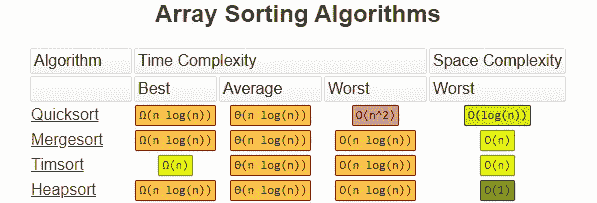

# Python 中的快速列表

> 原文：<https://levelup.gitconnected.com/faster-lists-in-python-4c4287502f0a>


来源:Inverse.com

Python 列表是漂亮的动态数据结构。它们是许多事情的首选数据结构，所以意识到每个操作的速度是最重要的。这通常被称为解决方案的大 O 或时间复杂度。

# **列表创建**

在 python 中有许多创建数组的方法，所以让我们看看哪种方法花费的时间最少。下面是我们使用的设置:

**列表理解**是创建数组的第一种方法。它们简单易读，这使得它们也很容易写。

```
listComp = [i for i in range(0, end)]
```

**追加**是下一个方法。我倾向于使用这个解决方案，因为它是更容易使用的解决方案之一。这类似于在大多数其他语言中添加列表的方式。

```
append_list = []
for i in range(0,end):
  append_list.append(i)
```

**预分配**是我们将测试的最终方法。这只适用于具有预定长度的数组。这涉及到预先创建所有的数组对象，然后通过索引修改它们的值。

```
preAllocate = [0] * end
for i in range(0, end):
  preAllocate[i] = i
```

**结果:**虽然列表理解在这里并不总是最有意义，但它们显然是赢家。我不建议你尝试把每个 for 循环都塞进一个理解中。当您使用简单的 for 循环或创建特别大的数组时，它才有意义。

```
**Method:            Median Time:**
listComprehension  0.5556 ms
preAllocate        1.1466 ms
append             1.3842 ms
```

# 比较列表

对此的测试与上面的类似。我们用 0 到 50，000 之间的 50，000 个随机数创建了两个列表。然后我们比较这两个列表，看看是否

**Double For 循环:**这应该有 O(n)的时间复杂度。对于每个元素，我们必须遍历第二个列表的一部分或全部。

```
for i in list_a:
  for j in list_b:
    if i == j:
      break
```

**在搜索:**‘在’的时间复杂度比较混乱。知道 double for 循环在 O(n)时间内执行，那么“in”访问以类似的方式操作是有意义的。好像没有。它似乎在更接近 O(n log n)的时间内运行。如果有人碰巧熟悉 CPython 中的“in”实现，请在下面留下评论，我会在这里给出答案。

```
for i in list_a:
  if i in list_b:
    continue
```

**集合搜索**时间复杂度略有不同。Python 中 set 的实现本质上是一个散列表，因此它的访问速度为 O(1)。因此，因为我们遍历列表一次，并且检查第二个列表是 O(1)操作，所以集合搜索应该在 O(n)时间内操作。

```
unique = set(list_b)
for i in list_a:
  if i in unique:
    continue
```

**结果:**与器械包的比较非常好。对于任何想知道的人来说，double for 循环是一个我从来没有想到会做得很好的循环。让我感到惊讶的是使用' in '操作符比使用 double for 少花了多少时间。

```
**Method:       Median Time:   Big O:** Set Syntax:   0.0046ms       O(n)
In Syntax:    3.4710ms       O(n log n)
Double For:   42.3418ms      O(n^2)
```

# **排序列表**

在最后一节中，我们将讨论 python 中的列表排序。有很多常见的排序算法我们会比较。要查看更完整的排序算法列表，请查看 [StackAbuse](https://stackabuse.com/sorting-algorithms-in-python/) 了解更多信息。

当谈到排序时，我们需要记住有稳定和不稳定的排序算法。如果算法保持相等项的原始顺序，那么它就是稳定的。下面是一个说明稳定性为何如此重要的例子:

## **稳定例子**

假设我们的代码中有一个 bug，我们想看看哪里出错了。我们可能会查看日志文件，并按用户对请求进行排序。以下是我们的示例日志文件:

```
user10: { 'request_number': 2 }
user11: { 'request_number': 1 }
user10: { 'request_number': 1 }
```

在不稳定排序中，我们可能会得到类似这样的结果，其中请求是由用户排序的，但是因为它不稳定，我们丢失了事件的原始序列。我们可能永远也不会发现我们的 bug，因为我们无法看到 user10 让请求 2 在请求 1 之前到达服务器。

```
# Unstable Sort Result
user10: { 'request_number': 1 }
user10: { 'request_number': 2 }
user11: { 'request_number': 1 }# Stable Sort Result
user10: { 'request_number': 2 }
user10: { 'request_number': 1 }
user11: { 'request_number': 1 }
```

**堆排序**的典型时间复杂度为 O(n log n)。然而，这不是一种稳定的排序算法，因此无法保证项目将处于其原始顺序。该算法的工作原理是将项目放置在一棵二叉树上，该二叉树的根节点是最大值。然后，它将解构该树以形成排序后的数组。

**Mergesort** 是一个分治算法，典型的时间复杂度为 O(n log n)。该算法将列表分成两半，这两半各占一半，直到剩下单独的元素。然后这些元素被配对、排序并重复合并，直到列表再次完整。这种算法是稳定的，所以它是伟大的地方是必要的。

**快速排序**是一种非常常用的算法，因为它易于实现，平均时间复杂度为 O(n log n)。这样做的问题是，一切都是基于选择一个已经在适当位置的好支点，并围绕它进行排序。选择一个差的支点可能导致 O(n)时间复杂度。这与它不稳定的事实联系在一起，导致我不推荐它。

**Timsort** 是一种你可能从未听说过的排序。这种排序以其发明者 Tim Peters 的名字命名，是二分搜索法、插入排序和合并排序的组合。它的平均时间复杂度是 O(n log n ),但是它能够以更好的一致性达到这一点，并且具有 O(n)的最佳情况复杂度。此外，这是一个稳定的算法，这使得它可以在任何地方使用。

最好的部分是在 python 中使用 Timsort 只需要一行代码。没错。它是内置的排序函数。

```
array.sort()
```

**结果:** Timsort 优于所有其他算法，这就是为什么它是 python 的核心排序算法。下一个合并排序和快速排序并驾齐驱。最后，Heapsort 排在最后…至少是这个列表的最后。还有很多更差的排序算法，比如随机排序。

```
**Algorithm:**   **Time:**          
timsort      0.001594 ms
mergesort    0.033845 ms
quicksort    0.097097 ms
heapsort     0.365555 ms
```

这里有一个图表显示了所有这些排序算法的主要部分。此外，我们还有空间复杂度，即完成算法需要多少额外的空间。



这就是这个列表的全部内容。现在向前迈进，在你的日常 Python 中使用这些，并跟随获得更多的提示和技巧。