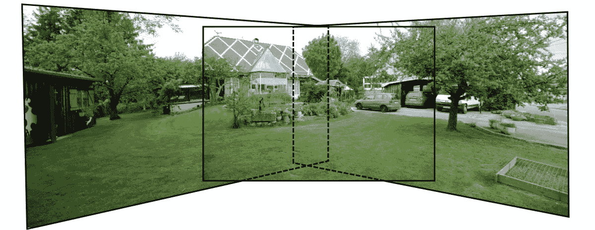
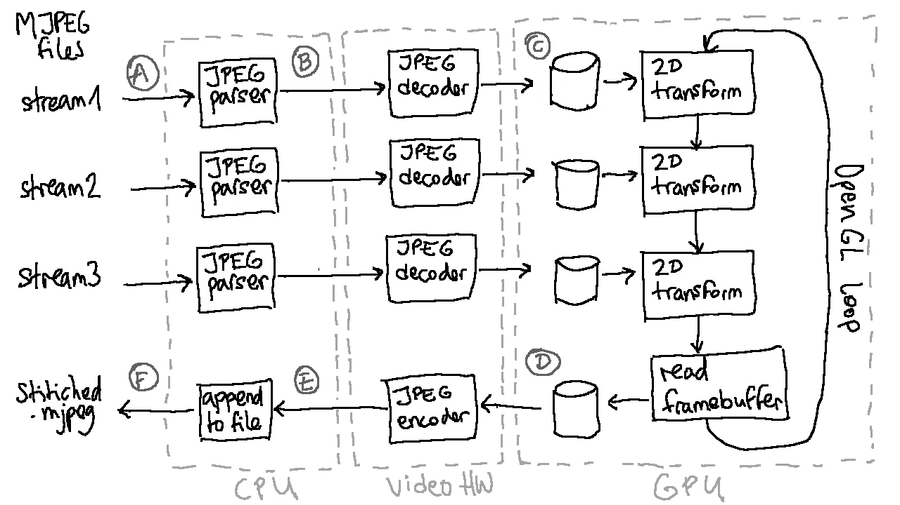
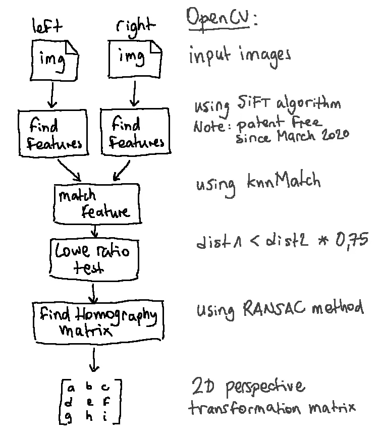
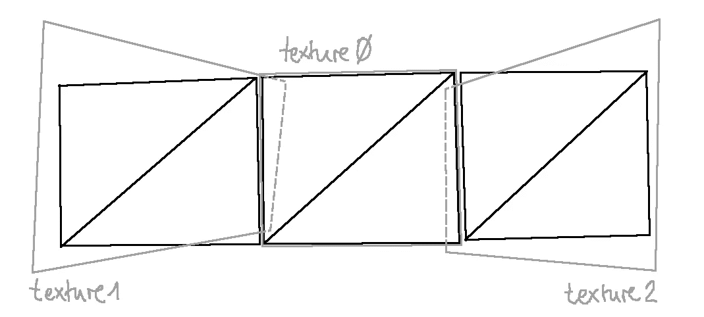
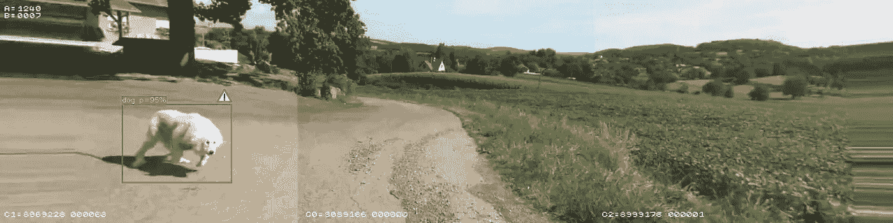

# 基于 GPU 的硬件加速视频拼接

> 原文：<https://levelup.gitconnected.com/faster-video-stitching-with-opengl-9e9132c72def>



> 用 OpenCV 拼接当然很好，但是如果你想用普通的 OpenGL 在 GPU 上用硬件来完成呢？

## 介绍

OpenCV 附带了一个高级的样本实现，可以在静态图像上产生很好的效果，然而，在视频流的每一帧上使用这个程序毫无疑问会非常慢*。这是使用树莓派制作[360°视频的解决方案。](https://medium.com/@vejipe/360-video-stitching-with-raspberry-pi-and-opencv-30549b37acbc)*

*这篇文章是上一篇文章的后续，在上一篇文章中，视频帧通过 OpenCV 在 CPU 上进行转换，并介绍了一个完整的 GPU 管道。*

*需要注意的是，OpenCV 对很多操作都有 GPU 支持，但是启用它仍然会导致很多低效的数据在 CPU 和 GPU 之间来回复制。*

# *为什么是 OpenGL 而不是 OpenCV？*

*针对低延迟和实时视频拼接，OpenCV 2D 像素变换被一个迷你 OpenGL 3D 引擎所取代。*

*它有多种好处:*

*   *摄像机 ISP 或硬件视频解码器可以将视频帧直接传送到 GPU 中的 OpenGL 纹理(避免通过 CPU 复制缓冲区)*
*   *GPU 具有针对像素处理和纹理采样的特定硬件加速*
*   *拼接帧已经在 GPU 中，几乎没有延迟就可以推送显示*
*   *OpenGL 是一个开放标准，对大多数嵌入式目标都有很好的支持*

*它也有缺点:*

*   *将 OpenGL 帧缓冲区读回 CPU 内存通常很慢且效率低下*
*   *OpenGL 渲染功能(特别是。OpenGL ES)通常依赖于连接的屏幕(例如，渲染速度不能超过 60fps)*
*   *OpenGL 的 API 很大，理解起来很复杂*

# *一种嵌入式视频拼接架构*

**

*涉及 CPU、视频硬件和 GPU 的拼接流水线*

*🅐 — CPU 从 MJPEG(即连接的 JPEG 文件)中读取流
🅑 — JPEG 解析器在流中查找单个帧，并将其与捕获时间戳相关联。
🅒——硬件 JPEG 解码器向 OpenGL 纹理缓冲区生成一个位图帧。
🅓——GPU 对每个纹理进行采样，以应用 2D 透视变换(使用像素着色器)
🅔——GPU 输出帧缓冲区由 JPEG 编码硬件读回
🅕——CPU 获得回调，并将 JPEG 缓冲区附加到输出文件*

## *介绍 Inatech 的开源缝合器*

*in astight 是一个开源项目，旨在实现这个拼接管道:*

*[](https://github.com/inastitch/inastitch) [## 不缝合/不缝合

### Inatech stitcher。在 GitHub 上创建一个帐户，为 in astight/in astight 的发展做出贡献。

github.com](https://github.com/inastitch/inastitch) 

注意:在撰写本文时，硬件 JPEG 解码还没有实现，解码/编码是在 CPU 上用`libturbojpeg`完成的(由于 CPU 矢量化，仍然非常快)。

# 内部**in 针脚**

**inastitch** 将一组视频流、帧时间戳以及每个流的 2D 变换矩阵作为输入。

同步的视频流和时间戳由改进的 Raspberry Pi 相机工具生成:**raspivid-inatech**
[https://github.com/inastitch/raspivid-inatech](https://github.com/inastitch/raspivid-inatech)

## 校准工具

转换矩阵由校准工具使用 OpenCV 库生成:**ina stitch _ cal** [https://github . com/ina stitch/ina stitch/tree/master/tools/calibration](https://github.com/inastitch/inastitch/tree/master/tools/calibration)



校准阶段的目的是找到*单应矩阵*。

单应矩阵是第二摄像机的视点的变换，以使其看起来像来自第一摄像机的视点。
参见*什么是单应矩阵？ [OpenCV 单应教程](https://docs.opencv.org/master/d9/dab/tutorial_homography.html)中的*。

注意:在校准工具中，*左图像*保持为参考视点(第一个摄像机)，变换矩阵应用于*右图像*(第二个摄像机)。

## OpenGL 渲染场景的描述

每个视频帧被转换成一个纹理，然后被绑定到一个简单的两个三角形的平面矩形，用于并排呈现每个匹配的帧。



透视 2D 变换通过一个非常简单的像素着色器应用于纹理:

```
varying vec2 texCoordVar;
uniform sampler2D texture1;
uniform mat3 warp;void main() {
   vec3 dst = warp * vec3((texCoordVar.x+1.0), texCoordVar.y, 1.0f);
   gl_FragColor = texture2D(texture1, vec2((dst.x/dst.z), (dst.y/dst.z)) );
}
```

`warp`是来自 OpenCV 的单应矩阵，归一化到 OpenGL 坐标。

# 演示时间到了！

这里是一个以 100fps 录制的三个同步流的演示。

第一次试驾时**处于缝合状态**

内部视图的相同视频:

以 25fps 而不是 100fps 播放的同一视频的一部分(即 4 倍慢速):

注:Youtube 将原始视频缩小到 60fps。

# 结论

对于拼接静态图像，OpenCV 非常棒，并且非常可定制，但不适合视频处理，因为视频处理中整个管道都需要硬件加速。OpenGL ES 中的迷你 3D 引擎是一个更好的选择，它支持从嵌入式 SoC 到数据中心 GPU 的硬件加速。当然 Vulkan 会比 OpenGL 更好，但代价是与更少的 GPU 硬件兼容。

# 下一步

下一步是**实时**拼接使用相同的 GPU 流水线。

这里的主要挑战将是通过以太网使用实时视频流。同步的视频帧需要以一致的延迟一起传送，以避免在网络的拼接器端进行缓冲。普通以太网不支持这种用例。

*时间敏感网络* (TSN)是对以太网的补充，旨在解决对时间敏感的数据包传输问题。

# 更进一步

## 使用 3D 变换代替 2D

你可能已经注意到**in astigh**使用像素着色器而不是使用顶点着色器的 3D 渲染在纹理中进行 2D 透视变换，以产生相同的透视效果，这将更好/更简单地使用 GPU 硬件。

一种想法是将单应矩阵分解成更简单的 3D 旋转和平移，然后可以应用于视频矩形的顶点。

参见 [OpenCV 单应性教程](https://docs.opencv.org/master/d9/dab/tutorial_homography.html)中的*演示 4:分解单应性矩阵*，以及函数`cv::decomposeHomographyMat`。

## 更好的缝合

正如在[上一篇文章](https://vejipe.medium.com/360-video-stitching-with-raspberry-pi-and-opencv-30549b37acbc)中详细解释的那样，由于相机变换是**而不是**纯旋转，拼接不可能完美。使用 alpha 通道和视频纹理网格，可以在 OpenGL 中有效地执行接缝混合和遮罩。

## 制作汽车友好型原型

inastitch 可以做一个很好的后视镜，不是吗？以下是一些建议:

[](https://medium.com/@vejipe/about-your-next-automotive-friendly-prototype-53ce5f2923e7) [## 关于你的下一个汽车友好型原型

### 你有很酷的项目想法，你想做一个更符合汽车世界的原型？这里有一些…

medium.com](https://medium.com/@vejipe/about-your-next-automotive-friendly-prototype-53ce5f2923e7) 

小心那条狗！*