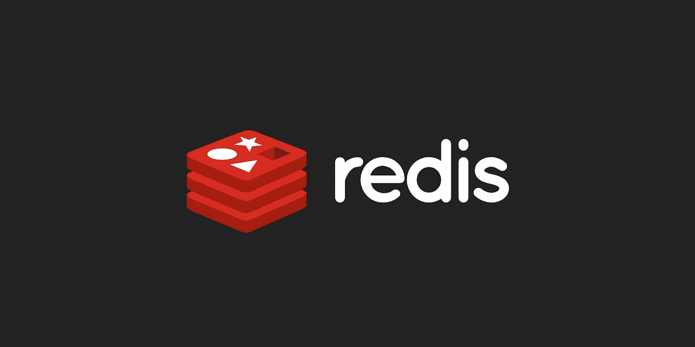

# 面向 Go 的最快 Redis 客户端库

> 原文：<https://levelup.gitconnected.com/fastest-redis-client-library-for-go-7993f618f5ab>

对一些流行的 Redis 客户端库进行基准测试，以找到最快的一个。

# 动机

提高 RPS(每秒请求数)不是一件容易的事情。更改代码以提高性能更具挑战性。有几个流行的库，几乎每一个都声称是最快的。当基准测试结果过时时，问题就出现了。更糟糕的是，进行基准测试的人以非通用的方式调优库。因此，对于普通用户来说，达到同样的性能几乎是不可能的。

基准测试的目的是在一个受控的环境中找到最快的 Redis 客户端库，并且不需要任何*魔法来调整任何库。*

# 环境

使用的 Go 客户端库:

*   [gomodule/redigo](https://github.com/gomodule/redigo) v1.8.4
*   [go-redis/redis](https://github.com/go-redis/redis) v8.8.2
*   [mediocregopher/radix](https://github.com/mediocregopher/radix)v 3 . 7 . 0
*   joomcode/re disppe v 0 . 9 . 4

最大连接池大小为 100 和 1000。

副本大小为 5 时打开和关闭群集模式。除了 [gomodule/redigo](https://github.com/gomodule/redigo) 目前不支持集群客户端模式。

# 基准测试结果

下面的结果是运行基准测试 25 次后的平均结果。

# 了解结果

每个 Redis 操作的右边有四列，就像上面结果中的 *GET* 一样。它们中每一个的含义是:

*   **迭代** = >运算运行的迭代次数，**一个** **值越高越好**。
*   **ns/op** = >这是每个函数调用完成的平均时间，****值越小越好**。**
*   ****B/op** = >这是每次函数调用使用的平均内存，**值越小越好。****
*   ****allocs/o** = >这是每个函数调用的平均内存分配，**值越小越好。****

**我们可以看到***go-redis/redis/V8/cluster-pool:1000***几乎在所有的运行基准*上都优于其他库。*不包括*到期*操作，其中***mediocregopher/radix/v3/cluster-pool:1000***实际上以微弱优势超过它。**

**另一个有趣的结果是，***gomodule/redigo-pool:100***实际上在类似 HGET 的某个操作上胜过了***gomodule/redigo-pool:1000***。这很可能是因为连接池的增加增加了在有限资源环境中对资源分配的竞争。拥有一个小连接池允许在处理下一个操作之前先完成上一个操作。由于没有资源分配竞争，它实际上比具有更高连接池的服务器性能更好。这意味着我们不应该盲目地增加最大连接池，并相信操作会更快。**

# **结论**

**通过查看上面的结果，我们可以得出结论， ***go-redis/redis/v8 在*** 上使用集群模式是 go 的总体最快的 redis 客户端库。建议在集群模式打开的情况下使用它，并根据您自己的环境使用专用的最大连接池大小。根据您最繁重的操作，需要进行一些测试来找到平衡最大连接池大小。**