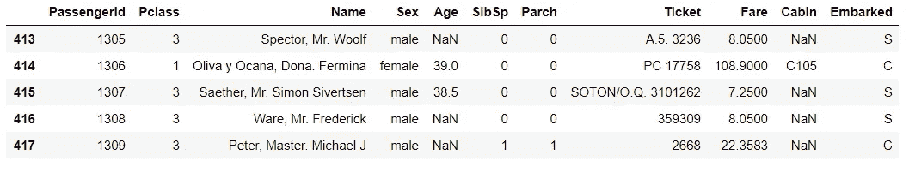
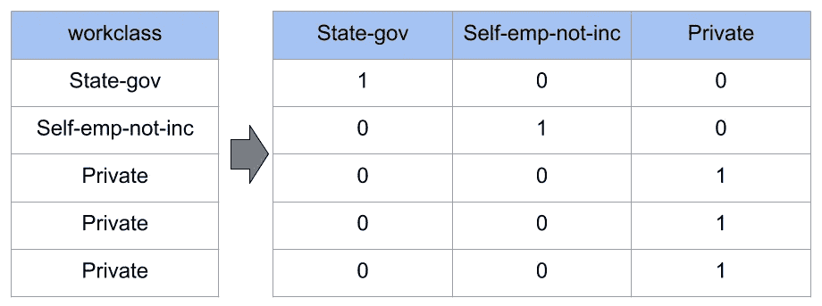
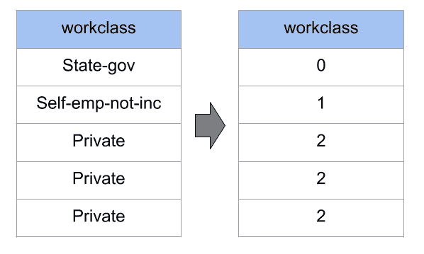
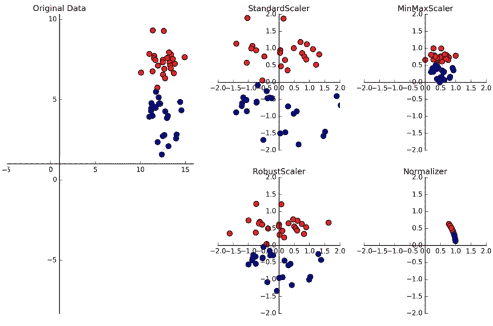

# 机器学习的特征工程

> 原文：<https://levelup.gitconnected.com/feature-engineering-for-machine-learning-algorithms-7f1c98d98d93>

我一直在写关于韩国仁荷大学提供的研究生课程“机器学习和数据分析”的文章。这将是它的第 7 部分，您可以跟随其他部分: [**df.info()** # quick description of the data **df.describe()** # summary of the numerical attributes **df.hist()** # plot a histogram for each numerical attribute](https://towardsdatascience.com/machine-learning-and-data-analysis-inha-university-part-1-be288b619fb5# <!-- -->look at the top five rows<strong class=)

## [3.创建测试集](https://towardsdatascience.com/machine-learning-and-data-analysis-inha-university-part-1-be288b619fb5# <!-- -->look at the top five rows<strong class=)

[在您进一步查看数据之前，您需要创建一个测试集并将其放在一边(大约 20%)。您可以随机选取一些实例，通常是数据集的 20%，然后将它们放在一边。我们可以使用 scikit 学习库(随机地)进行训练、测试分割。如以下命令所示，测试大小为 0.2，这意味着如果我们有一个 10 行的数据集，那么 8 行将用于训练，2 行用于测试。将随机做出选择。](https://towardsdatascience.com/machine-learning-and-data-analysis-inha-university-part-1-be288b619fb5# <!-- -->look at the top five rows<strong class=)

```
from sklearn.model_selection import train_test_splittrain_set, test_set = train_test_split(housing, test_size=0.2, random_state=43)
```

## [4.发现数据](https://towardsdatascience.com/machine-learning-and-data-analysis-inha-university-part-1-be288b619fb5# <!-- -->look at the top five rows<strong class=)

[现在，我们需要发现和可视化数据，以获得洞察力。您将只探索训练集。我们可以利用数据可视化库 *seaborn* 将数据可视化，生成几个图(*散点图*、*条形图*、*对线图*、*箱线图*、*热图*、*联合图*、*猫线图*等。).利用彼此对应的特征绘制大量图形，我们可以确定最有价值的特征，这些特征可以使数据集与特定的 ML 算法更加兼容，并提高算法的准确性。我们需要找出特征之间的相关性，这可以通过计算标准相关系数和开发几个数据可视化库来获得。](https://towardsdatascience.com/machine-learning-and-data-analysis-inha-university-part-1-be288b619fb5# <!-- -->look at the top five rows<strong class=)

## [5.为机器学习准备数据](https://towardsdatascience.com/machine-learning-and-data-analysis-inha-university-part-1-be288b619fb5# <!-- -->look at the top five rows<strong class=)

[为了准备 ML 算法的数据，我们需要遵循三个准备步骤。它们描述如下:](https://towardsdatascience.com/machine-learning-and-data-analysis-inha-university-part-1-be288b619fb5# <!-- -->look at the top five rows<strong class=)

*   [**数据清理**:对于任何一种缺失、损坏或不准确的数据，我们都可以利用`dropna()`、`drop()`、`fillna()`的方法进行替换。例如下面是泰坦尼克号数据集的`tail()`。这里我们可以看到 ***年龄*** 和 ***舱室*** 栏有缺失信息。这里我们可以用几种方法来处理它。我们可以避开整列，或者我们可以删除缺少值的行，或者我们可以用列的平均值填充 NaN 值，如果它有数值的话。比如我们可以用 ***列的平均值来填充*** 列的缺失值。](https://towardsdatascience.com/machine-learning-and-data-analysis-inha-university-part-1-be288b619fb5# <!-- -->look at the top five rows<strong class=)

[](https://towardsdatascience.com/machine-learning-and-data-analysis-inha-university-part-1-be288b619fb5# <!-- -->look at the top five rows<strong class=)

[泰坦尼克号数据集训练集的尾部](https://towardsdatascience.com/machine-learning-and-data-analysis-inha-university-part-1-be288b619fb5# <!-- -->look at the top five rows<strong class=)

*   [**处理文本和分类属性**:无论如何，大多数机器学习算法更喜欢处理数字，所以我们需要将文本和分类属性转换为数字。例如，我们可以通过将*男性* = 0 和*女性* = 1 来将 Titanic 数据集的 ***性别*** 列转换为数值，或者我们可以将两个列*男性*和*女性*设置为 0/1。这些过程被称为*顺序编码器*和*一个热编码器*。*顺序编码器*将分类特征编码为一个整数数组，而*一个热编码器*将分类特征编码为一个热数值数组。这个概念在下图中会更加清晰。](https://towardsdatascience.com/machine-learning-and-data-analysis-inha-university-part-1-be288b619fb5# <!-- -->look at the top five rows<strong class=)

[](https://towardsdatascience.com/machine-learning-and-data-analysis-inha-university-part-1-be288b619fb5# <!-- -->look at the top five rows<strong class=)[](https://towardsdatascience.com/machine-learning-and-data-analysis-inha-university-part-1-be288b619fb5# <!-- -->look at the top five rows<strong class=)

[一个热编码器和顺序编码器的例子。(](https://towardsdatascience.com/machine-learning-and-data-analysis-inha-university-part-1-be288b619fb5# <!-- -->look at the top five rows<strong class=)[来源](http://www.renom.jp/notebooks/tutorial/preprocessing/category_encoding/notebook.html))

*   **特征缩放**:当输入的数字属性具有非常不同的缩放比例时，机器学习算法表现不佳。我们可以遵循最小-最大缩放或标准化过程来缩放或属性。特征缩放可以在弱机器学习模型和强机器学习模型之间产生差异。



最小-最大特征缩放

在我的下一篇文章中，我将用分类数据、图像数据和时态数据来演示整个过程。非常感谢您的关注。我希望这能帮助你对 ML 算法中的特征工程有一个更清晰的认识。我仍然在学习走向数据科学和人工智能的每一步。如果有任何错误或任何类型的建议和批评是高度赞赏。你可以跟踪与这个故事相关的前几个故事。

以前的故事:

[**Part-1**](https://towardsdatascience.com/machine-learning-and-data-analysis-inha-university-part-1-be288b619fb5?source=friends_link&sk=583ba29a0766ad36bc993cddc642b11f)**:**python 基础及安装
[**Part-2**](https://towardsdatascience.com/machine-learning-and-data-analysis-inha-university-part-2-3fb599732021?source=friends_link&sk=80523165c66560e46f907da4c8af0d95)**:**第二章:Python 数据结构—数据类型
[**Part-3**](https://towardsdatascience.com/machine-learning-and-data-analysis-inha-university-part-3-51cb64c10901?source=friends_link&sk=a735571ab8f7bc418703fc3147eb6ecb)**:**Python 中的控制语句(循环)
[**Part:4**](https://towardsdatascience.com/machine-learning-and-data-analysis-inha-university-part-4-67aa1aa9c95d?source=friends_link&sk=9f1a2d1a77df1e9019cfea70b9de7edb)**:**Python 函数【T49
[**Part-6**](https://medium.com/datadriveninvestor/the-types-and-procedure-of-machine-learning-8ba691c3ddf)**:**机器学习的类型&程序

# 参考链接:

1.  [https://elitedatascience.com/feature-engineering](https://elitedatascience.com/feature-engineering)
2.  [https://developers . Google . com/machine-learning/crash-course/re presentation/feature-engineering](https://developers.google.com/machine-learning/crash-course/representation/feature-engineering)
3.  [https://www . kdnugges . com/2018/12/feature-engineering-explained . html](https://www.kdnuggets.com/2018/12/feature-engineering-explained.html)
4.  [https://heart beat . fritz . ai/a-practical-guide-to-feature-engineering-in-python-8326 e 40747 c8](https://heartbeat.fritz.ai/a-practical-guide-to-feature-engineering-in-python-8326e40747c8)