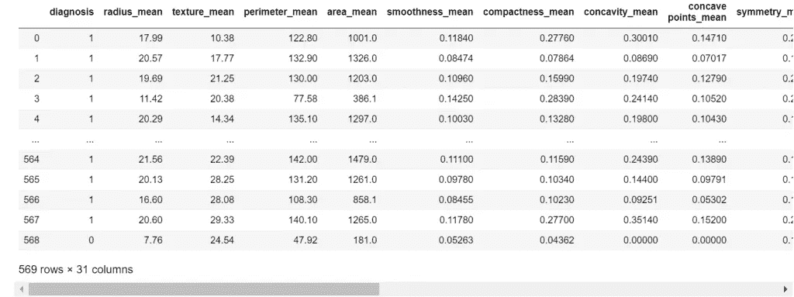
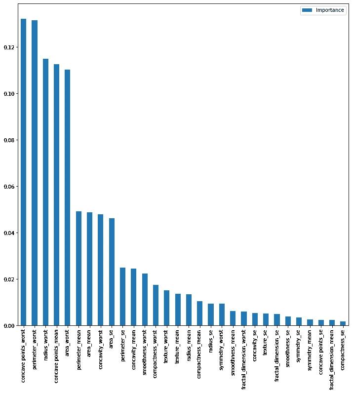
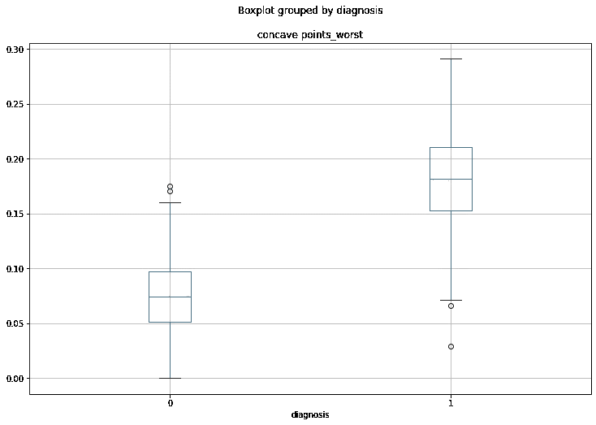

# Python 中的要素选择

> 原文：<https://levelup.gitconnected.com/feature-selection-in-python-predictive-hacks-8805b136955e>

## [机器学习](https://towardsai.net/p/category/machine-learning)，[编程](https://towardsai.net/p/category/programming)

## 如何选择最重要特性的实际例子

[](https://jorgepit-14189.medium.com/membership) [## 用我的推荐链接加入媒体-乔治皮皮斯

### 阅读乔治·皮皮斯(以及媒体上成千上万的其他作家)的每一个故事。您的会员费直接支持…

jorgepit-14189.medium.com](https://jorgepit-14189.medium.com/membership) 

我们将提供一个演示示例，说明如何选择最重要的功能。对于这个例子，我们将处理一个分类问题，但是也可以通过调整函数的参数扩展到回归情况。

我们将使用[乳腺癌](https://www.kaggle.com/uciml/breast-cancer-wisconsin-data?select=data.csv)数据集。让我们开始:

```
import pandas as pd
import numpy as np
from scipy import stats
from sklearn.ensemble import RandomForestClassifier
from sklearn.feature_selection import SelectFpr, chi2, SelectKBest, SelectFwe, f_classif, SelectFdrimport matplotlib.pyplot as plt
%matplotlib inline# [https://www.kaggle.com/uciml/breast-cancer-wisconsin-data?select=data.csv](https://www.kaggle.com/uciml/breast-cancer-wisconsin-data?select=data.csv)
df = pd.read_csv("data.csv")# replace M with 1 and B with 0
my_map = {
          'M':1,
          'B' :0
         }df['diagnosis'] = df['diagnosis'].map(my_map)# remove the id column
df.drop(['id'], axis=1, inplace=True)df
```



# 用 t 检验统计显著特征

由于我们的目标是二进制的，我们可以通过应用`t-test`来比较每个组(0，1)的独立变量的值。

```
my_important = []for c in df.columns[1:]:
    pvalue = stats.ttest_ind(df.loc[df.diagnosis==1][c], df.loc[df.diagnosis==0][c])[1]
    if pvalue<0.05:
        my_important.append(c)
        print(f'The variable {c} is statistically significant with a pvalue = {pvalue:.2}')
    else:
        print(f'The variable {c} is NOT statistically significant')
```

我们得到了:

```
The variable radius_mean is statistically significant with a pvalue = 8.5e-96
The variable texture_mean is statistically significant with a pvalue = 4.1e-25
The variable perimeter_mean is statistically significant with a pvalue = 8.4e-101
The variable area_mean is statistically significant with a pvalue = 4.7e-88
The variable smoothness_mean is statistically significant with a pvalue = 1.1e-18
The variable compactness_mean is statistically significant with a pvalue = 3.9e-56
The variable concavity_mean is statistically significant with a pvalue = 1e-83
The variable concave points_mean is statistically significant with a pvalue = 7.1e-116
The variable symmetry_mean is statistically significant with a pvalue = 5.7e-16
The variable fractal_dimension_mean is NOT statistically significant
The variable radius_se is statistically significant with a pvalue = 9.7e-50
The variable texture_se is NOT statistically significant
The variable perimeter_se is statistically significant with a pvalue = 1.7e-47
The variable area_se is statistically significant with a pvalue = 5.9e-46
The variable smoothness_se is NOT statistically significant
The variable compactness_se is statistically significant with a pvalue = 1e-12
The variable concavity_se is statistically significant with a pvalue = 8.3e-10
The variable concave points_se is statistically significant with a pvalue = 3.1e-24
The variable symmetry_se is NOT statistically significant
The variable fractal_dimension_se is NOT statistically significant
The variable radius_worst is statistically significant with a pvalue = 8.5e-116
The variable texture_worst is statistically significant with a pvalue = 1.1e-30
The variable perimeter_worst is statistically significant with a pvalue = 5.8e-119
The variable area_worst is statistically significant with a pvalue = 2.8e-97
The variable smoothness_worst is statistically significant with a pvalue = 6.6e-26
The variable compactness_worst is statistically significant with a pvalue = 7.1e-55
The variable concavity_worst is statistically significant with a pvalue = 2.5e-72
The variable concave points_worst is statistically significant with a pvalue = 2e-124
The variable symmetry_worst is statistically significant with a pvalue = 3e-25
The variable fractal_dimension_worst is statistically significant with a pvalue = 2.3e-15
```

因此，统计上显著的变量是:

```
my_important['radius_mean',
 'texture_mean',
 'perimeter_mean',
 'area_mean',
 'smoothness_mean',
 'compactness_mean',
 'concavity_mean',
 'concave points_mean',
 'symmetry_mean',
 'radius_se',
 'perimeter_se',
 'area_se',
 'compactness_se',
 'concavity_se',
 'concave points_se',
 'radius_worst',
 'texture_worst',
 'perimeter_worst',
 'area_worst',
 'smoothness_worst',
 'compactness_worst',
 'concavity_worst',
 'concave points_worst',
 'symmetry_worst',
 'fractal_dimension_worst']
```

# 随机森林特征重要性

我们还可以运行一个模型，如随机森林，看看哪些是最重要的功能。

```
clf = RandomForestClassifier( n_estimators=50)X = df.drop(['diagnosis'], axis=1)
y = df.diagnosismodel = clf.fit(X,y)
feat_importances = pd.DataFrame(model.feature_importances_, index=X.columns, columns=["Importance"])
feat_importances.sort_values(by='Importance', ascending=False, inplace=True)feat_importances.plot(kind='bar')
```



让我们来看看随机森林的 10 个最重要的特征:

```
feat_importances.index[0:10]
```

我们得到:

```
Index(['concave points_worst', 'perimeter_worst', 'radius_worst', 'concave points_mean', 'area_worst', 'perimeter_mean', 'area_mean', 'concavity_worst', 'area_se', 'perimeter_se'], dtype='object')
```

# 使用 Scikit-Learn 进行功能选择

我们可以用`scikit-learn`工作。您可以在[文档中找到更多详细信息。](https://scikit-learn.org/stable/modules/classes.html#module-sklearn.feature_selection)我们将提供一些例子:

# k-best

它选择 k 个最重要的特征。在我们的例子中，我们将使用卡方检验。请记住， **new_data** 是我们删除非重要变量后的最终数据。

```
selector = SelectKBest(score_func=chi2, k=5)
new_data = selector.fit_transform(X, y)mask = selector.get_support()
new_features = X.columns[mask]
new_features
```

我们得到:

```
Index(['perimeter_mean', 'area_mean', 'area_se', 'perimeter_worst', 'area_worst'], dtype='object')
```

# finished with engines 用车床精加工

这类似于我们一开始用 t 检验做的。这可以用`chi-square test`或`ANOVA`来完成(其中二进制情况与 t 检验相同)

**卡方检验**

```
# chi-ssquare
selector = SelectFwe(score_func=chi2, alpha=0.05)
new_data = selector.fit_transform(X, y)mask = selector.get_support()
new_features = X.columns[mask]
new_features
```

我们得到:

```
Index(['radius_mean', 'texture_mean', 'perimeter_mean', 'area_mean',
       'concavity_mean', 'concave points_mean', 'radius_se', 'perimeter_se',
       'area_se', 'radius_worst', 'texture_worst', 'perimeter_worst',
       'area_worst', 'compactness_worst', 'concavity_worst',
       'concave points_worst'],
      dtype='object')
```

**方差分析**

```
selector = SelectFwe(score_func=f_classif, alpha=0.05)
new_data = selector.fit_transform(X, y)mask = selector.get_support()
new_features = X.columns[mask]
new_features
```

我们得到:

```
Index(['radius_mean', 'texture_mean', 'perimeter_mean', 'area_mean',
       'smoothness_mean', 'compactness_mean', 'concavity_mean',
       'concave points_mean', 'symmetry_mean', 'radius_se', 'perimeter_se',
       'area_se', 'compactness_se', 'concavity_se', 'concave points_se',
       'radius_worst', 'texture_worst', 'perimeter_worst', 'area_worst',
       'smoothness_worst', 'compactness_worst', 'concavity_worst',
       'concave points_worst', 'symmetry_worst', 'fractal_dimension_worst'],
      dtype='object')
```

# FranklinDelanoRoosevelt 富兰克林.德兰诺.罗斯福（美国第三十二任总统）

错误发现率(FDR)考虑了多重比较。

```
selector = SelectFdr(chi2, alpha=0.05)
new_data = selector.fit_transform(X, y)mask = selector.get_support()
new_features = X.columns[mask]
new_features
```

我们得到:

```
Index(['radius_mean', 'texture_mean', 'perimeter_mean', 'area_mean',
       'compactness_mean', 'concavity_mean', 'concave points_mean',
       'radius_se', 'perimeter_se', 'area_se', 'radius_worst', 'texture_worst',
       'perimeter_worst', 'area_worst', 'compactness_worst', 'concavity_worst',
       'concave points_worst'],
      dtype='object')
```

# 从模型中

我们可以保留从模型中得到的最重要的特征。让我们再次考虑随机森林:

```
from sklearn.feature_selection import SelectFromModel
selector = SelectFromModel(estimator=RandomForestClassifier(n_estimators=50)).fit(X, y)
mask = selector.get_support()
new_features = X.columns[mask]
new_features
```

我们得到:

```
ndex(['perimeter_mean', 'area_mean', 'concavity_mean', 'concave points_mean',
       'radius_worst', 'perimeter_worst', 'area_worst',
       'concave points_worst'],
      dtype='object')
```

# 讨论

这是一个如何很好地了解哪些变量对您的模型最重要的例子。请记住，您应该始终运行探索性数据分析。对于二元情况，箱形图始终是合适的图。让我们看一下恶性肿瘤的`concave points_worst`的方框图。

最后可以找一个[卡方检验的详细解释。](https://stackoverflow.com/questions/57273694/how-selectkbest-chi2-calculates-score?fbclid=IwAR1GxhB8TpifAHOswQETOw2NvcDs8_f5Qomr3xq3ZLodAFYyvXuJLkh0iYQ)



*最初发表于*[T5【https://predictivehacks.com】](https://predictivehacks.com/feature-selection-in-python/)*。*