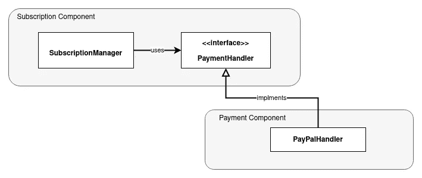

# 您会喜欢的 Go 功能

> 原文：<https://levelup.gitconnected.com/features-in-go-you-will-like-77b3a3a64417>

Go 中有趣的特性可能会说服你选择它作为你工具箱中的下一种语言

布鲁诺·马丁斯在 [Unsplash](https://unsplash.com?utm_source=medium&utm_medium=referral) 上的照片

Go 是一种非常年轻的现代编程语言，于 2009 年在谷歌创立。它利用了从 C 等较老的流行语言中学到的经验来改进它的设计。我主要来自 Python 背景(也有一些 Java 和 C)，我发现了 Go 中一些有趣的特性，我相信这些特性会使在 Go 中编写干净且可维护的代码变得更加容易。我将回顾这些特性，但有一个例外:并发编程。Go 的并发模型相当独特，简单优雅。然而，由于这可能是 Go 最著名的功能，我将在这篇文章中省略它。

# Go 运行时(和其他 Go 工具)

Go 不仅仅是一套语言规范。它附带了很多工具和*标准*库:最重要的是 Go 运行时。Go runtime 是一个编译成 Go 二进制文件的程序，它为你做很多低级的服务，比如垃圾收集或者 Go 例程分配(并发支持)。对于像我这样总是害怕 C/C++中容易出错的手动内存管理(或其他低级任务)的人来说，这真是一个好消息。这使得 Go 成为一种开发速度极快的高级语言，在运行时也非常快，带来了两个世界的最佳效果。

Go runtime 将 Java 虚拟机的方法向前推进了一步。Java 代码被编译成一种中间语言(字节码)，你需要安装一个单独的程序(JVM)来运行字节码。然而，Go 运行时被编译成 Go 二进制文件，产生一个可执行文件。这使得部署 Go 程序变得更加简单，因为不需要考虑虚拟机和程序之间的兼容性，您只需运行二进制文件。

Go 语言还附带了许多其他工具，使得 Go 的开发变得更加容易。一些例子是:依赖管理、测试、基准测试、覆盖、林挺和代码检查。

# 没有例外

围棋中没有像`try`、`except`或`catch`这样的专用关键词。Go 程序员用普通的`if`语句和函数返回值处理错误。在 Go 中，函数可以返回多个值(就像许多 Python 程序员使用的一样，我假设函数返回一个*元组*，但这不是真的。它们只是单独的值)。如果一个函数可能失败，它应该将一个`error`类型的值添加到它的输出值中。

然后`logic`方法的调用者应该检查错误并处理它，将它传递到上面或停止程序:

但是这怎么比异常好呢？首先，这是显式的，它告诉调用者这个函数调用可能会失败(类似于 Java 中的`throws`关键字)。此外，在 Go 中定义一个未使用的变量是一个编译时错误。因此，它迫使你明确你将如何处理函数返回的错误。除了显式性之外，它还使得代码更容易阅读。这是因为错误处理代码通常在一个`if`块中，并且与主代码不在同一缩进层次，所以主路径和*“哦不！”*路径被很好地分开。

Go 的错误处理风格让我想起了函数式编程中使用的`Either`数据类型(比如在 [Scala](https://www.scala-lang.org/api/2.13.6/scala/util/Either.html) 或 [Haskell](https://wiki.haskell.org/Handling_errors_in_Haskell#Error_using_the_Either_type) 中)来进行纯粹的函数式错误处理。尽管 Go 的错误模型没有提供`Either`的所有特性(例如[这些方法](https://www.scala-lang.org/api/2.13.6/scala/util/Either.html#map[B1](f:B=%3EB1):scala.util.Either[A,B1]))，但它带来了同样的显式性和(几乎)编译时安全性的效果。([阅读更多关于 vs 异常的](https://dev.to/anthonyjoeseph/either-vs-exception-handling-3jmg)

*(建议你看一下* [*这篇评论*](https://medium.com/@janek_schleicher/the-biggest-disadvantage-in-practice-is-beside-the-huge-boilerplate-is-the-poor-error-messaging-as-9b0d33a1b6b2) *关于 Go 的错误处理也有不好的地方)*

# 延期声明

在很多情况下，你希望某个东西总是在函数结束时运行，比如关闭 IO 或者进行一些清理。在许多语言中，我们使用某种形式的条件语句(或者是`if`语句或者是`try/except/finally`)来处理这个问题。但是在 Go 中你可以使用一个`defer`语句，它接收一个函数(或者更准确地说是一个 [*闭包*](https://en.wikipedia.org/wiki/Closure_(computer_programming)) )，并且总是在从函数返回时最后运行它，不管它是否成功返回。让我们来看看它的实际应用:

这里我们要求 Go 在逻辑运行后关闭文件，即使我们提前返回代码的逻辑部分，或者代码*崩溃，它也会这样做。*这些是我喜欢 defer 而不是它的替代品的原因，比如*最后:*

*   **无缩进:** defer 不会创建额外的缩进层次，从而使代码更易于阅读。
*   **无需重复:**如果一个函数中有多个返回路径，处理它们会变得很棘手，通常需要复制粘贴一个代码块。使用 defer，您只需提到一次清理，编译器和 Go 运行时就会处理它。
*   **物理邻近性:**使用 defer，不需要将清理移动到函数的末尾，所以它通常紧接在资源定义之后，从而带来更好的可读性。
*   **多个延迟:**可以在一个函数中堆叠多个延迟，这样你就不需要将所有的清理打包在一起(从而失去之前的好处)

# 接口:静态鸭类型

> 虽然 Go 的并发模型得到了所有的关注，但 Go 设计中真正的明星是它的隐式接口。— [ [学习围棋](https://www.oreilly.com/library/view/learning-go/9781492077206/)，乔恩·博德纳

为了解释这个特性，我将首先回顾软件设计中一个众所周知的原则:**依赖倒置原则。如果你已经熟悉这个概念，你可以跳过下一部分。**

## 依存倒置原则

这个原则可能是面向对象编程如此流行的主要原因。作为一个简单的例子，考虑像 Medium 这样提供付费订阅计划的服务。您肯定希望独立于当前使用的支付方式来设计订阅模块。这样你就可以切换不同的提供商，同时支持多种支付方式。标准的方法是创建一个处理支付的抽象接口，并在该接口的具体实现中完成真正的工作。(如下图所示)在像 Java 这样的静态类型语言中，`SubscriptionManager`类包含一个类型为`PaymentHandler`的字段，在运行时，像`PayPalHandler` 这样的具体实现被分配给它。注意，在运行时，是订阅包依赖`PayPalHandler`来完成它的工作，但是从`SubscriptionManager` 到`PayPalHandler.`没有代码依赖。代码依赖是反向的(从*细节*到*高级*)，因此名称依赖*反转。*

带有调用者和实现的示例接口

[一般认为](https://en.wikipedia.org/wiki/Dependency_inversion_principle#Implementations)接口和调用者(即`SubscriptionManager`)属于同一个组件/包，而实现(即`PayPalHandler`)属于不同的包。这是有意义的，因为依赖于接口的是*调用者*。这里`SubscriptionManager`高度依赖于`PaymentHandler`接口，通过调用它的方法并期望特定的结果。然而，在接口和实现之间还有一种耦合，一种相当强的耦合形式:*继承*。因此，虽然依赖性反转提供了很大的灵活性，并且很好地将我们的订阅管理器与特定支付方法的细节分离开来，但是它有一些限制:

*   切换到另一个实现需要改变`SubscriptionManager`来使用另一个接口或者为新的实现创建一个包装器(特别是如果实现是第三方代码的话)
*   接口的变化会导致实现中不必要的变化(或者至少是重新编译)

在像 Python 这样的动态类型语言中，这种耦合是不存在的。如果一个对象具有调用者期望的方法，那么它可以被用作调用者所需的*接口*的实例( [duck typing](https://en.wikipedia.org/wiki/Duck_typing) )。在我们的例子中，`PayPalHandler`根本不需要知道订阅组件，应用程序的 *main* 负责将 *right* 对象组装到`SubscriptionManager`这里“right”的意思是，拥有`SubscriptionManager`期望的方法和字段。尽管这将接口从实现中分离出来，但也带来了新的挑战:

*   阅读`SubscriptionManager` 时理解和遵循代码会更困难，因为你不知道它的`payment_handler`的类型。(每当我加入一个现有的 Python 项目时，我都亲身经历过这一点)
*   现在，当重构`SubscriptionManager`或`PaymentHandler.`时，更有可能把事情弄糟，比如调用一个不存在的方法，导致运行时错误:`object PaypalHandler has no attribute 'method'`

动态语言开发人员已经利用测试驱动开发解决了这些问题。虽然 TDD 在防止运行时错误方面非常有效，但是可读性问题仍然存在。这可能是在 Python 中引入类型提示或创建类型脚本语言的一个原因。

**Go 如何改善依赖倒置**

围棋试图把两个世界的最好的。接口在 Go 中是*隐式的*，实现一个接口不需要继承它。如果一个类型有一个接口定义的方法，它*实现*那个接口(并且被编译器认为是那个接口的一个实例)，即使它不知道那个接口存在。事实上，继承在 Go 中根本不存在，结构化子类型是 Go 提供的唯一子类型形式。让我们看看我们的订阅示例。首先从打电话者的角度来看:

它定义并使用接口。从实施*的*来看:

如您所见，在实现代码中没有引用`PaymentHandler`接口。然而，因为类型`PaypalHandler`具有接口中描述的方法，编译器认为它是`PaymentHandler.`的一个实例，这完全类似于鸭子类型，只是

*   您确切地知道您的支付处理程序公开了什么方法，因此您可以更容易地更改代码。
*   如果对象公开了具有所需签名的方法，则进行编译时检查
*   [接口分离原则](https://en.wikipedia.org/wiki/Interface_segregation_principle)是自动实现的，因为*用户*代码只依赖于它定义的接口，并不知道实现的其他方法。
*   如果第三方代码已经适合你期望的接口，就没有必要把它包装在一个继承你接口的对象中。您可以将它用作该接口的一个实例。

## Pythonic 式的做法是

让我们绕一小段路，看看 Python 对这个问题的解决方案。从 3.5 版本开始，Python 支持**类型提示**以在代码中提供文档，使理解或重构 Python 代码变得更加容易。再次考虑订阅示例。我们想用支付处理程序初始化`SubscriptionManager`对象。我们应该在下面的代码中使用什么作为`HandlerTyep`？

虽然我在 Python 项目中主要看到了两种具有上述缺点的解决方案(即定义一个抽象基类或使用一个[联合](https://docs.python.org/3/library/typing.html#typing.Union)类型)，但是**静态鸭类型**在 Python 中也确实存在(3.8 以上版本)。[协议](https://docs.python.org/3/library/typing.html#typing.Protocol)是描述你期望从一个对象得到什么方法和/或字段的数据类型。因此，我们可以为支付处理程序定义一个协议，并将其用作上面代码中的`HandlerType`。(参见示例[此处](https://www.daan.fyi/writings/python-protocols)。这个 [PEP](https://www.python.org/dev/peps/pep-0544/#rejected) 更详细地描述了这个方法，并将其与 Go 的方法进行了比较

# 结论

考虑到它只有大约十年的历史，围棋[在程序员中已经变得相当流行](https://insights.stackoverflow.com/survey/2021#most-popular-technologies-language-prof)。像 Docker、Kubernetes 和 Prometheus 等云世界中一些最流行的技术都是用 Go 编写的。所以如果你想在你的工具箱里增加一个新工具，Go 可能是一个不错的选择。尤其是如果你最习惯于 Python 或 Ruby 这样的解释型动态语言，Go 可以让你的工具箱多样化，成为一种编译型的静态语言，运行速度更快，并具有强大的并发支持。有了多个可用选项，您可以为每个任务和项目选择最合适的工具。

最后，即使你没有用一门新的语言编写很多代码，我相信你在这门语言中学到的新概念和新模式可以帮助你用其他语言更好地编写代码。

## 参考

我在学习围棋时使用的主要资源是 Jon Bodner 的伟大著作:[学习围棋](https://www.oreilly.com/library/view/learning-go/9781492077206/)。我强烈推荐这本书。我也主要是从马丁的书和演讲中了解到依赖倒置的[罗伯特](http://cleancoder.com/) [【鲍勃叔叔】](http://cleancoder.com/) [。](http://cleancoder.com/)